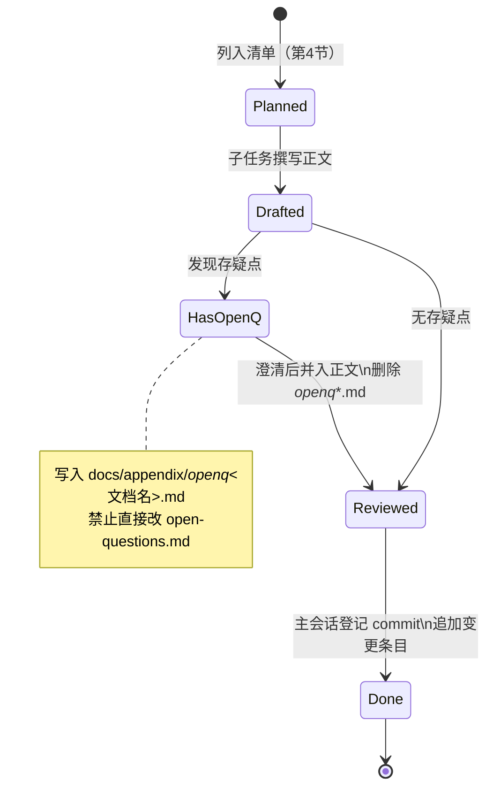

# 文档站变更日志（changelog-of-docs）

> 本文是 SGLang 源码精读文档站的**元文档（meta-doc）**：它不解读引擎代码，而是追踪「文档本身」的演进——哪篇文档已写、覆盖到哪个源码 commit、是否仍含未解问题。
> 本站所有结论对齐唯一事实来源（SSOT）：`/home/kimmo/develop/sglang`，commit `e1c4db9621f7c4203ee9becd5d5456d4e6bf54f7`。
> 本文件由本次任务**初始化结构**，后续由主会话统一维护。

---

## 1. What（这是什么）

本文档记录文档站自身的变更历史，属于 `appendix` 类的元文档，职责包括：

- **进度登记**：以单一入口登记每篇文档的撰写状态，避免多子任务并行时重复或遗漏。
- **版本绑定**：每篇文档标注其所对齐的 SSOT commit，保证阅读结论可复现（SGLang 演进极快，源码随时变动）。
- **未解问题隔离索引**：每个文档的存疑点写入独立的 `docs/appendix/_openq_<文档名>.md`，而非共享的 `open-questions.md`，以避免并发合并冲突。

它与「内容文档」的区别在于：内容文档回答引擎的 What/Why/How/坑，本文档只回答「文档站这个工程」的进度与规范。

---

## 2. Why（为什么需要这份变更日志）

### 2.1 可复现性
SGLang 是高强度迭代的生产级推理框架，官方首页自述其「每天生成数万亿 token、覆盖 40 万+ GPU  worldwide」（`docs/index.mdx:L61`）。源码的高频变更会让行号锚点、API 命名迅速失效。文档必须绑定具体 commit，读者才能按图索骥复现结论。

### 2.2 进度可追溯与去重
整套文档由多个子任务并行撰写（scheduler、radix-cache、model-runner、quantization 等）。没有一个单一登记入口，极易出现「同一模块被两篇文档各写一遍」或「某篇文档长期停留在占位」的情况。本文即该入口。

### 2.3 PROGRESS.md 缺失的替代方案
任务说明要求「对照 PROGRESS.md」，但本快照（commit `e1c4db9621f7c4203ee9becd5d5456d4e6bf54f7`）的 SSOT 与文档站根目录下均**不存在** `PROGRESS.md` 文件（已用 `ls` 验证：`/home/kimmo/develop/sglang/PROGRESS.md` 不存在）。因此本文以**文件系统实际清单**作为状态来源：依据各文档 `.md` 是否存在、以及是否存在对应的 `_openq_*.md` 来推断状态（详见第 4 节与「坑」一节）。

### 2.4 并发安全
`docs/appendix/open-questions.md` 是共享文件，禁止子任务直接改写。所有存疑点必须落到独立 `_openq_<文档名>.md`（文件名须含文档名，例如 `_openq_scheduler.md`），由主会话在合并时统一归并。

---

## 3. 对齐的源码 commit

本站内容统一对齐如下快照（该元数据记录在文档站首页 `sglangReading/docs/index.md:L36-L41`）：

| 项 | 值 |
| --- | --- |
| 源码路径 | `/home/kimmo/develop/sglang` |
| Git Commit | `e1c4db9621f7c4203ee9becd5d5456d4e6bf54f7` |
| Commit 时间 | `2026-08-14 11:11:02 +0800` |
| `git describe` | `gateway-v0.3.1-7844-ge1c4db9621` |
| Python 文件数 | 5496（`.py`） |
| 模型实现文件数 | 216（`python/sglang/srt/models/*.py`） |

> 注意：仓库根 `README.md` 标注的版本可能与 `git describe` 不一致（本仓同时含 `sgl-model-gateway` 等子项目）。文档以 **commit hash** 为准，不以版本字符串为准。

---

## 4. 已规划文档清单与状态

说明：**状态列是推断值，非验收结论**。推断规则：

- 若 `docs/appendix/` 下存在 `_openq_<对应文档名>.md` ⇒ 标记为「草稿（含未解问题）」，表示该文档已被子任务起草且留有存疑点。
- 若不存在对应 `_openq_*.md` ⇒ 标记为「规划中（未起草）」。本文未逐一读取各文档正文，无法判断其内容是否通过验收，故不标注「已完成」。

### 4.1 architecture（架构总览）
| 文档 | 主要源码锚点 | 状态 |
| --- | --- | --- |
| `architecture/overview.md` | `docs/index.mdx:L42-L59`（能力定位） | 草稿（含未解问题） |
| `architecture/request-lifecycle.md` | `python/sglang/srt/managers/scheduler.py` | 草稿（含未解问题） |
| `architecture/directory-map.md` | `python/sglang/srt/`（目录树） | 规划中（未起草） |

### 4.2 dataflow（数据流）
| 文档 | 主要源码锚点 | 状态 |
| --- | --- | --- |
| `dataflow/key-data-structures.md` | `python/sglang/srt/managers/schedule_batch.py` | 草稿（含未解问题） |
| `dataflow/sequence-diagrams.md` | `python/sglang/srt/managers/io_struct.py` | 草稿（含未解问题） |

### 4.3 deep-dive（模块深潜，共 16 篇）
| 文档 | 主要源码锚点 | 状态 |
| --- | --- | --- |
| `deep-dive/scheduler.md` | `python/sglang/srt/managers/scheduler.py` | 草稿（含未解问题） |
| `deep-dive/memory-pool.md` | `python/sglang/srt/mem_cache/memory_pool.py` | 草稿（含未解问题） |
| `deep-dive/radix-cache.md` | `python/sglang/srt/mem_cache/radix_cache.py`（RadixAttention） | 规划中（未起草） |
| `deep-dive/model-runner.md` | `python/sglang/srt/model_executor/model_runner.py` | 草稿（含未解问题） |
| `deep-dive/attention-backends.md` | `python/sglang/srt/layers/attention/` | 规划中（未起草） |
| `deep-dive/constrained-decoding.md` | `python/sglang/srt/constrained/` | 草稿（含未解问题） |
| `deep-dive/disaggregation.md` | `python/sglang/srt/disaggregation/`（PD 分离） | 草稿（含未解问题） |
| `deep-dive/frontend-language.md` | `python/sglang/lang/`（结构化生成 DSL） | 草稿（含未解问题） |
| `deep-dive/lora-multimodal.md` | `python/sglang/srt/lora/` 与 `python/sglang/srt/multimodal/` | 草稿（含未解问题） |
| `deep-dive/model-impl.md` | `python/sglang/srt/models/` | 草稿（含未解问题） |
| `deep-dive/observability.md` | `python/sglang/srt/observability/` | 草稿（含未解问题） |
| `deep-dive/parallelism.md` | `python/sglang/srt/distributed/`（TP/PP/DP/EP） | 草稿（含未解问题） |
| `deep-dive/quantization.md` | `python/sglang/srt/layers/quantization/` | 草稿（含未解问题） |
| `deep-dive/sampling.md` | `python/sglang/srt/sampling/` | 草稿（含未解问题） |
| `deep-dive/server-entrypoint.md` | `python/sglang/srt/entrypoints/` | 草稿（含未解问题） |
| `deep-dive/speculative-decoding.md` | `python/sglang/srt/speculative/` | 草稿（含未解问题） |
| `deep-dive/tokenizer-detokenizer.md` | `python/sglang/srt/tokenizer/` | 草稿（含未解问题） |

### 4.4 hacking / quickstart / appendix
| 文档 | 主要源码锚点 | 状态 |
| --- | --- | --- |
| `hacking/reading-guide.md` | 元文档（无单一源码锚点） | 规划中（未起草） |
| `hacking/dev-setup.md` | 安装/开发环境 | 规划中（未起草） |
| `hacking/add-a-model.md` | `python/sglang/srt/models/` | 规划中（未起草） |
| `hacking/add-a-kernel-backend.md` | `python/sglang/srt/layers/attention/` | 规划中（未起草） |
| `quickstart/install.md` | 安装流程 | 规划中（未起草） |
| `quickstart/minimal-example.md` | `python/sglang/`（运行示例） | 草稿（含未解问题） |
| `quickstart/e2e-observation.md` | `python/sglang/srt/observability/` | 规划中（未起草） |
| `appendix/glossary.md` | 元文档 | 规划中（未起草） |
| `appendix/config-reference.md` | `python/sglang/srt/server_args.py` | 规划中（未起草） |
| `appendix/changelog-of-docs.md` | 本文件（本次初始化） | 初始化完成 |

---

## 5. How（更新规范）

### 5.1 变更条目格式
每当一篇文档完成（从草稿到评审通过），在本文**追加**一个二级标题区块，**不要改写已有条目**以保留历史：

```
## 2026-08-14 — 初始化
- 新增 changelog-of-docs.md（本文件），对齐 commit e1c4db9621f7c4203ee9becd5d5456d4e6bf54f7。

## <YYYY-MM-DD> — <文档名>
- 文档路径：<相对 docs/ 的路径>
- 状态：草稿（含未解问题） → 评审通过 / 完成
- 对齐 commit：<hash>
- 主要源码锚点：<path:Lx-Ly>
- 备注：若有未解问题，列出对应 _openq_*.md 的条目，澄清后并入正文并删除该 _openq 文件。
```

### 5.2 规则
1. **追加而非覆盖**：保留历史条目，便于回溯「某篇文档何时对齐哪个 commit」。
2. **commit 真实**：记录撰写时所读的 SSOT commit（本文统一为 `e1c4db9621f7c4203ee9becd5d5456d4e6bf54f7`）；若后续升级 SSOT，须重读并刷新行号锚点。
3. **未解问题不进 open-questions.md**：存疑点一律写入独立 `_openq_<文档名>.md`；主会话在合并时统一将已澄清项并入正文、并删除对应 `_openq` 文件。
4. **锚点真实**：所有 `path:Lx-Ly` 的行号必须来自实际 Read 结果（如 `docs/index.mdx:L42-L59`、`docs/index.mdx:L61`），不得杜撰；源码路径须 `ls` 验证存在。
5. **不提交**：本会话严禁执行任何 git 命令（含 `git commit`/`git push`），所有改动由主会话统一提交。

### 5.3 文档生命周期状态机


---

## 6. 边界与坑

1. **PROGRESS.md 缺失（重要）**：任务描述要求对照 `PROGRESS.md`，但本快照中 SSOT 与文档站根目录均不存在该文件（已 `ls` 验证）。本文以文件系统清单为唯一状态源。若后续主会话创建 `PROGRESS.md`，应以其为准并同步本文第 4 节。详见 `docs/appendix/_openq_changelog-of-docs.md`。

2. **状态是推断而非验收**：第 4 节状态仅依据「是否存在 `_openq_*.md`」推断，本文未读取各文档正文，因此不标注「已完成」。标注「草稿（含未解问题）」仅表示已被起草且留有存疑点，不代表内容通过验收。

3. **commit 漂移导致行号失效**：SGLang 高频迭代，本文记录的 commit `e1c4db9621f7c4203ee9becd5d5456d4e6bf54f7` 仅代表本批文档对齐的快照。任何 SSOT 升级后，原有 `Lx-Ly` 锚点可能失效，须重读确认（铁律 #2 要求行号真实）。

4. **并发写入冲突**：所有子任务共享 `open-questions.md`，禁止直接改写；必须写入独立 `_openq_<文档名>.md`（文件名须含文档名），否则主会话合并时会产生冲突。

5. **不执行 git**：本会话严禁任何 git 命令。本文 commit 元数据来自文档站首页 `sglangReading/docs/index.md:L36-L41` 的登记值与任务给定的 hash，未通过 git 现场查询（即便如此，行号锚点仍须以 Read 实测为准）。

6. **锚点真实性校验**：本文所有 `path:Lx-Ly` 锚点的行号均来自实际 Read 结果（如 `docs/index.mdx:L42-L59`、`docs/index.mdx:L61`），所有源码目录/文件均经 `ls` 验证存在（如 `python/sglang/srt/mem_cache/radix_cache.py`、`python/sglang/srt/distributed/`、`python/sglang/srt/constrained/` 等），未杜撰任何路径或行号。

---

## 7. 初始化变更记录

### 2026-08-14 — 初始化
- 新增 `appendix/changelog-of-docs.md`（本文件）。
- 对齐 commit：`e1c4db9621f7c4203ee9becd5d5456d4e6bf54f7`（2026-08-14 11:11:02 +0800）。
- 初始化第 4 节文档清单（共 31 篇内容文档 + 本元文档），状态依据 `_openq_*.md` 有无推断。
- 建立第 5 节更新规范与第 5.3 节生命周期状态机。
- 记录 OPEN 问题：`PROGRESS.md` 缺失，以文件系统清单替代（见 `docs/appendix/_openq_changelog-of-docs.md`）。
