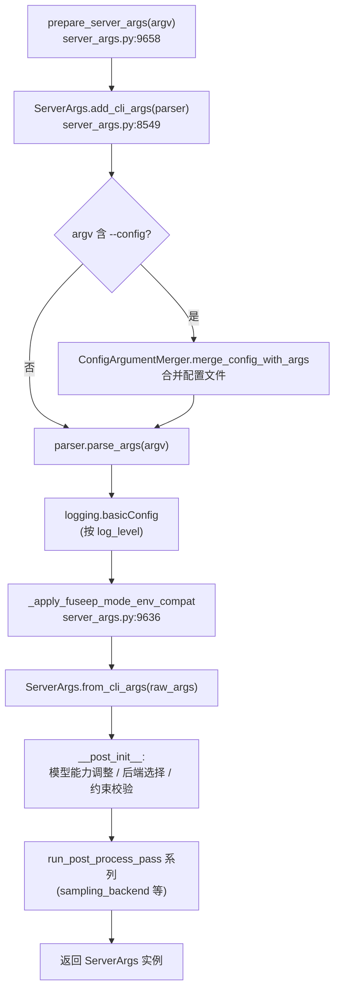

# SGLang ServerArgs 配置参考

本文是 SGLang 推理引擎启动配置的权威参考，覆盖 `ServerArgs` 全量字段、字段之间的关联/互斥约束，以及与 `ServerArgs` 互补或覆盖行为的进程环境变量。所有结论均来自对齐 commit `e1c4db9621f7c4203ee9becd5d5456d4e6bf54f7` 的本地源码（`/home/kimmo/develop/sglang/python/sglang/srt/server_args.py` 与 `arg_groups/arg_utils.py`）。

## What：ServerArgs 是什么

`ServerArgs` 是 SGLang 服务进程"唯一的全局配置对象"，几乎所有子系统（调度器、模型加载器、注意力后端、采样内核、KV 缓存、可观测性）都直接读取它的字段。它用一个 **dataclass** 承载约 400 个字段，每个字段通过 `A[T, ...]`（即 `typing.Annotated[T, ...]`）注解同时声明"类型、CLI 标志名、帮助文本、可选约束（choices/aliases/resolvable 等）"。类定义见 `python/sglang/srt/server_args.py:445`（字段声明至约 L3740，`__post_init__` 及 `_handle_*` 后处理方法延续至 L9700 前），字段按 `Model and tokenizer`、`Quantization`、`Memory and scheduling`、`Distributed topology`、`HTTP server`、`Observability` 等注释分节组织，新增字段需放进对应分节（见类文档字符串 `server_args.py:446-L483`）。

> **设计要点**：字段注解 `A[T, Arg(help=..., choices=..., aliases=..., resolvable=...)]` 承担了"配置即文档"的职责——`help` 文本既用于 `--help` 输出，也是本参考表的来源；`aliases` 提供长别名（如 `tp_size` → `--tensor-parallel-size`）；`resolvable=True` 标记该字段可被模型覆盖（model override）和 `__post_init__` 后处理改写（见 `arg_groups/arg_utils.py:77-L82`）。

## How：字段如何被解析成 CLI 并加载

`ServerArgs` 不是手工写 argparse 的，而是由一个工具函数从 dataclass 字段**自动**派生出 argparse 参数。`add_cli_args_from_dataclass(parser, cls)` 遍历每个 dataclass 字段，按注解推导 CLI 名称、类型解析器、choices、默认值、action（`arg_groups/arg_utils.py:218-L337`）。关键推导规则：

- 字段名 `model_path` → 旗标 `--model-path`（`_field_to_cli_name`，`arg_groups/arg_utils.py:208-L210`）。
- `bool` 字段 → `action="store_true"`（`arg_groups/arg_utils.py:313-L319`）。
- `Optional[X]`/`List[X]`/`Literal[...]` 自动展开（`arg_groups/arg_utils.py:166-L185`、`270-L311`）。
- `Arg(no_cli=True)` 的字段（如 `enable_prefill_context_parallel`、`server_args.py:1132-L1133`）不生成 CLI，仅能通过 Python 或后处理注入。

加载主流程由 `prepare_server_args(argv)` 驱动（`server_args.py:9658-L9694`）：

少数字段因需要动态 choices（如 `reasoning_parser`、`tool_call_parser`，其值来自插件注册表）或属于已废弃重定向标志，无法用注解表达，改在 `add_cli_args` 中手工 `parser.add_argument`（`server_args.py:8552-L8583`）。`--config` 元参数本身也不是 dataclass 字段（`server_args.py:8586-L8589`）。

## 字段分主题参考表

> 说明列摘录自源码 `help` 文本；"锚点"指向 SSOT 真实行号。类型为字典序简化（`Optional[X]` 表示可空）。

### 模型与分词（Model / Tokenizer）

| 字段 | 类型 | 默认 | 说明 | 锚点 |
|---|---|---|---|---|
| `model_path` | str（必填） | 无默认 | 模型权重路径，本地目录或 HF repo ID（别名 `--model`） | `server_args.py:489-L496` |
| `tokenizer_path` | Optional[str] | None | tokenizer 路径 | `server_args.py:497` |
| `tokenizer_mode` | str | "auto" | `auto`/`slow` | `server_args.py:498-L506` |
| `tokenizer_backend` | str | "huggingface" | `huggingface`/`fastokens` | `server_args.py:507-L516` |
| `context_length` | Optional[int] | None | 最大上下文长度；None 则取 `config.json`（`human_readable_int` 可写 4k 等） | `server_args.py:578-L586` |
| `load_format` | str | "auto" | 权重格式：`auto`/`pt`/`safetensors`/`npcache`/`dummy`/`gguf`/`bitsandbytes`/`layered`/`presharded`/`flash_rl` 等 | `server_args.py:528-L563` |
| `trust_remote_code` | bool | False | 允许加载 Hub 上的自定义模型实现 | `server_args.py:573-L577` |
| `is_embedding` | bool | False | 将 CausalLM 当 embedding 模型用 | `server_args.py:587-L589` |
| `revision` | Optional[str] | None | 指定分支/tag/commit | `server_args.py:595-L599` |
| `model_impl` | str | "auto" | `auto`/`sglang`/`transformers`/`mindspore` | `server_args.py:600-L615` |

### 量化与数据类型（Quantization）

| 字段 | 类型 | 默认 | 说明 | 锚点 |
|---|---|---|---|---|
| `dtype` | str | "auto" | 权重/激活精度：`auto`/`half`/`bfloat16`/`float` 等（`resolvable`） | `server_args.py:637-L654` |
| `quantization` | Optional[str] | None | 量化方法（`resolvable`） | `server_args.py:655-L663` |
| `quantization_param_path` | Optional[str] | None | KV cache 缩放因子 JSON 路径（FP8 KV 建议提供） | `server_args.py:664-L676` |
| `kv_cache_dtype` | str | "auto" | KV cache 存储类型：`auto`/`fp8_e5m2`/`fp8_e4m3`/`mxfp8`/`bf16`/`nvfp4`/`fp4_mx_block16` 等（`resolvable`） | `server_args.py:677-L703` |
| `enable_fp32_lm_head` | bool | False | LM head 输出（logits）用 FP32 | `server_args.py:704-L706` |
| `modelopt_quant` | Optional[Union[str,Dict]] | None | ModelOpt 量化配置（`fp8`/`int4_awq`/`nvfp4` 等） | `server_args.py:707-L716` |

### 并行与拓扑（Parallelism）

| 字段 | 类型 | 默认 | 说明 | 锚点 |
|---|---|---|---|---|
| `tp_size` | int | 1 | 张量并行度（别名 `--tensor-parallel-size`） | `server_args.py:1002-L1009` |
| `pp_size` | int | 1 | 流水线并行度（别名 `--pipeline-parallel-size`） | `server_args.py:1018-L1025` |
| `dp_size` | int | 1 | 数据并行度（别名 `--data-parallel-size`） | `server_args.py:1034-L1041` |
| `ep_size` | int | 1 | 专家并行度（别名 `--expert-parallel-size`/`--ep`，`resolvable`） | `server_args.py:2314-L2322` |
| `attn_cp_size` | int | 1 | 注意力上下文并行度（`resolvable`） | `server_args.py:1056-L1064` |
| `moe_dp_size` | int | 1 | MoE 数据并行度 | `server_args.py:1065-L1072` |
| `dwdp_size` | int | 1 | DWDP 权重预取组大小（须等于 `tp_size`） | `server_args.py:1073-L1081` |
| `enable_dp_attention` | bool | False | 注意力用 DP、FFN 用 TP（`resolvable`） | `server_args.py:1140-L1147` |
| `nnodes` / `node_rank` | int | 1 / 0 | 多节点部署的节点数与本节点 rank | `server_args.py:1000-L1001` |
| `nccl_port` | Optional[int] | None | NCCL 端口，默认随机 | `server_args.py:982-L986` |

### 缓存与调度（Memory / Scheduling）

| 字段 | 类型 | 默认 | 说明 | 锚点 |
|---|---|---|---|---|
| `mem_fraction_static` | Optional[float] | None | 静态显存占比（权重+KV 池）；OOM 时调小 | `server_args.py:771-L775` |
| `max_total_tokens` | Optional[int] | None | 内存池最大 token 数；指定后跳过按比例自动计算 | `server_args.py:784-L797` |
| `max_running_requests` | Optional[int] | None | 最大并发运行请求数 | `server_args.py:776-L778` |
| `chunked_prefill_size` | Optional[int] | None | 分块 prefill 每块最大 token；`-1` 禁用 | `server_args.py:798-L802` |
| `max_prefill_tokens` | int | 16384 | 一个 prefill 批的最大 token（真实上限取其与上下文长度的较大值） | `server_args.py:808-L819` |
| `schedule_policy` | str | "fcfs" | 调度策略：`lpm`/`random`/`fcfs`/`dfs-weight`/`lof`/`priority`/`routing-key` | `server_args.py:825-L840` |
| `page_size` | Optional[int] | None | 每页 token 数（`resolvable`） | `server_args.py:888-L892` |
| `radix_eviction_policy` | str | "lru" | radix 树淘汰：`lru`/`lfu`/`slru`/`priority` | `server_args.py:911-L923` |
| `disable_radix_cache` | bool | False | 禁用前缀缓存（RadixAttention） | `server_args.py:929-L931` |
| `num_continuous_decode_steps` | int | 1 | 连续 decode 步数，>1 降调度开销但升 TTFT | `server_args.py:963-L967` |

### 采样（Sampling）

> 注意：逐请求的 `temperature`/`top_p`/`top_k` 等采样超参不在 `ServerArgs` 上，而在请求级 `SamplingParams`；`ServerArgs` 只持有"默认采样参数来源"与"采样内核后端"。

| 字段 | 类型 | 默认 | 说明 | 锚点 |
|---|---|---|---|---|
| `sampling_backend` | Optional[str] | None | 采样层内核后端（`resolvable`）；None 时由 `_handle_sampling_backend` 推断 | `server_args.py:1695-L1703` |
| `sampling_defaults` | str | "model" | 默认采样参数来源：`openai`/`model`（取 `generation_config.json`） | `server_args.py:1400-L1407` |
| `preferred_sampling_params` | Optional[str] | None | 返回在 `/get_model_info` 的 JSON 采样设置 | `server_args.py:1418-L1425` |
| `random_seed` | Optional[int] | None | 随机种子 | `server_args.py:1202` |

### 日志与可观测性（Observability）

| 字段 | 类型 | 默认 | 说明 | 锚点 |
|---|---|---|---|---|
| `log_level` | str | "info" | 全量 logger 日志级别 | `server_args.py:1467` |
| `log_requests` | bool | False | 记录请求元数据/输入输出 | `server_args.py:1473-L1477` |
| `log_requests_level` | int | 2 | 0–3 详细度（3=记录全部输入输出） | `server_args.py:1478-L1485` |
| `enable_metrics` | bool | False | 启用 Prometheus 指标 | `server_args.py:1517-L1519` |
| `enable_trace` | bool | False | 启用 OpenTelemetry trace | `server_args.py:1621` |
| `crash_dump_folder` | Optional[str] | None | 崩溃前近 5 分钟请求 dump 目录 | `server_args.py:1509-L1513` |
| `export_metrics_to_file` | bool | False | 将每请求指标导出到本地文件 | `server_args.py:1633-L1637` |
| `otlp_traces_endpoint` | str | "localhost:4317" | trace collector 端点（配合 `enable_trace`） | `server_args.py:1627-L1631` |

## 环境变量参考（与 ServerArgs 互补/覆盖）

以下环境变量在代码各处读取，与 `ServerArgs` 字段形成互补或覆盖关系（来自 `grep` 结果，行号真实）：

| 环境变量 | 默认/取值 | 作用 | 锚点 |
|---|---|---|---|
| `SGLANG_USE_CPU_ENGINE` | "0" | 设为 "1" 时启用 CPU 推理引擎（覆盖 device 选择逻辑） | `python/sglang/srt/platforms/__init__.py:42`、`utils/common.py:210` |
| `SGLANG_HOST_IP` / `HOST_IP` | "" | 分布式初始化时本机 IP（影响 `dist_init_addr` 默认值） | `python/sglang/srt/utils/network.py:360` |
| `SGLANG_LOCAL_IP_NIC` | 无 | 探测本地 IP 时使用的网卡名 | `python/sglang/srt/utils/network.py:268` |
| `SGLANG_WAIT_PORT_TIMEOUT` | "30" | 等待端口就绪的超时（秒） | `python/sglang/srt/utils/network.py:67` |
| `SGLANG_LOGGING_CONFIG_PATH` | 无 | logging `dictConfig` 配置文件路径 | `python/sglang/srt/utils/common.py:2182` |
| `PROMETHEUS_MULTIPROC_DIR` | 自动生成 | Prometheus 多进程指标目录（启用指标时必需） | `python/sglang/srt/utils/common.py:2381-L2389` |
| `REQUEST_TIMEOUT` | "5"/"3"/"10" | 内部子请求（如多模态处理器）超时 | `python/sglang/srt/utils/common.py:1549`、`1754`、`1786` |
| `SGLANG_GRPC_PORT` | 无 | 原生 gRPC sidecar 端口（与 `--grpc-port` 等价路径） | `python/sglang/srt/server_args.py:4156` |
| `SGLANG_DG_CACHE_DIR` | 无 | DeepGEMM JIT 编译缓存目录 | `python/sglang/srt/layers/deep_gemm_wrapper/compile_utils.py:40` |
| `CUDA_VISIBLE_DEVICES` | 无 | 可见 GPU 列表（多实例/多卡部署基础） | `python/sglang/srt/utils/common.py:1126-L1180` |

> **说明**：这些环境变量与 `ServerArgs` 并非一一对应。它们多在 `ServerArgs.__post_init__` 之后、各子系统初始化时读取，因此属于"配置之外的运行期覆盖层"。例如 `SGLANG_USE_CPU_ENGINE` 会在平台探测阶段决定走 CPU 引擎而非 CUDA；`SGLANG_LOGGING_CONFIG_PATH` 提供比 `--log-level` 更细的 logging 配置。

## 字段关联与互斥（坑）

1. **并行度的整除/相等约束（硬校验）**。下列关系在 `__post_init__` 后处理中以 `assert`/`raise` 强制，违反即启动失败：
   - `tp_size` 必须能被 `dp_size * attn_cp_size` 整除（`server_args.py:6490-L6491`）。
   - `tp_size` 必须能被 `moe_dp_size` 整除（`server_args.py:6500-L6501`）；`ep_size * moe_dp_size` 须 ≤ `tp_size`（`server_args.py:6503-L6504`），elastic EP 场景下须 == `tp_size`（`server_args.py:6509-L6510`、`7147-L7149`）。
   - `dwdp_size` 必须等于 `tp_size`（`server_args.py:6533-L6534`）。
   - `enable_dp_attention` 要求 `dp_size == tp_size`，且仅在 DeepSeek-V2、Qwen2/3 MoE 等模型上受支持（字段 help `server_args.py:1143`；校验 `server_args.py:6870-L6871`、`7147-L7149`）。

2. **`mem_fraction_static` 与 `max_total_tokens` 二选一**。`max_total_tokens` 的 help 明确：若指定，则跳过基于 `mem_fraction_static` 比例的自动显存计算（`server_args.py:784-L797`）。两者同时给值以 `max_total_tokens` 优先，且其典型用途是"开发调试"，生产环境一般只设 `mem_fraction_static`。

3. **`prefill_only_disable_kv_cache` 的强组合约束**。该字段 help 列出硬性前提：必须同时 `--is-embedding` + `--chunked-prefill-size -1` + `--disable-radix-cache` + FA prefill 后端 + 非 FP4 KV cache，否则相关注意力路径不会激活（`server_args.py:924-L928`）。

4. **`disable_radix_cache` 与会话/前缀缓存互斥**。`disable_radix_cache=True` 会关掉 RadixAttention 前缀缓存；而 `enable_session_radix_cache`、`prefill_only_disable_kv_cache` 等许多后处理都依赖 radix 缓存开启，组合不当会触发静默退化为无缓存路径（参考 `server_args.py:3784` 中 HRM-Text 模型被强制 `disable_radix_cache=True` 的写法）。

5. **`chunked_prefill_size=-1` 与混合批互斥**。`enable_mixed_chunk`（prefill/decode 同批）的 help 表明它仅在启用分块 prefill 时有意义（`server_args.py:973-L977`）；设为 `-1` 后 `enable_mixed_chunk` 失去前提。

6. **`sampling_backend=None` 不等于"无采样"**。后端在 `__post_init__` 经 `_handle_sampling_backend`（`server_args.py:5787`、`8092-L8101`）推断：GPU 通常落到 `pytorch`/`fused` 等；当 `enable_deterministic_inference` 开启时会被强制写成 `pytorch`（`server_args.py:8097-L8101`）。因此不要假设 `None` 表示禁用采样。

7. **注意力/图后端自动降级**。`__post_init__` 中的 `_auto_disable_*_cudagraph_if_incompatible` 系列（`server_args.py:4480` 起）会根据后端、量化、DeepEP 等组合自动关闭不兼容的 CUDA Graph，并给出警告日志。这意味着你显式开启的某些图模式可能被静默关掉——排障时应看启动日志而非只看配置。

8. **`context_length=None` 的隐含依赖**。默认 `None` 时取模型 `config.json` 的 `max_position_embeddings`；若模型配置缺失或被 `json_model_override_args` 覆盖，需要显式给定，否则 KV 池大小计算可能异常（`server_args.py:578-L586`、`628-L632`）。

## Why：设计动机与权衡

- **"配置即 dataclass 注解"** 让约 400 个字段的 CLI、help、`choices`、默认值集中在字段定义处维护，避免 argparse 与 dataclass 双重定义漂移；`arg_utils.py` 的自动派生是这一设计的核心（`arg_groups/arg_utils.py:218`）。
- **`resolvable=True` 标记**区分"用户可设"与"运行期可被模型覆盖"的字段（`dtype`/`quantization`/`kv_cache_dtype`/`page_size` 等），使模型 `config.json` 或后处理能安全改写这些字段而不破坏其它固定字段（`arg_groups/arg_utils.py:77-L82`）。
- **并行度用多个独立字段（`tp/pp/dp/ep/attn_cp/moe_dp/dwdp`）而非单个 shape** 是为了支持 MoE、DP-attention、上下文并行等异构并行组合；代价是约束校验逻辑复杂（见上"坑"第 1 条）。
- **环境变量覆盖层**把"平台/部署相关"的开关（CPU 引擎、IP 探测、prometheus 多进程目录）从 `ServerArgs` 中剥离，避免 CLI 膨胀，也方便容器/K8s 通过环境变量注入而不改启动命令。

## 边界与坑（补充）

- `no_cli=True` 字段（如 `enable_prefill_context_parallel`、`disable_cuda_graph`、`enable_flashinfer_allreduce_fusion`）**不会出现在 `--help` 中**，只能经 Python 或内部后处理设置；排障时不要试图用 CLI 传它们（`server_args.py:1128-L1133`、`1884`、`1997`）。
- `watchdog_timeout`（默认 300s，`server_args.py:1222-L1226`）触发会让进程主动崩溃以防挂死；长尾模型/超大 prefill 时注意调大，否则误杀。
- 字段名到 CLI 旗标是机械映射（`_`→`-`），但 `aliases` 可重定向（如 `model_path`→`--model`、`tp_size`→`--tensor-parallel-size`），阅读启动命令时需留意（`arg_groups/arg_utils.py:208-L210`）。
- 配置合并：`--config <file>` 与命令行参数会发生合并（CLI 通常覆盖文件，`server_args.py:9673-L9679`）；合并逻辑在 `ConfigArgumentMerger`，布尔旗标的处理有专门兼容代码。

> **[OPEN]** `--config` 文件与命令行参数的合并优先级方向（命令行覆盖文件，还是文件作为默认值被命令行覆盖？）仅在 `prepare_server_args` 看到调用 `config_merger.merge_config_with_args(argv)`，但未展开 `ConfigArgumentMerger` 的实现确认最终优先级。见 docs/appendix/_openq_config-reference.md。

> 本文档覆盖的字段为 `ServerArgs` 高频/关键字段；完整字段以 `python/sglang/srt/server_args.py:445-L3740` 的 dataclass 定义为准。若发现某字段行为存疑，优先阅读其 `help` 文本与 `__post_init__` 后处理函数（命名约定 `_handle_*` / `_auto_disable_*` / `_disable_*_if_incompatible`）。
