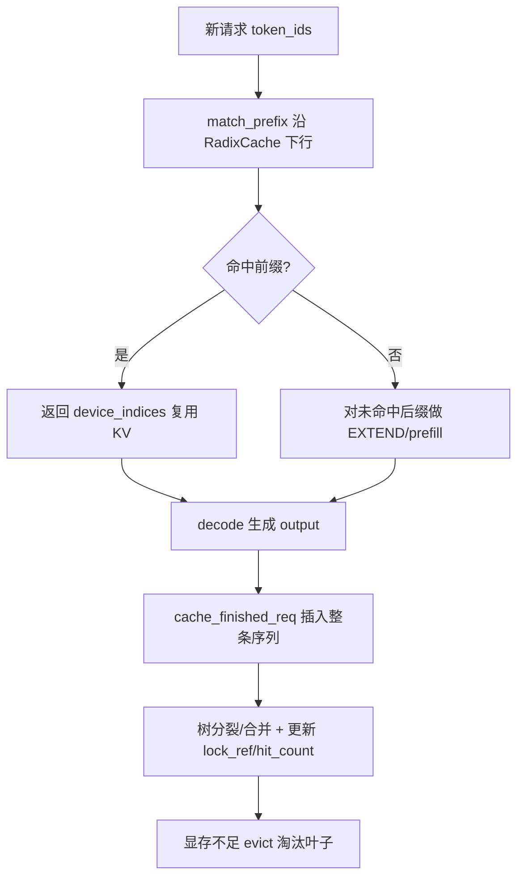
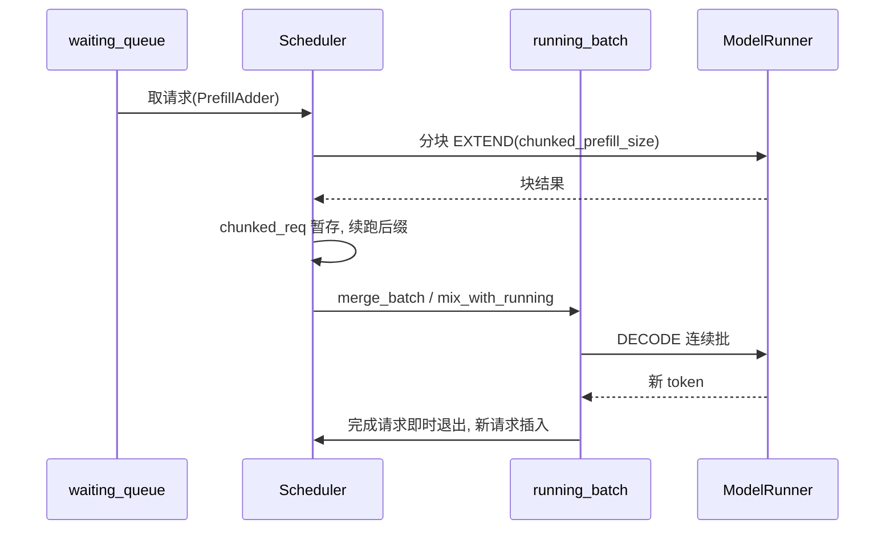
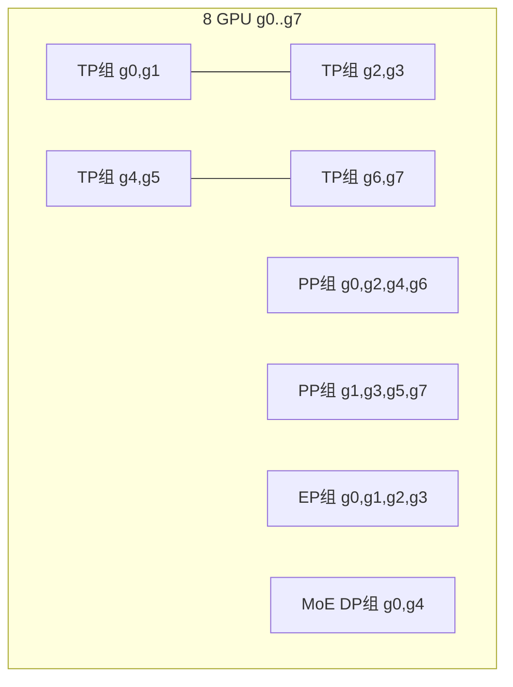

# SGLang 推理引擎源码术语表（Glossary）

> 本文档是 SGLang 推理引擎源码阅读的高频术语速查表，所有定义均来自对本地源码
> （commit `e1c4db9621f7c4203ee9becd5d5456d4e6bf54f7`）的实读，每个论断后附真实代码锚点。
> 术语的中文译名在 SGLang 社区并不统一，本文以"中文（英文）"形式给出，便于对照源码标识符。

## 一、How to use / Why 这份术语表

**What**：术语表把分散在 `mem_cache / managers / distributed / speculative` 等子系统中的核心概念集中到一张表上，
帮助阅读源码时快速定位"某个概念在代码里到底叫什么、落在哪个文件哪一行"。

**Why**：SGLang 的命名与常见的 vLLM / HuggingFace 体系并不完全一致。例如"前缀缓存"在 SGLang 里不叫
`PrefixCache` 而叫 `RadixCache`（其底层算法即 RadixAttention）；"数据并行"在并行组里细分为 attention DP 与 MoE DP。
不先建立这套映射，读 `scheduler.py` 和 `parallel_state.py` 时很容易把同名概念混淆。

**How**：先读下方术语总表（术语 | 定义 | 代码锚点），再用第三节的分主题"深读 + 踩坑"建立因果链。
文中所有 `路径:行号` 均为相对 SSOT（`/home/kimmo/develop/sglang`）的真实位置，可用 Read 复现。

**坑**：本文档只做"定位"，不替代逐模块深读文档（见 architecture/overview.md、mem_cache/radix_cache.md 等）。
术语表里的锚点多为"入口"，真正逻辑往往在该入口调用的 helper 里。

---

## 二、核心术语总表（≥20 条）

| 术语 | 一句话定义 | 代码锚点（SSOT 相对路径:行号） |
|------|-----------|-------------------------------|
| **RadixAttention** | SGLang 的前缀复用算法：用基数树（radix tree）组织 KV Cache，使不同请求共享相同 token 前缀对应的 KV。 | `python/sglang/srt/mem_cache/radix_cache.py:303`（`class RadixCache`） |
| **RadixCache** | 实现 RadixAttention 的基数树缓存结构（`TreeNode` 森林 + 引用计数 + 淘汰策略）。 | `python/sglang/srt/mem_cache/radix_cache.py:303-L330` |
| **Prefix Cache（前缀缓存）** | 与 RadixCache 同义，指"命中已缓存前缀、跳过其 prefill 计算"的能力。 | `python/sglang/srt/mem_cache/radix_cache.py:376-L434`（`match_prefix`） |
| **KV Cache** | 自回归解码时缓存的每层注意力 Key/Value 张量，以 `torch.Tensor` 形式挂在 `TreeNode.value`。 | `python/sglang/srt/mem_cache/radix_cache.py:246`（`TreeNode.value`） |
| **Paged KV Cache** | 把 KV 按页（page）切分、用 `token_to_kv_pool` 统一分配/释放，避免碎片化。 | `python/sglang/srt/mem_cache/radix_cache.py:307-L308`（`page_size`） |
| **Chunked Prefill（分块预填充）** | 把超长 prompt 的 prefill 切成固定大小的块逐批计算，避免一次 prefill 占用整块显存/拖垮 decode 延迟。 | `python/sglang/srt/managers/scheduler.py:1153-L1175`（`init_chunked_prefill`） |
| **Continuous Batching（连续批处理）** | 请求不必按批次同步起止，完成的请求即时退出、新请求随时插入 `running_batch`。 | `python/sglang/srt/managers/scheduler.py:1134-L1136`（`waiting_queue`/`running_batch`） |
| **Mixed Chunked Prefill** | prefill 块与 decode 请求混在同一 batch 执行，提升 GPU 利用率。 | `python/sglang/srt/managers/scheduler.py:3430-L3442`（`mix_with_running`） |
| **TP（张量并行）** | 把单层权重沿隐藏维切到多卡，组内做 all-reduce。 | `python/sglang/srt/distributed/parallel_state.py:2383-L2406`（build TP groups） |
| **PP（流水线并行）** | 按层把模型切成 stage，请求在不同 stage 间流水线流动。 | `python/sglang/srt/distributed/parallel_state.py:2620-L2632`（build PP groups） |
| **DP（数据并行）** | 同一模型复制多份并行服务；在并行组里细分为 `attention_data_parallel` 与 `moe_data_parallel`。 | `python/sglang/srt/distributed/parallel_state.py:2289`、`:2451`（`attn_dp_size`） |
| **EP（专家并行）** | MoE 中把不同 expert 放到不同卡，token 经 dispatcher 路由后 all-to-all。 | `python/sglang/srt/distributed/parallel_state.py:2528`（`moe_ep_size`）、`:2562-L2579` |
| **MoE（混合专家）** | 用多个前馈专家 + 门控 top-k 路由替代单一 FFN 的稀疏结构。 | `python/sglang/srt/layers/moe/fused_moe_triton/layer.py:277`（`moe_ep_size`） |
| **EAGLE** | 一种投机解码（speculative decoding）方法：用轻量 draft 模型基于目标模型隐藏态自回归"起草"多个 token 成树，再由目标模型一次验证。 | `python/sglang/srt/speculative/eagle_worker_v2.py:128`（`class EagleDraftWorker`） |
| **Speculative Decoding（投机解码）** | 用小模型/草稿快速猜测若干 token，目标模型并行验证，接受率高时显著提速。 | `python/sglang/srt/speculative/base_spec_worker.py` |
| **N-gram 投机** | 基于历史 n-gram 统计的草稿策略，无需额外 draft 模型。 | `python/sglang/srt/speculative/ngram_worker.py:70`（`class NGRAMWorker`） |
| **CUDA Graph** | 把一串 CUDA kernel 录制为静态图，重放时绕过 Python 调度开销，主要用于 decode。 | `python/sglang/srt/model_executor/model_runner.py:997-L1003`（`init_cuda_graphs`） |
| **ForwardMode** | 每次前向的语义模式枚举：PREFILL / EXTEND / DECODE / TARGET_VERIFY 等。 | `python/sglang/srt/model_executor/forward_batch_info.py`（`class ForwardMode`） |
| **Tree Attention** | EAGLE 验证阶段用树状注意力掩码一次性验证一棵草稿树。 | `python/sglang/srt/speculative/eagle_utils.py`（`build_tree_kernel_efficient`） |
| **Disaggregated Prefill（PD 分离）** | 把 prefill 与 decode 部署在独立实例（Prefill/Decode 引擎），KV 通过网络传输。 | `python/sglang/srt/managers/scheduler.py:81`、`python/sglang/srt/managers/scheduler.py:1392` |
| **GroupCoordinator** | 封装一个 `torch.distributed` 进程组的通信原语（all-reduce/broadcast/all-gather 等）。 | `python/sglang/srt/distributed/parallel_state.py:237`（`class GroupCoordinator`） |
| **req_to_token_pool / token_to_kv_pool** | 把"请求内 token 下标"映射到"KV 池物理槽位"的两张表（KV 分配器）。 | `python/sglang/srt/mem_cache/radix_cache.py:306-L307` |
| **lock_ref（引用计数）** | `TreeNode` 上的锁计数，>0 时节点被保护、不参与淘汰；请求持有/释放前缀时增减。 | `python/sglang/srt/mem_cache/radix_cache.py:622-L656`（`inc_lock_ref`/`dec_lock_ref`） |
| **Eviction（淘汰）** | KV 显存不足时按策略（LRU 等）从 `evictable_leaves` 中弹出可淘汰叶子并释放 KV。 | `python/sglang/srt/mem_cache/radix_cache.py:592-L620`（`evict`） |

> 以上锚点均为入口；更深入的行为见各子模块深读文档（如 mem_cache/radix_cache.md）。

---

## 三、分主题深读

### 3.1 前缀复用与 KV 管理（RadixAttention / RadixCache / Prefix Cache）

**What**：`RadixCache` 是一棵以 `RadixKey` 为边的基数树（`TreeNode` 组成），每个节点存一段
连续 token 序列对应的 KV 张量（`value`，见 `radix_cache.py:246`）。相同前缀的不同请求在树中
共享同一组节点，从而复用已算好的 KV，省去重复 prefill。

**Why**：LLM 服务中大量请求共享系统提示、Few-shot 样例或对话历史。若不复用，相同前缀会被反复
做前向计算，既浪费算力又占显存。RadixAttention 把"前缀命中率"直接转化为吞吐收益。

**How（关键路径）**：
- 请求到来时先 `match_prefix`（`radix_cache.py:376`）沿树下行求最长公共前缀，返回已缓存 KV 的
  `device_indices`，请求只需对未命中后缀做 prefill（EXTEND）。
- prefill 完成后 `cache_finished_req`（`radix_cache.py:458`）把整条 (input+output) 作为新键插入树。
- 中途未完成则 `cache_unfinished_req`（`radix_cache.py:515`）做分块插入，`maybe_to_bigram_view`
  （`:156`）在 EAGLE 场景下切到 bigram 视图。
- 插入/匹配若在某节点中间断开，会调用 `_split_node`（`radix_cache.py:704`）把节点一分为二，
  保证边界精确（用 exponential+二分搜索求匹配长度，见 `RadixKey.match` `:181`）。

### 3.2 调度：Chunked Prefill 与 Continuous Batching

**What**：`Scheduler` 维护 `waiting_queue`（待调度）与 `running_batch`（正在 decode 的批）
（`scheduler.py:1134-L1136`）。`init_chunked_prefill`（`scheduler.py:1153`）按
`get_schedule().chunked_prefill_size` 决定每块 token 数。

**Why**：长 prompt 的整段 prefill 既占显存又阻塞正在 decode 的请求（尾延迟爆炸）。分块能让 prefill
与 decode 交错；连续批处理让短请求不必等长请求结束即可开始/结束，提高设备利用率。

**How（关键路径）**：
- `_get_new_batch_prefill_raw`（`scheduler.py:3180`）用 `PrefillAdder` 从 `waiting_queue` 取请求，
  受 `max_prefill_tokens` 与 `chunked_prefill_size` 约束（`:3259-L3260`）。
- 一个尚未跑完的 prefill 会记为 `self.chunked_req`（`scheduler.py:3377-L3378`），下一轮继续喂后缀。
- prefill 完成后通过 `running_batch.merge_batch` / `mix_with_running`
  （`python/sglang/srt/managers/schedule_batch.py:3194`（`merge_batch`）、`:2739`（`mix_with_running`））并入 decode 批，这正是 continuous batching 的落点。

### 3.3 并行组：TP / PP / DP / EP

**What**：`initialize_model_parallel`（`parallel_state.py:2286`）按一组 size 参数构建多个
`GroupCoordinator`（`parallel_state.py:237`）。核心是 TP 组、PP 组，以及 MoE 专用的 EP/DP 组。

**Why**：单卡放不下大模型时需要切分；不同切分维度有不同的通信模式与带宽需求，分组管理可让每个算子
只在其所属组里通信，避免全局集合通信的开销。

**How**：
- TP：`for tp_group_idx ... range(num_tensor_model_parallel_groups)` 连续 rank 划组
  （`parallel_state.py:2388-L2395`），组内 `all_reduce` 聚合切分后的权重结果。
- PP：`num_pipeline_model_parallel_groups = world_size // pp_size`，跨 `pp_size` 步长取 rank
  （`parallel_state.py:2620-L2626`）形成 stage 链。
- EP/MoE DP：`attn_tp_size = tensor_model_parallel_size // attn_cp_size // attn_dp_size`
  （`parallel_state.py:2453`），`moe_tp_size = tensor_model_parallel_size // moe_ep_size // moe_dp_size`
  （`:2528`），据此再划 MoE 的 expert 组与 data 组（`layers/moe/fused_moe_triton/layer.py:277`）。

### 3.4 投机解码：EAGLE / N-gram / CUDA Graph

**What**：EAGLE（`EagleDraftWorker`，`eagle_worker_v2.py:128`）基于目标模型最后一层隐藏态，
用一个轻量 draft 模型自回归"起草"`speculative_num_draft_tokens`（`:152`、`:552`）个 token 形成草稿树，
目标模型用 tree attention（`eagle_utils.py:build_tree_kernel_efficient`）一次验证并采纳前缀。

**Why**：自回归 decode 每步只产 1 个 token、被内存带宽限制。若草稿多数被接受，单步可推进多个 token，
在算术强度不变下大幅降低步数。

**How**：
- `draft`（`eagle_worker_v2.py:494`）产生 `EagleDraftInput`，`prepare_for_draft_extend`
  （`eagle_worker_common.py:105`）为草稿树分配 KV 位置。
- 目标模型在 `TARGET_VERIFY` 模式前向，按接受位置把 token 搬入目标 KV 缓存
  （`spec_utils.move_accept_tokens_to_target_kvcache`）。
- N-gram 变体无需 draft 模型，直接用历史 n-gram 统计起草（`ngram_worker.py:70`）。
- decode 路径普遍用 CUDA Graph 降开销：`init_cuda_graphs`（`model_runner.py:997`）捕获
  `decode_cuda_graph_runner` 与 `prefill_cuda_graph_runner`（`:1002-L1003`）。

---

## 四、边界与坑（容易踩的点）

1. **Chunked Prefill 对多模态 + Transformers 后端被强制关闭**：`scheduler.py:1158-L1168`
   当 `is_multimodal` 且使用 Transformers 后端时把 `chunked_prefill_size` 置 `None`，否则分块会
   造成多模态 chunk 错位。读调度逻辑时不要假设 chunked 一定生效。

2. **`lock_ref` 与淘汰的张力**：节点 `lock_ref>0` 时被保护（`inc_lock_ref`，`radix_cache.py:622`），
   不参与 `evict`（`radix_cache.py:592` 只从 `evictable_leaves` 取）。请求未释放前缀就触发淘汰会
   "卡住"——显存紧张时若大量节点被锁，淘汰量可能为 0，需靠 `cache_unfinished_req` 的
   `cache_protected_len` 机制（`:564-L568`）正确释放尾部，否则内存泄漏。

3. **page_size 对齐**：EAGLE / bigram 视图下 `RadixKey` 长度按 `page_size` 向下取整
   （`:150-L155`、`:181`）。`cache_unfinished_req` 注释明确提到 page_size>1 时存在"未对齐尾页"，
   必须靠 `cache_protected_len` 在后续轮次释放，否则那部分 KV 槽位永远不被回收。

4. **CUDA Graph 的形状约束**：graph 捕获依赖固定 batch 形状/控制流，因此主要用于 decode；
   prefill 因长度变化通常走非 graph 或单独 captured 形状。改动 forward 控制流时要同步检查
   `capture_cuda_graphs` 的输入假设（`model_runner.py:998`）。

5. **并行 size 的可除性约束**：`initialize_model_parallel` 断言
   `world_size == tp_size * pp_size`（`parallel_state.py:2360`），并要求
   `tensor_model_parallel_size % decode_context_parallel_size == 0`（`:2377`），EP/DP 也需整除
   `tensor_model_parallel_size`。启动参数配错会直接 `RuntimeError`。

6. **DP 的两种含义易混**：顶层"数据并行"（多副本服务）与并行组内的 `attention_data_parallel_size` /
   `moe_data_model_parallel_size` 不是一回事；后者是 TP 组内部的再切分（`parallel_state.py:2289`、
   `:2451`）。读 MoE 通信代码时务必分清 `attn_dp_size` 与 `moe_dp_size`。

> **[OPEN]** `initialize_model_parallel` 中顶层"引擎级 data parallel"（多副本服务）与
> 并行组内的 `attention_data_parallel_size` / `moe_data_model_parallel_size` 的装配关系在
> `parallel_state.py` 中仅见到 attn/moe 细分，未找到统一的顶层 DP group 构造入口。顶层 DP 是否也
> 在该函数内建组、还是由上层 server 负责，待进一步确认。详见 `docs/appendix/_openq_glossary.md`。

---

## 五、交叉索引

- 调度全貌见 `managers/scheduler.md`；前缀缓存实现见 `mem_cache/radix_cache.md`。
- 并行通信原语见 `distributed/parallel_state.md`；MoE 路由见 `layers/moe/fused_moe_triton/layer.md`。
- 投机解码整体设计见 `speculative/`（EAGLE 见 `speculative/eagle_worker_v2.md`，N-gram 见 `speculative/ngram_worker.md`）。
