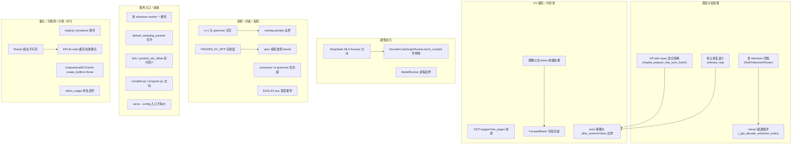

# 未解疑问汇总（Open Questions）

> 对齐 commit：`e1c4db9621f7c4203ee9becd5d5456d4e6bf54f7`（2026-08-14）
> 本文件是整套 SGLang 中文源码文档的"待验证/未解疑问"汇总页。它整合了各子任务在源码阅读过程中遗留的 `_openq_*.md` 文件，按所属模块归类，便于后续逐条追源码、补实结论。

## What：本文件是什么

本文件是**所有开放问题的集中索引**，不是某一模块的深入文档。它回答三件事：

- **有哪些问题还没读透？** 每条问题保留「模块 / 问题描述 / 可能的验证方向」三要素，并附带指向 SSOT 的真实证据锚点。
- **问题集中在哪些模块？** 见下方 Mermaid 分布图，开放问题高度集中在「调度与 KV 缓存」「采样与约束」「投机解码」「服务入口与多 tokenizer」四块。
- **下一步该追哪些源码？** 每条都给出具体函数/文件，可直接作为后续阅读清单。

## Why：为什么会存在这些疑问

SGLang 的推理路径高度耦合：调度器（`Scheduler`）、KV 缓存（`RadixCache` / `BasePrefixCache`）、模型执行（`ModelRunner` / `DecodeCudaGraphRunner`）、采样（`Sampler` / `SamplingBatchInfo`）在运行时通过共享内存、进程间 socket、CUDA Graph 录制相互交织。多数疑问都源于**跨模块语义无法在单一文件内闭环**：

- 进程边界（TokenizerManager / DetokenizerManager / Scheduler / ModelRunner 是否独立进程）只能在 `entrypoints` 与 `managers` 两侧同时确认。
- KV 缓存的「驱逐—重计算—前缀命中」语义横跨 `schedule_batch.py`、`mem_cache/*`、`scheduler.py` 三处。
- 部分关键逻辑（投机解码的接受准则、EPLB 重平衡、Router 扇出）实现在 **SSOT 之外的仓库**（`sgl_kernel`、外部 `sglang-router`、具体模型权重）中，本地 Python 层只见契约、不见实现。

因此这些条目**不推断、不编造**，只如实记录"读到哪、卡在哪、往哪追"。

## How：本文件如何产出与组织

本文件由本任务（最后一个子任务）扫描 `docs/appendix/_openq_*.md` 后整合而成。各条目直接继承自对应模块的开放问题文档；行号均经 `Read` / `Grep` 在 SSOT 中实测复核（其中 `metrics_collector.py` 的锚点路径由 `managers/` 修正为真实的 `observability/`，行号一致）。

组织方式：按 9 大模块分组，每组下列出该模块的开放问题。每个问题块含四行——**模块 / 问题描述 / 可能的验证方向 / 证据锚点**。

### 开放问题分布图

---

## 一、调度与批处理（Scheduler / ScheduleBatch / 请求生命周期）

### Q1：DP-attention + 投机解码同时开启时 prefill/decode 混合隔离细节
- **模块**：`managers/scheduler.py`（`Scheduler` / `DpAttentionAdapter`）
- **问题描述**：源码注释声明 `maybe_prepare_mlp_sync_batch` 通过 `need_mlp_sync` 确保 prefill 与 decode 批次不被混合，但跨 DP rank 的同步触发条件、`dp_attn_adapter.py` 与 `scheduler_pp_mixin.py` 内部实现尚未追到 worker 级。
- **可能的验证方向**：阅读 `scheduler_components/dp_attn.py` 中 `maybe_prepare_mlp_sync_batch` 与 PP mixin，确认 MLP sync 的确切触发与批次隔离边界。
- **证据锚点**：`python/sglang/srt/managers/scheduler.py:3108-L3134`

### Q2：retract_decode 的驱逐顺序与 radix 缓存联合优化
- **模块**：`managers/schedule_batch.py`（`ScheduleBatch`）
- **问题描述**：`_get_decode_retraction_order` 默认按 `(len(output_ids), -len(origin_input_ids))` 逆序保留"输出长、输入短"的请求，未联合考虑该请求在 radix 树中贡献的被共享前缀；高缓存命中率场景可能次优。源码自带 `TODO(lsyin): improve retraction policy for radix cache`。
- **可能的验证方向**：评估在驱逐决策中引入"共享前缀贡献度"权重的可行性（仅作为优化方向记录，当前文档只描述现状）。
- **证据锚点**：`python/sglang/srt/managers/schedule_batch.py:2857-L2867`

### Q3：被抢占（retract）请求的精确恢复语义
- **模块**：`managers/schedule_batch.py`（`ScheduleBatch.retract_decode` / `release_req`）
- **问题描述**：抢占时 `release_req` 注释明确"release memory and don't insert into the tree because we need the space instantly"——不写回 radix 树。但 `release_req` 是否对 `last_node` 执行 `dec_lock_ref`、SWA 下 `swa_reprefill_tail_tokens` 是否强制 re-prefill 尾部窗口，决定了恢复时能命中多长前缀，当前未给出确定性结论。
- **可能的验证方向**：精读 `utils/common.py` 的 `release_req` 与 `mem_cache/*` 的 `evict_from_tree_cache`，确认引用计数/节点删除分支。
- **证据锚点**：`python/sglang/srt/managers/schedule_batch.py:2825-L2897`、`schedule_batch.py:1336`

---

## 二、KV 缓存与内存池（mem_cache / RadixCache / key-data-structures）

### Q4：DCP 与 paged 同时启用时 free_pages 容量如何协调
- **模块**：`mem_cache/allocator/paged.py`（`PagedTokenToKVPoolAllocator`）/ `kv_cache_builder.py`
- **问题描述**：`dcp_enabled` 时 `allocator.page_size` 被放大为 `page_size * dcp_size`；两段代码在 DCP+paged 同时启用时 `free_pages` 真实容量（`num_pages = size // page_size` 还是 `// (page_size * dcp_size)`）尚未逐行验证。
- **可能的验证方向**：确认构造 `PagedTokenToKVPoolAllocator` 时传入的 `size` 是否已是 `max_total_num_tokens * attn_dcp_size`（若是，则 `page_size` 实际已是放大后值，二者自洽）。
- **证据锚点**：`python/sglang/srt/mem_cache/allocation.py:151-L208`、`python/sglang/srt/mem_cache/common.py:105`

### Q5：evict_from_tree_cache 的驱逐策略与 alloc_extend 仍返回 None 的边界
- **模块**：`mem_cache/allocation.py`（`alloc_extend`）/ `mem_cache/common.py`（`evict_from_tree_cache`）
- **问题描述**：`alloc_extend` 调用前先 `evict_from_tree_cache(tree_cache, num_tokens)`（预算高估为 `extend_num_tokens + len(seq_lens_cpu) * page_size`），但驱逐具体策略（LRU / `radix_eviction_policy`）、是否存在可驱逐额度上限、为何驱逐后 `alloc_extend` 仍可能返回 `None`（前缀锁 `lock`、session cache、被其它 batch 引用）未深入。
- **可能的验证方向**：阅读 `mem_cache/radix_cache.py` / `unified_radix_cache.py` 的 `evict` / `evictable_size` 实现。
- **证据锚点**：`python/sglang/srt/managers/schedule_batch.py:1931-L2803`（调用点）、`python/sglang/srt/mem_cache/common.py:105`

### Q6：ForwardBatch 是否真的拥有 attn_backend_data / req_to_token_pool 字段
- **模块**：`model_executor/forward_batch_info.py`（`ForwardBatch`）
- **问题描述**：任务预设 `ForwardBatch` 含 `attn_backend_data`、`req_to_token_pool`，但实读 `ForwardBatch` 定义**未找到**这两个持久字段——它通过 `model_runner` 间接访问内存池，注意力元数据由后端在 `init_forward_metadata` 时临时注入，非 dataclass 成员。
- **可能的验证方向**：对照 FlashInfer / Triton / Aiter 各 backend 的元数据载体命名，确认是否应改为"运行时由后端注入，非 FB 成员"。
- **证据锚点**：`python/sglang/srt/model_executor/forward_batch_info.py:412`（class 定义）、`python/sglang/srt/model_executor/forward_batch_info.py:777-L778`

---

## 三、模型执行（ModelRunner / 模型实现）

### Q7：DecodeCudaGraphRunner.enable_torch_compile 在 CUDA decode 图路径下的作用范围
- **模块**：`model_executor/runner/decode_cuda_graph_runner.py`（`DecodeCudaGraphRunner`）
- **问题描述**：`enable_torch_compile` 由 `get_flags().capture.enable_torch_compile` 赋值并触发 `set_torch_compile_config`，但 decode 主路径用 `backend.replay(...)` 重放录制图，未见对 `model.forward` 显式 `torch.compile`。它到底只用于 MoE/attention 融合编译，还是在外层再包一层 compile？warmup 阶段又有对其关闭的逻辑，三者未在一处串联。
- **可能的验证方向**：追踪 `BaseRunner.warmup()` 与 `_run_compile_pass`，确认 `enable_torch_compile` 是否仅设置全局编译配置、影响哪些子模块，而不直接包裹 decode 录制图；可对照 `cpu_graph_runner.py` / `tc_piecewise_cuda_graph_backend.py` 反推差异。
- **证据锚点**：`python/sglang/srt/model_executor/runner/decode_cuda_graph_runner.py:213-L342`

### Q8：ModelRunner 是否在某些部署形态下是独立 OS 进程
- **模块**：`managers/tp_worker.py` / `managers/scheduler.py` / `entrypoints/engine.py`
- **问题描述**：架构图常把 `ModelRunner` 与 TokenizerManager / Scheduler / DetokenizerManager 并列；但默认部署下 `ModelRunner` 经 `TpModelWorker` 运行在 Scheduler 子进程内。仅在 disaggregation 或 Rust server 模式下 GPU 计算可能被独立进程接管。历史版本是否保留独立 `model_worker` 进程路径未确认。
- **可能的验证方向**：以源码实测确认每种形态下的进程边界，据以校正架构图。
- **证据锚点**：`python/sglang/srt/managers/tp_worker.py:466`、`python/sglang/srt/managers/scheduler.py:1018`

### Q9：DeepSeek MLA forward 路径分派（model-impl）
- **模块**：`models/deepseek_v2.py`（`DeepseekV2AttentionMLA`）
- **问题描述**：`DeepseekV2AttentionMLA` 同时继承多个 forward mixin（CUDA / ROCm / CPU / NPU），运行时由哪个 mixin 的 forward 接管依赖后端、`maybe_use_decode_attn_tp`、`attn_mqa`/`attn_mha` 选择，未逐 mixin 展开分派图。此外本 commit 的 `deepseek_v3.py` 不存在（实现在 `deepseek_v2.py` 的 `DeepseekV3ForCausalLM` 子类）。
- **可能的验证方向**：补充 mla_forward 分派时序图，覆盖各后端如何选路径及 `prepare_qkv_latent` 在 `LayerCommunicator` 中的角色。
- **证据锚点**：`python/sglang/srt/models/deepseek_v2.py:1710-L1718`、`deepseek_v2.py:3220-L3221`

---

## 四、采样 / 约束解码 / 投机解码

### Q10：并行采样（n>1）与每请求单一 FSM 的交互
- **模块**：`model_executor/forward_batch_info.py` / `sampling/sampling_batch_info.py`
- **问题描述**：`BaseGrammarObject` 按**请求**展开（`grammars = [req.grammar for req in batch.reqs]`），而 `update_regex_vocab_mask` 的 vocab_mask 按 `batch_size`（采样行数）分配。若 `n>1` 与 grammar 共存，同一请求多行共享同一 FSM，`accept_token` 只能接受最终选中分支，其余分支 FSM 状态无法独立维护，可能基于错误状态计算后续 mask。
- **可能的验证方向**：确认 scheduler 是否在更上层禁止 grammar + parallel sampling，或实测 `json_schema + n=3` 观察行为。
- **证据锚点**：`python/sglang/srt/model_executor/forward_batch_info.py:777-L778`、`python/sglang/srt/sampling/sampling_batch_info.py:239-L264`

### Q11：overlap 模式下 penalty 张量的使用边界
- **模块**：`sampling/sampling_batch_info.py`（`apply_logits_bias` / `copy_for_forward`）
- **问题描述**：`apply_logits_bias` 同时用 overlap 专用缓冲 `acc_additive_penalties` / `acc_scaling_penalties` 与非 overlap 的 `penalizer_orchestrator.apply`，但未见"两者互斥/择一"的显式判断。若 overlap 路径下 `copy_for_forward` 已把 orchestrator 置 `None`，则 `penalizer_orchestrator.apply` 分支被跳过——需在 model_runner 的 overlap 调度路径二次确认。
- **可能的验证方向**：在 `model_runner.py` 的 overlap（chunked overlap / double-batch）调度中确认 `penalizer_orchestrator` 是否为 `None`。
- **证据锚点**：`python/sglang/srt/sampling/sampling_batch_info.py:283-L294`、`sampling_batch_info.py:453-L456`

### Q12：custom_logit_processor 与 grammar 的优先级
- **模块**：`sampling/sampler.py` / `sampling/sampling_batch_info.py`
- **问题描述**：执行顺序为 additive penalty → scaling penalty → `penalizer_orchestrator.apply` → `grammar_mask.apply` → `logit_bias.add_`；但自定义 processor 在更早的 `_preprocess_logits` 施加。若 processor 把某 token 抬到 0 而 grammar 置 `-inf`，最终 `-inf` 胜出。需确认"约束优先"是有意设计还是仅由执行顺序隐式决定。
- **可能的验证方向**：构造冲突用例（如 `ThinkingBudgetLogitProcessor` + grammar）实测，确认优先级语义。
- **证据锚点**：`python/sglang/srt/sampling/sampling_batch_info.py:283-L300`、`python/sglang/srt/layers/sampler.py:88-L95`

### Q13：投机解码接受准则的概率比具体数学实现
- **模块**：`speculative/spec_info.py` / `speculative/eagle_utils.py`（kernel 在 `sgl_kernel`）
- **问题描述**：接受/拒绝的精确判定（`min(1, q(x)/p(x))`、阈值 `speculative_accept_threshold_single/_acc`）实现在 `sgl_kernel` 的 `verify_tree_greedy` 等 CUDA/Triton kernel 内，不在本地 SSOT 中，Python 侧仅见输入契约与输出语义。
- **可能的验证方向**：结合 `sgl_kernel` 仓库逐行核对 kernel 内部公式。
- **证据锚点**：`python/sglang/srt/speculative/spec_info.py:97-L103`、`python/sglang/srt/speculative/eagle_utils.py:442`

### Q14：FROZEN_KV_MTP 在 scheduler 全流程的完成度
- **模块**：`speculative/spec_info.py`（`SpeculativeAlgorithm.is_eagle`）
- **问题描述**：`is_eagle()` 仍把 `FROZEN_KV_MTP` 包含在内（源码 `FIXME(kpham_sgl)`），worker 创建时复用 EAGLE 路径，但是否在 scheduler 的草稿缓存分配、radix 协同等全流程完全支持尚未确认。
- **可能的验证方向**：结合 scheduler 侧 `_draft_extend_for_*` 与 `frozen_kv_mtp_worker_v2.py` 核实。
- **证据锚点**：`python/sglang/srt/speculative/spec_info.py:97-L103`

---

## 五、服务入口 / 前端 DSL / Tokenizer

### Q15：多 tokenizer worker 与单 worker 的共享状态一致性边界
- **模块**：`entrypoints/http_server.py`（`_setup_and_run_http_server`）
- **问题描述**：`tokenizer_worker_num > 1` 时改用 `uvicorn.run("sglang.srt.entrypoints.http_server:app", workers=N)`，每 worker 独立进程经共享内存 `multi_tokenizer_args_<pid>` 重建 `TokenizerManager`；两条路径在 `lifespan` 中对全局状态（如 `max_req_input_len`、`startup_time`、模板）的初始化是否完全一致、并发请求如何路由，尚未完整确认。
- **可能的验证方向**：阅读 `multi_tokenizer_mixin.py`（`MultiTokenizerRouter` / `TokenizerWorker` / shm 协议），确认 API key 中间件为何仅在单 worker 挂载。
- **证据锚点**：`python/sglang/srt/entrypoints/http_server.py:2650`、`http_server.py:2440`

### Q16：serving 层 default_sampling_params 的来源与合并规则
- **模块**：`entrypoints/openai/serving_chat.py`（`OpenAIServingChat`）
- **问题描述**：`ServerArgs.sampling_defaults` 默认 `"model"`，但 `self.default_sampling_params` 在 `OpenAIServingChat` 中的初始化来源、与 `sampling_defaults` / `preferred_sampling_params` 的优先级、per-request 的 `temperature`/`top_p` 是覆盖还是 supplement，未完整追踪。
- **可能的验证方向**：搜索 `serving_chat.py` 中 `default_sampling_params` 赋值处，并阅读 `protocol.py` 的 `ChatCompletionRequest.to_sampling_params` 合并语义。
- **证据锚点**：`python/sglang/srt/entrypoints/openai/serving_chat.py:953`

### Q17：TokenizerManager 进程启动入口位置
- **模块**：`managers/tokenizer_manager.py`
- **问题描述**：与 `DetokenizerManager` 明确有 `run_detokenizer_process` 不同，在 `tokenizer_manager.py` 中未找到等价主进程启动函数与 `setproctitle("sglang::tokenizer")` 调用，推测由引擎装配层（engine / entrypoints）spawn。
- **可能的验证方向**：在 `entrypoints/*` / `Engine` 侧确认确切入口与进程名设置位置。
- **证据锚点**：`python/sglang/srt/managers/detokenizer_manager.py:515`（对照物）

### Q18：多 stop string 同时命中时的裁剪语义
- **模块**：`managers/detokenizer_manager.py`（`DetokenizerManager.trim_matched_stop`）
- **问题描述**：当前只读 `finished_reason.get("matched", None)` 的**单个**匹配项裁剪；源码 `TODO(lmzheng): handle the case where multiple stop strs are hit`。多 stop 同时命中时保留/裁剪哪一个、按何种优先级，需结合 `Scheduler` 侧 `finished_reason` 构造确认。
- **可能的验证方向**：追踪 `Scheduler` 侧 `finished_reason` 的构造逻辑。
- **证据锚点**：`python/sglang/srt/managers/detokenizer_manager.py:176-L186`

### Q19：多 detokenizer 下 decode_status 跨进程一致性的极端情况
- **模块**：`managers/multi_tokenizer_mixin.py`（`MultiDetokenizerRouter`）
- **问题描述**：用 `zlib.crc32(http_worker_ipc) % num_workers` 静态钉选；若运行期 `num_workers` 变化或某 worker 崩溃重建导致 `http_worker_ipc` 重分配，同一 rid 可能被路由到不同 detokenizer，使 `decode_status` 状态缺失。该边界是否在调度层有保护待确认。
- **可能的验证方向**：确认是否要求停服后再扩缩容，或调度层有兜底。
- **证据锚点**：`python/sglang/srt/managers/multi_tokenizer_mixin.py:572-L573`

### Q20：多 tokenizer 模式下回程路径是否与单进程一致
- **模块**：`managers/tokenizer_manager.py` / `managers/detokenizer_manager.py` / `multi_tokenizer_mixin.py`
- **问题描述**：`tokenizer_worker_num > 1` 时 `init_ipc_channels` 改用 `tokenizer_worker_ipc_name`，且 `DetokenizerManager.send_to_tokenizer` 被绕过；具体分发/聚合由 `MultiTokenizerRouter` 与 `TokenizerWorker` 承担，回程是否与单 tokenizer 模式在 `rid_to_state` 写回逻辑上等价未展开。
- **可能的验证方向**：核对 `MultiHttpWorkerDetokenizerMixin` 与 `multi_http_worker_event_loop`，确认 `BatchStrOutput` 是否经 `SocketMapping` 直接回推。
- **证据锚点**：`python/sglang/srt/managers/multi_tokenizer_mixin.py:572-L573`

### Q21：前端 fork / position_ids_offset / fork_program 是否生效（dead code?）
- **模块**：`lang/interpreter.py`（`ProgramState.fork` / `StreamExecutor.fork`）、`lang/backend/base_backend.py`
- **问题描述**：`fork` 接收 `position_ids_offset` 但 `StreamExecutor.__init__` 无此参数、fork 体只是透传后忽略；`BaseBackend.fork_program` 全仓无任何调用方。疑为早期多卡 KV 共享方案的遗留接口。
- **可能的验证方向**：确认 `RuntimeEndpoint` 路径下 fork 子请求是否真的共享 KV（除 `concate_and_append` 模式外）；若是纯独立请求，则 `position_ids_offset` 无实际效果。
- **证据锚点**：`python/sglang/lang/interpreter.py:891-L900`

### Q22：concate_and_append 模式下父状态在 fork/join 间能否继续生成
- **模块**：`lang/interpreter.py`（`_execute_concatenate_and_append_kv_cache`）
- **问题描述**：合并每个子状态前断言 `exe.fork_start_text_pos == self_len`，意味着 `concate_and_append` 仅在"fork 后父不再推进文本"时成立；若父在 fork 与 join 间又 `+=` 文本，断言会失败。
- **可能的验证方向**：确认文档是否应要求用户"fork 后父仅做并行分支、join 前不再 add 文本"，或该路径仅服务 demo。
- **证据锚点**：`python/sglang/lang/interpreter.py:738-L752`（合并逻辑）

### Q23：compiler.py / program.py 的去向
- **模块**：`lang/`（IR / tracer）
- **问题描述**：本 commit 的 `lang/` 不含 `program.py` / `compiler.py`；所谓 Program 实体由 `ir.py` 的 `SglFunction` 承担，"编译"角色由 `tracer.py` 的 `trace_program`/`TracerProgramState` 承担（记录 IR 而非生成字节码）。
- **可能的验证方向**：确认是否社区改名 `program.py`→`ir.py` 并删除 `compiler.py`，或文档源对应了不同 commit。
- **证据锚点**：（见 `python/sglang/lang/ir.py` 与 `python/sglang/lang/tracer.py` 现状）

---

## 六、量化（quantization）

### Q24：original_isinstance 悬空赋值
- **模块**：`layers/quantization/__init__.py`
- **问题描述**：`original_isinstance = builtins.isinstance` 全仓 grep 仅此一处，无任何消费者，疑似 vLLM `isinstance` 全局 patch 移除后的遗留物。未能确认是否存在动态引用（exec/setattr 回读）。
- **可能的验证方向**：在 `builtins.isinstance` 挂 hook 或启动期扫描 `gc.get_referrers`，确认该绑定确无读取方后再清理。
- **证据锚点**：`python/sglang/srt/layers/quantization/__init__.py:173`

### Q25：UnquantizedKVCacheMethod.create_buffers 返回 None
- **模块**：`layers/quantization/fp4_kv_cache_quant_method.py`
- **问题描述**：`UnquantizedKVCacheMethod.create_buffers` 函数体只有 `pass` 返回 `None`。未完全确认所有 `MHATokenToKVPool` / `MHAChunkedTokenToKVPool` 初始化分支都不会走到它；若误调会拿到 `None` 而非 `dict`，在 buffer 布局解包处静默崩溃。
- **可能的验证方向**：逐条核对 `kv_cache_configurator.py` 与 `memory_pool.py` 中 `get_kv_cache_quant_method` 的返回值使用点，确认未量化实例在构造期被短路。
- **证据锚点**：`python/sglang/srt/layers/quantization/fp4_kv_cache_quant_method.py:299-L300`

### Q26：get_quantization_config 错误消息与实际可用集合不一致
- **模块**：`layers/quantization/__init__.py`
- **问题描述**：CPU+AMX 下可用集合二次收窄到 `CPU_QUANTIZATION_METHODS`（仅 7 种），但抛出的 `ValueError` 消息打印的是全量 `QUANTIZATION_METHODS.keys()`，与实际可加载集合不符。
- **可能的验证方向**：将错误消息改为打印实际参与查找的字典，或显式说明"当前平台仅支持 CPU_QUANTIZATION_METHODS 子集"。
- **证据锚点**：`python/sglang/srt/layers/quantization/__init__.py:146-L170`

---

## 七、可观测性（observability）

### Q27：SchedulerStats.token_usage 命名误导的后续兼容性
- **模块**：`observability/metrics_collector.py`（`SchedulerStats.token_usage`）
- **问题描述**：源码注释 `FIXME: misleadingly named "token_usage"; rename requires API deprecation`——该字段实际是 `max(full, swa, mamba)` 的瓶颈 KV 使用率，并非仅 full-attention 使用率。外部看板若按字面理解可能误判 KV 池水位。
- **可能的验证方向**：未来可能新增 `bottleneck_token_usage` 并 deprecate `token_usage`；重命名前需谨慎，因可能进入公开指标 API 造成破坏性变更。
- **证据锚点**：`python/sglang/srt/observability/metrics_collector.py:77-L78`

---

## 八、分离式推理（disaggregation）

### Q28：外部 Router 的扇出与 bootstrap_room 分配在引擎侧不可见
- **模块**：`disaggregation/prefill.py` / `disaggregation/decode.py`、`entrypoints/openai/protocol.py`
- **问题描述**：路由只覆盖引擎侧逻辑（请求携带 `bootstrap_host`/`bootstrap_room`，两端用相同 room 在 Bootstrap Server rendezvous）；但"把请求扇出到哪个 prefill/decode 实例、如何分配 `bootstrap_room`"的外部 Router（如 sglang-router）不在本 commit 的 `python/sglang/srt/` 内。
- **可能的验证方向**：到 Router 侧源码确认 a) 是否真的双投；b) `bootstrap_room` 是否保证跨 prefill DP rank 均匀分散（影响 `bootstrap_room % dp_size` 内部负载均衡是否生效）。
- **证据锚点**：`python/sglang/srt/disaggregation/decode.py:577-L593`、`python/sglang/srt/disaggregation/prefill.py:569`、`decode.py:2147`

### Q29：bootstrap_room 的离散性对 prefill DP rank 倾斜的影响
- **模块**：`disaggregation/decode.py`（`DecodePreallocQueue._resolve_prefill_dp_rank`）
- **问题描述**：`follow_bootstrap_room=True` 时用 `bootstrap_room % dp_size` 选 prefill DP rank。该取模成立取决于 Router 端 `bootstrap_room` 分配是否均匀覆盖 `[0, dp_size)`；若顺序分配相邻 room 且 `dp_size` 不匹配，会造成 DP rank 热点。引擎侧无证据。
- **可能的验证方向**：在 Router 侧源码/部署配置中确认 `bootstrap_room` 分配策略。
- **证据锚点**：`python/sglang/srt/disaggregation/decode.py:577-L593`

---

## 九、并行（parallelism）/ 多模态 LoRA

### Q30：EPLB 重平衡与 radix 缓存失效的耦合点
- **模块**：`eplb/eplb_manager.py`（`EPLBManager.rebalance` / `update_expert_location_with_recovery`）
- **问题描述**：专家布局（`physical_to_logical_map`）变更后把缺失权重回灌到对应 rank，但未确认物理位置改变时是否存在显式 radix 缓存（前缀缓存）失效调用；是否依赖"EPLB 仅在空闲窗口/prefill 触发"来规避一致性问题、`lp` 路径与 radix 命中交互也未确认。
- **可能的验证方向**：追踪 `ExpertLocationUpdater` 调用链及 scheduler 的缓存失效逻辑，确认是否触发 `RadixCache.cache_finished_req` 或全局失效。
- **证据锚点**：`python/sglang/srt/eplb/eplb_manager.py:99-L302`

### Q31：RadixCache 对图像占位 token（词表外 hash）的确切处理
- **模块**：`managers/schedule_batch.py`（`_compute_pad_value`）/ `mem_cache/radix_cache.py`
- **问题描述**：多模态占位 token id 由 `_compute_pad_value(hash)` 得到，落在词表外；前缀树按 token id 字面匹配，天然前缀隔离。但 KV 之外的视觉嵌入不在 Radix 缓存，`encoder_cached` 用 `len(req.prefix_indices) >= im.num_image_tokens` 判定是否可跳过编码器。
- **可能的验证方向**：确认是否存在对 multimodal/image token 的特殊保护（避免被 chunked-prefill 前缀边界切断），以及 `prefix_indices >= num_image_tokens` 是否为"前缀命中且含完整图像"的唯一防线。
- **证据锚点**：`python/sglang/srt/managers/schedule_batch.py:217`、`schedule_batch.py:2254`

### Q32（quickstart）：sglang serve --config 与 launch_server --config 入口不等价
- **模块**：`cli/serve.py` / `launch_server.py` / `srt/server_args.py`
- **问题描述**：`serve()` 先 `get_model_path(dispatch_argv)`（找不到 `--model-path` 就抛异常），而 YAML 合并发生在更下游的 `prepare_server_args`（`--config` 才构造 `ConfigArgumentMerger`）。因此 `sglang serve --config x.yaml`（model_path 仅写 YAML）会在 `get_model_path` 处抛错，而 `python -m sglang.launch_server --config` 不经 `get_model_path` 能正常工作。
- **可能的验证方向**：构造只含 `model_path` 的 YAML，分别用两入口启动对比是否抛 `--model-path is required`；并确认是否存在对 `--config` 的前置 argv 展开（如 plugin）。
- **证据锚点**：`python/sglang/cli/serve.py:97-L105`、`python/sglang/srt/server_args.py:9658-L9681`

---

## 坑与权衡（跨模块洞察）

- **锚点路径漂移风险**：整合中发现 `_openq_observability.md` 把 `metrics_collector.py` 归在 `managers/` 下，但 SSOT 中真实路径是 `observability/metrics_collector.py`（行号一致）。这说明各 `_openq_*.md` 的锚点**并非全部经统一复核**，引用时请以本文件"证据锚点"栏的实测路径为准。
- **跨模块才能闭环**：Q3（抢占恢复）依赖 Q5/Q6（驱逐）；Q10/Q11（采样）依赖 model_runner 的 overlap 调度；Q14（FROZEN_KV_MTP）依赖 scheduler 全流程——这些问题单独追源码无法收口，建议按依赖图（见 Mermaid）分批攻克。
- **SSOT 之外的实现**：Q13（投机接受准则）、Q28/Q29（Router 扇出）、Q9 的部分后端路径落在 `sgl_kernel` / 外部 Router / 具体权重中，本地 Python 层只见契约，需到对应仓库复核。

> **[OPEN]** 经实测，源 `_openq_*.md` 中至少存在一处锚点路径漂移（`managers/metrics_collector.py` → `observability/metrics_collector.py`）。其余 30+ 条锚点的路径/行号是否也需统一复核、是否个别为早期 commit 残留，尚无完整证据。详见 `docs/appendix/_openq_open-questions.md`。
