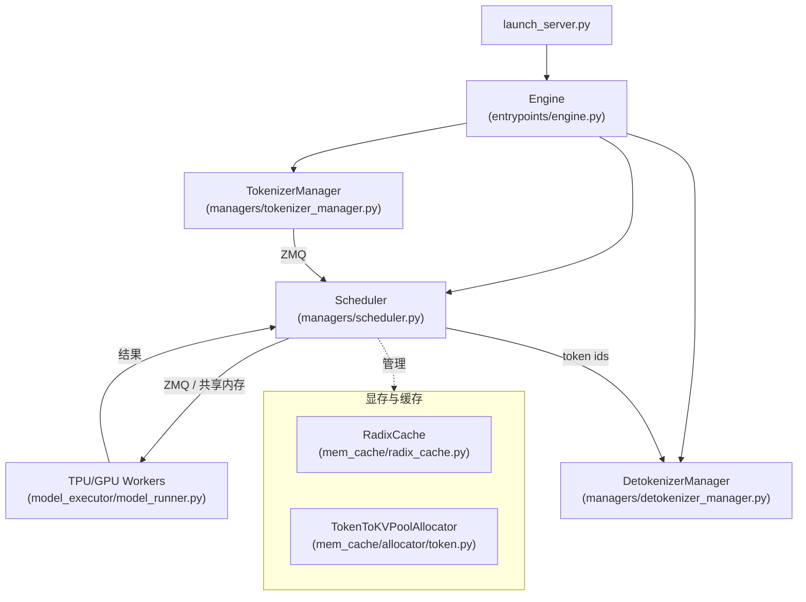

# 目录与模块地图

> 初版（Phase 0）。本表基于本地源码 `python/sglang/srt` 的目录结构与关键类定位生成，后续深潜文档会逐模块补全细节。
> 锚点格式：`路径:行号`（行号为初版快照，可能随上游变动，请以本地文件为准）。

## 顶层布局

| 路径 | 职责 | 关键类 / 入口 |
| --- | --- | --- |
| `python/sglang/launch_server.py` | 服务启动总入口（CLI `python -m sglang.launch_server`） | `run_server()`（:15） |
| `python/sglang/srt/entrypoints/` | HTTP / gRPC / OpenAI / Anthropic / Ollama 兼容入口、Engine 封装 | `Engine`（`entrypoints/engine.py`）、`launch_server()`（`entrypoints/http_server.py:2718`） |
| `python/sglang/srt/managers/` | **多进程调度核心**：Tokenizer 管理、Scheduler、Detokenizer | `Scheduler`、`TokenizerManager`、`DetokenizerManager` |
| `python/sglang/srt/mem_cache/` | KV 缓存与 Radix 树、显存分配器 | `RadixCache`、`TokenToKVPoolAllocator`（`mem_cache/allocator/token.py:28`）、多级缓存 |
| `python/sglang/srt/model_executor/` | 模型前向执行、CUDA Graph、batch 组装 | `ModelRunner`、`ForwardBatch` |
| `python/sglang/srt/layers/` | 注意力后端抽象、量化层、radix attention 层 | `RadixAttention`、`*Backend` |
| `python/sglang/srt/models/` | 各模型实现（216 个文件） | 如 `llama.py`、`deepseek_v4.py` |
| `python/sglang/srt/distributed/` | 张量/流水/数据并行通信原语 | `GroupCoordinator` 等 |
| `python/sglang/srt/eplb/` | 专家并行负载均衡（Expert Parallelism Load Balancer） | EPLB 算法 |
| `python/sglang/srt/sampling/` | 采样参数、logits processor、penalty | `SamplingParams`、penalty lib |
| `python/sglang/srt/speculative/` | 投机解码（EAGLE / n-gram 等） | `SpecInput`（`speculative/spec_info.py:330`）、`BaseSpecWorker`（`speculative/base_spec_worker.py:147`） |
| `python/sglang/srt/constrained/` | 语法/JSON 约束解码（集成 xgrammar / outlines） | `BaseGrammarObject`（`constrained/base_grammar_backend.py:52`）、`GrammarManager`（`constrained/grammar_manager.py:26`） |
| `python/sglang/srt/lora/` | LoRA 适配器加载与合并 | `LoRAManager` |
| `python/sglang/srt/multimodal/` | 多模态输入处理与缓存 | `MultimodalDataItem`（`managers/schedule_batch.py:317`）、processors |
| `python/sglang/srt/disaggregation/` | PD 分离（prefill/decode 解耦） | `PrefillBootstrapQueue`（`disaggregation/prefill.py:119`）、`DecodeTransferQueue`（`disaggregation/decode.py:1795`） |
| `python/sglang/srt/observability/` | 指标、日志、profiling | `SchedulerMetricsCollector`（`observability/metrics_collector.py:238`） |
| `python/sglang/srt/server_args.py` | 全局参数体系 | `ServerArgs`（dataclass） |
| `python/sglang/srt/arg_groups/` | `ServerArgs` 的 CLI 参数分组定义 | `arg_utils.py` |
| `python/sglang/lang/` | 前端 DSL 编译器与运行时 | `SglFunction`（`lang/ir.py:141`）、`StreamExecutor`（`lang/interpreter.py:274`） |
| `python/sglang/kernels/` | 自研 CUDA/Triton kernel（JIT/AOT） | `ops/`、`jit/` |

## 进程级模块地图

## 关键文件速查（按读者目标）

| 你想做的事 | 先读 |
| --- | --- |
| 理解一次请求怎么走完 | `managers/tokenizer_manager.py` → `managers/scheduler.py` → `model_executor/model_runner.py` → `managers/detokenizer_manager.py` |
| 改调度策略 | `managers/scheduler.py`、`managers/schedule_batch.py` |
| 调 KV 缓存 / 显存 | `mem_cache/radix_cache.py`、`mem_cache/memory_pool.py` |
| 换/加注意力后端 | `layers/attention/attention_registry.py`、`layers/attention/base_attn_backend.py` |
| 加模型 | `models/llama.py`、`model_loader/weight_utils.py` |
| 改并行 | `distributed/`、`eplb/` |
| 改采样/约束 | `sampling/`、`constrained/` |
| 看指标 | `observability/metrics_collector.py` |

> 注：深潜文档（[模块深潜](../deep-dive/scheduler.md) 等）会基于上述锚点逐行展开，本文为地图而非细节。
