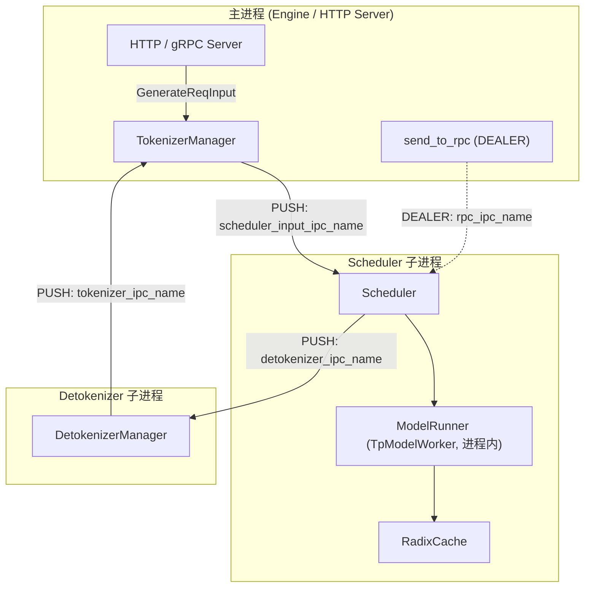
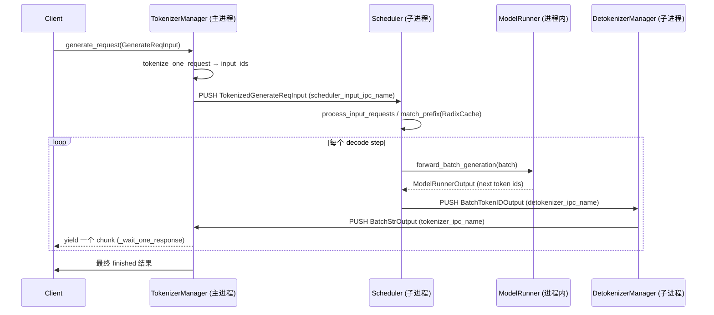

# SGLang 推理引擎全局架构总览（architecture/overview）

> 本文档依据 SSOT 仓库 `sglang`（对齐 commit `e1c4db9621f7c4203ee9becd5d5456d4e6bf54f7`，2026-08-14）的源码阅读整理而成。所有关键论断均附 `文件:行号区间` 形式的证据锚点，行号以 Read 工具实测为准。

---

## 1. What：SGLang 由什么组成

SGLang 的推理栈分为两层：

- **前端 DSL 层（sglang 包）**：提供 `sglang` Python 库里的编程式结构化生成接口（如 `sglang` runtime 的前端函数、`program` 等），让调用方以代码形式表达多轮对话、分支、并行、约束解码等复杂提示词结构。
- **后端引擎层（SRT = SGLang Runtime）**：由 `python/sglang/srt/entrypoints/engine.py` 中的 `Engine` 类承载，是真正的推理执行引擎。它对外暴露 `generate / async_generate / encode / rerank` 等 Python API，以及通过 HTTP/gRPC 服务暴露的 REST 接口。

`Engine` 自身的类注释明确把后端拆成三个核心组件：

> "The engine consists of three components: 1. TokenizerManager: Tokenizes the requests and sends them to the scheduler. 2. Scheduler (subprocess): Receives requests, schedules batches, forwards them, and sends the output tokens to the Detokenizer Manager. 3. DetokenizerManager (subprocess): Detokenizes the output tokens and sends the result back to the Tokenizer Manager."

证据锚点：`python/sglang/srt/entrypoints/engine.py:199-211`

注意这里 GPU 计算并不由独立的"模型进程"承担——它发生在 **Scheduler 进程内部**。`Scheduler` 在其 `init_tp_model_worker()` 中直接构造 `TpModelWorker`，而 `TpModelWorker` 又在同一进程内持有 `ModelRunner`（`python/sglang/srt/managers/scheduler.py:901-918` 与 `python/sglang/srt/managers/tp_worker.py:299-466`）。因此本任务题面中"Worker(ModelRunner) 作为一个独立进程"的说法，在默认（非 disaggregation、非 Rust server）部署下并不准确——`ModelRunner` 是 Scheduler 子进程内的一个**线程/对象组件**，而非独立 OS 进程。详见末尾"坑与边界"与 `docs/appendix/_openq_overview.md`。

---

## 2. 多进程模型与 ZMQ 通信

### 2.1 进程边界

| 进程 | 真实类名 | 是否独立进程 | 职责 |
|------|----------|--------------|------|
| 主进程 | `Engine` / `HTTP Server` / `TokenizerManager` | 是（TokenizerManager 在主进程内，非子进程） | 接收请求、tokenize、聚合结果、托管 HTTP/gRPC 服务 |
| Scheduler 子进程 | `Scheduler` | 是（`mp.Process`，`run_scheduler_process`） | 接收 tokenized 请求、调度 batch、调用 `ModelRunner` 做 GPU 前向、管理 `RadixCache`、把输出 token 发给 Detokenizer |
| Detokenizer 子进程 | `DetokenizerManager` | 是（`mp.Process`，`run_detokenizer_process`） | 把 token id 还原为文本/embedding 输出，回传给 TokenizerManager |
| （可选）DataParallelController | `run_data_parallel_controller_process` | 是 | 当 `dp_size>1` 或 `ep_join_mode=="scale"` 时，取代直接启动的 TP scheduler 进程，负责 DP 路由 |

进程启动的组装逻辑集中在 `Engine._launch_subprocesses`：`python/sglang/srt/entrypoints/engine.py:1051-1244`。其中：

- Scheduler 进程由 `Engine._launch_scheduler_processes` 用 `mp.Process(target=run_scheduler_process_func, ...)` 启动：`python/sglang/srt/entrypoints/engine.py:847-963`。
- Detokenizer 由 `Engine._launch_detokenizer_subprocesses` 启动，默认 `detokenizer_worker_num==1` 时只起一个进程：`python/sglang/srt/entrypoints/engine.py:965-1020`。
- 当 `node_rank>=1`（非 rank-0 节点）或启用 Rust server 时，主进程**不**启动 TokenizerManager 与 Detokenizer（`python/sglang/srt/entrypoints/engine.py:1138-1188`）。

### 2.2 进程间通信（IPC）通道

所有跨进程通信走 `zmq`（严格说是 `pyzmq` 的 IPC transport，非 TCP），通道名来自 `PortArgs`（`python/sglang/srt/server_args.py:9702-9720`）。三类核心 socket 的绑定关系如下：

1. **TokenizerManager → Scheduler**：`zmq.PUSH` 推到 `port_args.scheduler_input_ipc_name`。
   证据：`python/sglang/srt/managers/tokenizer_manager.py:540-542`（单 tokenizer 模式）。
2. **Scheduler → DetokenizerManager**：`zmq.PUSH` 推到 `port_args.detokenizer_ipc_name`；Scheduler 侧由 `SchedulerIpcChannels` 持有 `send_to_detokenizer`。
   证据：`python/sglang/srt/managers/scheduler_components/ipc_channels.py:58-68` 与 `python/sglang/srt/managers/detokenizer_manager.py:113-114`。
3. **DetokenizerManager → TokenizerManager**：`zmq.PUSH` 推到 `port_args.tokenizer_ipc_name`；TokenizerManager 侧用 `zmq.PULL` 的 `recv_from_detokenizer` 接收。
   证据：`python/sglang/srt/managers/detokenizer_manager.py:120-121` 与 `python/sglang/srt/managers/tokenizer_manager.py:536-537`。

此外还有 Engine 主进程到各 Scheduler 的 RPC 通道（`rpc_ipc_name`，`zmq.DEALER`）：`python/sglang/srt/entrypoints/engine.py:291-293`，用于 `collective_rpc`（`python/sglang/srt/entrypoints/engine.py:1604-1609`）。

> **Why 多进程**：tokenizer/detokenizer 是 CPU 密集且可能阻塞的 Python 工作（正则、chat template 渲染、多模态图像预处理），而 GPU 前向是异步、需要连续喂料的。把这两类工作拆到独立进程，可以让 Scheduler 的 GPU 计算循环不被 Python GIL 与 tokenize 阻塞打断，实现 CPU 预处理与 GPU 计算的重叠（overlap schedule）。引擎注释原文："Inter-process communication is done through IPC (each process uses a different port) via the ZMQ library."（`python/sglang/srt/entrypoints/engine.py:208-210`）。

---

## 3. 线程模型

### 3.1 TokenizerManager（主进程）

`TokenizerManager` 运行在 `asyncio` + `uvloop` 事件循环上（模块级 `asyncio.set_event_loop_policy(uvloop.EventLoopPolicy())`，`python/sglang/srt/managers/tokenizer_manager.py:155`）。其核心是一个 `handle_loop` 协程：不断 `async_sock_recv(self.recv_from_detokenizer)`，收到 `BatchStrOutput / BatchEmbeddingOutput / BatchTokenIDOutput` 后调用 `_handle_batch_output`，否则走 `_result_dispatcher`。

证据：`python/sglang/srt/managers/tokenizer_manager.py:2200-2213`。

针对每个用户请求，`generate_request` 是一个 `async` 生成器：先 tokenize，再通过 `_send_one_request` 把 `TokenizedGenerateReqInput` 用 `sock_send` 推给 Scheduler，然后 `yield from _wait_one_response(obj, request)`，在 `state.event` 上等待并逐块吐出结果。

证据：`python/sglang/srt/managers/tokenizer_manager.py:755-822` 与 `python/sglang/srt/managers/tokenizer_manager.py:1722-1807`。

### 3.2 Scheduler（子进程）

`run_scheduler_process` 在子进程里构造 `Scheduler` 后调用 `scheduler.run_event_loop()`（`python/sglang/srt/managers/scheduler.py:5042-5058`）。`run_event_loop` 建立一条 `schedule_stream`（CUDA stream，用于与 `forward_stream` 重叠），随后 `dispatch_event_loop(self)` 选择 `event_loop_normal` 或 `event_loop_overlap`：

- `event_loop_normal`：每轮 `recv_requests → process_input_requests → get_next_batch_to_run → run_batch → process_batch_result`（`python/sglang/srt/managers/scheduler.py:1714-1747`）。
- `event_loop_overlap`：额外用一个 `result_queue` 把上一批的结果处理与当前批的前向重叠（`python/sglang/srt/managers/scheduler.py:1749-1788`）。

Scheduler 的主循环是**单线程、同步**的（GPU 前向在 `self.model_worker.forward_batch_generation(batch)` 中同步触发，由 CUDA stream 异步执行），但它不持有 asyncio 事件循环——它与 Detokenizer 的通信通过 `SenderWrapper.send_output` 同步 `sock_send`。

### 3.3 DetokenizerManager（子进程）

`DetokenizerManager.event_loop` 是一个**阻塞的同步死循环**（非 asyncio）：`sock_recv(self.recv_from_scheduler)` 收包，用 `TypeBasedDispatcher` 分发，输出（若有）经 `sock_send(self.send_to_tokenizer, output)` 回传。

证据：`python/sglang/srt/managers/detokenizer_manager.py:166-174`。

### 3.4 为什么三者线程模型不同

TokenizerManager 用 asyncio 是因为它要同时服务大量并发 HTTP 连接并等待网络 IO；Detokenizer 是纯 CPU 串行 decode（受 GIL 限制，异步无收益），故用同步阻塞循环更简单、延迟更稳；Scheduler 是 GPU 驱动的单循环，必须在单一确定顺序下推进 forward 以避免状态错乱。

---

## 4. How：一次请求的数据流

下面以 `Engine.generate("hello")` 为例，串起完整调用链。

### 4.1 启动期的组装（launch_server 调用链）

1. CLI 入口 `python -m sglang.launch_server` 解析参数后调用 `run_server`（`python/sglang/launch_server.py:15-52`），默认 HTTP 模式走 `sglang.srt.entrypoints.http_server.launch_server`。
2. HTTP server 内部构造 `Engine(...)`（`python/sglang/srt/entrypoints/engine.py:224-320`）。
3. `Engine.__init__` 调用 `self._launch_subprocesses(...)`，该函数：
   - 分配 `PortArgs`（`PortArgs.init_new`，`python/sglang/srt/entrypoints/engine.py:1085-1086`）；
   - 启动 Scheduler 子进程（`_launch_scheduler_processes`）；
   - 启动 Detokenizer 子进程（`_launch_detokenizer_subprocesses`）；
   - 在主进程构造 `TokenizerManager`（`python/sglang/srt/entrypoints/engine.py:1201-1208`）；
   - 调 `scheduler_init_result.wait_for_ready()` 阻塞等到各 Scheduler 通过 `mp.Pipe` 回报 `get_init_info()`，确认权重加载与 CUDA graph 就绪（`python/sglang/srt/entrypoints/engine.py:1213` 与 `python/sglang/srt/managers/scheduler.py:5055`）。
4. 主进程用 `zmq.Context(2)` 建立 `send_to_rpc`（`python/sglang/srt/entrypoints/engine.py:289-295`）。

### 4.2 运行期的数据流（时序）

关键节点：

- **Tokenize**：`TokenizerManager.generate_request` → `_tokenize_one_request` 把文本变成 `input_ids`，再 `_send_one_request` 推送给 Scheduler（`python/sglang/srt/managers/tokenizer_manager.py:801-807`）。
- **Scheduler 收包与调度**：`event_loop_normal` 每轮 `recv_requests()` 拉取，`process_input_requests` 把请求落成 `Req` 并插入等待队列（`python/sglang/srt/managers/scheduler.py:1721-1722`）。
- **前缀复用（RadixCache）**：在把请求送入 forward 前，Scheduler 通过 `RadixCache.match_prefix` 查最长已缓存前缀，命中部分直接复用 KV，只算未命中后缀（`python/sglang/srt/mem_cache/radix_cache.py:376-434`）。生成完成后 `cache_finished_req`（`:458` 起）把新前缀通过 `insert`（`python/sglang/srt/mem_cache/radix_cache.py:436-457`）写回树。
- **GPU 前向**：`Scheduler` 调 `self.model_worker.forward_batch_generation(batch)`，最终落到 `ModelRunner.forward(forward_batch) → _forward_raw`，返回 `ModelRunnerOutput`（`python/sglang/srt/model_executor/model_runner.py:1510-1560` 与 `python/sglang/srt/managers/scheduler.py:3691/3760`）。
- **回传 detokenize**：Scheduler 把输出 token 经 `self.ipc_channels.send_to_detokenizer.send_output(...)` 发给 Detokenizer（`python/sglang/srt/managers/scheduler.py:4852/4863`）；Detokenizer 的 `handle_batch_token_id_out`（`:430` 起）把 token id 还原文本后 `sock_send` 回 TokenizerManager，由 `_handle_batch_output` 写入 `ReqState.out_list` 并 `state.event.set()` 唤醒等待中的生成器（`python/sglang/srt/managers/tokenizer_manager.py:2215-2309`）。

---

## 5. 坑与边界（容易踩错的理解）

1. **ModelRunner 不是独立进程**：如前所述，默认部署下 `ModelRunner` 在 Scheduler 子进程内，由 `TpModelWorker` 持有（`python/sglang/srt/managers/tp_worker.py:299-466`）。若把架构图误画成"Tokenizer / Scheduler / Worker / Detokenizer 四个平级进程"，会与代码不符。仅在 disaggregation（prefill/decode 分离）或 Rust server 模式下，GPU 计算才被独立 server 接管（`python/sglang/srt/managers/scheduler.py:2003` 的 `self.recv_from_tokenizer = rust_server`）。

2. **多 tokenizer / 多 detokenizer 模式会改变 socket 拓扑**：当 `detokenizer_worker_num>1` 时，会额外起一个 `MultiDetokenizerRouter` 进程，每个 detokenizer worker 使用独立 IPC socket，router 拥有原 `detokenizer_ipc_name`（`python/sglang/srt/entrypoints/engine.py:985-1020`）。同理 `tokenizer_worker_num>1` 时主进程内是 `MultiTokenizerRouter` 而非单个 `TokenizerManager`（`python/sglang/srt/entrypoints/engine.py:1201-1208`）。本文图的拓扑只覆盖默认 `worker_num==1`。

3. **DP/EP scale 模式路由层**：当 `dp_size>1` 或 `ep_join_mode=="scale"`，`_launch_scheduler_processes` 不再直接起 TP scheduler 进程，而是起一个 `run_data_parallel_controller_process`，由它再去拉起各 DP rank 的 scheduler（`python/sglang/srt/entrypoints/engine.py:864-934`）。此时 IPC 拓扑多一层 `DataParallelController` 做分发——简单三进程图不适用。

4. **Scheduler 非 rank-0 不接收 tokenizer 请求**：只有 `pp_rank==0 & attn_tp_rank==0 & attn_cp_rank==0` 的 Scheduler 才绑定 `recv_from_tokenizer`（`python/sglang/srt/managers/scheduler.py:733-760`）。其余 TP/PP rank 的 scheduler 只通过 NCCL 参与集合通信，不直接从 tokenizer 收请求。

5. **ZMQ PUSH/PULL 是无路由、fire-and-forget**：TokenizerManager 用 `zmq.PUSH` 发、Scheduler 用 `zmq.PULL` 收，是一对多/多对一的队列语义，没有请求-响应配对；请求与输出的"配对"完全靠 `rid` 在应用层完成（`python/sglang/srt/managers/tokenizer_manager.py:2230-2231` 的 `rid_to_state[rid]`）。

6. **启动阻塞点**：`_wait_for_scheduler_ready` 用 `mp.Pipe` 的 `poll(timeout=5.0)` 等待，而非无限阻塞，以便子进程被 OOM SIGKILL 时能尽快报错而非挂死（`python/sglang/srt/entrypoints/engine.py:1762-1791`）。

---

## 6. 小结

SGLang 后端是一个"**主进程 TokenizerManager + Scheduler 子进程（内含 ModelRunner 与 RadixCache）+ Detokenizer 子进程**"的多进程、ZMQ-IPC 架构。多进程的核心动机是把阻塞型 CPU tokenize/detokenize 与 GPU 前向解耦，以支撑 overlap schedule 与高并发。请求以 `rid` 为关联键，在 `TokenizerManager → Scheduler → DetokenizerManager → TokenizerManager` 的环路上流转，GPU 计算与 KV 前缀缓存则由进程内的 `ModelRunner` 与 `RadixCache` 完成。

> **[OPEN]** 题面将 `ModelRunner` 列为一个独立"进程"，但默认部署下它通过 `TpModelWorker` 运行在 Scheduler 子进程内部（见 `python/sglang/srt/managers/tp_worker.py:466` 的 `self._model_runner = ModelRunner(...)`）。需进一步确认：在哪些官方/第三方部署形态（如 disaggregation、Rust server 或历史 `model_worker` 进程模式）中，GPU 计算会被拆成独立 OS 进程；当前源码中是否存在仍未移除的"独立 model worker 进程"代码路径。详见 `docs/appendix/_openq_overview.md`。
