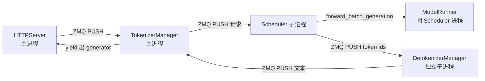
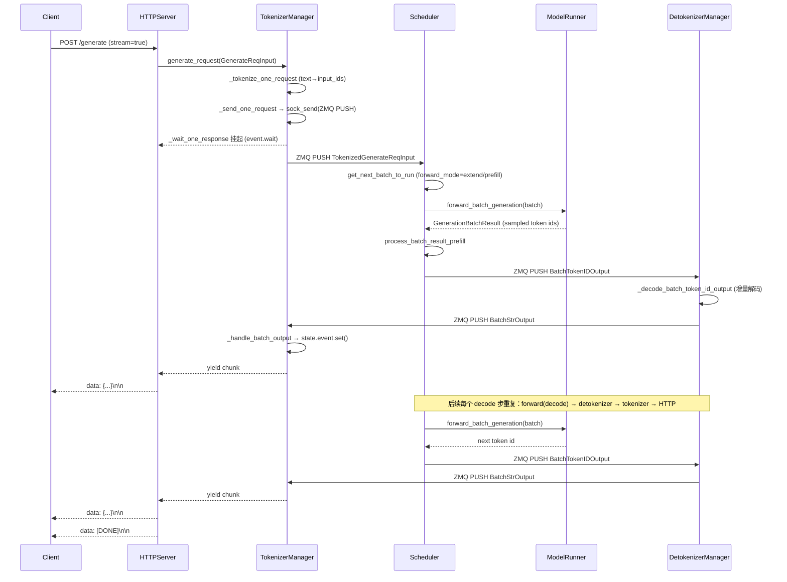

# 一次请求的完整生命周期（Request Lifecycle）

> 本文档对齐 commit `e1c4db9621f7c4203ee9becd5d5456d4e6bf54f7`（2026-08-14）。所有论断均来自该 commit 的本地源码，行号以 `Read` 实测为准。

## What：一次 HTTP 生成请求是什么

在 SGLang Runtime（SRT）中，一次生成请求（如 `/generate`、`/v1/chat/completions`）从客户端进入，到第一个 token 以 SSE 流式返回，要穿过 **五个真实进程/线程组件**，经过 **四段 ZMQ 跨进程队列**。这五个组件不是抽象分层，而是源码中真实存在的类（见 `python/sglang/srt/`）。

| 组件 | 真实类名 | 进程位置 | 职责 |
| --- | --- | --- | --- |
| HTTP 接入层 | `HTTPServer`（FastAPI app，`http_server.py`） | 主进程 | 解析 HTTP、构造 `GenerateReqInput`、把流式结果包成 SSE |
| 令牌管理 | `TokenizerManager` | 主进程（与 HTTP 同进程） | 分词、构造 tokenized 请求、发送 ZMQ、异步等待响应 |
| 调度器 | `Scheduler`（`scheduler.py`，`run_scheduler_process` 启动） | 子进程 | 接收请求、组 batch、调度 prefill/decode、调用 `ModelRunner` |
| 模型执行 | `ModelRunner`（经 `model_worker.forward_batch_generation`） | 与 Scheduler 同子进程 | 真实 GPU forward、采样出 token id |
| 去令牌化 | `DetokenizerManager` | 独立子进程 | 把 token id 增量解码成文本、回传 `TokenizerManager` |

`Engine` 类的文档字符串（`python/sglang/srt/entrypoints/engine.py:199-211`）明确写道：HTTP server、Engine、TokenizerManager 都运行在**主进程**；进程间通信通过 ZMQ 库，每个进程使用不同的 IPC 端口。这与我们的分进程描述完全一致。

### 进程与 ZMQ 队列边界

`TokenizerManager.init_ipc_channels`（`python/sglang/srt/managers/tokenizer_manager.py:534-560`）在主进程建立两个 socket：
- `recv_from_detokenizer`：`zmq.PULL`，绑定 `port_args.tokenizer_ipc_name` —— 接收去令牌化结果。
- `send_to_scheduler`：`zmq.PUSH`，连 `port_args.scheduler_input_ipc_name` —— 把 tokenized 请求推给 Scheduler。

`DetokenizerManager.init_ipc_channels`（`python/sglang/srt/managers/detokenizer_manager.py:111-126`）建立：
- `recv_from_scheduler`：`zmq.PULL`，绑定 `port_args.detokenizer_ipc_name` —— 接收 Scheduler 的 token 输出。
- `send_to_tokenizer`：`zmq.PUSH` —— 把解码后的文本回推给 `TokenizerManager`。

Scheduler 端通过 `ipc_channels` 持有 `recv_from_tokenizer` 与 `send_to_detokenizer`（见 `python/sglang/srt/managers/scheduler.py:760-782` 与 `:2136`）。于是形成如下数据环：



**关键边界结论**：分词（文本→input_ids）只发生在主进程的 `TokenizerManager`；`token id` 的 GPU 计算只发生在 `Scheduler`/`ModelRunner` 子进程；文本解码（token id→文本）只发生在 `DetokenizerManager` 子进程。跨进程的"载荷"是经过 `wrap_pickle_fields` 的 `TokenizedGenerateReqInput`（`python/sglang/srt/managers/tokenizer_manager.py:1586-1606` 的 `_send_one_request`），以及 `BatchTokenIDOutput`/`BatchStrOutput` 这类批量输出对象。

## Why：为什么是这样一条链路

### 1. 把"重 CPU + GPU"解耦，避免互相阻塞
分词、模板渲染、多模态 processor 是 CPU 密集且会抖动的操作；而 GPU forward 必须尽可能饱满。把它们放进不同进程，TokenizerManager 的阻塞不会拖慢 Scheduler 的批处理循环。源码中 `Scheduler.event_loop_normal`（`python/sglang/srt/managers/scheduler.py:1714-1746`）是纯粹的 `while True` 循环：收请求 → `get_next_batch_to_run` → `run_batch` → `process_batch_result`，没有任何 tokenizer 调用。

### 2. 去令牌化单独成进程，支持批量解码与并发
`DetokenizerManager` 把一批请求的 token id 一次性批量解码（`_grouped_batch_decode`，`python/sglang/srt/managers/detokenizer_manager.py:226-288`），并维护每个 rid 的增量解码状态 `DecodeStatus`（`:64-88`）。单独进程使得词典解码与主进程解耦，且可通过 `detokenizer_worker_num` 水平扩展（见 `engine.py:_launch_detokenizer_subprocesses`，`python/sglang/srt/entrypoints/engine.py:965-1020`）。

### 3. 流式（SSE）自然落在"最后一段回程"
流式输出不需要在 GPU 侧做任何特殊处理——`Scheduler` 每解码出一个 token 就通过 ZMQ 推给 `DetokenizerManager`，后者立即回推 `TokenizerManager`，由 HTTP 层逐条 `yield`。因此 token 的"流式返回"发生点不在模型里，而在 **HTTP server 的 `stream_results` 生成器**（见下节）。

## How：逐段代码路径与关键函数

### 1) HTTP 接入：`HTTPServer.generate_request`

FastAPI 路由 `/generate` 由 `generate_request`（`python/sglang/srt/entrypoints/http_server.py:874-919`）处理。它读取 `obj.stream`：

- 流式分支（L878-910）：构造 `stream_results()` 异步生成器，内部 `async for out in _global_state.tokenizer_manager.generate_request(obj, request)` 每拿到一个 chunk，就 `yield b"data: " + dumps_json(out) + b"\n\n"`；结束时 `yield b"data: [DONE]\n\n"`。返回 `StreamingResponse(..., media_type="text/event-stream")`。**这就是 SSE 流式 token 返回的真实发生点。**
- 非流式分支（L911-919）：直接 `.__anext__()` 取第一个（也是唯一一个）完整结果，用 `orjson_response` 返回。

注意 `obj` 在这里已经是 FastAPI 用 pydantic 反序列化好的 `GenerateReqInput` 实例（`:874` 的类型标注）。OpenAI 兼容端点（如 `/v1/chat/completions`，`:1702-1709`）则先交给 `OpenAIServingChat.handle_request`，最终仍汇总成同一个 `GenerateReqInput` 并调用 `tokenizer_manager.generate_request`。

### 2) 主进程：`TokenizerManager.generate_request` 与发送

`generate_request`（`python/sglang/srt/managers/tokenizer_manager.py:755-821`）是一个 `async generator`：

1. `obj.normalize_batch_and_arguments()` 规范化（L763）。
2. `_init_req_state(obj, request)` 建立 `rid_to_state[rid]` 状态槽（L786），后续响应就写回这个槽。
3. 在 `model_update_lock.reader_lock` 下调用 `_validate_and_resolve_lora`（L797）。
4. 单请求分支（L801-808）：
   - `_tokenize_one_request(obj)`（L985）做文本→`input_ids`、跑多模态 processor。
   - `_send_one_request(tokenized_obj)`（L1586）经 `_dispatch_to_scheduler` → `sock_send(self.send_to_scheduler, obj)`（L557-560）推入 ZMQ。
   - `async for response in self._wait_one_response(obj, request): yield response`（L807）—— 挂起，等待结果。

`_send_one_request` 还会对多模态特征做 `cuda_vmm_feature_transport.prepare_for_dispatch` 与 `wrap_pickle_fields()`（L1593-1602），说明跨进程发送前会把对象打包成可 pickle / 共享内存友好的形态。

### 3) Scheduler 子进程：接收、调度、forward

`Scheduler.event_loop_normal`（`python/sglang/srt/managers/scheduler.py:1714-1746`）主循环：

```
recv_reqs = self.request_receiver.recv_requests()   # 从 tokenizer ZMQ 收
self.process_input_requests(recv_reqs)              # 把新请求放进 waiting_queue
plan = self.get_next_batch_to_run(...)             # 拼 running/waiting 成 batch
self.running_batch = plan.running_batch
if batch: result = self.run_batch(batch)           # GPU forward
self.process_batch_result(batch, result)           # 采样/组输出/推给 detokenizer
```

- `get_next_batch_to_run`（`python/sglang/srt/managers/scheduler.py:3012`）决定批次的 `forward_mode`：新进请求走 **extend（prefill）**，已在运行的请求走 **decode**。
- `run_batch`（`python/sglang/srt/managers/scheduler.py:3623`）调用 `self.model_worker.forward_batch_generation(batch)`（例如 L3691、L3784）。`model_worker` 内部最终委托给 `ModelRunner.forward`。

### 4) ModelRunner：prefill 与 decode 的真实落点

`ModelRunner.forward`（`python/sglang/srt/model_executor/model_runner.py:1510`）依据 `forward_batch.forward_mode` 分派：

- **decode**：优先走 `decode_cuda_graph_runner.execute(...)`（L1678-1687，条件是 `forward_mode.is_decode()` 且 CUDA graph 能跑）。`init_decode_cuda_graph`（`model_runner.py:1370-1385`）在启动时捕获 decode 的 CUDA graph，以压低解码步延迟。
- **extend / prefill**：走 `prefill_cuda_graph_runner.execute(...)`（L1736-1741）或 eager 路径（L1741 之后）。`init_prefill_cuda_graph`（`model_runner.py:1385-1401`）捕获 prefill CUDA graph。
- **split prefill**：`forward_split_prefill`（`model_runner.py:1488-1510`）用于把超长 prompt 切块 prefill。

`forward` 返回 `GenerationBatchResult`，其中包含采样出的 `logits`/`next_token_ids`，随后由 `run_batch` 内的 `copy_to_cpu`（如 L3724-3737）把结果 D2H 回 CPU。

### 5) 回程：Scheduler → DetokenizerManager → TokenizerManager

`process_batch_result`（`python/sglang/srt/managers/scheduler.py:3917-3940`）按 `forward_mode` 选择处理路径：
- `is_decode()` → `process_batch_result_decode`（L3928）
- `is_extend()`（即 prefill）→ `process_batch_result_prefill`（L3935；PD 分离时走 `process_batch_result_disagg_prefill`，L3932-3933）

这些方法内部（经 `batch_result_processor`）把 token id 组装成 `BatchTokenIDOutput`（或 embedding 的 `BatchEmbeddingOutput`），通过 `ipc_channels.send_to_detokenizer.send_output(...)` 推送（调用点见 `scheduler.py:2136` 绑定的 `send_to_detokenizer`）。

`DetokenizerManager.event_loop`（`python/sglang/srt/managers/detokenizer_manager.py:166-174`）收 `recv_from_scheduler`，经 `_request_dispatcher` 解码（核心逻辑在 `_decode_batch_token_id_output`，L290-321，维护 `DecodeStatus` 增量解码、裁掉 stop 串/stop token），再 `sock_send(self.send_to_tokenizer, output)` 把 `BatchStrOutput` 推回主进程。

主进程 `TokenizerManager.handle_loop`（`python/sglang/srt/managers/tokenizer_manager.py:2200-2213`）是常驻事件循环：`async_sock_recv(self.recv_from_detokenizer)` 收到 `BatchStrOutput` 后调用 `_handle_batch_output`（L2215），该函数按 `rid` 把增量结果写进 `rid_to_state[rid].out_list` 并置 `state.event`，唤醒正在 `_wait_one_response` 中 `await state.event.wait()` 的协程（L1731-1754）。HTTP 层的 `stream_results` 于是再 `yield` 一条 SSE 数据。

### 6) 端到端时序图



### 7) prefill 与 decode 在链路中的位置

- **prefill（代码中叫 extend）**：仅发生在"请求首次进入运行队列"的那一步。Scheduler 在 `get_next_batch_to_run` 把新请求标记为 extend 模式（`process_batch_result` 走 `is_extend()` 分支）。此时 `ModelRunner` 对整个 prompt 做一次性 forward，并通过 `forward_mode.is_extend()` 在 `forward`（model_runner.py:1717-1741）分流到 prefill CUDA graph / eager 路径。
- **decode**：prefill 完成后，该请求留在 `running_batch`，此后每一步都是 decode。采样出一个 token 即被推给 `DetokenizerManager` 并立刻回传，**每个 decode 步就是一次流式 chunk**。这就是"边解码边流式"的实现机制——流式不是事后切片，而是 decode 步天然产生增量。
- PD 分离（disaggregation）：当 `disaggregation_mode == "prefill"` 时，prefill 节点把 KV 提前发给 decode 节点（`scheduler.py:3649-3651` 的 `maybe_send_cached_prefix_chunk`），此时 prefill 节点走 `process_batch_result_disagg_prefill`（L3932-3933）而非普通 prefill 路径。

## 边界与坑（容易踩的点）

1. **多 tokenizer 模式下信道名不同**：`tokenizer_worker_num > 1` 时，`TokenizerManager` 用 `tokenizer_worker_ipc_name` 而非 `scheduler_input_ipc_name`，且 `DetokenizerManager` 的 `send_to_tokenizer` 被绕过，改为经 `MultiDetokenizerRouter` 直接回推各 `TokenizerWorker`（`detokenizer_manager.py:116-120`）。文档中的"单一 send_to_tokenizer"只适用于 `tokenizer_worker_num==1`。
   > **[OPEN]** 多 tokenizer 模式下，`TokenizerWorker` 与 `MultiTokenizerRouter` 的具体分发/聚合实现（见 `python/sglang/srt/managers/multi_tokenizer_mixin.py`）本文未展开；其回程路径与单进程是否完全一致，需进一步核对。

2. **流式 vs 非流式共享同一条回程**：无论 stream 与否，`Scheduler`/`DetokenizerManager` 都逐 token 推送，区别只在 `TokenizerManager._wait_one_response`：流式每个 chunk 立即 `yield`（L1809-1816），非流式则一直等到 `finished` 才取最后一个 `out_list[-1]` 返回（L1779-1807）。所以非流式请求的延迟 = prefill + 全部 decode + 回程，首 token 不会提前返回。

3. **`state.event` 超时与断连 abort**：`_wait_one_response` 用 `asyncio.wait_for(state.event.wait(), timeout=_REQUEST_STATE_WAIT_TIMEOUT)`（L1733），超时不直接报错，而是检查 `request.is_disconnected()`，若客户端已断则调用 `abort_request`（L1740-1747）。这解释了为什么客户端断开后服务端不会卡死，而是在下一个事件循环收到 abort 信号。

4. **health check 的旁路**：`/health_generate` 构造的请求走 `generate_request` 但只取一个 token；`maybe_send_health_check_signal`（`scheduler.py:3985-3994`）可直接经 `send_to_tokenizer` 回 `HealthCheckOutput`，**绕过 DetokenizerManager**。因此健康探测并不完全经过完整链路，不能据此推断 detokenizer 是否健康（源码注释 L3989 已自承此点）。

5. **overlap 调度下的结果延迟**：`event_loop_overlap`（`scheduler.py:1749-1821`）把上一批的 `process_batch_result` 与下一批的 GPU forward 重叠，结果进 `result_queue`。这意味着 decode 步的输出处理可能滞后一个 batch，但流式回程仍按 token 粒度推进，不会累积成大块（除非 `_coalesce_streaming_chunks` 因 backlog 触发合并，见 `tokenizer_manager.py:1641-1676` 的告警）。

6. **ZMQ 阻塞发送风险**：`TokenizerManager` 用 `zmq.PUSH` 发请求、`send_to_detokenizer` 用 PUSH 回推，均为单向队列。若 detokenizer 消费慢于生产，队列在 OS 层缓冲；但 Scheduler 主循环是单线程顺序 `run_batch`+`process_batch_result`，不会无限堆积（背压体现在 running/waiting 队列的调度上，而非 ZMQ）。

### 8) 离线 Python API（`Engine.generate`）走的是同一条链路

值得强调的是，上述 HTTP 链路并不是唯一入口。离线场景下的 `Engine.generate` / `async_generate`（`python/sglang/srt/entrypoints/engine.py:352-460` 与 `:462-563`）同样只是把入参打包成 `GenerateReqInput`，然后调用 `self.tokenizer_manager.generate_request(obj, None)`（L445、L558）。区别仅在于：HTTP 路径由 FastAPI 协程驱动，而离线路径由 `self.loop.run_until_complete(generator.__anext__())`（L459）或 `async for` 驱动。二者在 `TokenizerManager` 之后**完全复用**同一套 ZMQ 跨进程链路、同一个 `Scheduler` 与 `DetokenizerManager`。这意味着文档中描述的"五个组件 + 四段 ZMQ"对在线与离线两种用法都成立，理解一套即可贯通两种入口。

## 小结

一次请求的"完整链路"实为 **HTTP 接入 → 主进程分词 → ZMQ → Scheduler 组批/调 ModelRunner (prefill/decode) → ZMQ → DetokenizerManager 解码 → ZMQ → 主进程写回 generator → SSE 推给客户端** 的闭环。Token 的流式返回并非模型侧特性，而是 decode 步逐 token 经三段 ZMQ 回程、由 `HTTPServer.stream_results` 包装成 SSE 的自然结果。理解这条链路的关键，是抓住"五个真实进程组件 + 四段 ZMQ 队列"这一事实，而非抽象的分层叙事。
