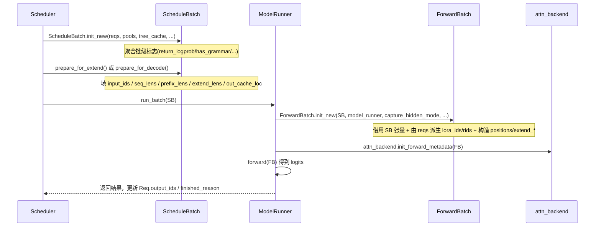

# 关键数据结构：Req / ScheduleBatch / ForwardBatch

> 本文档是 SGLang 推理引擎数据流（dataflow）系列的一章，聚焦三个贯穿一次推理请求生命周期的核心数据结构：**`Req`**、**`ScheduleBatch`**、**`ForwardBatch`**。所有论断均来自 SSOT 在 commit `e1c4db9621f7c4203ee9becd5d5456d4e6bf54f7` 的源码，行号均以 `Read` 实读为准。

## 1. What：三个结构分别是什么

### 1.1 总体关系

SGLang 把"调度视角"与"执行视角"在数据结构层面彻底分开：

- **`Req`**（`python/sglang/srt/managers/schedule_batch.py:L810`，`class Req(ReqDllmMixin)`）是**单个请求**的完整状态机：输入、输出、KV 内存归属、前缀命中、停止原因、logprob 等。它是整个引擎中唯一长期存活、随请求生命周期演化的对象。
- **`ScheduleBatch`**（`python/sglang/srt/managers/schedule_batch.py:L1995`，`@dataclasses.dataclass class ScheduleBatch`）是**一批请求在某次调度决策时刻的集合视图**，由 `Scheduler` 拥有，数据大多在 CPU 上，承载"高层调度元数据"（如 `forward_mode`、`seq_lens`、`prefix_lens`、`extend_lens`）。
- **`ForwardBatch`**（`python/sglang/srt/model_executor/forward_batch_info.py:L411`，`@dataclass class ForwardBatch(ForwardBatchDeepSeekMHAMixin)`）是喂给 `ModelRunner` 做**一次前向**的低层打包，绝大多数字段是 GPU 张量（如 `input_ids`、`positions`、`out_cache_loc`）。它由 `ForwardBatch.init_new` 从一个 `ScheduleBatch` 直接构造，且**按设计不允许反向修改 `ScheduleBatch`**（`python/sglang/srt/model_executor/forward_batch_info.py:L747` 的 `init_new must not mutate the input ScheduleBatch`）。

模块级 docstring 已经写明这条主链路：`ScheduleBatch -> ForwardBatch`，前者由 `scheduler.py::Scheduler` 管理，后者由 `model_runner.py::ModelRunner` 管理（`python/sglang/srt/managers/schedule_batch.py:L34-L46`、`python/sglang/srt/model_executor/forward_batch_info.py:L14-L26`）。

```mermaid
flowchart TD
    subgraph 调度域[CPU / Scheduler 域]
        R1[Req A]
        R2[Req B]
        R3[Req C]
        SB[ScheduleBatch\nreqs: List[Req]\nforward_mode / seq_lens / prefix_lens ...]
    end
    subgraph 执行域[GPU / ModelRunner 域]
        FB[ForwardBatch\ninput_ids / positions / out_cache_loc ...]
        AB[attn_backend.init_forward_metadata\nbackend 专有元数据]
        M[model forward]
    end
    R1 --> SB
    R2 --> SB
    R3 --> SB
    SB -->|ForwardBatch.init_new| FB
    FB --> AB
    AB --> M
    SB -.指向.-> P1[ReqToTokenPool]
    SB -.指向.-> P2[BaseTokenToKVPoolAllocator]
    SB -.指向.-> P3[BasePrefixCache / RadixCache]
    FB -.借用 SB 的 GPU 张量.-> SB
```

> **[OPEN]** 任务书写作重点中提到 `ForwardBatch` 含 `attn_backend_data` 与 `req_to_token_pool` 两个字段，但实读 `forward_batch_info.py` 的 `ForwardBatch` 定义（L411-L638）**并不存在这两个字段**：`ForwardBatch` 不持有 `req_to_token_pool`（它通过 `model_runner` 而非自身字段访问内存池），也不持有名为 `attn_backend_data` 的属性——注意力后端元数据是在 `ModelRunner._forward_raw` 内调用 `attn_backend.init_forward_metadata(fb)` 时**由后端临时构造**的，而非 `ForwardBatch` 的持久成员。文档此处以源码为准，未杜撰这两个字段。

### 1.2 `Req` 逐字段表

`Req.__init__`（`python/sglang/srt/managers/schedule_batch.py:L813-L1204`）字段极多，下表列出文档/数据流相关核心字段：

| 字段 | 类型 | 含义 | 代码锚点 |
|---|---|---|---|
| `rid` | `str` | 请求唯一 ID，贯穿日志、KV 传输、dumper 跟踪 | `:861` |
| `origin_input_ids` | `array[int]` | 原始 prompt token ids（多模态 padding 前） | `:862` |
| `origin_input_ids_unpadded` | `array[int]` | 去图像 padding 前的 prompt ids（用于增量 detokenize） | `:863` |
| `output_ids` | `array("q")` | 已生成的输出 token，**append-only 契约** | `:872` |
| `full_untruncated_fill_ids` | `array("q")` | origin + output（+dllm mask block）的完整序列，`_refresh_fill_ids` 维护 | `:876` |
| `extend_range` | `Optional[Range]` | 本次 extend 覆盖的 `[start, end)` 区间 | `:877` |
| `sampling_params` | `SamplingParams` | 采样参数（温度/top_p/stop 等），见 `sampling_params.py` | `:921` |
| `tokenizer` | `Optional` | 用于 stop-string 匹配与 detokenize，可为 None（skip_tokenizer_init） | `:960` |
| `req_pool_idx` | `Optional[int]` | 在 `ReqToTokenPool` 中的槽位下标，同一请求跨 chunk/decode 复用 | `:940` |
| `kv_committed_len` | `int` | 已提交到 KV 池的序列长度（内存账本） | `:889` |
| `kv` | `Optional[ReqKvInfo]` | KV 分配信息（`kv_allocated_len`、`swa_evicted_seqlen`） | `:890`、`:800` |
| `prefix_indices` | `torch.Tensor` | 已被 Radix 前缀缓存命中的 KV 槽位索引（来自 `match_prefix`） | `:998` |
| `last_node` / `best_match_node` | `Any` | Radix 树命中节点，用于缓存插入与锁定 | `:1000-L1002` |
| `num_matched_prefix_tokens` | `int` | 命中前缀 token 总数（设备 + host + storage） | `:1011` |
| `host_hit_length` / `swa_host_hit_length` / `mamba_host_hit_length` | `int` | 各组件 host（CPU）层命中长度，需 H2D load-back | `:1004-L1006` |
| `cache_protected_len` | `int` | 插入树缓存的前缀长度 | `:1022` |
| `multimodal_inputs` | `Optional[MultimodalInputs]` | 多模态占位/特征 | `:989` |
| `finished_reason` | `Optional[BaseFinishReason]` | 停止原因（EOS/长度/abort/grammar 等） | `:961` |
| `finished_len` | `Optional[int]` | 在 `output_ids` 中停止位置（含 stop token） | `:963` |
| `logprob` | `ReqLogprob` | logprob 累积与返回值容器 | `:1046` |
| `grammar` | `Optional[...]` | 约束解码文法对象 | `:1106` |
| `cached_tokens` / `cached_tokens_device/host/storage` | `int` | 命中缓存 token 数及分层细分（HiCache） | `:1112-L1118` |

关键便捷属性（property）：

- `seqlen` = `len(origin_input_ids) + len(output_ids)`，即当前完整序列长度（`:1206`）。
- `is_prefill_only` = `sampling_params.max_new_tokens == 0 且未启用 spec`（`:1211`）。

### 1.3 `ScheduleBatch` 逐字段表

`ScheduleBatch` 是 `@dataclasses.dataclass`，字段按"核心/全局资源/批级调度态/GPU 张量/配置标志/CPU 元数据/复合对象"分组（`python/sglang/srt/managers/schedule_batch.py:L1995-L2181`）：

| 字段 | 类型 | 含义 | 代码锚点 |
|---|---|---|---|
| `reqs` | `List[Req]` | 本批请求；`ForwardBatch` 的 lora_ids/rids/grammars/positions 都从这里派生 | `:2000` |
| `req_to_token_pool` | `ReqToTokenPool` | `req_pool_idx -> KV 槽位` 映射池（引擎级，跨批相同） | `:2004` |
| `token_to_kv_pool_allocator` | `BaseTokenToKVPoolAllocator` | KV 槽位分配器 | `:2005` |
| `tree_cache` | `BasePrefixCache` | Radix/前缀缓存，用于前缀匹配与插入 | `:2006` |
| `model_config` | `ModelConfig` | 模型配置 | `:2009` |
| `forward_mode` | `ForwardMode` | 本批前向模式（EXTEND/DECODE/MIXED/...） | `:2115` |
| `input_ids` | `torch.Tensor` | **本轮要算的 token ids**（EXTEND=未缓存部分；DECODE=每请求最后 1 个） | `:2059` |
| `req_pool_indices` | `torch.Tensor` | 各请求在 `ReqToTokenPool` 的下标 `[b]` | `:2075` |
| `seq_lens` | `torch.Tensor` | 各请求当前总长度 `[b]` | `:2076` |
| `seq_lens_sum` | `int` | 所有 `seq_lens` 之和（token 总数） | `:2145` |
| `orig_seq_lens` | `torch.Tensor` | 未 chunk 的原始序列长度（Qwen-1M 相关） | `:2079` |
| `out_cache_loc` | `torch.Tensor` | 本轮输出 token 在 KV 池中的槽位下标 | `:2082` |
| `prefix_lens` | `List[int]` | 各请求命中前缀长度（extend/mixed 才有意义） | `:2166` |
| `extend_lens` | `List[int]` | 各请求本次 extend 的新增 token 数 | `:2167` |
| `extend_num_tokens` | `Optional[int]` | 本批 extend 新增 token 总数 | `:2146` |
| `extend_logprob_start_lens` | `List[int]` | 各请求 logprob 计算起始相对位置 | `:2168` |
| `sampling_info` | `SamplingBatchInfo` | 批级采样信息（含 grammars） | `:2177` |
| `spec_info` | `Optional[SpecInput]` | 投机解码信息 | `:2181` |
| `return_logprob` | `bool` | 是否需要 logprob | `:2129` |
| `is_prefill_only` | `bool` | 整批是否仅做 prefill（无生成） | `:2132` |
| `has_grammar` | `bool` | 是否含约束解码 | `:2142` |
| `global_num_tokens` | `Optional[List[int]]` | DP attention 各 DP rank 的 token 数 | `:2171` |
| `is_extend_in_batch` | `bool` | 批内是否含 extend | `:2119` |

构造入口为 `ScheduleBatch.init_new`（`python/sglang/srt/managers/schedule_batch.py:L2183`），它从 `reqs` 聚合出 `return_logprob`、`has_grammar`、`is_prefill_only` 等批级标志。

### 1.4 `ForwardBatch` 逐字段表

`ForwardBatch` 是 `@dataclass`，定义见 `python/sglang/srt/model_executor/forward_batch_info.py:L411-L638`，注释明确分"Required core / Borrowed / Derived / Forward-derived / Runtime-filled"五类。要点字段：

| 字段 | 类型 | 含义 | 代码锚点 |
|---|---|---|---|
| `forward_mode` | `ForwardMode` | 前向模式（直接来自 `batch.forward_mode`） | `:417` |
| `batch_size` | `int` | = `len(batch.seq_lens)` | `:419`、`:797` |
| `input_ids` | `torch.Tensor` | 借用自 `ScheduleBatch.input_ids` | `:421`、`:798` |
| `req_pool_indices` | `torch.Tensor` | 借用自 `ScheduleBatch.req_pool_indices` | `:423`、`:799` |
| `seq_lens` | `torch.Tensor` | 借用自 `ScheduleBatch.seq_lens` | `:425`、`:800` |
| `out_cache_loc` | `torch.Tensor` | 借用自 `ScheduleBatch.out_cache_loc` | `:427`、`:801` |
| `seq_lens_sum` | `int` | 借用自 `ScheduleBatch.seq_lens_sum` | `:429`、`:802` |
| `positions` | `torch.Tensor` | **前向构造**：decode=clamp(seq_lens-1)；extend=arange(prefix, prefix+extend) | `:528`、`:906`、`:926` |
| `extend_num_tokens` / `extend_seq_lens` / `extend_prefix_lens` / `extend_start_loc` | 见名 | **仅 extend/mixed 非空**（decode/idle 置 None，`:767`） | `:531-L534`、`:768` |
| `sampling_info` | `SamplingBatchInfo` | 借用自 `ScheduleBatch.sampling_info` | `:505`、`:838` |
| `spec_info` | `Optional[SpecInput]` | 借用自 `ScheduleBatch.spec_info` | `:507`、`:839` |
| `lora_ids` | `List[str]` | 由 `batch.reqs` 派生：`[req.lora_id for req in batch.reqs]` | `:511`、`:835` |
| `rids` | `List[str]` | 由 `batch.reqs` 派生：`[req.rid for req in batch.reqs]` | `:513`、`:836` |
| `mrope_positions` | `torch.Tensor` | 多模态 RoPE 位置（MRoPE 模型） | `:588` |
| `global_num_tokens_cpu/gpu` | `List[int]` / `Tensor` | DP attention MLP sync 用的各 rank token 数 | `:545-L546` |
| `num_token_non_padded` | `Tensor` | 非 padding token 数（MoE EP>1 时启用） | `:552` |
| `forward_metadata_ready` | `bool` | 注意力元数据是否已预规划（避免重复 plan） | `:624` |

## 2. Why：为什么这么设计

**调度与执行解耦。** `ScheduleBatch` 在 CPU 上做调度决策（前缀匹配、内存分配、chunk 划分、DP padding），`ForwardBatch` 在 GPU 上做张量计算。两者分离带来两个好处：(1) 调度逻辑可独立于具体模型/注意力后端实现；(2) 同一 `ScheduleBatch` 在 overlap / CUDA graph 场景下可被多次"快照"成 `ForwardBatch`，而 `ForwardBatch.init_new` 的"不修改 SB"契约（`:747`）保证了调度态不被执行态污染。

**`Req` 长期存活、批量态短命。** `Req` 携带跨多次前向的持久状态（`output_ids`、`req_pool_idx`、`prefix_indices`、`kv_committed_len`），而 `ScheduleBatch`/`ForwardBatch` 只是某次调度/前向的"瞬时快照"。请求被 retract（抢占/重计算）时，`Req.reset_for_retract`（`python/sglang/srt/managers/schedule_batch.py:L1673`）清空前缀与 KV 账本但保留 `rid` 与 `retraction_count`，以便 PD 重引导（rebootstrap）能复用身份。

**借用而非拷贝 GPU 张量。** `ForwardBatch.init_new` 通过引用别名大量 `ScheduleBatch` 的 GPU 张量（`input_ids`、`seq_lens`、`out_cache_loc` 等，`:798-L840`），仅在必要时（positions、extend_* 、mrope）在 forward stream 上构造新张量。这避免了每步前向的 CPU→GPU 大块拷贝。源码中的 `FIXME(lsyin)`（`:431-L434`）承认这些别名未来应被克隆以实现真正的流隔离。

**`prefix_indices` 与 `input_ids` 的分工。** `Req.prefix_indices` 只保存 Radix 命中的 KV 槽位；真正送进模型的 `ScheduleBatch.input_ids` 只含**未命中部分**（`get_fill_ids()[len(prefix_indices):]`，`python/sglang/srt/managers/schedule_batch.py:L2372`）。这样前缀 KV 无需重算，是 RadixAttention 复用缓存的关键。

## 3. How：三者如何转换

### 3.1 时序



### 3.2 构造入口与关键调用

1. **`ScheduleBatch.init_new`**（`python/sglang/srt/managers/schedule_batch.py:L2183`）：`cls(reqs=..., req_to_token_pool=..., token_to_kv_pool_allocator=..., tree_cache=..., model_config=..., ...)` 创建批对象，并即时计算 `return_logprob = any(req.return_logprob)`、`has_grammar = any(req.grammar)`、`is_prefill_only = all(req.is_prefill_only)`。

2. **`prepare_for_extend`**（`python/sglang/srt/managers/schedule_batch.py:L2363`）：设置 `forward_mode = EXTEND`（dLLM 用 `DLLM_EXTEND`）；从每个 `req` 计算 `input_ids = get_fill_ids()[len(prefix_indices):]`、`prefix_lens`、`extend_lens = extend_range.length`、`seq_lens = extend_range.end`；随后调用 `alloc_for_extend(self)`（`python/sglang/srt/mem_cache/allocation.py:L303`）完成 KV 分配，回填 `out_cache_loc` 与 `req_pool_indices`。

3. **`ForwardBatch.init_new`**（`python/sglang/srt/model_executor/forward_batch_info.py:L738`）：这是 `ScheduleBatch -> ForwardBatch` 的核心转换。它：
   - 决定 `capture_hidden_mode`（draft worker 强制 NULL，否则取 batch 与 server 配置的最大值，`:752-L764`）；
   - 对 decode/idle 把 `extend_*` 置 None，否则从 `batch.extend_lens/prefix_lens/extend_logprob_start_lens` 取（`:767-L772`）；
   - 用 `cls(...)` 一次性把 SB 的 `forward_mode/batch_size/input_ids/req_pool_indices/seq_lens/out_cache_loc/seq_lens_sum` 与 borrowing 张量、`lora_ids`、`rids`、`sampling_info`、`spec_info` 拷入 FB（`:794-L840`）；
   - 在 forward stream 上构造 `positions`：`decode/target_verify` 用 `clamp_position(seq_lens)`；`extend` 用 `compute_position(...)`（`:904-L934`）；
   - 多模态 MRoPE 模型额外经 `_compute_mrope_positions` / `compute_spec_mrope_positions` 填充 `mrope_positions`。

### 3.3 转换的细节：字段从哪来

- `ForwardBatch.input_ids / seq_lens / out_cache_loc / req_pool_indices / seq_lens_sum` 是**别名引用** SB 同名张量（`:798-L802`）。
- `ForwardBatch.lora_ids / rids` 是**从 `batch.reqs` 重新派生**的 Python list（`:835-L836`），因为 SB 本身只持有 `reqs`。
- `ForwardBatch.extend_prefix_lens / extend_seq_lens / extend_start_loc / extend_num_tokens` 仅在非 decode/idle 时存在（`:767-L772`、`:909-L934`），decode 时这些字段为 None——这是调度语义差异在执行侧的直接体现。
- `ForwardBatch.positions` 是**全新构造**的：其取值完全取决于 `forward_mode`（decode 取 seq_len-1，extend 取 arange），与 SB 没有同名对应字段。

## 4. 坑：prefill / decode 时含义不同的字段

这是最容易误用、也最值得警惕的部分。

**(1) `input_ids` 语义完全相反。**
- EXTEND：`input_ids` = **未命中前缀的待计算 token**（即 `get_fill_ids()[len(prefix_indices):]`），可能包含成百上千个 prompt token（`:2372`）。
- DECODE：`input_ids` = **每请求最后 1 个 token**（因为只生成 1 个新 token）。
同样的字段名，prefill 是成段、decode 是单点，若在采样/embedding 逻辑里假设其长度等于 `seq_lens` 会直接出错。

**(2) `extend_*` 系列字段在 decode 为 None。**
`ForwardBatch.extend_seq_lens / extend_prefix_lens / extend_start_loc / extend_logprob_start_lens_cpu` 在 `forward_mode.is_decode_or_idle()` 时整体置 None（`:767-L768`）。任何读取这些字段的代码都必须先判断 `forward_mode`，否则 `None` 解引用崩溃。同样地，`ScheduleBatch.prefix_lens / extend_lens` 只在 `prepare_for_extend` 之后填充（`:2366-L2404`），decode 路径不会填它们。

**(3) `seq_lens` 在两类模式下都表示"当前总长度"，但来源不同。**
- EXTEND：`seq_lens[i] = req.extend_range.end`（前缀 + 本轮新增，即 extend 完成后的总长度，`:2374`）。
- DECODE：`seq_lens[i]` = 该请求此刻的完整长度（每步 +1）。
因此 `seq_lens` 的"绝对长度"语义一致，但 EXTEND 的 `seq_lens` 与 `input_ids` 长度（`extend_lens`）并不相等——差就是 `prefix_lens`。

**(4) `positions` 的生成逻辑因模式而异（见 3.2）。**
decode 的 `positions = seq_lens - 1`（每请求一个位置），extend 的 `positions` 是跨请求的拼接 arange。若把 decode 的 positions 构造方式套到 extend 会得到错误位置编码。

**(5) `out_cache_loc` 的"本轮"含义。**
- EXTEND：`out_cache_loc` 指向本轮新增 token 的 KV 槽位（长度 = `extend_num_tokens`）。
- DECODE：`out_cache_loc` 指向本步单 token 的槽位。
注意 `out_cache_loc` 不包括前缀命中部分——前缀 KV 已落在 `req.prefix_indices`，不再分配。

**(6) `req_pool_idx` 跨 chunk 复用，但 `prefix_indices` 每步变化。**
同一请求的 `req_pool_idx` 在 chunked prefill 的多个 chunk、以及后续 decode 中保持稳定（`ReqToTokenPool.alloc` 的 `reusing` 逻辑，`python/sglang/srt/mem_cache/memory_pool.py:L291-L323`）；而 `prefix_indices` 每次 `init_next_round_input` 都重新经 `tree_cache.match_prefix` 计算（`:1347-L1396`），因为随着输出增长、已计算的 KV 会成为新前缀被后续命中。

**(7) `cached_tokens` 的语义（HiCache 分层）。**
`Req.cached_tokens` 是命中缓存 token 总数，并细分 `cached_tokens_device/host/storage`（`:1112-L1118`）。在纯 GPU Radix 场景下 `host/storage` 为 0；启用 HiCache 后才出现非 0 的 host/storage 命中，此时 prefill 实际只计算 `seqlen - cached_tokens` 个 token，但 `input_ids` 仍是"未命中部分"——不要把 `cached_tokens` 等同于 `len(prefix_indices)`，后者只是 device 层命中。

**(8) 投机解码下 `forward_mode` 不是 EXTEND/DECODE 二选一。**
`ForwardMode` 还有 `TARGET_VERIFY`、`DRAFT_EXTEND_V2`、`MIXED`、`PREBUILT`、`SPLIT_PREFILL`、`DLLM_EXTEND`（`python/sglang/srt/model_executor/forward_batch_info.py:L98-L196`）。例如 MIXED 同时含 extend 与 decode 请求，`prepare_for_extend` 之外还有专门的分支。判断"是否 prefill"必须用 `forward_mode.is_extend()` 而非 `== EXTEND`。

## 5. 边界与坑（补充）

- **`Req.output_ids` 的 append-only 契约**：注释强调 `_refresh_fill_ids` 仅靠长度推断已写数量，原地改写会被静默破坏 fill_ids（`:868-L876`）。 retract 时 `set_finish_with_abort` 会把它替换成单 token stub（`:1814`）。
- **`forward_metadata_ready` 与 CUDA graph 重规划**：若该标记被预规划者设置但形状不再匹配，且 `replan_equivalent` 为 False，则前向路径**不会**重新 plan（`needs_forward_metadata_init`，`:657-L676`）——这是多步 spec draft/视图上下文 plan 的安全性约束，误用会污染预规划元数据。
- **DP padding 改变 `batch_size` 与 `seq_lens`**：`prepare_mlp_sync_batch`（`python/sglang/srt/model_executor/forward_batch_info.py:L1305`）会按 `DpPaddingMode` 把批 pad 到 `MAX_LEN` 或 `SUM_LEN`，并可能把 idle rank 伪装成 1 个 dummy extend 请求（`:1413-L1470`），导致运行时 `batch_size`/`seq_lens` 与原始 `reqs` 数量不再一致。

## 6. 小结

`Req` 是请求的"真相源"，`ScheduleBatch` 是调度时刻的"批快照"，`ForwardBatch` 是执行时刻的"张量包"。三者通过 `ScheduleBatch.init_new` 与 `ForwardBatch.init_new` 衔接，GPU 张量以别名方式借用、仅必要字段（positions/extend_*/mrope）在执行流上新建。理解 `input_ids`、`seq_lens`、`extend_*` 在 prefill 与 decode 下的语义差异，是正确编写调度与采样逻辑的前提。

> 本文档交叉引用见 architecture/overview.md（调度总览）。相关内存池细节见 `python/sglang/srt/mem_cache/memory_pool.py` 与 `python/sglang/srt/mem_cache/allocation.py`（不在本文档范围内展开）。
