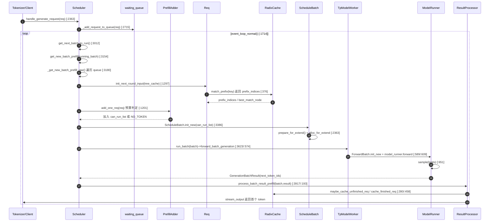
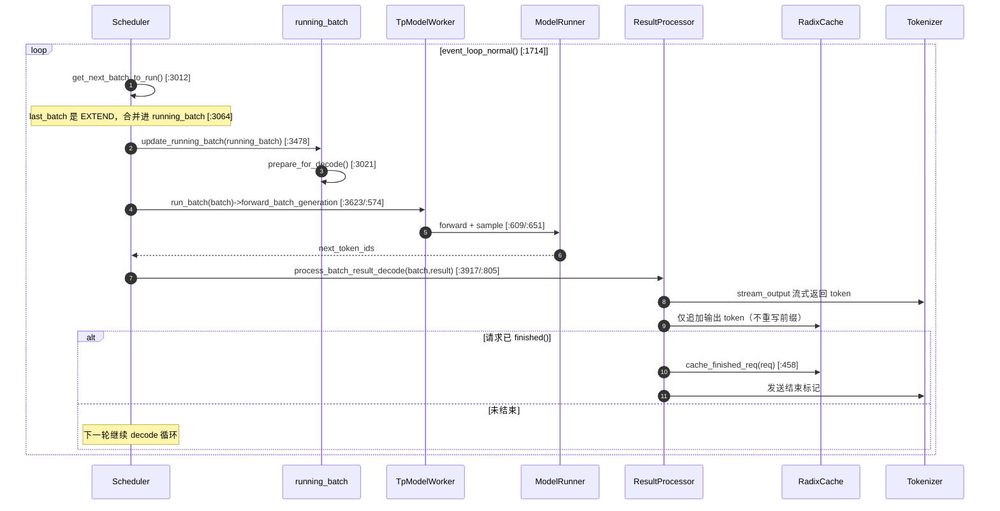
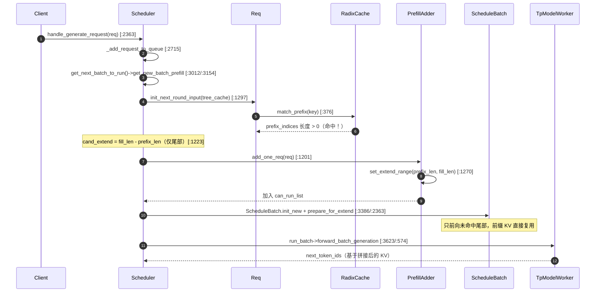
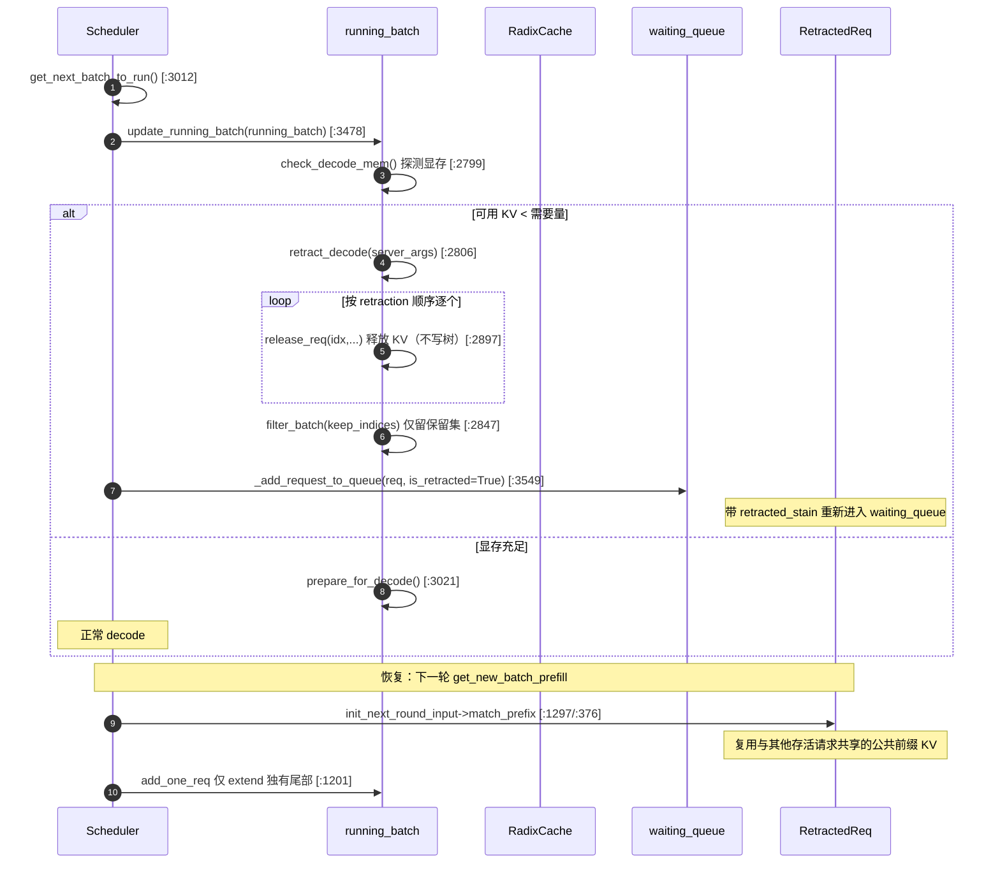
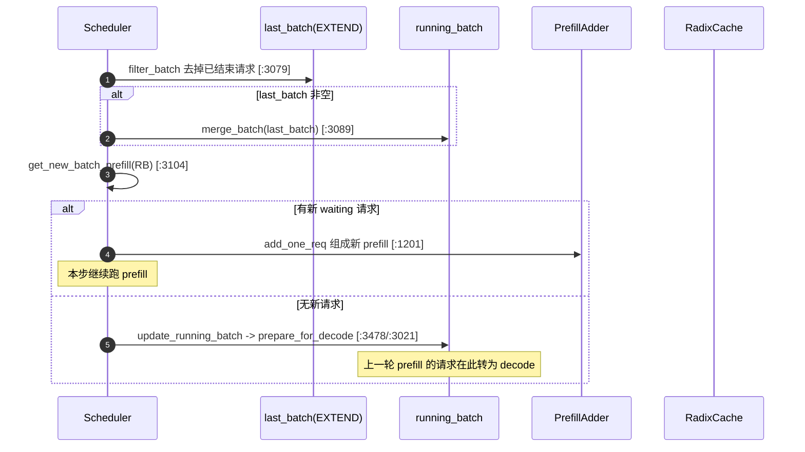
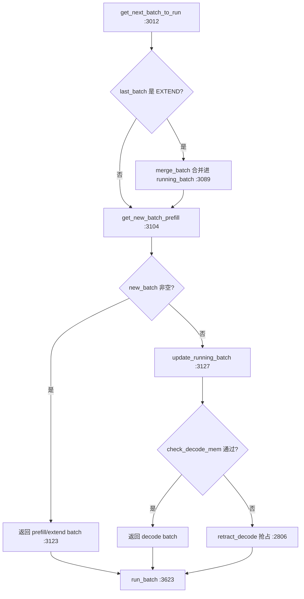

# 推理数据流时序图（prefill / decode / 缓存命中 / 抢占恢复）

> 本文档基于 SSOT 提交 `e1c4db9621f7c4203ee9becd5d5456d4e6bf54f7`（2026-08-14）的本地源码逐行阅读得出。所有结论均附证据锚点（SSOT 相对路径 + 行号区间，行号由 Read 实测）。涉及未完全确认的路径见文末 `> **[OPEN]**` 标注，细节写入 `docs/appendix/_openq_sequence-diagrams.md`。

---

## 1. What：本文档覆盖什么

SGLang 的单卡（tensor-parallel）推理由一个 `Scheduler` 进程驱动。它在一个事件循环里，每个迭代完成四件事：

1. **收请求**：从 tokenizer/server 的 IPC 通道接收 `TokenizedGenerateReqInput`，构造 `Req` 并放入 `waiting_queue`。
2. **规划 batch**：调用 `get_next_batch_to_run`，决定本步跑 **prefill（extend）** 还是 **decode**，必要时从 `waiting_queue` 取出可运行的请求组成新的 prefill batch。
3. **执行 forward**：把规划好的 `ScheduleBatch` 交给 GPU worker（`TpModelWorker` → `ModelRunner`）做前向计算并采样。
4. **处理结果**：`process_batch_result` 把采样出的 token 写回 `Req`、流式返回给 tokenizer、并把 KV 写进 `RadixCache`（前缀树）。

文档给出 4 张真实调用序列的 Mermaid 时序图，并标注每一步触发的调度决策点。

### 参与组件（真实类名）

| 组件 | 类/函数 | 主要文件 |
| --- | --- | --- |
| 调度器主循环 | `Scheduler.event_loop_normal` / `get_next_batch_to_run` | `python/sglang/srt/managers/scheduler.py` |
| prefill 准入策略 | `PrefillAdder.add_one_req` | `python/sglang/srt/managers/schedule_policy.py` |
| 批与请求载体 | `ScheduleBatch` / `Req` | `python/sglang/srt/managers/schedule_batch.py` |
| 前缀缓存 | `RadixCache.match_prefix` / `insert` / `cache_finished_req` / `cache_unfinished_req` | `python/sglang/srt/mem_cache/radix_cache.py` |
| GPU worker | `TpModelWorker.forward_batch_generation` → `ModelRunner.forward` / `sample` | `python/sglang/srt/managers/tp_worker.py`、`model_executor/model_runner.py` |
| 结果处理 | `SchedulerBatchResultProcessor.process_batch_result_*` | `python/sglang/srt/managers/scheduler_components/batch_result_processor.py` |

---

## 2. Why：为什么需要这些阶段与决策点

- **prefill 与 decode 是两种 attention 模式**。`prefill`（内部 `ForwardMode.EXTEND`）一次性处理整段提示词，计算量大、可并行；`decode`（`ForwardMode.DECODE`）每步只喂入 1 个新 token，受限于显存带宽。源码用 `prepare_for_extend`（`schedule_batch.py:2363`）和 `prepare_for_decode`（`schedule_batch.py:3021`）分别准备两套输入张量，因此调度器必须区分两类 batch。
- **前缀复用（radix cache）是为了省掉重复 prefill**。多个请求若共享同一 system prompt，其 KV 已在 `RadixCache` 中。每个待 prefill 请求在 `Req.init_next_round_input` 中调用 `RadixCache.match_prefix`（`radix_cache.py:376`）拿到 `prefix_indices`（已缓存的 KV 下标），只需对**未命中尾部**做 extend。
- **抢占（retraction）是为了在 KV 池耗尽时不崩溃**。`update_running_batch` 在每步 decode 前用 `ScheduleBatch.check_decode_mem`（`schedule_batch.py:2799`）探测显存，不够则 `retract_decode`（`schedule_batch.py:2806`）按策略回退部分请求，腾出空间。
- **调度优先级：prefill 优先于 decode**。`get_next_batch_to_run` 先尝试 `get_new_batch_prefill`，只有没有可运行 prefill 时才 `update_running_batch` 走 decode（见 `scheduler.py:3121-3130`）。这样新请求不会被长尾 decode 饿死。
- **chunked prefill 用来给单次迭代的 prefill 长度封顶**。`PrefillAdder` 在构造时接收 `max_prefill_tokens` 与 `chunked_prefill_size`（`python/sglang/srt/server_args.py:798-808`），前者限制一个 prefill batch 的总 token 数，后者限制单个请求一次最多处理多少 token。当请求过长时，`add_one_req` 走 chunked 分支，只处理前缀未命中部分的截断窗口（`schedule_policy.py:1379-1426`），剩余部分在后续迭代以 `chunked_req` 续跑。这样既能把新请求尽快纳入（首块即可开始转 decode），又避免一次 prefill 卡死整批 decode。
- **优先级抢占（priority preemption）允许用 prefill 抢占 decode**。`_get_new_batch_prefill_raw` 在 `enable_priority_preemption` 打开时，会调 `adder.preempt_to_schedule(req, server_args)`（`scheduler.py:3309` → `schedule_policy.py:1430`）主动回退正在 decode 的低优先级请求以容纳高优先级 prefill，而非简单地 `break` 跳过（`scheduler.py:3306-3311`）。这是与 3.4 中"decode 阶段内存不足才回退"互补的另一条抢占路径。

---

## 3. How：四张时序图

### 3.1 纯 prefill（含前缀命中）全流程

调用链：`Scheduler` 收请求 → `waiting_queue` → `get_next_batch_to_run` → `get_new_batch_prefill` → `_get_new_batch_prefill_raw`（遍历 queue、`PrefillAdder.add_one_req`、`Req.init_next_round_input`、`RadixCache.match_prefix`）→ `ScheduleBatch.init_new` + `prepare_for_extend` → `run_batch` → `TpModelWorker.forward_batch_generation` → `ModelRunner.forward`/`sample` → `process_batch_result_prefill` → `RadixCache` 写回。

**决策点**：
- `add_one_req` 中的预算闸门：`total_tokens >= rem_total_tokens` 返回 `AddReqResult.NO_TOKEN`，该请求留在 `waiting_queue`（见 `schedule_policy.py:1236`、`:1275`）。
- `match_prefix` 返回的 `prefix_indices` 长度决定 `set_extend_range` 的起点：`cand_extend_input_len = len(full_untruncated_fill_ids) - len(prefix_indices)`（`schedule_policy.py:1223`）。命中越长，需要计算的 token 越少。

### 3.2 decode 循环

prefill 完成后，该请求的 KV 已在 `RadixCache` 中。下一轮 `get_next_batch_to_run` 会把上一轮 extend batch（作为 `last_batch`）合并进 `running_batch`（`scheduler.py:3064-3089`），随后 `update_running_batch` 调用 `prepare_for_decode` 转成 decode 模式，反复迭代直到请求结束或被抢占。

**决策点**：
- `update_running_batch` 先 `filter_batch` 移除已结束/中止请求（`:3482`）；若 `check_decode_mem` 失败则进入 **抢占分支**（见 3.4）。
- decode 步**不**重新 `match_prefix`、不重新分配前缀 KV——`prefix_indices` 已在 prefill 时固定，每步只分配 1 个新 KV slot（`alloc_for_extend` 的 decode 等价路径）。

### 3.3 缓存命中（前缀复用，跳过整段 prefill）

当新请求与树中已有 KV 共享长前缀时，`match_prefix` 命中，`prefix_indices` 非空，于是 `add_one_req` 只把**未命中尾部**设为 extend 区间。这就是"缓存命中跳过 prefill"的本质：并非完全跳过前向，而是把 extend 长度从 `全量 prompt` 缩减到 `未命中尾部`。

**决策点**：
- 命中判定发生在 `init_next_round_input` 内 `match_prefix` 返回后（`schedule_batch.py:1358-1396`）：`prefix_indices` 即命中长度。若 `SGLANG_RADIX_FORCE_MISS` 被设置，结果被 `zero_match_result` 强制清零（`:1370`）。
- SWA 场景：`swa_reprefill_tail_tokens` 会截掉尾部滑动窗口，强制 re-prefill 最后一段（`schedule_batch.py:1336`），因为 SWA 的环形 buffer 不在 radix 树里、内容不稳定。

### 3.4 抢占（retraction）与恢复

当 `update_running_batch` 判定下一 decode 步的显存不足时，执行 `retract_decode`：按 `retraction_policy`（默认按输出长度 + 输入长度排序，`schedule_batch.py:2869-2895`）从"最该被牺牲"的请求开始 `release_req` 释放 KV，释放的 KV **不**写回 radix（注释见 `schedule_batch.py:2825`："don't insert into the tree"），随后请求以 `is_retracted=True` 重新入队，下一轮重新走 prefill 准入。

**决策点**：
- 触发条件：`check_decode_mem` 返回 `available_size < num_tokens`（`schedule_batch.py:2804`）。其内部先 `evict_from_tree_cache` 回收**可驱逐**的树节点（`:2803`），仍不够才 retract。
- 兜底：即使 retract 到只剩 1 个请求仍 OOM，则 `FINISH_ABORT` 优雅中止该请求（`:2828-2845`），避免调度器崩溃。
- 恢复时 `add_one_req` 用 `req.retracted_stain` 影响预算（`schedule_policy.py:1374` 传入 `_update_prefill_budget`），使被抢占请求在预算上受到一定惩罚但优先重新准入。

### 3.5 prefill 如何转为 decode：last_batch 合并决策

理解"一张请求的 prefill 结束后为什么下一轮就变 decode"，关键在 `get_next_batch_to_run` 的 `last_batch` 合并逻辑（`:3064-3089`）。当上一轮 `run_batch` 跑的是 EXTEND（prefill）batch，本轮回合会：

1. 用 `chunked_req_to_exclude` 排除正在分块续跑的那个 `chunked_req`（`:3069-3072`）；
2. 对 `last_batch` 调用 `filter_batch` 去掉本步已结束/中止的请求（`:3079`）；
3. 若 `last_batch` 非空，则 `merge_batch` 把它并入 `running_batch`（`:3084-3089`）。

合并后，该批请求在 `get_new_batch_prefill` 返回 `None`（没有新 waiting 请求可跑）时，由 `update_running_batch` 调 `prepare_for_decode` 转为 decode 模式（`:3126-3128`、`:3021`）。因此**单请求的 prefill→decode 切换是"同一 batch 对象跨轮次被重设 forward_mode"完成的**，而不是新建一个 decode batch。

**决策点**：`running_batch.is_prefill_only` 为真时（纯 prefill 请求、永不进入 decode），`get_next_batch_to_run` 会直接 `filter_batch` 并清空 `batch_is_full`，避免把它错误地当作 decode 批继续推进（`:3096-3099`）。

---

## 4. 调度决策点汇总（get_next_batch_to_run）

`get_next_batch_to_run`（`scheduler.py:3012`）是全局唯一的 batch 规划入口，其内部决策顺序：

1. 处理待中止 chunk、超时请求、DLLM 过滤（`:3015-3022`）。
2. 若上一轮是 extend 且非 HiSparse，把 `last_batch` 合并进 `running_batch`（`:3064-3089`）。
3. `prefill_plan = get_new_batch_prefill(running_batch)`（`:3104`）；若返回 `new_batch` 非空 → **跑 prefill**（`:3121-3123`）。
4. 否则 `update_running_batch` → **跑 decode**（`:3126-3128`）。
5. 最后经 `dp_attn_adapter.maybe_prepare_mlp_sync_batch` 与 `ngram_embedding_manager.prepare_for_forward` 做跨 DP / ngram 包装（`:3133-3140`）。

---

## 5. 边界与坑（pitfalls）

- **坑 1：extend 区间起点不是 0。** 前缀命中后 `set_extend_range(prefix_len, fill_len)`（`schedule_batch.py:1270`），`prepare_for_extend` 用 `get_fill_ids()[len(prefix_indices):]` 取输入（`schedule_batch.py:2372`），`alloc_for_extend` 只为未命中部分分配 KV slot。若误以为 prefill batch 总是从 token 0 起算，会重复占用显存。
- **坑 2：retract 会丢弃独有 KV，但可能保留共享前缀。** 被抢占请求的独有 continuation 被 `release_req` 释放且**不写回树**（`:2825`）。下一轮恢复时只能复用与存活请求共享的公共前缀（通过 `match_prefix`），独有尾部必须重新 prefill。详见 `> **[OPEN]**` 标注与 `docs/appendix/_openq_sequence-diagrams.md`。
- **坑 3：混合 chunked prefill。** 当 `is_mixed_chunk` 为真且 `running_batch` 非空时，新 prefill batch 会与 decode 请求 `mix_with_running`（`scheduler.py:3429-3444`），此时 `running_batch.prepare_for_decode()` 已被调用过，调度语义更微妙——prefill 与 decode 在同一 batch 内混合前向。
- **坑 4：SWA 前缀不可直接复用。** `swa_reprefill_tail_tokens` 强制 re-prefill 尾部滑动窗口（`schedule_batch.py:1336`、`radix_cache` 同名方法），因为 SWA 环形 buffer 不在 radix 树中、内容不稳定，复用会拿到 stale KV。
- **坑 5：chunked prefill 的中断与续跑。** 超长请求单步放不下时，`add_one_req` 走 chunked 分支（`schedule_policy.py:1379-1426`），设 `new_chunked_req`，下一轮 `_get_new_batch_prefill_raw` 通过 `adder.add_chunked_req` 续跑（`scheduler.py:3180`）；中途代码用 `stash_chunked_request` 暂存已算 KV（`:2922`），且只在产出新 KV 时才 stash（`:3048`）。
- **坑 6：prefill 优先可能压低 decode 吞吐。** 因为 prefill 永远先跑（`:3121`），高并发下持续涌入的新请求会让 decode 批次被频繁打断、合并；`PrefillDelayer` / `min_free_slots_delayer` 正是为缓解此问题而设（`:3156`、`:3206`），但属于调优参数而非硬保证。
- **坑 7：prefill→decode 切换依赖跨轮次同一 batch 对象。** 如 3.5 所述，切换是通过把 EXTEND 的 `last_batch` `merge_batch` 进 `running_batch` 后改 `forward_mode` 实现的（`:3089`、`:3021`）。任何会丢弃 `last_batch` 或重置 `running_batch` 的逻辑（例如 `retract`、`FlushCache`、`pause_generation`）都会打断该连续状态，导致该请求重新走 prefill 准入。
- **坑 8：`contains_last_prefill_chunk` 影响 KV 写回时机。** 新建 prefill batch 时，`new_batch.contains_last_prefill_chunk` 由 `chunked_req is None or len(can_run_list) != 1` 决定（`scheduler.py:3397-3399`）。只有"最后一块"才会触发 `maybe_cache_unfinished_req` 写树（见 `batch_result_processor.py:253`），中途分块请求被 `skip_stream_req` 暂存、不写树也不流式返回（`:307-313`），否则会错误地把它当成已完成请求处理。

---

## 证据锚点速查

| 论断 | 锚点 |
| --- | --- |
| 事件主循环 | `python/sglang/srt/managers/scheduler.py:1714` |
| batch 规划总入口 | `python/sglang/srt/managers/scheduler.py:3012` |
| prefill 准入主流程 | `python/sglang/srt/managers/scheduler.py:3154`、`:3180` |
| 前缀命中查询 | `python/sglang/srt/managers/schedule_batch.py:1297` → `python/sglang/srt/mem_cache/radix_cache.py:376` |
| 预算闸门 NO_TOKEN | `python/sglang/srt/managers/schedule_policy.py:1236` |
| extend 区间设置 | `python/sglang/srt/managers/schedule_batch.py:1270` |
| decode 准备 | `python/sglang/srt/managers/schedule_batch.py:3021` |
| GPU 前向入口 | `python/sglang/srt/managers/scheduler.py:3623` → `python/sglang/srt/managers/tp_worker.py:574` → `python/sglang/srt/managers/tp_worker.py:609` |
| 结果处理（prefill） | `python/sglang/srt/managers/scheduler_components/batch_result_processor.py:193` |
| KV 写回 radix | `python/sglang/srt/mem_cache/radix_cache.py:458`、`:515` |
| decode 显存探测 | `python/sglang/srt/managers/schedule_batch.py:2799` |
| 抢占回收 | `python/sglang/srt/managers/schedule_batch.py:2806`、`:2897` |
| 抢占后重新入队 | `python/sglang/srt/managers/scheduler.py:3549` |

> **[OPEN]** 被抢占请求恢复时的精确 KV 复用语义（是否完全丢弃独有 KV、能否命中更长的共享前缀）仍需在 `python/sglang/srt/utils/common.py` 的 `release_req` 中确认，详见 `docs/appendix/_openq_sequence-diagrams.md`。
