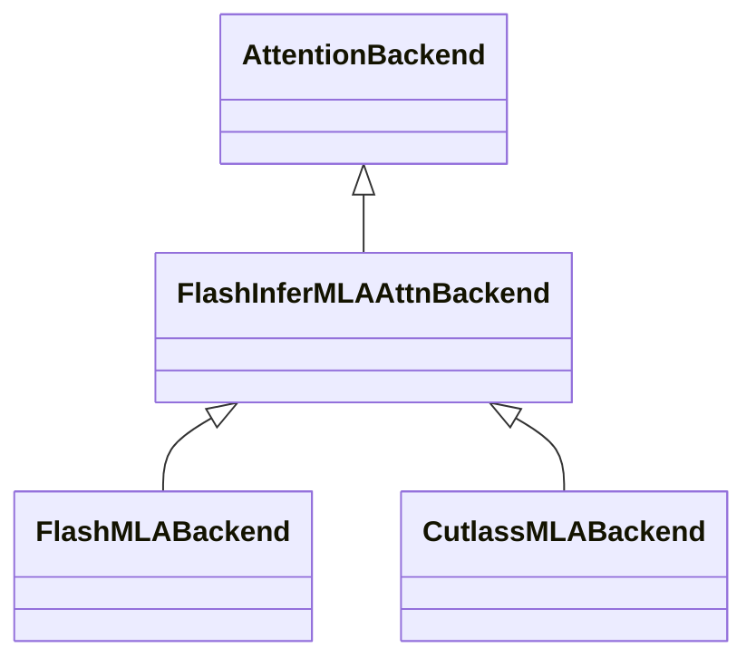

# Attention 后端（Attention Backends）深度解析

> 本文基于 SGLang 源码（commit `e1c4db9621f7c4203ee9becd5d5456d4e6bf54f7`，2026-08-14）逐行阅读整理，所有结论均附源码锚点（格式：`python/sglang/srt/...py:Lx-Ly`）。

## 0. 总览

SGLang 的 attention 计算并非由模型层直接调用某个 kernel，而是抽象成一组 **AttentionBackend**（注意力后端）。模型层（如 `RadixAttention`）只关心「我要算注意力」，至于底层是用 FlashInfer、FlashAttention、FlashMLA 还是 Cutlass MLA，则由后端在**启动期**根据模型结构（MHA / MLA）、硬件（Hopper / SM100 / Hip）、编译选项（CUDA graph / TBO / 投机解码）动态选择。

这样做的好处是：同一份模型代码（如 DeepSeek-V3）可以无缝运行在多代 GPU 上，且 prefill 与 decode 阶段可以使用**不同的后端**（混合后端），从而分别追求吞吐与延迟最优。

```mermaid
flowchart TD
    subgraph 选择期[启动期: 后端选择]
        SA[ServerArgs<br/>attention_backend /<br/>prefill_attention_backend /<br/>decode_attention_backend] --> RA1[resolve_attention_backend_strs<br/>python/sglang/srt/model_executor/model_runner_components/attention_backend_setup.py:L155-L176]
        RA1 --> RA2[build_attention_backends<br/>python/sglang/srt/model_executor/model_runner_components/attention_backend_setup.py:L67-L140]
        RA2 --> RA3[_build_resolved_backend<br/>python/sglang/srt/model_executor/model_runner_components/attention_backend_setup.py:L179-L233]
        RA3 -->|prefill==decode| Single[单后端]
        RA3 -->|prefill!=decode| Hybrid[HybridAttnBackend<br/>python/sglang/srt/layers/attention/hybrid_attn_backend.py:L18-L59]
        Single --> Fac[_build_full_attention_backend_from_str<br/>python/sglang/srt/model_executor/model_runner_components/attention_backend_setup.py:L249-L255]
        Fac --> REG[(ATTENTION_BACKENDS 注册表<br/>python/sglang/srt/layers/attention/attention_registry.py:L31-L33]
    end

    subgraph 抽象层[抽象层]
        BASE[AttentionBackend ABC<br/>python/sglang/srt/layers/attention/base_attn_backend.py:L33-L104]
        BASE -.实现.-> FI[FlashInferAttnBackend<br/>python/sglang/srt/layers/attention/flashinfer_backend.py:L289-L420]
        BASE -.实现.-> FA[FlashAttentionBackend<br/>python/sglang/srt/layers/attention/flashattention_backend.py:L120-L340]
        BASE -.实现.-> FIMLA[FlashInferMLAAttnBackend<br/>python/sglang/srt/layers/attention/flashinfer_mla_backend.py:L208-L327]
        FIMLA -.继承.-> FMLAB[FlashMLABackend<br/>python/sglang/srt/layers/attention/flashmla_backend.py:L58-L150]
        FIMLA -.继承.-> CMLAB[CutlassMLABackend<br/>python/sglang/srt/layers/attention/cutlass_mla_backend.py:L51-L83]
    end

    REG --> BASE
    Hybrid --> BASE
```

---

## 1. 后端抽象：`AttentionBackend` 基类

### 1.1 What

`AttentionBackend`（基类在 `python/sglang/srt/layers/attention/base_attn_backend.py:L33-L104`）是所有注意力后端必须实现的抽象契约。它定义了一套「按 forward 阶段分派」的接口，使上层 `RadixAttention.forward` 无需感知底层 kernel 差异。

### 1.2 Why

SGLang 的推理循环存在多种执行形态：eager 执行、CUDA graph 捕获、target verify（投机解码验证）、mixed（prefix + extend 混合）、idle（无有效 seq）。如果让每个 kernel 后端自己处理这些分支，会造成大量重复且易错的逻辑。基类把「**何时调用哪个算子**」的分派统一收敛，后端只需实现 `forward_decode` / `forward_extend` / `forward_mixed` 几个原子算子。

### 1.3 How：关键方法签名

基类把元数据初始化拆成 **out_graph（宿主侧，图捕获之外）** 与 **in_graph（可捕获进 CUDA graph 内）** 两段，这是为支持 CUDA graph 复用而设计的核心约束。

```python
# python/sglang/srt/layers/attention/base_attn_backend.py:L62-L68
def init_forward_metadata(self, forward_batch: ForwardBatch) -> None:
    # 默认实现 = out_graph + in_graph 两次调用
    self.init_forward_metadata_out_graph(forward_batch)
    self.init_forward_metadata_in_graph(forward_batch)

# python/sglang/srt/layers/attention/base_attn_backend.py:L70-L90
def init_forward_metadata_out_graph(
    self, forward_batch: ForwardBatch, in_capture: bool = False
) -> None:
    # 在 CUDA graph 捕获前于 host 侧执行，构建不可捕获的、依赖 Python 对象的状态

# python/sglang/srt/layers/attention/base_attn_backend.py:L92-L104
def init_forward_metadata_in_graph(self, forward_batch: ForwardBatch) -> None:
    # 可被捕获进 CUDA graph 的状态（仅张量、固定 shape）

# python/sglang/srt/layers/attention/base_attn_backend.py:L216-L259
def forward(self, q, k, v, layer, forward_batch, save_kv_cache=True, **kwargs):
    # 按 forward_mode 分派：
    #   idle              -> 直接返回空
    #   decode / idle     -> forward_decode
    #   mixed + NPU       -> forward_mixed
    #   其余(extend/...)  -> forward_extend
```

三个原子算子默认抛 `NotImplementedError`，由具体后端实现（`python/sglang/srt/layers/attention/base_attn_backend.py:L261-L297`）：

- `forward_decode(self, q, k, v, layer, forward_batch, **kwargs)`
- `forward_extend(self, q, k, v, layer, forward_batch, **kwargs)`
- `forward_mixed(self, q, k, v, layer, forward_batch, **kwargs)`

### 1.4 关键类属性（行为开关）

基类用类属性标记后端能力，调度器据此决定是否做 D2H 同步、是否支持 chunked prefix 等：

- `needs_cpu_seq_lens = True`（`python/sglang/srt/layers/attention/base_attn_backend.py:L114`）：是否需要在 host 侧持有 `seq_lens_cpu`。FlashMLA / CutlassMLA 因元数据在 device 侧构建而设为 `False`。
- `extend_dummy_seqs_capped_by_req_pool = False`（`python/sglang/srt/layers/attention/base_attn_backend.py:L119`）：MLA 后端覆写为 `True`（见 `python/sglang/srt/layers/attention/flashinfer_mla_backend.py:L213`）。
- `supports_full_cuda_graph_chunked_prefix = False`（`python/sglang/srt/layers/attention/base_attn_backend.py:L143`）。

### 1.5 坑

`forward` 的分派逻辑（`python/sglang/srt/layers/attention/base_attn_backend.py:L216-L259`）对所有后端统一，但 **`init_forward_metadata` 的 out_graph / in_graph 拆分是否被后端正确实现** 是隐性约束。若后端把本应放在 `out_graph` 的、依赖动态 Python 对象（如 wrapper 引用）的逻辑放进了 `in_graph`，CUDA graph 捕获后会因对象失效而出错；反之若把可捕获的张量变赋值放到 `out_graph`，又会丧失图复用收益。子类**必须**遵守这一拆分，但基类无法在编译期强制——这是纯靠约定维护的隐性契约。

---

## 2. 后端注册表与工厂函数

### 2.1 What

`attention_registry.py` 维护一个全局字典 `ATTENTION_BACKENDS = {}`（`python/sglang/srt/layers/attention/attention_registry.py:L31`）与装饰器 `register_attention_backend`（`python/sglang/srt/layers/attention/attention_registry.py:L34-L39`），并定义一系列 `create_*_backend` 工厂函数。注册表是「字符串名 → 后端类」的映射，名字来自 `ServerArgs.ATTENTION_BACKEND_CHOICES`（`python/sglang/srt/server_args.py:L179-L207`）。

### 2.2 Why

后端选择依赖运行时大量条件（模型 arch、GPU compute capability、量化、投机解码开关），无法在 import 期静态决定。用「字符串 + 工厂」而非直接 `import class` 可以：① 延迟 import 重 kernel 依赖（避免无 GPU 环境 import 失败）；② 把 MLA 专属后端的校验集中到工厂里。

### 2.3 How：工厂按 MLA 分流

最典型的工厂 `create_flashinfer_backend`（`python/sglang/srt/layers/attention/attention_registry.py:L42-L66`）会根据 `runner.use_mla_backend` 决定实例化 `FlashInferAttnBackend`（MHA）还是 `FlashInferMLAAttnBackend`（MLA）：

```python
# python/sglang/srt/layers/attention/attention_registry.py:L42-L66 (核心逻辑节选)
def create_flashinfer_backend(model_runner):
    if model_runner.use_mla_backend:
        return FlashInferMLAAttnBackend(model_runner)   # MLA
    return FlashInferAttnBackend(model_runner)          # MHA
```

MLA **专属**后端在工厂里强制校验：若用户在不支持 MLA 的模型上指定，直接抛错（`python/sglang/srt/layers/attention/attention_registry.py:L69`、`python/sglang/srt/layers/attention/attention_registry.py:L90`、`python/sglang/srt/layers/attention/attention_registry.py:L101`）：

- `trtllm_mla` → `if not runner.use_mla_backend: raise ...`
- `tokenspeed_mla` → 同上
- `cutedsl_mla` → 同上

具体后端映射：

- `create_flashmla_backend`（`python/sglang/srt/layers/attention/attention_registry.py:L202-L206`）→ `FlashMLABackend`
- `create_cutlass_mla_backend`（`python/sglang/srt/layers/attention/attention_registry.py:L244-L248`）→ `CutlassMLABackend`

### 2.4 混合模型包裹

对于 GDN / Mamba / Inkling / Kimi 这类含非注意力层的混合模型，`attn_backend_wrapper`（`python/sglang/srt/layers/attention/attention_registry.py:L309-L494`）会把后端再包一层，使其能处理「部分层走注意力、部分层走状态空间」的情况。

### 2.5 坑

`ATTENTION_BACKEND_CHOICES` 定义在 `python/sglang/srt/server_args.py`，而 `ATTENTION_BACKENDS` 定义在 `python/sglang/srt/layers/attention/attention_registry.py`，**两处名字必须严格一致**，否则用户在命令行填的合法 choice 在运行时查不到后端类会 KeyError。新增后端时容易只改一处而漏改另一处。

---

## 3. 后端选择流水线

### 3.1 What

运行时后端的最终确定经过：`ServerArgs` 字段 → `resolve_attention_backend_strs` → `build_attention_backends` → `_build_resolved_backend` → `_build_full_attention_backend_from_str` → `ATTENTION_BACKENDS[str](model_runner)`。

### 3.2 Why

- **prefill 与 decode 解耦**：prefill 重吞吐（倾向 FA / paged），decode 重延迟（倾向 FlashMLA / CutlassMLA 的专为 decode 优化的 kernel）。允许分别指定才能各自最优。
- **默认智能回退**：大多数用户不指定，引擎需按硬件自动挑最优后端（`python/sglang/srt/server_args.py:_get_default_attn_backend`，`python/sglang/srt/server_args.py:L5797-L5869`）。

### 3.3 How

`resolve_attention_backend_strs`（`python/sglang/srt/model_executor/model_runner_components/attention_backend_setup.py:L155-L176`）返回 `(prefill_str, decode_str)` 二元组；投机解码草稿阶段会用 `draft_attention_backend` 再覆盖。

`build_attention_backends`（`python/sglang/srt/model_executor/model_runner_components/attention_backend_setup.py:L67-L140`）据此构建 `AttentionBackends` 结构体，并把 `prefill_attention_backend_str` / `decode_attention_backend_str` 烙印到后端实例上。

`_build_resolved_backend`（`python/sglang/srt/model_executor/model_runner_components/attention_backend_setup.py:L179-L233`）是关键的「是否混合」决策点：

- 若 `prefill == decode` → 单后端
- 若 `prefill != decode` → 构造 `HybridAttnBackend`（`python/sglang/srt/layers/attention/hybrid_attn_backend.py:L18-L59`），在每次 forward 时按 `forward_mode` 路由

```mermaid
flowchart LR
    A[ServerArgs] --> B[resolve_attention_backend_strs<br/>attention_backend_setup.py:L155-L176]
    B --> C[build_attention_backends<br/>attention_backend_setup.py:L67-L140]
    C --> D{_build_resolved_backend<br/>attention_backend_setup.py:L179-L233}
    D -->|prefill==decode| E[单后端]
    D -->|prefill!=decode| F[HybridAttnBackend<br/>hybrid_attn_backend.py:L18-L59]
    E --> G[_build_full_attention_backend_from_str<br/>attention_backend_setup.py:L249-L255]
    F --> G
    G --> H[ATTENTION_BACKENDS[str]<br/>(model_runner)]
```

> 注：上图节点文字为简写，完整锚点见正文（均以 `python/sglang/srt/...` 开头）。

`HybridAttnBackend._select_backend`（`python/sglang/srt/layers/attention/hybrid_attn_backend.py:L60-L84`）按 forward_mode 路由：decode_or_idle → decode_backend；target_verify → 视 `spec_attn_is_decode` 取 decode 或 prefill；其余 → prefill_backend。其 `needs_cpu_seq_lens`（`python/sglang/srt/layers/attention/hybrid_attn_backend.py:L43-L45`）取 decode 与（prefill 若 `spec_attn_is_prefill`）的 OR。

### 3.4 默认后端自动选择

`_get_default_attn_backend`（`python/sglang/srt/server_args.py:L5797-L5869`）逻辑概览：

- **MHA**：Hopper → `fa3`；SM100 且 topk≤1 → `trtllm_mha`；否则 → `flashinfer`；兜底 `triton`
- **MLA**：Hopper → `fa3`；SM100 → `flashinfer`；HIP(AMD) → `aiter`/`triton`；其余 → `triton`

`use_mla_backend`（`python/sglang/srt/server_args.py:L8926-L8930`）检查 `AttentionArch.MLA`，由 `model_config.attention_arch`（`python/sglang/srt/model_executor/model_runner.py:L341`）驱动。

### 3.5 ServerArgs 开关字段

| 字段 | 作用域 | 备注 |
| --- | --- | --- |
| `attention_backend` | 全局默认 | `python/sglang/srt/server_args.py:L1668` 起，NS("exec.kernel") |
| `decode_attention_backend` | decode 阶段覆盖 | `python/sglang/srt/server_args.py:L1684` 起 |
| `prefill_attention_backend` | prefill 阶段覆盖 | 与 `decode_attention_backend` 相邻定义 |
| `speculative_draft_attention_backend` | 投机草稿阶段 | NS("exec.kernel") |

当 `prefill == decode` 时 `overrides.py:_attention_backend_default`（`python/sglang/srt/arg_groups/overrides.py:L2075-L2088`）会回填 `attention_backend`，二者缺省均回退到 `_get_default_attn_backend`。`attention_backends_of`（`python/sglang/srt/arg_groups/overrides.py:L276-L290`）在 prefill/decode 缺失时回退到 `attention_backend`。

### 3.6 坑（平台/能力回退）

`overrides.py` 内含多条兼容性补丁，用户指定的后端可能被静默改写，排查问题时极易困惑：

- `_mla_backend_page_constraints`（`python/sglang/srt/arg_groups/overrides.py:L2091-L2135`）：`flashmla`→page 64、`cutlass_mla`→128、`trtllm_mla`/`tokenspeed_mla`→32/64，违反即报错。
- `_attention_backend_fa3_fp8_fallback`（`python/sglang/srt/arg_groups/overrides.py:L2250-L2257`）：`fa3 + fp8_e5m2` → 回退 `triton`。
- `_fa4_page_constraint`（`python/sglang/srt/arg_groups/overrides.py:L2261-L2279`）：`fa4` 非 MLA 在 SM100 → page 128。
- `_attention_backend_platform_fallbacks`（`python/sglang/srt/arg_groups/overrides.py:L2283-L2302`）：`intel_amx` 无 AMX → `torch_native`；`intel_xpu` 无 XMX → `triton`。

即「我填了 X，实际跑的是 Y」是常态，必须看最终 `AttentionBackends` 结构体而非命令行参数。

---

## 4. 各后端实现要点

### 4.1 FlashInfer（`FlashInferAttnBackend`）

类定义在 `python/sglang/srt/layers/attention/flashinfer_backend.py:L289-L420`。它内部再区分 `prefill_backend` 与 `decode_backend`（均默认 `"fa2"`，`__init__` 见 `python/sglang/srt/layers/attention/flashinfer_backend.py:L296-L420`），并支持 kv cache 量化、sliding window、Qwen workspace 调参。

元数据分两类：

- `DecodeMetadata`（`python/sglang/srt/layers/attention/flashinfer_backend.py:L147-L150`）：持有 `decode_wrappers: List[BatchDecodeWithPagedKVCacheWrapper]` 与 `swa_out_cache_loc`。
- `PrefillMetadata`（`python/sglang/srt/layers/attention/flashinfer_backend.py:L154-L159`）：持有 `prefill_wrappers`、`use_ragged`、`extend_no_prefix`、`multi_item_params`、`swa_out_cache_loc`。

`init_forward_metadata`（`python/sglang/srt/layers/attention/flashinfer_backend.py:L908-L1002`）按 decode / target_verify / extend 三分支，分别调用 `indices_updater_decode.update(...)` 与 `indices_updater_prefill.update(...)`；ragged 决策在 `python/sglang/srt/layers/attention/flashinfer_backend.py:L963-L967`：`use_ragged = not self.enable_deterministic and not is_in_tc_piecewise_cuda_graph() and not self.use_paged`。`use_paged` 由环境变量 `SGLANG_FLASHINFER_USE_PAGED` 控制（`python/sglang/srt/layers/attention/flashinfer_backend.py:L422`）。

`forward_extend`（`python/sglang/srt/layers/attention/flashinfer_backend.py:L1244-L1402`）在 paged 与 ragged+paged 两条路径间选择，合并时走 `_safe_merge_state`。

### 4.2 FlashAttention（`FlashAttentionBackend`）

类定义在 `python/sglang/srt/layers/attention/flashattention_backend.py:L120-L340`，默认 `needs_cpu_seq_lens = False`（`python/sglang/srt/layers/attention/flashattention_backend.py:L138`、`python/sglang/srt/layers/attention/flashattention_backend.py:L186`）。元数据用单一 dataclass `FlashAttentionMetadata`（`python/sglang/srt/layers/attention/flashattention_backend.py:L56-L118`），含 `cache_seqlens_int32`、`cu_seqlens_q/k`、`page_table`、`scheduler_metadata` 等。

`__init__`（`python/sglang/srt/layers/attention/flashattention_backend.py:L145-L340`）根据 compute capability 选择 `fa_impl_ver`（3 或 4），`fa_impl_ver == 4` 启用 `score_mod`（`python/sglang/srt/layers/attention/flashattention_backend.py:L1180`、`python/sglang/srt/layers/attention/flashattention_backend.py:L1770`）。`init_forward_metadata`（`python/sglang/srt/layers/attention/flashattention_backend.py:L670+`）按 `forward_mode` 构建 `FlashAttentionMetadata`，page_table 取自 `req_to_token_pool.req_to_token[req_pool_indices, :max_seq_len_k]`。`forward_extend`（`python/sglang/srt/layers/attention/flashattention_backend.py:L1160-L1240`）与 `forward_decode`（`python/sglang/srt/layers/attention/flashattention_backend.py:L1750+`）都有 MLA 专用分支，调用 `set_mla_kv_buffer(layer, cache_loc, k, k_rope)`。

### 4.3 MLA 专属后端体系

MLA（Multi-head Latent Attention，DeepSeek-V2/V3 等）把 KV 压缩成低秩潜变量，需要专用 kernel。继承结构：



- **`FlashInferMLAAttnBackend`**（`python/sglang/srt/layers/attention/flashinfer_mla_backend.py:L208-L327`）：MLA 父类，`extend_dummy_seqs_capped_by_req_pool = True`（`python/sglang/srt/layers/attention/flashinfer_mla_backend.py:L213`），`supports_ragged_verify_graph = True`（`python/sglang/srt/layers/attention/flashinfer_mla_backend.py:L217`）。`__init__`（`python/sglang/srt/layers/attention/flashinfer_mla_backend.py:L219-L327`）创建 ragged / paged 两类 prefill wrapper 与 `BatchMLAPagedAttentionWrapper` 形式的 decode wrapper；`fmha_backend = "cutlass"` 当 `is_sm100_supported()` 否则 `"auto"`（`python/sglang/srt/layers/attention/flashinfer_mla_backend.py:L275-L278`）。`forward_decode`（`python/sglang/srt/layers/attention/flashinfer_mla_backend.py:L675-L739`）调用 `decode_wrapper.run(q_nope, q_rope, k_buffer[:,:,:v_head_dim], k_buffer[:,:,v_head_dim:])`。

- **`FlashMLABackend`**（`python/sglang/srt/layers/attention/flashmla_backend.py:L58-L150`，`PAGE_SIZE = 64`，`python/sglang/srt/layers/attention/flashmla_backend.py:L33`）：`needs_cpu_seq_lens = False`（`python/sglang/srt/layers/attention/flashmla_backend.py:L63`）。`FlashMLADecodeMetadata`（`python/sglang/srt/layers/attention/flashmla_backend.py:L36-L55`）含 `flashmla_metadata`、`num_splits`、`block_kv_indices`、`seq_lens_k`。`init_forward_metadata`（`python/sglang/srt/layers/attention/flashmla_backend.py:L152-L248`）用 `create_flashmla_kv_indices_triton` 构建 `block_kv_indices` 后调 `get_mla_metadata`。`forward_decode`（`python/sglang/srt/layers/attention/flashmla_backend.py:L402-L481`）调 `flash_mla_with_kvcache`；FP8 路径要求 `dcp_world_size == 1`。还提供 `FlashMLAMultiStepDraftBackend`（`python/sglang/srt/layers/attention/flashmla_backend.py:L566`）供投机解码（仅 topk=1）。

- **`CutlassMLABackend`**（`python/sglang/srt/layers/attention/cutlass_mla_backend.py:L51-L83`，`PAGE_SIZE = 128`，`python/sglang/srt/layers/attention/cutlass_mla_backend.py:L34`）：`CutlassMLADecodeMetadata`（`python/sglang/srt/layers/attention/cutlass_mla_backend.py:L37-L48`）含 `workspace`、`block_kv_indices`。`forward_decode`（`python/sglang/srt/layers/attention/cutlass_mla_backend.py:L191-L250`）调 `cutlass_mla_decode`，按 `q_nope`/`q_rope` 拆分，`kv_cache_dim = kv_lora_rank + qk_rope_head_dim`。

### 4.4 坑：MLA 专用后端的 page_size 不可混用

`flashmla` 约定 page=64、`cutlass_mla` 约定 page=128，KV cache 的 page 分配必须与之匹配。若模型/调度层按错误 page_size 分配 token table，`block_kv_indices` 索引会错位，产生静默错误结果或越界。该约束由 `python/sglang/srt/arg_groups/overrides.py:L2091-L2135` 强制，但只在启动期检查。

### 4.5 各后端适用场景速查

下表归纳常见组合，帮助工程上快速决策（最终以 `_get_default_attn_backend` 回退结果为准）：

| 模型类型 | 硬件 | 推荐/默认后端 | 说明 |
| --- | --- | --- | --- |
| MHA（LLaMA/Qwen 等） | Hopper (H100/H200) | `fa3` | FA3 在 Hopper 上 prefill/decode 综合最优 |
| MHA | SM100 (B200) 且 topk≤1 | `trtllm_mha` | TensorRT-LLM 的 MHA 实现，topk>1 时不支持 |
| MHA | 其他 CUDA | `flashinfer` | 通用稳健默认，支持 paged/ragged 与多样量化 |
| MHA | AMD HIP | `aiter` / `triton` | ROCm 后端 |
| MLA（DeepSeek-V3 等） | Hopper | `fa3`（由 FlashInferMLA 分流） | 经 `create_flashinfer_backend` 落到 MLA 父类 |
| MLA | SM100 | `flashinfer` | `fmha_backend` 切到 cutlass（`python/sglang/srt/layers/attention/flashinfer_mla_backend.py:L275-L278`） |
| MLA（纯 decode 极致延迟） | Hopper/SM100 | `flashmla`（page=64）/ `cutlass_mla`（page=128） | 专为 MLA decode 设计，需在 `decode_attention_backend` 显式指定 |
| MLA（TensorRT-LLM 生态） | 支持环境 | `trtllm_mla` / `tokenspeed_mla` / `cutedsl_mla` | MLA 专属，非 MLA 模型会抛错（见 §2.3） |

需要强调：表中所列「默认」只是 `_get_default_attn_backend`（`python/sglang/srt/server_args.py:L5797-L5869`）的回退结果；一旦 `overrides.py` 的兼容性补丁触发（如 `fa3 + fp8_e5m2` 回退 `triton`，`python/sglang/srt/arg_groups/overrides.py:L2250-L2257`），实际运行后端可能不同。工程排障的第一动作应是打印最终 `AttentionBackends` 结构体，而非相信命令行传参。

---

## 5. 元数据（Metadata）构建：最易错环节

### 5.1 What

每次 forward 前，`model_runner` 调用 `attn_backend.init_forward_metadata(forward_batch)`（`python/sglang/srt/model_executor/model_runner.py:L1495` 的 eager 路径）；CUDA graph 下由 `decode_cuda_graph_runner.capture_one_shape`（`python/sglang/srt/model_executor/runner/decode_cuda_graph_runner.py:L1061-L1068`）先在 `L1061` 调 `init_forward_metadata_out_graph(..., in_capture=True)`、再在 `L1068` 调 `init_forward_metadata_in_graph`。后端据此把 `ForwardBatch` 的离散字段（req_pool_indices / seq_lens / out_cache_loc 等，见 `python/sglang/srt/model_executor/forward_batch_info.py:L423-L536`）转换成 kernel 需要的紧凑张量结构。

### 5.2 Why

`ForwardBatch` 是「请求级」的通用批描述，而 kernel 需要「连续张量 + 偏移表」形式。元数据构建就是这一转换，且必须在 CUDA graph 捕获边界内外正确拆分。

### 5.3 How：以 FlashMLA 为例

`FlashMLABackend.init_forward_metadata`（`python/sglang/srt/layers/attention/flashmla_backend.py:L152-L248`）将 `forward_batch.req_pool_indices` 经 `create_flashmla_kv_indices_triton` 映射成 `block_kv_indices`（按 page_size=64 对齐），并由 `get_mla_metadata` 计算 `num_splits`。`seq_lens_k` 来自 `forward_batch.seq_lens`。

### 5.4 坑（重点）

元数据构建是整条链路**最易出错**之处，集中在四点：

1. **`seq_lens_cpu` 的 D2H 同步门控**：是否需要在 host 持有 `seq_lens_cpu` 由 `needs_cpu_seq_lens` 决定（见 `python/sglang/srt/layers/attention/base_attn_backend.py:L114`）。`overlap_utils.decide_needs_cpu_seq_lens`（`python/sglang/srt/managers/overlap_utils.py:L22-L48`）横向 OR 所有后端需求，并在 TBO / ngram 下强制 True。若某后端漏设 `needs_cpu_seq_lens=False`，会多出无谓的 D2H 同步拖慢 decode；反之该 True 却 False，则 host 侧用到 `seq_lens_cpu` 时会拿到 `None`（`python/sglang/srt/model_executor/forward_batch_info.py:L487` 标注为 `Optional`）。

2. **ragged vs paged 决策**：FlashInfer 的 `use_ragged` 受确定性、tc-piecewise graph、paged 开关共同影响（`python/sglang/srt/layers/attention/flashinfer_backend.py:L963-L967`）。决策与 kernel wrapper 选择必须一致，否则 ragged wrapper 拿到 paged 输入会崩溃。

3. **page_size 一致性**：见 §4.4，KV 分配 page 必须与后端约定匹配。

4. **out_graph / in_graph 拆分错误**：CUDA graph 下若把动态对象放 in_graph，或把可捕获张量放 out_graph，捕获或复用阶段即出错（见 §1.5）。`python/sglang/srt/model_executor/runner/decode_cuda_graph_runner.py:L1061-L1068` 的调用顺序本身就是契约，后端必须保证 `out_graph` 产出 `in_graph` 所需的不变量。

### 5.5 元数据生命周期：eager 与 CUDA graph 两条路径

必须厘清两条执行路径如何触发元数据构建，否则极易误以为「改了 `init_forward_metadata` 就全局生效」：

- **eager 路径**：每次 forward 直接调 `attn_backend.init_forward_metadata(forward_batch)`（`python/sglang/srt/model_executor/model_runner.py:L1495`），即 out_graph + in_graph 连续两次调用，无图捕获。
- **CUDA graph 路径**：仅在**捕获期**由 `decode_cuda_graph_runner.capture_one_shape`（`python/sglang/srt/model_executor/runner/decode_cuda_graph_runner.py:L1030-L1090`）按固定 batch shape 调一次 `init_forward_metadata_out_graph(..., in_capture=True)`（`L1061`）与 `init_forward_metadata_in_graph`（`L1068`），把 in_graph 部分固化进图；**复用期**只重放图，不再调用 `init_forward_metadata`。因此 out_graph 中构建的、随请求变化的对象（wrapper、索引表引用）必须能在复用期通过捕获时固化的张量正确工作。

这解释了为何「动态 Python 对象不能进 in_graph」：复用期根本不会执行 out_graph 代码，所有可变状态必须在捕获时落入图内的张量或常量。任何依赖 forward_batch 新对象的逻辑若遗漏在 out_graph，复用期就会用到捕获时的陈旧引用。这是 CUDA graph 后端（FlashMLA / CutlassMLA / FlashInfer 的 graph 模式）最隐蔽的出错来源。

---

## 6. 上层调用入口

`RadixAttention.forward`（`python/sglang/srt/layers/radix_attention.py:L150+`）是模型层唯一入口，在 `python/sglang/srt/layers/radix_attention.py:L279`、`python/sglang/srt/layers/radix_attention.py:L366`、`python/sglang/srt/layers/radix_attention.py:L526`、`python/sglang/srt/layers/radix_attention.py:L599` 处统一调用 `get_attn_backend().forward(q, k, v, self, forward_batch, save_kv_cache, **kwargs)`。它负责把 MLA 的 `k_rope`/`q_rope`、tc-piecewise、score_mod / rel_bias 等额外 kwargs 透传给后端，实现层与后端层解耦。

这一层解耦的意义在于：模型层（如各 Transformer 块的 attention 调用）**完全不必 import 任何具体后端**，也无需 `if backend == "flashmla"` 之类的分支。新增一个后端时，只需在 `attention_registry.py` 注册并实现 `AttentionBackend` 的原子算子，模型层代码零改动即可生效。这也是 SGLang 能快速适配新硬件（SM100、ROCm、Ascend）与新 kernel（FA4、Cutlass MLA）的架构基础。

---

## 7. 小结与边界

- **抽象价值**：`AttentionBackend`（`python/sglang/srt/layers/attention/base_attn_backend.py:L33-L104`）把「按执行形态分派 kernel」的复杂度收敛到基类和注册表，模型层零感知。
- **选择价值**：prefill/decode 分离 + 默认智能回退让同一份代码跨硬件最优。
- **主要边界（坑）**：① 注册表与 choice 名单双写一致性（§2.5）；② 平台/量化静默回退（§3.6）；③ MLA page_size 匹配（§4.4）；④ 元数据构建（D2H 门控、ragged/paged、out/in-graph 拆分，§5.4）。

> 本文所有 `python/...` 锚点均相对于 SSOT 仓库根目录 `/home/kimmo/develop/sglang`（commit `e1c4db9621f7c4203ee9becd5d5456d4e6bf54f7`），行号来自实际 Read。
