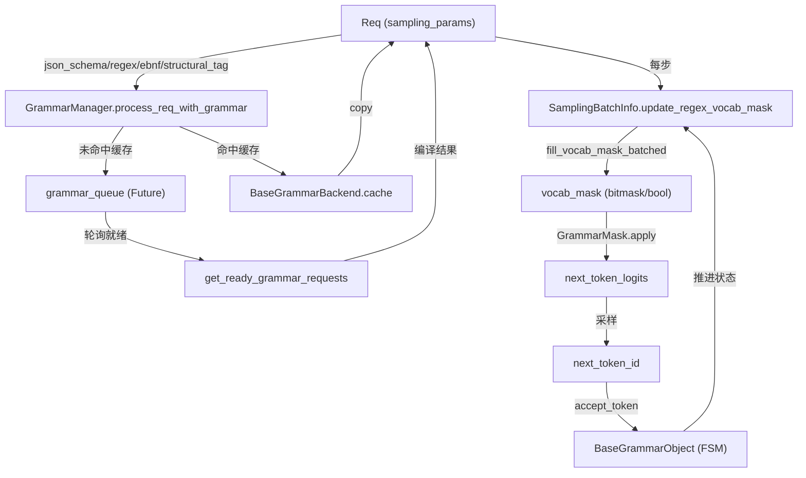

# 约束解码（Constrained Decoding）深度文档

> 本文基于 SGLang 源码 commit `e1c4db9621f7c4203ee9becd5d5456d4e6bf54f7`（2026-08-14）撰写。
> 注意：本任务原始给定的待读文件（`constrained/__init__.py`、`grammar.py`、`constraint.py`、`xgrammar.py`）在该 commit 中已不存在；约束解码模块已被重构为 `base_grammar_backend.py`、`grammar_manager.py`、`xgrammar_backend.py`、`outlines_backend.py`、`llguidance_backend.py`、`reasoner_grammar_backend.py` 等多个文件。本文所有结论均来自对**实际存在**的这些文件的阅读。

## 1. What：约束解码是什么（解决什么问题）

约束解码（grammar-guided / constrained decoding）解决的是**让模型输出严格满足某种形式文法**的问题。原生自回归采样只保证输出是"高概率 token 序列"，不保证结构合法。约束解码在采样前，把每一步的 logits 中"违反文法"的 token 置为 `-inf`（或等价地屏蔽），从而保证最终生成的字符串 100% 符合约束。

SGLang 支持四类约束，且**互斥**（每个请求只能选其一）：

- **`json_schema`**：按 JSON Schema 约束输出（最常用，支撑 OpenAI `response_format=json_schema`）。
- **`regex`**：按正则表达式约束输出。
- **`ebnf`**：按 EBNF 文法约束输出（比 regex 表达力强）。
- **`structural_tag`**：按"结构化标签"约束（如工具调用 protocol，legacy `StructuralTagResponseFormat` 与新 `format` 两种形态）。

源码中对互斥性的硬校验在 `SamplingParams.verify` 中：`python/sglang/srt/sampling/sampling_params.py:L201-L210` —— 若 `json_schema / regex / ebnf / structural_tag` 同时设置超过一个，直接抛 `ValueError`。此外 L137-L141 把空字符串归一化为 `None`，明确"空约束 = 未设置"，而非"约束到空集"。

抽象的约束对象统一建模为 `BaseGrammarObject`，其核心接口（`python/sglang/srt/constrained/base_grammar_backend.py:L52-L141`）包括：

- `accept_token(token) -> None`：把已采样 token 喂给解析状态机，推进文法状态。
- `fill_vocab_mask(vocab_mask, idx)`：为第 `idx` 行计算"合法 token 位图"。
- `apply_vocab_mask(logits, vocab_mask)`：把位图应用到 logits（屏蔽非法 token）。
- `rollback(k)`：回退 k 步状态（用于 tree/draft 回滚或 reject）。
- `is_terminated()`：文法是否已到达接受终态。

## 2. Why：为什么这样设计（动机与权衡）

### 2.1 为什么放在 logits 层面做 mask，而不是后处理

最直接保证"合法"的做法是：采样后若不合法就拒绝重采。但这会反复浪费前向计算，且存在"后续永远无合法 token"的死锁风险。SGLang 选择在**采样之前**于 logits 层面把非法 token 屏蔽，使 argmax/采样**只能**落在合法集合内。这样一次前向即产出合法 token，无重试、无死锁。

权衡：mask 必须在每一步采样前完成，因此约束状态机必须能**增量、低开销**地给出"下一步合法 token 集合"。这正是 `fill_vocab_mask` + 后端专用 matcher 的设计动机。

### 2.2 为什么抽象出多种 backend（xgrammar / outlines / llguidance）

不同约束引擎在"如何把文法编译成可高效查询的合法 token 集合"上实现差异巨大（字节级 FSM vs token 级 pushdown automaton），性能与特性（如 token filtering / jump-forward）也各异。SGLang 把引擎差异封装在 `BaseGrammarBackend` 之下，调度层只依赖统一接口。

实测默认后端是 **xgrammar**：`python/sglang/srt/server_args.py:L6089-L6091` 中 `_handle_grammar_backend` 在 `grammar_backend is None` 时默认置为 `"xgrammar"`；可选集合在 `python/sglang/srt/server_args.py:L243` 定义为 `["xgrammar", "outlines", "llguidance", "none"]`。后端分发逻辑在 `create_grammar_backend`：`python/sglang/srt/constrained/base_grammar_backend.py:L311-L405`，按 `server_args.grammar_backend` 字符串实例化对应类；特别地，xgrammar 在 tokenizer 不被支持时会抛 `TokenizerNotSupportedError`，此时若未开启 `enable_strict_thinking` 会回退到 `none` 并禁用结构化输出（L350-L364）。

### 2.3 为什么约束编译要异步 + 缓存

编译一个 JSON Schema / EBNF 可能耗时数十毫秒，若阻塞调度主线程会拖垮整批。SGLang 用 `ThreadPoolExecutor` 把编译提交为 `Future`：`python/sglang/srt/constrained/base_grammar_backend.py:L244-L253`（`get_cached_or_future_value`）——命中缓存则直接 `copy()` 返回，未命中则 `executor.submit` 异步编译。调度器随后轮询就绪（`GrammarManager.get_ready_grammar_requests`），把编译完成的请求放回 waiting 队列。

## 3. How：关键代码路径

### 3.1 组件总览



### 3.2 请求接入：`GrammarManager`

调度器在收到请求时调用 `process_req_with_grammar`，其逻辑（`python/sglang/srt/constrained/grammar_manager.py:L131-L182`）：

1. 根据 `req.sampling_params` 中哪个字段非空，构造 key 元组 `("json"|"regex"|"ebnf"|"structural_tag", 字符串)`（L144-L151）。
2. `self.grammar_backend.get_cached_or_future_value(key, req.require_reasoning)` 取编译结果（L153）。
3. 若未命中缓存，把 `req` 加入 `grammar_queue`，等 `get_ready_grammar_requests` 异步轮询（L179-L180）。
4. 若命中但为 `InvalidGrammarObject`（编译失败被缓存），直接 `set_finish_with_abort`（L162-L168），避免重复编译报错。
5. 若 `grammar_backend is None`（即 `none`），直接 abort 并提示结构化生成不可用（L140-L142）。

`GrammarManager.__init__`（`python/sglang/srt/constrained/grammar_manager.py:L26-L60`）负责创建后端，并处理 DP/TP/PP 同步组，因为编译完成的"就绪集合"需要在并行 rank 间对齐（PP0 提供数据，后续 PP rank 透传，见 `python/sglang/srt/constrained/grammar_manager.py:77-L107`）。

`get_ready_grammar_requests`（`python/sglang/srt/constrained/grammar_manager.py:L184-L311`）的关键设计：

- 在 `SGLANG_GRAMMAR_POLL_INTERVAL` 内轮询 `Future.done()`（L203-L225）。
- 超过 `SGLANG_GRAMMAR_MAX_POLL_ITERATIONS` 仍未完成则判超时，缓存 `InvalidGrammarObject`（L233-L239，L297-L303）。
- 通过 `all_gather_object` 在 PP0 的 DP/TP 组内求**交集**（ready）与**并集**（failed），保证所有 rank 对"哪些请求可解码"达成一致（L242-L255）。
- 编译成功后 `set_cache` 写入缓存，供同 key 后续请求复用（L286）。

### 3.3 后端如何实现约束

**xgrammar（默认）**：`XGrammarGrammar`（`python/sglang/srt/constrained/xgrammar_backend.py:L73-L199`）持有一个 `GrammarMatcher`：

- `accept_token` 调用底层 `matcher.accept_token(token)`，若返回 `False` 直接抛 `ValueError`（L93-L105）——这把"采样出非法 token"显式暴露为错误，正常情况下不该发生，因为 mask 已经保证只采合法 token。
- `fill_vocab_mask` 调用 `matcher.fill_next_token_bitmask(vocab_mask, idx)`（L119-L120），由 xgrammar 的 C++ matcher **直接以 token 为单位**计算合法位图（见 3.5）。
- `apply_vocab_mask` 用 Triton/HIP kernel `apply_token_bitmask_inplace_*` 把位图就地作用到 logits（L126-L143），支持 cuda/xpu/musa/npu/cpu。
- `copy`（L145-L162）从同一 `CompiledGrammar` 上下文克隆一个新 `GrammarMatcher`（`max_rollback_tokens=MAX_ROLLBACK_TOKENS=200`），并把 `grammar_stats.is_cache_hit=True`，使缓存命中请求零编译开销。

xgrammar 的编译分发：`dispatch_json`（`python/sglang/srt/constrained/xgrammar_backend.py:L337-L350`）对 `"$$ANY$$"` 走 `compile_builtin_json_grammar`（接受任意合法 JSON），否则 `compile_json_schema(schema=..., any_whitespace=...)`；`dispatch_regex`/`dispatch_ebnf`/`dispatch_structural_tag` 分别对应 `compile_regex`/`compile_grammar`/`compile_structural_tag`（L352-L399）。编译异常统一转为 `InvalidGrammarObject`（L347-L349 等）。

**outlines（字节级 FSM）**：`OutlinesGrammar`（`python/sglang/srt/constrained/outlines_backend.py:L42-L111`）基于 `RegexGuide`，把 JSON Schema **先转成 regex**（`dispatch_json` → `build_regex_from_object`，L166-L175），再在字节级状态机上游走：

- `fill_vocab_mask`（L65-L71）调用 `guide.get_next_instruction(self.state).tokens` 拿到"本状态可接受的 token 列表"，再用 `scatter_` 把 vocab_mask 中这些位置置 0、其余置 1（即 1 = 屏蔽）。
- `apply_vocab_mask`（L74-L75）用 `logits.masked_fill_(vocab_mask, float("-inf"))` 完成屏蔽。

**llguidance**：`GuidanceGrammar`（`python/sglang/srt/constrained/llguidance_backend.py:L98-L209`）基于 `LLMatcher`，同样提供 token 级 `fill_next_token_bitmask`，并额外支持 `fill_vocab_mask_batched`（原生并行 kernel，L151-L159）和 `reset_vocab_mask`（L161-L167，要求 `int32` 打包位图）。它还提供 `fill_token_bitmask_with_draft_tokens`（L59-L76）用于投机解码的 draft 链 mask。

### 3.4 与采样/投票结合：logits 层面的 mask

每步解码前，`SamplingBatchInfo.update_regex_vocab_mask`（`python/sglang/srt/sampling/sampling_batch_info.py:L239-L264`）：

1. 找一个非空 grammar 作为 `first_grammar`（L245）。
2. `allocate_vocab_mask` 分配 `[batch_size, vocab_size]` 的位图（L247-L251）。
3. 对**未终止且未 finished** 的请求构造 `GrammarRow`，批量填充位图（L255-L260）。finished/terminated 行保留"全放行"初始值。
4. `move_vocab_mask` 把位图搬到目标设备，`GrammarMask(first_grammar, vocab_mask)` 封装（L263-L264）。

随后在 `apply_logits_bias` 中，`python/sglang/srt/sampling/sampling_batch_info.py:L296-L297` 执行 `self.grammar_mask.apply(logits)`，而 `GrammarMask.apply`（`python/sglang/srt/constrained/base_grammar_backend.py:L152-L153`）只是转发到 `grammar.apply_vocab_mask`。**顺序关键**：grammar mask 在 additive/scaling penalty、logit_bias 之后、采样之前应用（L283-L300），因此合法 token 集不会被后续 bias 破坏，且屏蔽对所有采样策略（greedy/top-p/温度）一致生效。

采样拿到 `next_token_id` 后，调度器在 `python/sglang/srt/managers/scheduler_components/batch_result_processor.py` 的 `_apply_prefill_grammar`（L574-L592）与 decode 路径（L721）调用 `req.grammar.accept_token(next_token_id)` 推进 FSM；prefill 阶段还会先判断 `already_advanced`（投机 overlap 路径已由 grammar barrier 提前推进）以避免重复 accept（L580-L583）。`accept_token` 失败会被捕获并 `FINISH_ABORT`（L584-L591），防止非法 token 污染状态机。

### 3.5 JSON Schema 模式如何保证合法且高效（token 级预查）

xgrammar/llguidance 的核心效率来源是 **token 级位图预查**：传统 Outlines 走字节级 FSM，要先枚举"从当前状态可达的所有 token"，对每个候选 token 做字节展开与状态查询，复杂度随词表增大而上升；xgrammar 的 `GrammarMatcher` 在编译期把文法转成可在 GPU 友好的位图上直接求值的匹配器，`fill_next_token_bitmask` 一次性算出**整词表**哪些 token 合法，无需逐 token 试探。

位图以"32 个布尔值打包进一个 32 位整数"的紧凑格式存储（`python/sglang/srt/speculative/spec_utils.py:L469-L472` 展示了按 `current_token // 32` 与 `1 << (current_token % 32)` 解包），因此 `vocab_size` 行位图体积很小，拷贝/应用开销低。`_allocate_token_bitmask`（`python/sglang/srt/constrained/xgrammar_backend.py:L61-L70`）用 `pin_memory` 分配，使后续 H2D 拷贝能真正 non_blocking。

此外 JSON 模式还有 `any_whitespace` / `constrained_json_disable_any_whitespace`（`server_args.py:L1659-L1661`）与 `constrained_json_whitespace_pattern` 控制空白处理，影响合法 token 集合大小与紧凑性，是"合法"与"输出体积"之间的权衡开关。

### 3.6 推理（reasoning）阶段的延迟约束

当启用 reasoning parser 时，后端会被 `ReasonerGrammarBackend` 包裹（`python/sglang/srt/constrained/base_grammar_backend.py:L387-L403`）。`ReasonerGrammarObject.fill_vocab_mask`（`python/sglang/srt/constrained/reasoner_grammar_backend.py:L150-L171`）体现关键设计：**思考阶段不启用内部文法**，只对"思考 token"做可选的 token filtering（屏蔽 `think_excluded_token_ids` 或强制 `think_end_ids`）；只有在 `_is_generation()`（即思考结束标记已出现）之后，才把本步交给内部 `grammar.fill_vocab_mask`。这意味着约束只在"正式回答段"生效，保证 JSON/工具调用结构不被思考过程污染。

## 4. 数据流图（token → mask → 采样）

```mermaid
sequenceDiagram
    participant Sched as Scheduler/BatchResultProcessor
    participant FSM as BaseGrammarObject (matcher)
    participant SBI as SamplingBatchInfo
    participant Kern as bitmask kernel
    participant Sampler as Sampler

    Note over Sched,FSM: 上一步已 accept_token 推进状态
    SBI->>FSM: fill_vocab_mask_batched(entries, vocab_mask)
    FSM->>Kern: fill_next_token_bitmask / get_next_instruction
    Kern-->>SBI: vocab_mask (合法=1/放行)
    SBI->>Sampler: apply_logits_bias -> grammar_mask.apply(logits)
    Sampler->>Kern: apply_token_bitmask_inplace(logits, vocab_mask)
    Kern-->>Sampler: logits (非法token=-inf)
    Sampler->>Sampler: 采样得到 next_token_id
    Sampler-->>Sched: next_token_id
    Sched->>FSM: accept_token(next_token_id)
    FSM-->>FSM: 推进/终止; 若非法则 raise -> FINISH_ABORT
```

## 5. 边界与坑

### 5.1 与投机解码（speculative decoding）的冲突

这是最棘手的坑。约束解码要求"每一步先算 mask 再采样"，而投机解码的 verify 阶段一次验证一整棵 draft 树。SGLang 用 `grammar_needs_sync` 协调二者：

```python
# python/sglang/srt/managers/schedule_batch.py:L2232-L2235
def grammar_needs_sync(self) -> bool:
    return self.has_grammar and not self.spec_algorithm.supports_grammar_overlap()
```

即：**只要本批含 grammar 且投机算法不支持 overlap，就必须退化为同步路径**（verify 阶段不 overlap 前向）。`supports_grammar_overlap`（`python/sglang/srt/speculative/spec_info.py:L142-L148`）只对 eagle / standalone / dflash 家族返回 `True`；**NGRAM 返回 `False`**，因为它的 draft 来自 host 语料检索、本身即同步，没法把 grammar 的 CPU 工作藏在 GPU draft 下。

在支持 overlap 的算法中，FSM 的推进被放进 verify() 内的 "grammar barrier"，与 target 前向重叠（见 `python/sglang/srt/managers/scheduler.py:L1855-L1861`、L3681-L3687）。而在不支持 overlap 时，`_advance_pending_grammar`（scheduler.py:L1861-L1866）需要被显式调用以避免阻塞。

投机解码下 mask 的填充走专用 DFS（`python/sglang/srt/speculative/spec_utils.py:L459-L492`）：沿 draft 树每个节点先 `grammar.fill_vocab_mask` 算该节点合法集合，再 `grammar.accept_token` 推进、`grammar.rollback(1)` 回退，保证"被 reject 的分支"不会污染父状态机的后续查询。llguidance 还提供 `fill_token_bitmask_with_draft_tokens`（L59-L76）直接用原生 kernel 一次性填充 draft 链 mask。

### 5.2 与并行采样（parallel sampling, n>1）的潜在冲突

> **[OPEN]** 约束对象 `BaseGrammarObject` 是**每请求一个**（见 `python/sglang/srt/model_executor/forward_batch_info.py:L777-L780`，`batch.sampling_info.grammars = [req.grammar for req in batch.reqs]`，按请求而非按 sample 展开）。而 `update_regex_vocab_mask` 的位图是按 `batch_size`（采样行数）分配的，同请求的多行会共用同一 grammar 行引用。当 `n>1` 个并行样本从同一 FSM 状态发散出**不同 token** 时，`accept_token` 只能接受"最终被选中"的那个分支，其余分支的 FSM 状态无法独立维护。本 commit 的代码中未发现对"grammar + 并行采样"显式 mutual-exclusion 校验，其实际行为（是否禁止、还是未定义）建议进一步确认——见 `docs/appendix/_openq_constrained-decoding.md`。

### 5.3 其他边界

- **tokenizer 不支持**：xgrammar 对特殊 tokenizer 需提供 `init_xgrammar`（如 `python/sglang/srt/tokenizer/tiktoken_tokenizer.py:L161-L162`），否则回退 `none` 并禁用结构化输出。
- **编译超时**：`SGLANG_GRAMMAR_MAX_POLL_ITERATIONS` 控制编译轮询上限，超限请求被 abort（grammar_manager.py:L233-L239）。
- **mask 显存泄漏**：overlap 模式下 `grammar_mask` 可能被延迟采样闭包持有，因此 `python/sglang/srt/model_executor/model_runner.py:L1769` 在 apply 后立即置 `None` 释放显存。
- **Overlap 模式下 mask 计算时机**：`python/sglang/srt/model_executor/model_runner.py:L1757-L1762` 注释明确 `update_regex_vocab_mask` 在上一批结果处理后才执行，使 CPU 端 mask 计算与 GPU 前向重叠；`grammar_needs_sync=True` 时该重叠被禁用。
- **`reasoning` 包裹层的 current_token 一致性**：`ReasonerGrammarObject` 在 `accept_token`（reasoner_grammar_backend.py:L113-L121）里**显式**维护 `self.current_token`，否则 disaggregation 的 `process_prebuilt` 会因 `current_token is None` 误判而重复 accept，导致 "Tokens not accepted" → `FINISH_ABORT`。

## 6. 小结

约束解码在 SGLang 中以"后端可插拔 + 统一 `BaseGrammarObject` 接口 + 每步 logits mask"的三层结构落地：调度侧 `GrammarManager` 负责异步编译与缓存，采样侧 `SamplingBatchInfo` 负责批量位图填充与就地应用，后端侧 `xgrammar`/`outlines`/`llguidance` 负责把文法高效编译为 token 级合法集合。其正确性根基是"先 mask 后采样 + 采样后 `accept_token` 推进 FSM"，主要工程难点在于与投机解码 overlap 的协调，以及与并行采样的 FSM 单态约束。
