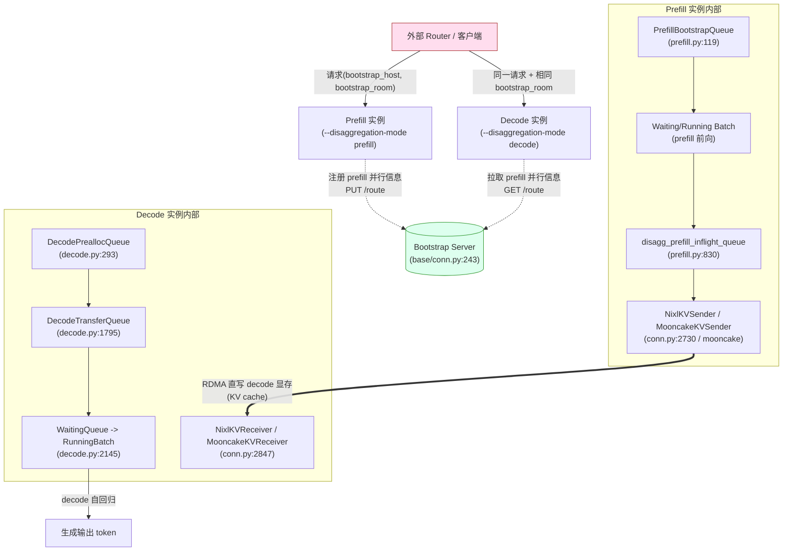
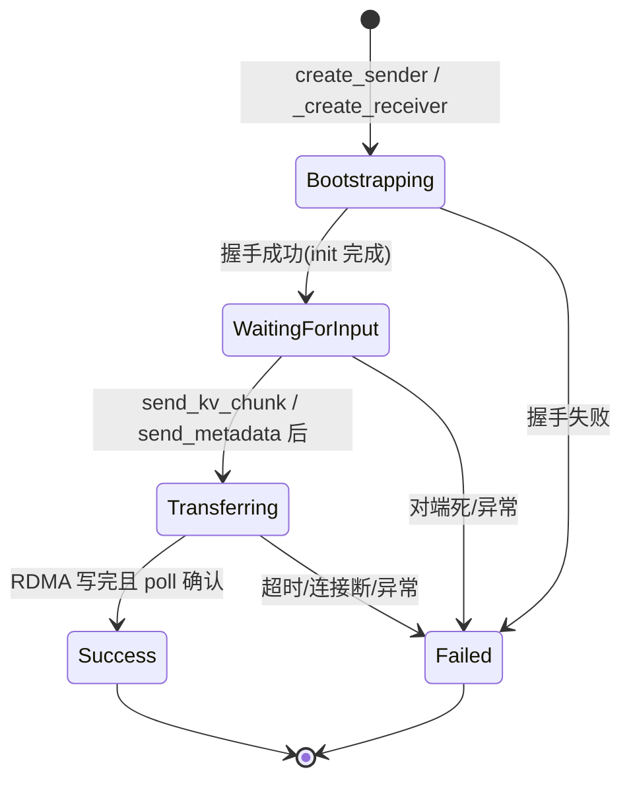

# PD 分离（Prefill/Decode Disaggregation）架构深度解析

> 本文所有结论均来自 commit `e1c4db9621f7c4203ee9becd5d5456d4e6bf54f7` 的本地源码，路径锚点均以 `python/sglang/srt/disaggregation/` 为基准。

## 0. 术语与总览

PD 分离（Prefill/Decode Disaggregation）把一次生成请求拆成两个阶段，分别放到不同进程/实例上：

- **Prefill 实例**：只做 prefill 前向（计算 prompt 的 KV cache 与首个输出 token）。
- **Decode 实例**：接收 prefill 算好的 KV cache，只做自回归 decode。

两者通过 **KV transfer** 衔接：prefill 算完后把 KV cache 通过 RDMA（NIXL/Mooncake 等后端）直接写入 decode 已预分配的显存。核心抽象定义在 `python/sglang/srt/disaggregation/base/conn.py`：

- `BaseKVSender`（`python/sglang/srt/disaggregation/base/conn.py:115`）：prefill 侧发送端，关键方法 `send(kv_indices, state_indices, num_kv_tokens)`（`python/sglang/srt/disaggregation/base/conn.py:135`）。
- `BaseKVReceiver`（`python/sglang/srt/disaggregation/base/conn.py:184`）：decode 侧接收端，关键方法 `send_metadata(kv_indices, aux_index, state_indices, decode_prefix_len)`（`python/sglang/srt/disaggregation/base/conn.py:204`）。
- `BaseKVManager` / `BaseKVBootstrapServer`：管理与握手的元数据。

`DisaggregationMode`（`python/sglang/srt/disaggregation/utils.py:100`）只有 `PREFILL` / `DECODE` / `NULL` 三态；传输后端 `TransferBackend` 枚举含 `MOONCAKE / NIXL / MORI / ASCEND / FAKE`（`python/sglang/srt/disaggregation/utils.py:592`）。运行时具体类由 `get_kv_class(transfer_backend, class_type)` 工厂分发（`python/sglang/srt/disaggregation/utils.py:630`）。

---

## 1. What：PD 分离是什么，由哪些组件构成

### 1.1 整体架构



### 1.2 关键组件

| 组件 | 文件:行 | 职责 |
| --- | --- | --- |
| `PrefillBootstrapQueue` | `python/sglang/srt/disaggregation/prefill.py:119` | prefill 侧握手队列；管理 sender 的 bootstrap 状态 |
| `SchedulerDisaggregationPrefillMixin` | `python/sglang/srt/disaggregation/prefill.py:485` | prefill `Scheduler` 的混入类，含事件循环 |
| `DecodePreallocQueue` | `python/sglang/srt/disaggregation/decode.py:293` | decode 侧预分配队列；创建 receiver、预分配 KV、发送 metadata |
| `DecodeTransferQueue` | `python/sglang/srt/disaggregation/decode.py:1795` | decode 侧传输轮询队列；检测 KV 是否到达 |
| `SchedulerDisaggregationDecodeMixin` | `python/sglang/srt/disaggregation/decode.py:2145` | decode `Scheduler` 混入类，含事件循环 |
| `NixlKVSender/Receiver`、`NixlKVManager` | `python/sglang/srt/disaggregation/nixl/conn.py:2730,2847,393` | NIXL 后端具体实现 |
| `MooncakeKVManager/Sender/Receiver` | `python/sglang/srt/disaggregation/mooncake/conn.py` | Mooncake 后端具体实现 |

---

## 2. Why：为什么需要 PD 分离

**1) 计算特性解耦。** Prefill 是 compute-bound 的矩阵乘（prompt 长、可大 batch 并行），decode 是 memory-bandwidth-bound 的小 batch 自回归。两者对 batch size、调度策略、显存占用的偏好相反；拆开后可独立扩缩容与调参（`python/sglang/srt/server_args.py:3061` 的 `--disaggregation-mode`）。

**2) 复用 KV，而不是重复算。** 分离后 prefill 算一次 KV，通过 RDMA 直接搬到 decode 显存，省去 decode 端重算 prompt 的开销；同时 decode 端可开启 `--disaggregation-decode-enable-radix-cache`（`python/sglang/srt/server_args.py:3088`）复用前缀 KV，进一步减少跨实例传输量。

**3) 规避统一调度的耦合。** 在统一实例里 prefill 与 decode 共用一棵 radix 树与同一套显存预算；分离后两者用各自的 `DecodeReqToTokenPool`（`python/sglang/srt/disaggregation/decode.py:112`）做独立的预分配账本，使 decode 能在 prefill 尚未完成时就占住显存槽位（详见 §5 坑）。

**代价（权衡）：** 引入了跨实例的 KV 传输延迟、握手（bootstrap）延迟，以及需要外部 Router 做请求分发（见 §4）。

---

## 3. How：请求的生命周期与 KV 传输路径

### 3.1 Prefill 侧生命周期

```mermaid
sequenceDiagram
    participant R as 外部 Router
    participant PBQ as PrefillBootstrapQueue
    participant PF as Prefill Scheduler
    participant PS as KVSender
    participant BS as Bootstrap Server
    participant DR as KVReceiver(decode)

    R->>PBQ: 请求(bootstrap_host/room)
    PBQ->>PS: create_sender (prefill.py:299)
    PS->>BS: 注册/bootstrap 握手(共享 room)
    BS-->>DR: 握手成功(WaitingForInput)
    PBQ->>PF: pop_bootstrapped 进入 waiting (prefill.py:383)
    PF->>PF: run_batch 前向计算 KV
    PF->>PS: send_kv_chunk (prefill.py:1139)
    PS==>DR: RDMA 写入 decode 显存
    PF->>PBQ: process_disagg_prefill_inflight_queue 轮询 (prefill.py:830)
    PS-->>PBQ: poll()==Success
    PBQ->>PBQ: release_kv_cache + 返回客户端
```

关键方法签名与路径：

- **`PrefillBootstrapQueue.create_sender(self, req, num_kv_heads) -> bool`**（`python/sglang/srt/disaggregation/prefill.py:299`）：为请求创建 `KVSender`，调用 `get_kv_class(backend, KVClassType.SENDER)` 得到具体类，随后入 bootstrap 队列；若超过 KV 容量则返回 `False`。
- **`PrefillBootstrapQueue.pop_bootstrapped(...)`**（`python/sglang/srt/disaggregation/prefill.py:383`）：轮询队列里每个 sender 的 `poll()`（`KVPoll` 见 §3.3），把完成握手的请求移入 `waiting_queue`。
- **`SchedulerDisaggregationPrefillMixin.event_loop_normal_disagg_prefill`**（`python/sglang/srt/disaggregation/prefill.py:568`）：prefill 的事件循环；`process_batch_result_disagg_prefill`（`python/sglang/srt/disaggregation/prefill.py:658`）在 prefill 前向完成后调用 `send_kv_chunk`。
- **`SchedulerDisaggregationPrefillMixin.send_kv_chunk(self, req, last_chunk, end_idx)`**（`python/sglang/srt/disaggregation/prefill.py:1139`）：按页（page）切分待传 KV 索引，调用 `req.disagg_kv_sender.send(page_indices, state_indices, num_kv_tokens)`。支持分块（chunked prefill）多次发送：`last_chunk=True` 时附带 aux/state 元数据，并把请求挂入 `disagg_prefill_inflight_queue`。
- **`process_disagg_prefill_inflight_queue`**（`python/sglang/srt/disaggregation/prefill.py:830`）：非阻塞轮询 inflight 请求；`poll()==Success` 后 `release_kv_cache(req, self.tree_cache)` 解锁 radix 树并回包给客户端。

### 3.2 Decode 侧生命周期

```mermaid
sequenceDiagram
    participant R as 外部 Router
    participant DPQ as DecodePreallocQueue
    participant DR as KVReceiver
    participant DTQ as DecodeTransferQueue
    participant DS as Decode Scheduler
    participant BM as 预分配 KV 显存

    R->>DPQ: 请求(bootstrap_host/room)
    DPQ->>DR: _create_receiver_and_enqueue (decode.py:597)
    DPQ->>DPQ: _resolve_prefill_dp_rank (decode.py:577)
    DR->>DR: kv_receiver.init(prefill_dp_rank)
    DPQ->>BM: _pre_alloc 预分配 KV (decode.py:1536)
    DPQ->>DR: send_metadata(kv_indices, aux, prefix_len) (decode.py:1309)
    DR==>>DPQ: 等待 prefill RDMA 写入
    DPQ->>DTQ: pop_preallocated 转移 (decode.py:908)
    DTQ->>DTQ: pop_transferred 轮询 (decode.py:2018)
    DTQ->>DS: transfer 完成 -> waiting_queue
    DS->>DS: get_new_prebuilt_batch 构造 PrebuiltExtendBatch (decode.py:2281)
    DS->>DS: 直接进入 decode 自回归
```

关键方法签名与路径：

- **`DecodePreallocQueue.add(self, req, is_retracted=False, is_rebootstrap=False)`**（`python/sglang/srt/disaggregation/decode.py:524`）：创建 `kv_receiver`（`_create_receiver_and_enqueue`，`python/sglang/srt/disaggregation/decode.py:597`）。若 `_is_fake_transfer` 或能直接解析出 `prefill_dp_rank`，立即 `kv_receiver.init(...)`；否则放入 `pending_reqs` 走慢路径。
- **`DecodePreallocQueue._resolve_prefill_dp_rank(self, req)`**（`python/sglang/srt/disaggregation/decode.py:577`）：从 `kv_manager.prefill_info_table` 查 prefill 并行信息；若 `follow_bootstrap_room=True` 则用 `req.bootstrap_room % prefill_info.dp_size` 选 DP rank（这是 decode 侧唯一的“负载均衡”逻辑，见 §4）。
- **`DecodePreallocQueue.pop_preallocated(...)`**（`python/sglang/srt/disaggregation/decode.py:908`）：核心调度点。`_resolve_pending_reqs` 解析慢路径请求、`_update_handshake_waiters` 推进握手状态；随后在预算允许下调用 `_pre_alloc`（`python/sglang/srt/disaggregation/decode.py:1536`）预分配 KV，并通过 `kv_receiver.send_metadata(page_indices, metadata_buffer_index, state_indices, decode_prefix_len=total_prefix_len)`（`python/sglang/srt/disaggregation/decode.py:1309`）把“把 KV 写到哪”告诉 prefill。返回已预分配请求给 transfer 队列。
- **`DecodeTransferQueue.pop_transferred(self, rids_to_check=None)`**（`python/sglang/srt/disaggregation/decode.py:2018`）：轮询队列中每个 `kv_receiver.poll()`；`Success` 后调用 `_commit_transfer_to_req`（`python/sglang/srt/disaggregation/decode.py:1830`）从 metadata buffer 读出首个输出 token、cached_tokens、logprobs 等，构造 `output_ids`，请求进入 `waiting_queue`。
- **`SchedulerDisaggregationDecodeMixin.process_decode_queue`**（`python/sglang/srt/disaggregation/decode.py:2350`）：每 `disaggregation_decode_polling_interval` 个周期调用 `pop_preallocated` 与 `pop_transferred`，把传输完成的请求并入 `waiting_queue`，再由 `get_new_prebuilt_batch`（`python/sglang/srt/disaggregation/decode.py:2281`）构造 `PrebuiltExtendBatch`——跳过 prefill 前向，只填元数据，直接进入 decode。

### 3.3 传输状态机（KVPoll）

`KVPoll`（`python/sglang/srt/disaggregation/base/conn.py:89`）是传输双方共享的状态枚举：



NIXL 后端实现中 `NixlKVSender.poll`（`python/sglang/srt/disaggregation/nixl/conn.py:2790`）会检查 staging 残留（`_staging_outstanding`）——若有未完成的 staging 分块，即便底层状态是 `Success` 也会降级返回 `Transferring`，避免提前结束丢失分块。

---

## 4. Router / 负载均衡：请求如何在 P 与 D 集群间路由

> **[OPEN]** 真正把请求“扇出”到具体 prefill / decode 实例、并分配 `bootstrap_host` 与 `bootstrap_room` 的外部 Router（sglang-router 项目）不在本 commit 的 `python/sglang/srt/` 源码树内，其分配策略（轮询/最少负载/一致性哈希等）无法在此源码中取证，本文只描述引擎侧可见的衔接逻辑。见附录 `docs/appendix/_openq_disaggregation.md`。

引擎侧可见的路由/均衡逻辑分两层：

### 4.1 外部层：bootstrap_host + bootstrap_room 是“ rendezvous 钥匙”

请求对象携带 `bootstrap_host` / `bootstrap_room`（`python/sglang/srt/entrypoints/openai/protocol.py:376,378`，可由 HTTP 头 `x-override-bootstrap-host/room` 覆盖，`python/sglang/srt/entrypoints/request_headers.py:12`）。prefill 与 decode 两端拿到**相同的 `bootstrap_room`**，通过 Bootstrap Server 在同一 room 上握手——room 是跨实例配对的唯一关键字。

### 4.2 内部层：Bootstrap Server 维护 prefill 并行信息表

- **注册（prefill 启动）：** `CommonKVManager.register_to_bootstrap`（`python/sglang/srt/disaggregation/common/conn.py:680`）通过 `PUT /route` 把自身并行信息（attn_tp_size/rank、dp_size/rank、pp_size、page_size、kv_cache_dtype 等）注册到 Bootstrap Server。
- **查询（decode 拉取）：** `CommonKVManager.try_ensure_parallel_info`（`python/sglang/srt/disaggregation/common/conn.py:507`）通过 `GET /route` 取回并缓存到 `prefill_info_table`；随后 `_resolve_rank_mapping`（`python/sglang/srt/disaggregation/common/conn.py:567`）计算 TP/CP/PP rank 映射（支持异构 TP、decode CP=1、PP 对齐等约束）。
- **DP rank 选择（内部负载均衡）：** `DecodePreallocQueue._resolve_prefill_dp_rank`（`python/sglang/srt/disaggregation/decode.py:577`）在 `follow_bootstrap_room=True` 时用 `bootstrap_room % dp_size` 把请求分散到不同 prefill DP rank；否则走 `CommonKVReceiver.query_prefill_dp_ranks` 慢路径查询。注册 payload 里还带 `load_balance_method`（`python/sglang/srt/disaggregation/common/conn.py:712`），但具体均衡算法由 Bootstrap Server 实现决定。

> **[OPEN]** `bootstrap_room` 的取值离散性（是否由 Router 保证“均匀分散”到各 prefill DP rank）在引擎侧不可见；若 Router 连续分配相邻 room 且 prefill `dp_size` 与取模基数不匹配，可能导致 DP rank 倾斜。该问题需到 Router 侧源码才能确认（见 `docs/appendix/_openq_disaggregation.md`）。

### 4.3 异构 TP / CP / PP 的映射

`_resolve_rank_mapping`（`python/sglang/srt/disaggregation/common/conn.py:567`）是 PD 分离支持“prefill 与 decode 不同并行度”的关键：

- prefill TP == decode TP：1:1 映射，单 rank 取数。
- prefill TP > decode TP（非 MLA 性能不保证，仅告警）：一个 decode rank 从多个 prefill rank 取 KV（`target_tp_ranks` 多元素，`python/sglang/srt/disaggregation/common/conn.py:593`）。
- MLA 后端：decode 单 rank 即可从单个 prefill rank 取全部 KV（`python/sglang/srt/disaggregation/common/conn.py:601` 注释），但需维持多连接以避免 poll 状态错乱。

---

## 5. 一致性：decode 端如何“等待” KV 到达

decode 端不主动拉取 KV，而是**预分配显存并把写地址交给 prefill**，由 prefill 通过 RDMA 直写；decode 仅轮询状态：

1. `DecodePreallocQueue._pre_alloc`（`python/sglang/srt/disaggregation/decode.py:1536`）在握手完成后立刻占住 KV 槽位（用独立的 `DecodeReqToTokenPool`，`python/sglang/srt/disaggregation/decode.py:112`，允许 `#pre-allocated + #transfer` 超出 `--max-running-requests`，用 `pre_alloc_size` 扩展）。
2. `send_metadata` 把目标页索引（`kv_indices`）与 metadata buffer 索引发往 prefill；prefill 的 `NixlKVReceiver.send_metadata`（`python/sglang/srt/disaggregation/nixl/conn.py:2858`）连接 bootstrap 并把写地址下发给各 prefill TP rank。
3. prefill 完成前向，`send_kv_chunk` 触发 RDMA 写；decode 在 `DecodeTransferQueue.pop_transferred`（`python/sglang/srt/disaggregation/decode.py:2018`）里轮询 `kv_receiver.poll()`，直到 `Success`。
4. `_commit_transfer_to_req`（`python/sglang/srt/disaggregation/decode.py:1830`）做**元数据门控校验**：比对 `output_bootstrap_room` 与实际 `bootstrap_room`，若 `actual_room==0` 判定“ readiness gate 后元数据仍未就绪”直接 abort；若 `actual_room != expected_room` 判定“metadata buffer 索引冲突/上下文损坏”abort——这是防止跨 rank 队列分叉的强校验。

**同步/异步边界：** 传输本身由后端传输线程异步完成（NIXL 有 `transfer_worker` 线程，`python/sglang/srt/disaggregation/nixl/conn.py:1111`；`poll()` 是非阻塞轮询），但 decode 的调度循环是“周期性轮询 + 非阻塞 poll”，因此 KV 到达是**事件驱动 + 轮询兜底**，不会阻塞 GPU 前向。

---

## 6. 坑：边界条件与易错点

### 6.1 传输是异步的，但调度靠轮询——“轮询间隔”会引入尾延迟

decode 侧 `process_decode_queue`（`python/sglang/srt/disaggregation/decode.py:2350`）按 `disaggregation_decode_polling_interval`（`python/sglang/srt/server_args.py:3106`）节流：只有每 N 个循环才 `pop_preallocated` + `pop_transferred`。间隔过大 → KV 早已到达却迟迟不被 commit；过小 → 多余 CPU/同步开销。调优该参数是常见坑。

### 6.2 metadata buffer 是有限资源，可能成为瓶颈

`ReqToMetadataIdxAllocator`（`python/sglang/srt/disaggregation/utils.py:290`）按池分配 buffer 索引。`pop_bootstrapped`（`python/sglang/srt/disaggregation/prefill.py:383`）与 `DecodePreallocQueue.pop_preallocated`（`python/sglang/srt/disaggregation/decode.py:908`）在 `ensure_metadata_buffer` 失败时会**主动 yield / 推迟**，表现为请求卡在 bootstrap 队列而不报错——排障时容易误判为网络慢。

### 6.3 PD 分离下 radix 缓存的边界

- **prefix 复用只发生在 decode 侧**（开关 `--disaggregation-decode-enable-radix-cache`，`python/sglang/srt/server_args.py:3088`）。decode 在 `pop_preallocated` 用 `match_prefix_for_req` 匹配自身 radix 树（`python/sglang/srt/disaggregation/decode.py:561`），算出 `total_prefix_len` 作为 `decode_prefix_len` 回传给 prefill，prefill 只传 delta 部分（`python/sglang/srt/disaggregation/prefill.py:344` 的 `decode_prefix_len`）。
- **prefill 侧对“已传给 decode 的 KV”不能复用**：prefill 在 inflight 完成后 `release_kv_cache(req, self.tree_cache)`（`python/sglang/srt/disaggregation/prefill.py:886`）解锁整棵 radix 树——prefill 的 radix 命中只能省 prefill 自身重算，不能跨实例省传输。
- **DSV4 NPU（C4）限制：** 当前 PD + decode 侧 radix/HiCache 不支持前缀缓存，检测到 `total_prefix_len != 0` 且带 `c4_attn_allocator` 时直接抛 `RuntimeError`（`python/sglang/srt/disaggregation/decode.py:1105`）。
- **retracted / rebootstrap 请求不走 decode radix 缓存**：`use_decode_radix_cache` 显式排除 `is_rebootstrap`（`python/sglang/srt/disaggregation/decode.py:1029`），因为前缀 KV 需在更新权重后由 prefill 重算。

### 6.4 TP / dtype / page_size 必须两端一致

`try_ensure_parallel_info`（`python/sglang/srt/disaggregation/common/conn.py:507`）会硬性校验 `page_size` 与 `kv_cache_dtype` 一致，否则 `RuntimeError`。异构 TP 在非 MLA 模型上仅告警、不保证性能（`python/sglang/srt/disaggregation/common/conn.py:578`）。

### 6.5 跨实例 KV 传输与显存压缩（unified memory）的互斥窗口

`unified_memory_disagg_move_gate`（`python/sglang/srt/disaggregation/utils.py:114`）指出：传输期间页面“从地址到达对端到传输结束”全程暴露给 RDMA，且部分生命周期请求既不在 prefill 也不在 decode 的队列里（例如 prefill 清空 `chunked_req` 但 chunk 仍在 drain）。因此 compaction 搬迁 gate 必须检查 `disagg_prefill_inflight_queue` / `disagg_prefill_pending_chunk_rids` / `disagg_decode_transfer_queue` / `has_published_destinations`，否则会搬走正在被 RDMA 读写的页。

### 6.6 失败处理的对称性

- prefill 侧：`handle_bootstrap_failure`（`python/sglang/srt/disaggregation/prefill.py:993`）、`handle_inflight_transfer_failure`（`python/sglang/srt/disaggregation/prefill.py:937`）、`optimistic_release_and_requeue`（`python/sglang/srt/disaggregation/prefill.py:1329`，乐观 prefill 重试）。
- decode 侧：`_commit_transfer_to_req` 内 `bootstrap_room` 不匹配即 abort（`python/sglang/srt/disaggregation/decode.py:1877`），`pop_transferred` 处理 `Failed` 状态并 `release_kv_cache(..., is_insert=False)` 避免把失败 KV 插入 radix（`python/sglang/srt/disaggregation/decode.py:2076`）。

---

## 7. 小结

PD 分离把 prefill 与 decode 拆到不同实例，用 `BaseKVSender/BaseKVReceiver` 抽象 + `KVPoll` 状态机衔接，传输后端（NIXL/Mooncake/Mori/Ascend）通过 `get_kv_class` 工厂注入。请求经外部 Router 用 `bootstrap_host/room` 配对，两端在 Bootstrap Server 上交换并行信息；decode 预分配显存、把写地址交给 prefill，由 RDMA 直写，decode 仅轮询直到 `Success` 后进入自回归。主要坑集中在：轮询间隔尾延迟、metadata buffer 容量、decode 侧 radix 的有限复用边界、以及两端 TP/dtype/page_size 必须一致。
