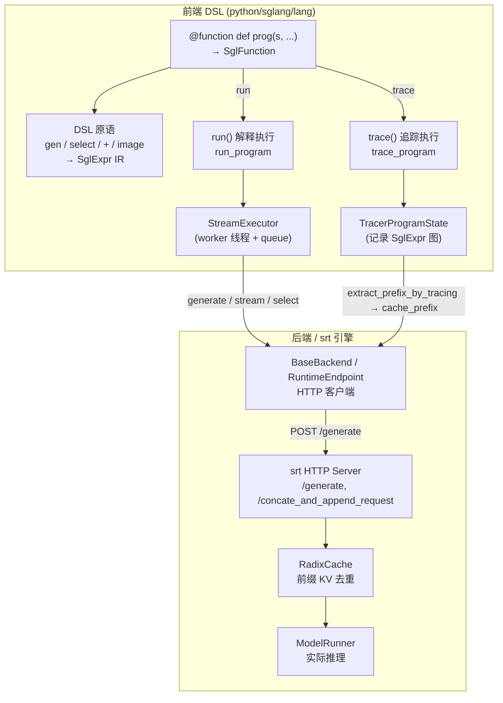

# SGLang 前端 DSL（lang 模块）源码解析

> 唯一事实来源：本地仓库 `python/sglang/`，对齐 commit `e1c4db9621f7c4203ee9becd5d5456d4e6bf54f7`（2026-08-14）。
> 本文所有论断均来自该 commit 源码阅读，路径与行号以 Read 工具实测为准。

## 0. 模块地图：文件结构与任务预设的差异

任务预设要求阅读 `lang/__init__.py`、`lang/program.py`、`lang/compiler.py`，但在本 commit 中 **这些文件并不存在**。实际 `lang/` 目录（`python/sglang/lang/`）包含：

| 文件 | 角色 |
| --- | --- |
| `api.py` | 公共 DSL API：`function`、`gen`、`select`、`image`、`video`、`system/user/assistant`、`separate_reasoning`、`Runtime`、`Engine` 等，以及程序实体 `SglFunction` 的调用入口 |
| `ir.py` | 中间表示（IR）：`SglExpr` 基类及全部节点（`SglGen`、`SglSelect`、`SglFork`…），以及 `SglFunction`、`SglSamplingParams` |
| `interpreter.py` | 解释执行：`run_program` / `StreamExecutor` / `ProgramState` / `ProgramStateGroup` |
| `tracer.py` | 追踪执行（记录 IR）：`trace_program` / `TracerProgramState` / `TracingScope` |
| `choices.py` | `select` 的评分方法（`TokenLengthNormalized`、`GreedyTokenSelection`、`UnconditionalLikelihoodNormalized`） |
| `chat_template.py` | 角色前缀/后缀模板 |
| `backend/` | 后端抽象与实现：`base_backend.py`、`runtime_endpoint.py`、`openai.py`、`anthropic.py` 等 |

公共符号由 `python/sglang/__init__.py:44` 从 `sglang.lang.api` 再导出，用户可直接 `from sglang import function, gen, select, …`。

> **[OPEN]** 任务预设的 `program.py`/`compiler.py` 在本 commit 不存在，程序实体即 `ir.py:SglFunction`，「编译」由 `tracer.py` 承担（见 `docs/appendix/_openq_frontend-language.md` 第 3 条）。

---

## 1. What：前端 DSL 是什么

SGLang 前端是一套以 Python 为宿主、以「状态（`s`）+ 表达式拼接」为核心的**提示词编程 DSL**。它的目标不是训练，而是把「构造 prompt → 调模型 → 解析输出 → 再构造」这一循环用结构化、可组合的方式写出来，并把**前端程序与后端推理引擎（srt）解耦**。

### 1.1 程序（Program）的表示

一个 SGLang 程序即一个被 `@function` 装饰的普通 Python 函数，其首参必须命名为 `s`（程序状态）。装饰器把它包成 `SglFunction`：

```python
@function
def story(s, topic):
    s += "Write a story about " + topic   # 字符串与变量拼接
    s += gen("story", max_tokens=256)      # 调模型生成，结果绑定到变量 story
    s += "The genre is" + select("genre", ["comedy", "horror"])
```

`SglFunction.__init__` 用 `inspect.getfullargspec` 解析参数名，并强制第一个参数为 `"s"`（`python/sglang/lang/ir.py:L142-L152`）。它持有 `func`（原始 callable）、`num_api_spec_tokens`（投机执行开关）、`bind_arguments`（部分参数绑定）。

IR 节点统一继承自 `SglExpr`（`python/sglang/lang/ir.py:L327-L359`），每个节点带 `node_id`、`prev_node` 形成链式依赖；`__add__`/`__radd__` 把两个 IR 表达式合并成 `SglExprList`（`concatenate_ir`）。这才是「程序如何表示」的核心——程序在解释路径下表现为**实时执行的 Python 调用流**，在追踪路径下表现为一棵 `SglExpr` 图。

### 1.2 DSL 原语 → IR 节点映射

| 用户写法 | API（api.py） | 产生的 IR 节点 | 锚点 |
| --- | --- | --- | --- |
| `gen(name, ...)` | `gen()` | `SglGen`（若传 `choices` 则变 `SglSelect`） | `python/sglang/lang/api.py:L75-L139` |
| `select(name, choices, ...)` | `select()` | `SglSelect` | `python/sglang/lang/api.py:L236-L243` |
| `image(expr)` / `video(...)` | `image`/`video` | `SglImage` / `SglVideo` | `python/sglang/lang/api.py:L228-L233` |
| `system/user/assistant(expr)` | `_role_common` | `SglExprList([SglRoleBegin, expr, SglRoleEnd])` | `python/sglang/lang/api.py:L246-L262` |
| `separate_reasoning(expr, model_type)` | `separate_reasoning` | `SglExprList([expr, SglSeparateReasoning(...)])` | `python/sglang/lang/api.py:L289-L292` |
| `s += expr`（或 `s += "text"`） | `ProgramState.__iadd__` | `stream_executor.submit(expr)`（字符串先包成 `SglConstantText`） | `python/sglang/lang/interpreter.py:L1023-L1027` |
| `s.fork(size)` | `ProgramState.fork` | 执行期创建 N 个 `StreamExecutor`；追踪期记录 `SglFork`/`SglGetForkItem` | `python/sglang/lang/interpreter.py:L888-L896` |

`+` 有两种语义，容易混淆：
- **IR 表达式之间的 `+`**（`SglExpr.__add__`）用于把若干提示片段静态拼接成 `SglExprList`，发生在程序构建阶段，不产生任何模型调用。
- **状态对象的 `+=`**（`ProgramState.__iadd__` → `StreamExecutor.submit`）用于把一条指令**提交到执行器队列**，触发真正的填充/生成动作。

`SglGen` 通过包装 `SglSamplingParams`（`python/sglang/lang/ir.py:L451-L503`，dataclass 定义在 `ir.py:L17-L138`）携带采样参数，并提供 `to_srt_kwargs`/`to_openai_kwargs` 等多后端序列化方法。

---

## 2. Why：为什么这样设计

### 2.1 为什么需要 DSL，而非裸 prompt 字符串

结构化生成任务（多轮对话、受约束选择、分支采样、JSON/正则约束）若用字符串拼接手写，难以复用、易错，且无法让引擎感知「前缀共享」。SGLang 把 prompt 构造变成**可组合的表达式**，并通过 `select`/`gen` 的一等公民化，让「模型输出」能直接当成后续拼装的输入（变量绑定）。

### 2.2 为什么是「解释 + 追踪」两条路径，而非传统编译器

本 commit **没有编译成字节码的中间编译器**（不存在 `compiler.py`）。取而代之：

- **解释执行（run）**：直接 `program.func(state, ...)` 在当前/后台线程跑，所见即所得，延迟最低，适合单次或流式调用。
- **追踪执行（trace）**：用 `TracerProgramState` 把每条指令记录成 `SglExpr` 图而不真正发请求。它服务于两个目的：(a) **前缀缓存**——`extract_prefix_by_tracing` 抽取一批请求的公共前缀并提前 `cache_prefix`（`python/sglang/lang/tracer.py:L29-L51`）；(b) **IR 可视化/重放**。

之所以「记录 IR 而非编译字节码」，是因为 SGLang 的核心优化在前端之外（RadixCache 前缀树、后端 KV 复用），前端只需把「前缀是什么、分支有哪些」如实告诉后端即可，无需自造执行虚拟机。

### 2.3 为什么 fork 是「快照式」而非「服务端多请求合一」

fork 的动机是并行采样同一个前缀的多个续写（如 self-consistency、多样性采样）。实现上 fork 在**客户端**复制状态（`variables/text_/messages_`），让每个分支拿到独立 `StreamExecutor` 并各自发 `/generate`；join 时再把结果按模式收回。这把并行度与调度完全交给前端线程池，后端保持无状态、请求粒度简单，利于与 RadixCache 的前缀去重天然契合。

---

## 3. How：关键代码路径

### 3.1 入口：`SglFunction.run` → `run_program`

`SglFunction.run`（`python/sglang/lang/ir.py:L160-L221`）把用户传入的采样参数汇编成 `SglSamplingParams` 作为 `default_sampling_para`，再调用 `run_program`。`run_program`（`python/sglang/lang/interpreter.py:L57-L90`）做三件事：

1. 若 `backend` 带 `endpoint` 属性（`Runtime` 包装），解开为真正的 `RuntimeEndpoint`。
2. 构造 `StreamExecutor`（后台 worker 线程 + 指令队列）与 `ProgramState`。
3. 在（可选）线程中执行 `program.func(state, *func_args, **func_kwargs)`，结束后 `stream_executor.end()` 并 `sync()`。

`run_program_batch`（`python/sglang/lang/interpreter.py:L93-L181`）则用 `ThreadPoolExecutor` 横向铺开一批参数；当 `global_config.enable_precache_with_tracing` 且批大小 > 1 时，先 `cache_program` 预缓存公共前缀（`interpreter.py:L242-L247`），再并发执行。

### 3.2 解释执行内核：`StreamExecutor` 的队列 + 后台线程

`StreamExecutor`（`python/sglang/lang/interpreter.py:L274-L849`）是执行核心，关键字段：`variables`（变量名→值）、`variable_event`（变量名→`threading.Event`，用于跨线程就绪通知）、`text_`（累计文本）、`messages_`（chat 格式）、`images_`；当 `use_thread` 时持有一条 `queue.Queue` 与常驻 worker 线程。

`_thread_worker_func`（`interpreter.py:L422-L459`）循环 `queue.get()` → `_execute(expr)` → `task_done()`；`submit`（`interpreter.py:L342-L348`）把表达式入队。`_execute`（`interpreter.py:L461-L503`）是**大分派表**：按节点类型调用 `_execute_fill`/`_execute_gen`/`_execute_select`/`_execute_role_*`/`_execute_image`/`_execute_variable`/`_execute_commit_lazy_operations`/`_execute_concatenate_and_append_*` 等。

`_execute_gen`（`interpreter.py:L593-L644`）是生成主路径：先由 `_resolve_sampling_params` 把 `default_sampling_para` 与 `gen` 的覆盖参数合并（并补 chat 模板的 stop），非流式时直接 `backend.generate(self, sampling_params)` 拿到 `(comp, meta_info)`，写 `variables[name]` 并 `variable_event[name].set()`；流式时则 `backend.generate_stream(...)` 逐块 yield，每块都 set 事件以便 `text_iter`/`text_async_iter` 推送。

### 3.3 约束选择：`select` 的后端实现

`select` 不走「让模型自由生成再匹配」，而是**基于 logprob 的评分选择**。`gen()`（`python/sglang/lang/api.py:L75-L139`）传入 `choices` 时自动转成 `SglSelect`；`RuntimeEndpoint.select`（`python/sglang/lang/backend/runtime_endpoint.py:L248-L315`）的流程：

1. 先以 `max_new_tokens=0` 跑一次拿到 `prompt_len`（token healing 起点）。
2. 对每个 choice 构造 `text + choice`，`return_logprob=True` 请求，取各 choice 的 `input_token_logprobs`/`output_token_logprobs`。
3. 调用 `choices_method(...)`（默认 `token_length_normalized`，见 `python/sglang/lang/choices.py:L32-L53`）得到 `ChoicesDecision.decision`。

`assert temperature <= 1e-5` 保证选择是确定性的（不靠采样随机性）。

### 3.4 并行原语：fork / join

**fork（执行期）** —— `ProgramState.fork(size)`（`python/sglang/lang/interpreter.py:L888-L896`）调用 `StreamExecutor.fork`（`interpreter.py:L370-L402`）：

- 若已有文本且 `size > 1`，先 `submit(SglCommitLazy())` 把前缀提交后端，再 `sync()`。
- 创建 `size` 个新 `StreamExecutor`，把父的 `variables`、`text_`、`messages_`、`cur_role`、`fork_start_text_pos` 等**逐字段复制**给每个子执行器（`interpreter.py:L391-L402`）。注意 `fork_start_text_pos = len(self.text_)`，即记录「分叉点」在父文本中的偏移，供后续合并使用。
- 返回 `ProgramStateGroup`（包装 N 个 `ProgramState`）。

**join（合并）** —— `ProgramStateGroup.join(mode)`（`python/sglang/lang/interpreter.py:L1052-L1073`）两种模式：

- `"gather_variable"`：把每个子状态**新增的**变量名收集回父 `variables`，若该变量名已存在于父，则累加成列表（`src_vars[k].append(child_vars[k])`）。适合「并行采样多个候选、各自取变量」的场景。
- `"concate_and_append"`：提交 `SglConcateAndAppend(self.states)`，触发 `_execute_concatenate_and_append_kv_cache`（`interpreter.py:L738-L752`）——对每个子先 `SglCommitLazy` 再 `sync`，断言 `exe.fork_start_text_pos == self_len`，把子从分叉点起的文本拼回父，最后 `backend.concatenate_and_append(src_rids, self.sid)` 让后端把子请求的 KV 合并进父请求。

`ProgramState.copy()`（`interpreter.py:L898-L904`）是 `fork(1)` 的便捷上下文管理器，用于「复制一份状态分支后改、再 join」。

**fork（追踪期）** —— `TracerProgramState.fork`（`python/sglang/lang/tracer.py:L108-L133`）不真正执行，而是把 `SglFork(size)` 作为图节点（`prev_node = last_node`），并为每个分支挂 `SglGetForkItem(i)`，复制 `variables/messages_` 快照，返回 `ProgramStateGroup`。这样 IR 图能完整表达并行结构。

### 3.5 后端交互：RuntimeEndpoint 的 HTTP 协议

前端与 srt 引擎的边界在 `BaseBackend`（`python/sglang/lang/backend/base_backend.py`）。本地推理用 `Runtime`（`python/sglang/lang/backend/runtime_endpoint.py:L356-L436`）——它在进程内 `launch_server` 拉起 srt HTTP 服务，并把 `.endpoint` 暴露为 `RuntimeEndpoint`；远端则直接 `RuntimeEndpoint(base_url)`。

`RuntimeEndpoint` 的关键方法（锚点）：

- `generate`（`runtime_endpoint.py:L159-L196`）：POST `base_url + "/generate"`，body 为 `{"text": s.text_, "sampling_params": {...to_srt_kwargs()}}`，返回 `(text, meta_info)`。
- `generate_stream`（`runtime_endpoint.py:L198-L246`）：同上但 `stream=True`，逐行解析 `data:` SSE 并 yield `(chunk_text, meta_info)`。
- `select`（`runtime_endpoint.py:L248-L315`）：见 3.3。
- `concatenate_and_append`（`runtime_endpoint.py:L317-L324`）：POST `"/concate_and_append_request"`。
- `commit_lazy_operations`（`runtime_endpoint.py:L105-L114`）：以 `max_new_tokens=0` 提交当前 `text_`，强制后端把前缀固化到 RadixCache（speculative / lazy 路径使用）。

换言之，前端每一次 `gen`/`fill` 本质上就是把「当前累积文本 + 采样参数」发给 srt 的 `/generate`，后端无感知「这是 SGLang 程序」——它只看到一系列前缀递增的续写请求，这正是 RadixCache 能做前缀去重的前提。

### 3.6 追踪执行与前缀缓存

`trace_program`（`python/sglang/lang/tracer.py:L54-L72`）用 dummy 参数跑一遍 `program.func`，`TracerProgramState._execute`（`tracer.py:L144-L173`）把每条指令追加为 `SglExpr` 节点（`_append_node`）并记录 `prev_node` 依赖。`extract_prefix_by_tracing`（`tracer.py:L29-L51`）只取 IR 图头部连续的 `SglConstantText` 拼成前缀串，若长度 > 64 则 `backend.cache_prefix(prefix)`，从而让整批请求共享这一段前缀的 KV。

### 3.7 状态与变量绑定

变量绑定有三种机制：

1. **`gen`/`select` 命名绑定**：`_execute_gen` 把生成结果写入 `variables[name]`，并 `variable_event[name].set()`；后续 `s[var_name]`（`ProgramState.__getitem__`，`python/sglang/lang/interpreter.py:L1029-L1030`）经 `get_var`（`python/sglang/lang/interpreter.py:L1014-L1015`）阻塞等待事件后返回值（`interpreter.py:L354-L357` 为类级 `get_var`）。
2. **`SglVariable` IR 节点**：在追踪图中，`SglVariable(name, source)`（`ir.py:L574-L581`）指向生成源，使 IR 图保留「哪个变量来自哪次生成」的依赖，供 `print_graph_dfs` 打印。
3. **`var_scope` 区间捕获**：`SglVarScopeBegin/End`（`ir.py:L584-L599`）在 `begin` 时记录 `len(text_)`，在 `end` 时把 `[begin_pos:]` 的子串存为变量（`interpreter.py:L719-L724`），用于「捕获这一段生成的原文而不单独命名」。

---

## 4. 架构与执行流（Mermaid）



```mermaid
sequenceDiagram
    participant U as 用户代码
    participant P as ProgramState(s)
    participant SE as StreamExecutor(父)
    participant W as worker 线程
    participant B as RuntimeEndpoint
    participant C as srt /generate

    U->>P: s += gen("a")
    P->>SE: submit(SglGen)
    SE->>W: queue.put(expr)
    W->>B: generate(text_, params)
    B->>C: POST /generate
    C-->>B: (comp, meta_info)
    B-->>W: comp
    W->>SE: variables["a"]=comp; event.set()

    Note over U,SE: fork 并行分支
    U->>P: group = s.fork(2)
    P->>SE: StreamExecutor.fork(2) 复制 variables/text_
    SE-->>P: ProgramStateGroup([s0, s1])

    par 分支 0
        U->>P: group[0] += gen("b0")
        P->>SE: 子执行器 submit → /generate
    and 分支 1
        U->>P: group[1] += gen("b1")
        P->>SE: 子执行器 submit → /generate
    end

    U->>P: group.join(mode="gather_variable")
    P->>SE: 收回各子 state 新增变量
```

---

## 5. 坑与边界

1. **`+` 语义双关**：IR 节点间 `+` 是静态拼接成 `SglExprList`；`s += expr` 才是提交执行。把两者之间混用（例如期望 `s + gen("x")` 立即生成）不会触发模型调用，只会构造一个未提交的表达式。正确做法是 `s += gen("x")`。

2. **首参必须叫 `s`**：`SglFunction.__init__` 硬性 `assert argspec.args[0] == "s"`（`ir.py:L150`），否则构造即报错。

3. **fork 的 `position_ids_offset` 当前大概率无效**：
   > **[OPEN]** `StreamExecutor.fork` / `ProgramState.fork` 接收 `position_ids_offset` 但并未向下传递，且 `BaseBackend.fork_program`（`base_backend.py:L38-L44`）在本 commit 无任何调用方（详见 `docs/appendix/_openq_frontend-language.md` 第 1 条）。在 `RuntimeEndpoint` 路径下，fork 是纯客户端快照 + 独立 `/generate` 请求，`position_ids_offset` 对单活体 server 似乎无实际效果。

4. **`concate_and_append` 模式对父文本推进敏感**：
   > **[OPEN]** `_execute_concatenate_and_append_kv_cache` 断言 `exe.fork_start_text_pos == self_len`（`interpreter.py:L748`）。若 fork 之后、join 之前父状态又 `+=` 了文本，断言会失败。该模式更适合「fork 后父只做并行分支、join 前不再推进文本」的用法（见 `docs/appendix/_openq_frontend-language.md` 第 2 条）。

5. **`select` 强制低温**：`RuntimeEndpoint.select` 要求 `temperature <= 1e-5`（`runtime_endpoint.py:L255`），它是基于 logprob 评分的选择而非采样，传入高温会被断言拒绝。

6. **流式与投机执行互斥**：`_execute_gen` 在 `stream=True` 时断言 `num_api_spec_tokens is None`（`interpreter.py:L627-L629`），API 投机执行（chat 模型上缓存 lazy 生成调用）不支持流式输出。

7. **变量就绪是跨线程事件**：`get_var` 会阻塞在 `variable_event[name].wait()`（`interpreter.py:L354-L357`）。若某变量从未被 `set`（例如程序提前异常退出且 worker 未走到 set 分支），读取方会一直挂起——生产代码应在外层捕获异常并 `state.sync()`/`state.error()` 探活。

8. **`SglArgument` 不能进 f-string**：`SglArgument.__format__` 故意抛 `TypeError`（`ir.py:L427-L431`），因为格式化会破坏追踪器对参数来源的记录；传入参数应直接用 `s += topic` 而非 `f"{topic}"`。

---

## 6. 小结

本 commit 的前端 DSL 由「`api.py` 暴露原语 + `ir.py` 定义程序与 IR + `interpreter.py` 解释执行 + `tracer.py` 记录 IR」四块构成，没有独立编译器/字节码。程序实体是 `SglFunction`，一次运行经 `run_program` 落到 `StreamExecutor` 的后台线程，按 `SglExpr` 分派表逐条提交给 `RuntimeEndpoint`，最终以「前缀递增的 `/generate` 请求」交给 srt 引擎；`fork/join` 在客户端做状态快照与合并，使后端保持无状态、与 RadixCache 前缀去重天然契合。
