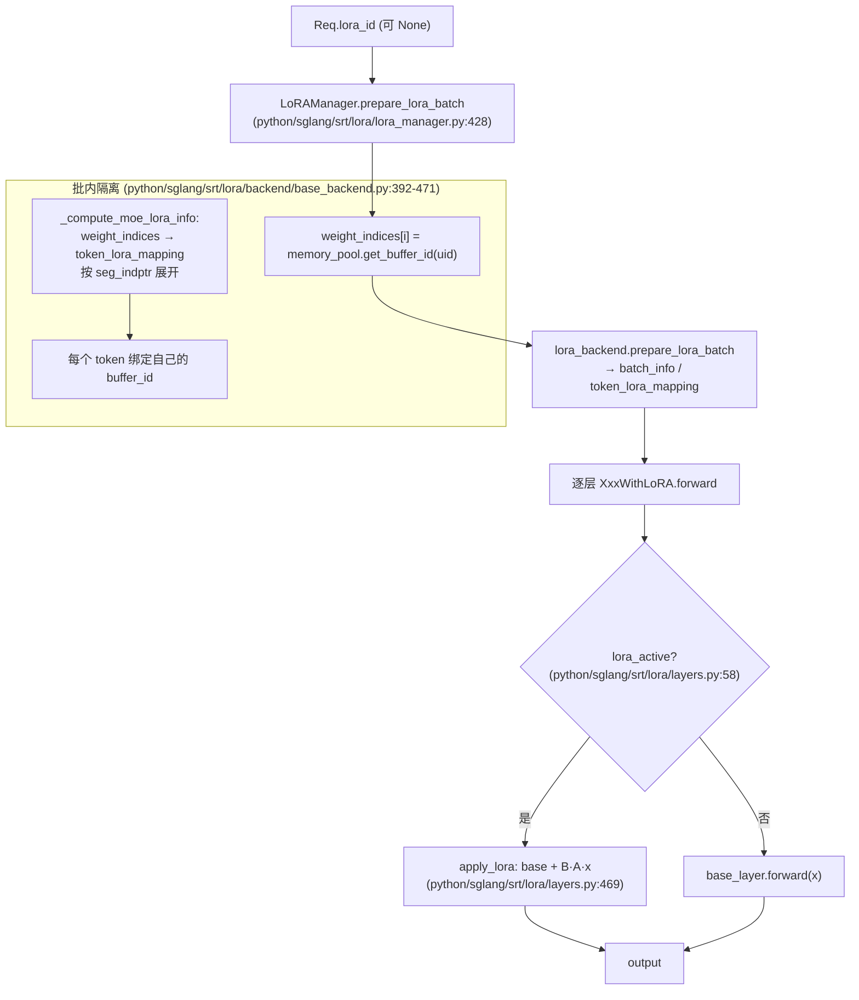
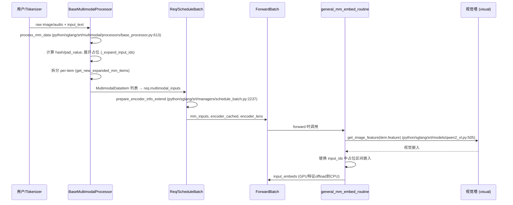
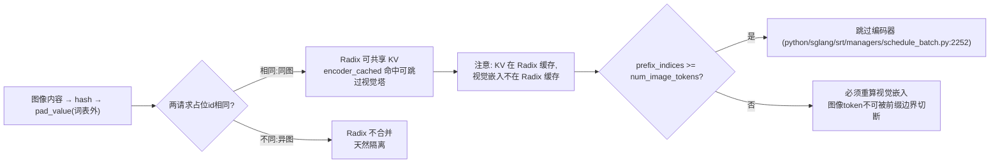

# LoRA 与多模态（Multimodal）机制深度解读

本文聚焦 SGLang 推理引擎中两条相对独立、但又常与调度器（Scheduler）、前缀缓存（RadixCache）和批次（Batch）紧密耦合的子系统：

1. **LoRA**：如何在同一个基座模型上，按请求（Req）动态加载多个适配器，并在前向时把 LoRA 旁路（bypass）叠加到基座层之上，实现“一个基座、多适配器并发服务”。
2. **多模态**：图像 / 视频 / 音频等原始数据如何被预处理、哈希、展开为占位 token、并作为 `MultimodalDataItem` 注入模型 `input_embeds`，以及它对前缀缓存与调度的特殊影响。

所有结论均来自本仓库 `e1c4db9621f7c4203ee9becd5d5456d4e6bf54f7` 的源码阅读，行号以 `Read` 实测为准。

---

## 一、LoRA：适配器加载、合并与批内切换

### What（是什么）

SGLang 的 LoRA 实现整合了 **S-LoRA**（千级并发 LoRA 服务）与 **Punica**（多租户 LoRA）的思想，核心由以下组件构成：

- `LoRAManager`（`python/sglang/srt/lora/lora_manager.py:59`）：适配器生命周期与每批元数据的管理者。
- 各类 `BaseLayerWithLoRA` 子类（`python/sglang/srt/lora/layers.py:34` 起）：把基座线性层（如 `ColumnParallelLinear`、`RowParallelLinear`、`FusedMoE`、`VocabParallelEmbedding`、`ParallelLMHead`）原地包装（wrap），在 `forward` 中按需叠加 `B·A·x` delta。
- `LoRAMemoryPool`（`python/sglang/srt/lora/mem_pool.py`）：把每个已加载适配器的 A/B 权重按 `buffer_id` 组织成连续显存缓冲，支持 `max_loras_per_batch` 个并发槽位与淘汰策略（eviction policy）。
- `BaseLoRABackend`（`python/sglang/srt/lora/backend/base_backend.py`）：执行 Triton sgemm 内核（`run_lora_a_sgemm` / `run_lora_b_sgemm` 等），并维护 `batch_info`、`token_lora_mapping`、`weight_indices`。

LoRA 权重**并不修改基座权重**，而是以 `output = base(x) + scaling · B · A · x` 的形式叠加。A 形状 `[rank, in]`，B 形状 `[out, rank]`，`rank` 受 `--max-lora-rank` 约束。

### Why（设计动机与权衡）

- **并发服务多适配器**：S-LoRA 思路是“一组适配器常驻显存、按 token 索引选择”。SGLang 把每个适配器放进 `LoRAMemoryPool` 的固定槽位（`uid_to_buffer_id`），前向时按请求/ token 选择对应槽位，避免每次请求都重新加载权重。
- **零拷贝包装**：`set_lora_module`（`python/sglang/srt/lora/lora_manager.py:874-878`）用 `replace_submodule` 把原模块替换成 `XxxWithLoRA` 包装层，基座权重张量复用，不额外占用显存（见 `python/sglang/srt/lora/lora_manager.py:917-921` 对 `tie_word_embeddings` 时 lm_head 的处理，仅共享 `weight` 张量）。
- **CUDA Graph 友好**：批级元数据（`weight_indices` / `lora_ranks` / `scalings`）在图捕获时为静态张量，重放时做原地更新（`prepare_lora_batch` 的 `use_cuda_graph` / `use_prefill_cuda_graph` 分支，`python/sglang/srt/lora/lora_manager.py:432-463`）。
- **权衡**：`max_loras_per_batch` 同时限制“显存槽位数”与“单批可出现的不同适配器数”。被 pin 的适配器不能占满全部槽位，否则会导致未 pin 适配器饿死（`python/sglang/srt/lora/lora_manager.py:307-313`）。

### How（关键代码路径）

#### 1) 加载一个适配器

入口 `LoRAManager.load_lora_adapter` → `_load_lora_adapter`（`python/sglang/srt/lora/lora_manager.py:221-268`）：

- 先构造 `LoRAConfig` 并 `validate_new_adapter`（`python/sglang/srt/lora/lora_manager.py:270-313`）：拒绝**增加词表 token 的 LoRA**（`lora_added_tokens_size > 0`，`python/sglang/srt/lora/lora_manager.py:274-277`）与 **DoRA**（`python/sglang/srt/lora/lora_manager.py:279-282`），并校验 rank / target_modules 是否与当前 `LoRAMemoryPool` 兼容。
- 再 `load_lora_weights`（`python/sglang/srt/lora/lora_manager.py:767-781`）：构造 `LoRAAdapter` 并 `initialize_weights()`，权重先驻留 **CPU 内存**（`self.loras`）。

#### 2) 把适配器装入显存池并绑定到层

- `init_memory_pool`（`python/sglang/srt/lora/lora_manager.py:852-872`）创建 `LoRAMemoryPool`，并先 `fetch_new_loras({None})` 把基座（无 LoRA）也作为一个槽位。
- `fetch_new_loras`（`python/sglang/srt/lora/lora_manager.py:392-412`）调用 `memory_pool.prepare_lora_batch(...)`，把 `self.loras` / `self.lora_modules` 中对应适配器的权重拷贝进 `A_buffer` / `B_buffer`，并建立 `uid_to_buffer_id` 映射；新装入的槽位会触发 `_notify_lora_slots_updated`（`python/sglang/srt/lora/lora_manager.py:414-419`）通知各 LoRA 层刷新。
- `update_lora_info`（`python/sglang/srt/lora/lora_manager.py:468-551`）用 `memory_pool.get_tensor(target_module, layer_id, lora_type)` 取出张量，调用每层的 `set_lora_info(A, B)`，把缓冲指针注入包装层。
- `init_lora_modules`（`python/sglang/srt/lora/lora_manager.py:880-1009`）遍历 `base_model.named_modules()`：凡是名字末段命中 `self.target_modules` 的线性层，或整体是 `FusedMoE` 且 `gate_up_proj`/`down_proj` 在 target 中，就用 `get_lora_layer`（`python/sglang/srt/lora/layers.py:1291-1313`）选对应包装类并 `replace_submodule` 原地替换。

#### 3) 每批前向：决定“谁用哪个适配器”

`LoRAManager.prepare_lora_batch`（`python/sglang/srt/lora/lora_manager.py:428-466`）是调度器在每次 `run_batch` 时调用以填充批级元数据的关键函数：

- 输入 `forward_batch.lora_ids`（每个 Req 一个 lora_id，可为 `None` 表示用基座）。
- 构造 `weight_indices[i]`：第 i 个请求对应的 `buffer_id`（`memory_pool.get_buffer_id(uid)`，`python/sglang/srt/lora/lora_manager.py:446-453`）。
- `lora_ranks[buffer_id]` / `scalings[buffer_id]` 记录该适配器的 rank 与缩放系数。
- 调用 `lora_backend.prepare_lora_batch(...)` 把上述元数据写入 `batch_info`，并最终算出 `has_active_lora`（`python/sglang/srt/lora/lora_manager.py:464-466`）。

#### 4) 层内旁路与按 token 选择

包装层通过 `lora_active`（`python/sglang/srt/lora/layers.py:58-64`）判断是否走 LoRA 路径：

```python
@property
def lora_active(self) -> bool:
    return self.set_lora and self.lora_backend.batch_info is not None
```

注意：当 `batch_info is None`（例如 DP-attention 空闲前向）时强制走基座路径，避免读到上一批的过期元数据（`python/sglang/srt/lora/layers.py:231-237`、`python/sglang/srt/lora/lora_manager.py:421-426` 的 `reset_lora_batch`）。

以 `ColumnParallelLinearWithLoRA` 为例（`python/sglang/srt/lora/layers.py:439-495`）：

```python
def forward(self, input_):
    output_parallel = self.base_layer.quant_method.apply(self.base_layer, input_, bias)
    if self.lora_active:
        output_parallel = self.apply_lora(output_parallel, input_)
    ...
def apply_lora(self, base_output, x):
    lora_a_output = self.lora_backend.run_lora_a_sgemm(x, self.A_buffer)
    lora_output = self.lora_backend.run_lora_b_sgemm(
        x=lora_a_output, weights=self.B_buffer,
        output_offset=self.output_offset, base_output=base_output)
    return lora_output
```

即 `output = base + B·A·x`，其中 A/B 来自 `set_lora_info` 注入的 `A_buffer` / `B_buffer`。

**按 token 隔离的核心**在 `BaseLoRABackend`：每个请求对应一个 `weight_indices` 槽位，`_compute_moe_lora_info`（`python/sglang/srt/lora/backend/base_backend.py:392-471`）把“请求级”的 `weight_indices` 通过 `seg_indptr` 展开为“token 级”的 `token_lora_mapping`（`torch.index_select(weight_indices, 0, req_indices)`，见 `python/sglang/srt/lora/backend/base_backend.py:467-469`）。TP 切分时 A 通常保持未分片（`slice_lora_a_weights` 返回原张量，如 `python/sglang/srt/lora/layers.py:497-498`），B 沿输出维按 TP rank 切片（如 `python/sglang/srt/lora/layers.py:500-506`）。

#### 5) MoE 的 LoRA 合并点

`FusedMoEWithLoRA`（`python/sglang/srt/lora/layers.py:931-1188`）不是把 LoRA 当独立项相加，而是把 delta 融进 MoE 计算内部：`gate_up` 之后、激活之前加一次，`down` 之后、最终归约之前再加一次（`python/sglang/srt/lora/layers.py:1119-1122`、`_forward_with_lora` `python/sglang/srt/lora/layers.py:1133-1182`）。它通过 `_get_lora_info`（`python/sglang/srt/lora/layers.py:1067-1113`）构建 `LoRAInfo`（`seg_indptr` / `req_to_lora` / `token_lora_mapping` / `lora_ranks` 等），交给 `MoeRunner` 的 LoRA 内核。

### 坑（LoRA）

- **不支持新增词表的 LoRA 与 DoRA**：`validate_new_adapter` 直接拒绝（`python/sglang/srt/lora/lora_manager.py:274-282`）；`VocabParallelEmbeddingWithLoRA.extra_token_embedding` 当前仍是 `NotImplementedError`（`python/sglang/srt/lora/layers.py:183-206`）。
- **批内不同适配器靠 `max_loras_per_batch` 隔离**：`validate_lora_batch`（`python/sglang/srt/lora/lora_manager.py:361-390`）校验单批不同 lora_id 数量不超过槽位数；pin 适配器过多会饿死其它请求。批内每 token 通过 `token_lora_mapping` 严格绑定自己的 `buffer_id`，**不会串扰**。
- **DP-attention 空闲前向必须 `reset_lora_batch`**：否则包装层会读到上一批 `batch_info` 导致错误叠加（`python/sglang/srt/lora/lora_manager.py:421-426`）。
- **CUDA Graph 与 LoRA 的组合限制**：MoE LoRA 与 DP-attention 下禁用 prefill CUDA graph（`python/sglang/srt/lora/lora_manager.py:157-192`）。
- **视觉塔默认不套 LoRA**：VL 模型通过 `should_apply_lora` 跳过 `visual` 前缀的模块（如 `python/sglang/srt/models/qwen2_vl.py:537-539`），LoRA 只作用于语言模型部分。

---

## 二、多模态：预处理、占位展开与特征注入

### What（是什么）

多模态输入在 SGLang 中以 **`MultimodalDataItem`** 为最小单元（`python/sglang/srt/managers/schedule_batch.py:317-440`）：

```python
class MultimodalDataItem:
    modality: Modality                 # IMAGE / VIDEO / AUDIO
    hash: int = None                   # 数据内容哈希（用于 radix 缓存）
    pad_value: int = None              # 由 hash 推导，作为占位 token id
    offsets: Optional[list] = None     # 在 input_ids 中的占位区间
    feature: Union[torch.Tensor, np.ndarray] = None        # 处理器原始特征
    precomputed_embeddings: ... = None                  # 或预计算好的嵌入
    model_specific_data: dict = ...    # 模型专属字段（如 image_grid_thw）
```

每个 item 拥有**独立的 hash 与 pad_value**，因此可以实现“每张图单独的前缀缓存”（`python/sglang/srt/managers/schedule_batch.py:322` 注释）。

### Why（设计动机与权衡）

- **占位 token 即数据指纹**：`pad_value = _compute_pad_value(hash)`，占位 token id 落在模型词表之外（`python/sglang/srt/managers/schedule_batch.py:1983` 注释称其为 “hash tokens that lie outside the model vocab”）。这样两个请求只要图像内容不同，占位 id 就不同，前缀树不会错误合并它们的 KV 缓存——天然隔离。
- **避免重分词漂移**：开启 `SGLANG_MM_AVOID_RETOKENIZE` 时，保留用户原始 token，仅把第 i 个图像占位扩展成 `counts[i]` 个占位（`_expand_input_ids`，`python/sglang/srt/multimodal/processors/base_processor.py:1501-1535`），丢弃 HF 处理器重分词结果。
- **按图拆分提升缓存粒度**：`get_new_expanded_mm_items`（`python/sglang/srt/multimodal/processors/base_processor.py:1693-1695`）把“整段多图”拆成“每图一个 item”，使相同图像在不同请求间更易命中前缀/编码器缓存。
- **跨进程传输**：`use_cuda_ipc` 下用有界 CUDA-IPC 池包装 GPU 特征，调度器侧再拷贝并释放（`python/sglang/srt/multimodal/processors/base_processor.py:1706-1710`）。

### How（关键代码路径）

#### 1) 预处理：原始数据 → processor → items

`BaseMultimodalProcessor.process_mm_data`（`python/sglang/srt/multimodal/processors/base_processor.py:613-694`）用 transformers `AutoProcessor.__call__` 把图像/视频/音频转成 `pixel_values`、`audio_features` 等特征张量；随后 `process_and_combine_mm_data`（`python/sglang/srt/multimodal/processors/base_processor.py:1537-1704`）：

- 分类 raw / dict / precomputed 三类输入；
- 对 raw 图像调用 `_process_and_collect_mm_items` 拿到 `mm_items` 与展开后的 `input_ids`；
- 为每个 item 计算 `offsets`（`get_mm_items_offset`，`python/sglang/srt/multimodal/processors/base_processor.py:1681-1690`），即占位在 `input_ids` 中的区间；
- 调用 `get_new_expanded_mm_items` 拆分，并对 `PROCESSOR_OUTPUT` / `PRECOMPUTED_EMBEDDING` 格式的 item 做 `set_pad_value()`（`python/sglang/srt/multimodal/processors/base_processor.py:1697-1704`）。

编码器侧若需要“仅在本视觉 DP rank 物化”，可用 `EncoderPreprocessOutput`（`python/sglang/srt/multimodal/encoder_preprocessing.py:33-110`）携带 `mm_items`，其 `local_item_indices` / `materialize_for_rank` 按 `get_dp_encoder_lb_assignment`（`python/sglang/srt/multimodal/mm_utils.py:420`）做负载均衡分配。

#### 2) 进入调度：存入 Req / ScheduleBatch

预处理后的 `MultimodalDataItem` 列表封装进请求的 `multimodal_inputs`（`python/sglang/srt/managers/schedule_batch.py:2155`）。每个 prefill 批次构造时，`prepare_encoder_info_extend`（`python/sglang/srt/managers/schedule_batch.py:2237-2257`）逐请求计算：

```python
encoder_lens_cpu.append(im.num_image_tokens)
encoder_cached.append(
    self.forward_mode.is_decode()
    or len(req.prefix_indices) >= im.num_image_tokens
)
```

即：**只有解码阶段，或图像 token 已完全落在命中前缀内，才认为编码器结果已缓存、可跳过编码器**——否则必须重新跑视觉塔。随后这些字段进入 `ForwardBatch`（`python/sglang/srt/model_executor/forward_batch_info.py:497-498`、`832-834` 的 `mm_inputs` / `encoder_cached`）。

#### 3) 前向注入：特征放进 input_embeds

模型 `forward` 调用 `general_mm_embed_routine`（`python/sglang/srt/managers/mm_utils.py:609-736`）：

- 仅当“非解码 / 非 target_verify 且 `contains_mm_inputs()`”时进入多模态分支；
- 经 `embed_mm_inputs`（或自适应分流的 `_embed_mm_inputs_with_split`）把每个 item 的 `feature` 用 `get_image_feature` 等模型方法编码为视觉嵌入，并**替换** `input_ids` 中对应占位区间的嵌入（`python/sglang/srt/multimodal/mm_utils.py:642-685`）；
- 完成后把 GPU 特征 offload 到 CPU 以便 chunked-prefill 后续分片复用（`python/sglang/srt/managers/mm_utils.py:698-718`），并清空 `forward_batch.mm_inputs`。

以 Qwen2-VL 为例（`python/sglang/srt/models/qwen2_vl.py:505-514`）：

```python
def get_image_feature(self, items):
    pixel_values = torch.cat([item.feature for item in items], dim=0)
    image_grid_thw = torch.concat([item.image_grid_thw for item in items], dim=0)
    return self.visual(pixel_values, grid_thw=image_grid_thw)
```

### 坑（多模态）

- **占位 token 在词表之外**：前缀树按 token id 匹配，因此不同图像的占位 id 不同 → 不会误前缀合并（隔离）。但也意味着**相同图像 + 不同文本**仍可共享前缀（占位 id 相同），此时 KV 与编码器输出均可复用。
- **与 Radix 前缀复用的冲突**：RadixCache 只缓存 KV，**不缓存视觉嵌入**。当某个前缀被命中、且其内部包含图像占位 token 时，不能在“仅前向新 token”的 extend 中重新产生这些图像嵌入——这正是 `encoder_cached` 用 `len(req.prefix_indices) >= num_image_tokens` 来判定的原因（`python/sglang/srt/managers/schedule_batch.py:2252-2255`）。若图像被 chunked-prefill 切到“部分在命中前缀、部分在新片段”，既无法整体跳过也无法整体重算，需要上游保证图像 token 不被前缀边界切断。
- **DP-attention 下编码器负载均衡**：`get_dp_encoder_lb_assignment`（`python/sglang/srt/multimodal/mm_utils.py:420`）按 item 大小做均衡分配，并用 `local_item_indices` 确保每 rank 只物化自己负责的图像，否则 `EncoderPreprocessOutput.materialize_for_rank` 会越界报错（`python/sglang/srt/multimodal/encoder_preprocessing.py:66-85`）。
- **LoRA 与多模态的边界**：视觉塔不参与 LoRA（`should_apply_lora` 跳过 `visual`），但语言模型部分仍可套 LoRA；若同时开 LoRA 与多模态，需注意两者的 `target_modules` 不应覆盖到视觉相关子模块。
- **特征张量形状必须一致**：`materialize_multimodal_features`（`python/sglang/srt/multimodal/mm_utils.py:61-111`）要求所有 item 在除首维外形状一致，否则报错——不同分辨率图像经 anyres 展开后 patch 数不同是允许的（仅首维不同）。

---

## 三、综合图示

### 3.1 LoRA 旁路与批内多适配器隔离



### 3.2 多模态注入流程



### 3.3 多模态与 Radix 前缀复用的关系



---

## 四、关键 API 速查（签名与锚点）

- `LoRAManager.load_lora_adapter(self, lora_ref: LoRARef) -> LoRAUpdateOutput`（`python/sglang/srt/lora/lora_manager.py:221`）
- `LoRAManager.fetch_new_loras(self, new_loras: set, running_loras: set=set())`（`python/sglang/srt/lora/lora_manager.py:392`）
- `LoRAManager.prepare_lora_batch(self, forward_batch: ForwardBatch)`（`python/sglang/srt/lora/lora_manager.py:428`）
- `LoRAManager.init_lora_modules(self)`（`python/sglang/srt/lora/lora_manager.py:880`）
- `BaseLayerWithLoRA.lora_active` 属性（`python/sglang/srt/lora/layers.py:58`）
- `ColumnParallelLinearWithLoRA.apply_lora(self, base_output, x)`（`python/sglang/srt/lora/layers.py:469`）
- `FusedMoEWithLoRA.forward(self, hidden_states, topk_output, **kwargs)`（`python/sglang/srt/lora/layers.py:1115`）
- `get_lora_layer(layer, lora_backend) -> BaseLayerWithLoRA`（`python/sglang/srt/lora/layers.py:1291`）
- `BaseMultimodalProcessor.process_mm_data(self, input_text, images=None, videos=None, audios=None, ...)`（`python/sglang/srt/multimodal/processors/base_processor.py:613`）
- `BaseMultimodalProcessor._expand_input_ids(original_ids, counts, placeholder_token_id)`（`python/sglang/srt/multimodal/processors/base_processor.py:1501`）
- `BaseMultimodalProcessor.process_and_combine_mm_data(...)`（`python/sglang/srt/multimodal/processors/base_processor.py:1537`）
- `MultimodalDataItem.set_pad_value(self)`（`python/sglang/srt/managers/schedule_batch.py:373`）
- `ScheduleBatch.prepare_encoder_info_extend(self, input_ids, seq_lens)`（`python/sglang/srt/managers/schedule_batch.py:2237`）
- `general_mm_embed_routine(input_ids, forward_batch, language_model, ...)`（`managers/mm_utils.py:609`）
- `Qwen2VLForConditionalGeneration.get_image_feature(self, items)`（`python/sglang/srt/models/qwen2_vl.py:505`）

> **[OPEN]** 关于 RadixCache 对“图像占位 token（词表外 hash）”的确切处理：当前 `mem_cache/radix_cache.py` 内未检索到对 multimodal / `pad_value` 的特殊分支（已在 `radix_cache.py` 全文 grep 无命中），因此前缀匹配完全依赖 token id 字面相等。需要结合 `tree_cache.match_prefix` 在含图像 token 的具体路径上进一步确认：当命中前缀边界恰好落在图像占位区间内部时，调度器/`extend` 是否额外保证图像 token 不被切断、以及 `encoder_cached` 的 `len(prefix_indices) >= num_image_tokens` 判定是否为唯一防线。详见附录 `_openq_lora-multimodal.md`。
