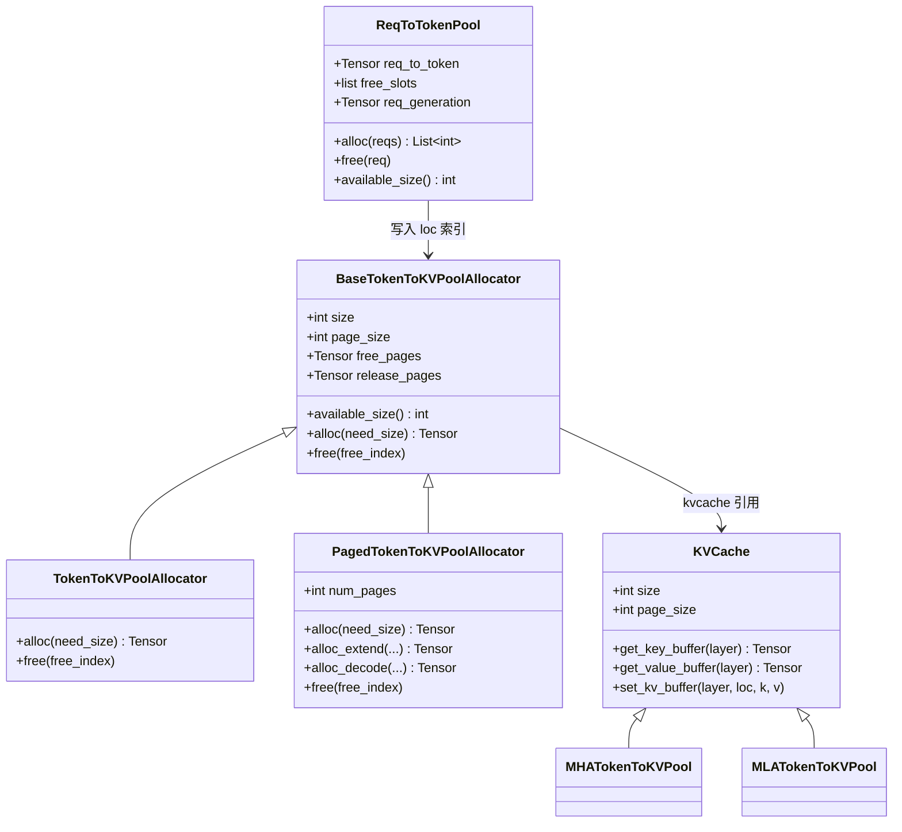
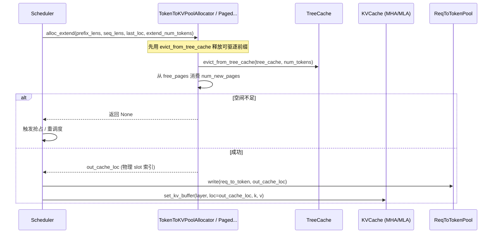
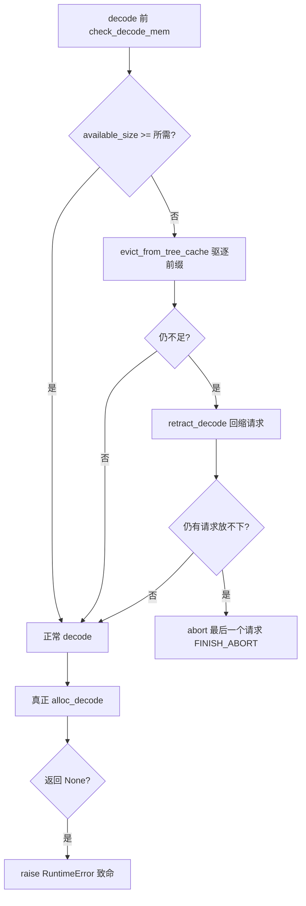

# KV Cache 内存池（Memory Pool）深度解析

> 本文档基于 SGLang 源码 SSOT（`/home/kimmo/develop/sglang`，对齐 commit `e1c4db9621f7c4203ee9becd5d5456d4e6bf54f7`）撰写，所有结论均来自源码阅读。

## 1. What：内存池是什么

SGLang 的 KV cache 显存管理是一个**两级（two-level）内存池**。模块顶部的文档字符串明确了这一抽象：

```
SGLang has two levels of memory pool.
ReqToTokenPool maps a request to its token locations.
TokenToKVPoolAllocator manages the indices to kv cache data.
KVCache actually holds the physical kv cache.
```
证据锚点：`python/sglang/srt/mem_cache/memory_pool.py#L15-L21`

三个核心角色的职责边界如下：

| 角色 | 类名 | 职责 |
| --- | --- | --- |
| 请求 → token 映射表 | `ReqToTokenPool`（及 `HybridReqToTokenPool` 等子类） | 为每个请求分配一个 `req_pool_idx`，并把该请求的每个逻辑 token 位置映射到物理 KV slot 索引 |
| 物理 KV slot 分配器 | `BaseTokenToKVPoolAllocator` 及其子类 `TokenToKVPoolAllocator` / `PagedTokenToKVPoolAllocator` 等 | 维护一个“空闲物理 slot 索引”列表，向上层提供 `alloc` / `free` 接口 |
| 物理 KV 显存载体 | `KVCache` 及其子类 `MHATokenToKVPool` / `MLATokenToKVPool` 等 | 真正持有形状为 `(size(+page_size), ...)` 的 K/V 显存张量 |

关键认知：**分配器只管理“索引”（一个 int64 张量上的 slot 编号），并不持有显存**；真正占用显存的是 `KVCache` 的 buffer 张量。分配器与 `KVCache` 通过构造参数 `kvcache` 关联，分配出来的 slot 索引直接作为 `KVCache.set_kv_buffer` 的 `loc` 写入位置。



`KVCache` 基类构造时固化了 `size`、`page_size`、`dtype`、`layer_num` 等字段；其中 `page_size` 是贯穿全文的核心参数，它决定了分配器是“按 token”还是“按 page”粒度工作。

证据锚点：`python/sglang/srt/mem_cache/memory_pool.py#L1624-L1653`

---

## 2. Why：为什么这样设计

### 2.1 两级解耦的动机

把“请求级元数据”（哪个请求、哪些 token）与“物理显存槽位”分离，带来两个收益：

1. **前缀复用（radix cache）**：`TreeCache` 可以把一个请求的某些 token 的物理 slot 直接复用给另一个请求，而无需复制 KV 数据。复用本质上就是让两个 `req_pool_idx` 在 `req_to_token` 表中指向相同的物理 slot 索引——这只有“索引与显存分离”才能廉价实现。
2. **统一分配语义 + 多后端显存布局**：分配器只关心“整数 slot 索引”，而 `KVCache` 子类负责把这些索引解释成 NHD / HND / page-major / MLA 等不同物理布局。`page_size` 的差异被隔离在分配器层与 `KVCache` 层的边界内。

### 2.2 为什么 slot 0 被保留（padding slot）

两个池子都刻意把索引 `0` 排除在可分配范围之外：

- `ReqToTokenPool.__init__` 中 `_alloc_size = size + 1`，`free_slots` 从 `1` 开始（`python/sglang/srt/mem_cache/memory_pool.py#L273-L282`）。
- `TokenToKVPoolAllocator.clear` 中 `free_pages = torch.arange(1, self.size + 1)`（`python/sglang/srt/mem_cache/allocator/token.py#L42-L46`）。

原因注释写明：cuda-graph 的 padding batch 默认把 `req_pool_idx` / KV slot 置为 `0`，dummy token 的读写会落到 slot 0，“harmlessly”地落在保留区，不会破坏真实数据。

### 2.3 为什么需要 paged 与非 paged 两种分配器

`KVCacheConfigurator._build_token_to_kv_pool_allocator` 根据 `get_schedule().page_size` 选择分配器类型：

- 当 `page_size == 1 and not get_parallel().dcp_enabled` 时，使用**非 paged** 的 `TokenToKVPoolAllocator`；
- 否则使用** paged** 的 `PagedTokenToKVPoolAllocator`（其 `page_size = get_schedule().page_size`）。

证据锚点：`python/sglang/srt/mem_cache/kv_cache_configurator.py#L1611-L1724`

`page_size > 1` 来自 `--page-size` 等调度参数（典型用于 sliding-window attention 等需要页式管理的场景，如 DSV4-NPU 要求 `page_size == 256`）。paged 分配器能让一次分配的输出“页对齐”，从而与某些注意力后端（如 `trtllm_mha`、HiCache 的分层页表）直接对接；非 paged 则是 `page_size == 1` 的退化形式，分配最小粒度即为单个 token，逻辑最简单。

> **[OPEN]** `PagedTokenToKVPoolAllocator` 在非 DCP 路径下的 `page_size` 来自 `get_schedule().page_size`，但 `dcp_enabled` 时 `allocator.page_size` 会被放大为 `page_size * dcp_size`（见 `kv_cache_builder.py` 中 `params.page_size` 的处理）。dcp 与 paged 同时启用时两段代码如何协调 `free_pages` 的真实容量，本文档尚未逐行验证，需进一步确认 `MultiEndedAllocator` 的行为。

### 2.4 为什么没有引用计数，而是显式 free

与某些推理引擎的“KV 引用计数”不同，SGLang 的三元结构中 `free` 是**调用方显式负责**的：请求结束、`TreeCache` 驱逐节点、或 scheduler 回缩时都会主动调用分配器与 `ReqToTokenPool` 的 `free`。这种做法的代价是释放责任必须精确配对（否则出现悬空 slot 或 double-free），收益是分配/释放路径无原子计数开销，且前缀复用由 `TreeCache` 的锁（`lock` / `cache_protected_len`）而非引用计数来表达“不可驱逐”。换句话说，**引用语义被上推到了 radix tree 的锁机制，分配器本身保持无状态、纯索引管理**。这也是为什么 `alloc` 只做“弹出空闲索引”，`free` 只做“归还索引”，二者都不感知“谁还在用”。

此外，三层对象最终被打包进 `KVCacheConfigResult`（`req_to_token_pool` / `token_to_kv_pool` / `token_to_kv_pool_allocator` / `memory_pool_config` 等字段），由 `KVCacheConfigurator.configure` 在模型加载后统一初始化并返回给 scheduler，作为全局唯一的内存池句柄。
证据锚点：`python/sglang/srt/mem_cache/kv_cache_configurator.py#L166-L181`、`python/sglang/srt/mem_cache/kv_cache_configurator.py#L263-L294`

---

## 3. How：关键代码路径

### 3.1 ReqToTokenPool：请求 → 物理 slot 的映射表

`ReqToTokenPool` 持有一个二维张量 `req_to_token`，形状 `(size + 1, max_context_len)`，行号即 `req_pool_idx`，列号即该请求内的逻辑 token 位置，单元格值即物理 KV slot 索引。

- `alloc(reqs: list[Req]) -> Optional[List[int]]`：从 `free_slots` 尾部弹出 `need_size` 个 `req_pool_idx`，写入 `r.req_pool_idx` 并对 `req_generation` 自增（用于检测 stale 引用）。若 `need_size > len(self.free_slots)` 返回 `None`。注意它支持 chunked-prefill 续跑：`req_pool_idx` 已非 `None` 的请求会复用原 slot，不重复占用。
  证据锚点：`python/sglang/srt/mem_cache/memory_pool.py#L291-L323`
- `free(req: Req)`：把 `req.req_pool_idx` 归还 `free_slots` 并置 `None`。
  证据锚点：`python/sglang/srt/mem_cache/memory_pool.py#L325-L328`
- `write(indices, values)`：即 `self.req_to_token[indices] = values`，是注意力层把 `out_cache_loc`（来自分配器）落到映射表的写入点。
  证据锚点：`python/sglang/srt/mem_cache/memory_pool.py#L285-L286`

`available_size()` 返回 `len(self.free_slots)`，代表**还能接纳多少个新请求**（注意这是请求级预算，不是 KV token 预算）。Scheduler 用它在 `get_num_allocatable_reqs` 中夹紧最大并发：
证据锚点：`python/sglang/srt/managers/scheduler.py#L3149-L3152`

### 3.2 分配器：物理 slot 索引的 alloc / free

`BaseTokenToKVPoolAllocator.__init__` 维护两个张量：`free_pages`（可直接分配的页/槽索引）与 `release_pages`（延迟回收、待排序合并的索引），以及一个 `free_group` 机制用于“先收集、后统一释放”。
证据锚点：`python/sglang/srt/mem_cache/allocator/base.py#L27-L49`

`available_size()` 在基类返回 `(len(free_pages) + len(release_pages)) * page_size`（即“还有多少 token 容量”）；非 paged 子类 `TokenToKVPoolAllocator` 因为 `page_size == 1` 直接返回 `len(free_pages) + len(release_pages)`。
证据锚点：`python/sglang/srt/mem_cache/allocator/base.py#L57-L59`、`python/sglang/srt/mem_cache/allocator/token.py#L51-L53`

#### 非 paged（TokenToKVPoolAllocator，page_size == 1）

```python
def alloc(self, need_size: int):
    if self.need_sort and need_size > len(self.free_pages):
        self.merge_and_sort_free()
    if need_size > len(self.free_pages):
        return None                       # OOM：返回 None
    select_index = self.free_pages[:need_size]
    self.free_pages = self.free_pages[need_size:]
    return select_index
```
证据锚点：`python/sglang/srt/mem_cache/allocator/token.py#L55-L64`

`free` 在 `need_sort` 时把索引追加到 `release_pages`，否则直接回到 `free_pages`；`merge_and_sort_free` 会在下次分配前把 `release_pages` 合并并排序，保证 `free_pages` 单调，利于前缀复用时的地址连续性。
证据锚点：`python/sglang/srt/mem_cache/allocator/token.py#L66-L76`、`python/sglang/srt/mem_cache/allocator/base.py#L77-L83`

#### paged（PagedTokenToKVPoolAllocator，page_size > 1）

- `alloc(need_size)`：要求 `need_size` 页对齐，按 `num_pages = need_size // page_size` 从 `free_pages` 取页，再展开成 `page_size` 个连续索引返回（`out_pages[:, None] * page_size + arange(page_size)`）。不足时同样返回 `None`。
  证据锚点：`python/sglang/srt/mem_cache/allocator/paged.py#L149-L170`
- `alloc_extend(prefix_lens, prefix_lens_cpu, seq_lens, seq_lens_cpu, last_loc, extend_num_tokens, ...)`：在单个 Triton kernel（`alloc_extend_kernel`）里为每个请求计算“在已有前缀之后还要新分配哪些 slot”，按页从 `free_pages` 消费 `num_new_pages` 页；不足返回 `None`。这是 prefill 阶段的核心分配入口。
  证据锚点：`python/sglang/srt/mem_cache/allocator/paged.py#L172-L220`
- `alloc_decode(seq_lens, seq_lens_cpu, last_loc)`：decode 阶段每步每请求分配 1 个新 token（即可能需要 1 个新页的部分），同样返回 `None` 表示不足。
  证据锚点：`python/sglang/srt/mem_cache/allocator/paged.py#L222-L259`
- `free(free_index)`：paged 的关键在于**按页释放**——先 `torch.unique(free_index // page_size)` 取出被释放的页号，再交给 `_release_page_ids`，避免重复释放同一页。
  证据锚点：`python/sglang/srt/mem_cache/allocator/paged.py#L261-L268`

非 paged 的 `alloc_extend` / `alloc_decode` 在基类中直接 `raise NotImplementedError`，说明这两种“扩展式”分配接口只为 paged 语义设计。
证据锚点：`python/sglang/srt/mem_cache/allocator/base.py#L103-L107`

### 3.3 一次 prefill 分配的完整调用链



`alloc_extend` 的实际调用点位于 `mem_cache/allocation.py`：它会**高估**所需 token 数（`num_tokens = extend_num_tokens + len(seq_lens_cpu) * allocator.page_size`，即每个请求预留一整页，防止预算超卖），先 `evict_from_tree_cache` 再调用分配器。
证据锚点：`python/sglang/srt/mem_cache/allocation.py#L200-L237`

> **[OPEN]** 上文 `evict_from_tree_cache` 的具体驱逐策略（LRU / 按 `radix_eviction_policy`）与“驱逐后为何 `alloc_extend` 仍可能返回 None”的边界，本文档仅在调用层面确认，未深入 `evict_from_tree_cache` 内部实现，可作为后续补充。

### 3.4 KVCache：物理写入

`KVCache.set_kv_buffer(layer, loc, cache_k, cache_v)` 是抽象方法，`MHATokenToKVPool` 通过 `store_cache` / naive 写入把 K/V 落到 `get_key_buffer(layer_id)[loc]` / `get_value_buffer(layer_id)[loc]`。`loc` 正是分配器返回的 `out_cache_loc`。合法索引范围为 `[0, size + page_size)`，slot 0 为 padding 保留区。
证据锚点：`python/sglang/srt/mem_cache/memory_pool.py#L1714-L1722`、`python/sglang/srt/mem_cache/memory_pool.py#L2324-L2341`、`python/sglang/srt/mem_cache/memory_pool.py#L2447-L2449`

---

## 4. 显存预算与 OOM 处理

### 4.1 预算从哪来

`KVCacheConfigurator._derive_pool_sizes` 把 `MemoryPoolConfig.max_total_num_tokens` 换算成各池子容量（`max_total_num_tokens`、`full_*` / `swa_*` 子池、`c4_*` / `c128_*` 等），并乘以 `loc_space_scale`（如 DCP/TP 相关的位置空间放大系数）。
证据锚点：`python/sglang/srt/mem_cache/kv_cache_configurator.py#L311-L356`

显存总量的探测在 `_profile_available_bytes`：用 `get_available_gpu_memory` 减去 `slack_gb` 与多模态预留（`mm_reservation_gb`），得到可分配给 KV cache 的字节上限，再反推 `max_total_num_tokens`。这部分属于“显存预算”的上游，分配器只消费已确定好的 `size`。
证据锚点：`python/sglang/srt/mem_cache/kv_cache_configurator.py#L1769-L1801`

### 4.2 OOM 的接口契约

分配器与 scheduler 之间的 OOM 契约非常清晰：**`alloc` / `alloc_extend` / `alloc_decode` 在容量不足时返回 `None`，绝不抛异常**；是否“致命”由调用方决定。

1. **decode 阶段（致命路径）**：`alloc_decode` 返回 `None` 时，`allocation.py` 会记录“Decode out of memory. Try to lower your batch size.”并 `raise RuntimeError`。即 decode OOM 默认是**致命错误**，必须依赖 scheduler 在真正 decode 之前通过抢占腾出空间。
   证据锚点：`python/sglang/srt/mem_cache/allocation.py#L495-L534`

2. **decode 前的预算闸门（`check_decode_mem`）**：`ScheduleBatch.check_decode_mem` 先 `evict_from_tree_cache(tree_cache, num_tokens)` 释放可驱逐前缀，再用 `token_to_kv_pool_allocator.available_size() >= num_tokens` 判断是否放得下下一步 decode。
   证据锚点：`python/sglang/srt/managers/schedule_batch.py#L2799-L2804`

3. **scheduler 的抢占/回缩（`retract_decode`）**：当 `batch.check_decode_mem()` 为 `False` 时，scheduler 进入回缩循环——按 `_get_decode_retraction_order` 排序，逐个 `release_req` 释放请求与其 KV 占用，直到 `check_decode_mem()` 通过；若只剩 1 个请求仍放不下，则**优雅 abort** 该请求（`FINISH_ABORT`）而非崩溃。
   证据锚点：`python/sglang/srt/managers/scheduler.py#L3487-L3510`、`python/sglang/srt/managers/schedule_batch.py#L2806-L2840`

4. **prefill 阶段**：`alloc_extend` 返回 `None` 时由 scheduler 的调度逻辑决定是延迟该请求还是触发 tree-cache 进一步驱逐/抢占（结合 `schedule_policy` 中的 `alloc_extend` 预算估算）。



### 4.3 两本独立预算

需要强调：系统里有**两本独立预算**，不要混淆：

- `req_to_token_pool.available_size()`：还能接纳多少个**新请求**（行级 slot 预算）。
  证据锚点：`python/sglang/srt/managers/scheduler.py#L3150-L3152`
- `token_to_kv_pool_allocator.available_size()`：KV 池里还剩多少**token 容量**（显存预算）。
  证据锚点：`python/sglang/srt/managers/scheduler.py#L3491-L3504`

一个请求被接纳（行预算足够）不代表它能跑完（KV 预算可能在中途不足），因此 decode 阶段必须再有 `check_decode_mem` 这道闸门。

---

## 5. 坑与边界

1. **slot 0 永远不可分配**：任何把 `req_pool_idx == 0` 当作“有效请求”的假设都会出错——`0` 是 padding 保留号，`free_slots` 从 `1` 起。

2. **`free_group` 的延迟释放语义**：`free_group_begin` / `free_group_end` 之间多次 `free` 仅被收集到 `_copy_for_free_group`（clone 以防外部 mutation），到 `free_group_end` 才真正 `free`。若中途直接读取 `free_pages` 会看到“尚未回收”的假象。
   证据锚点：`python/sglang/srt/mem_cache/allocator/base.py#L63-L75`

3. **paged allocator 的页对齐约束**：`alloc(need_size)` 在 debug 模式下断言 `need_size % page_size == 0`；非对齐的 need_size 会导致分配出的索引跨页、与注意力后端的页表假设冲突。
   证据锚点：`python/sglang/srt/mem_cache/allocator/paged.py#L151-L154`

4. **`free` 必须按页去重**：paged 的 `free` 用 `torch.unique(free_index // page_size)` 防止同一页被多次释放写坏 `free_pages`；`free_segment` 则用 stride 切片避免 `torch.unique` 带来的 device sync（`free_segment` 注释明确说明此数据依赖形状会强制同步）。
   证据锚点：`python/sglang/srt/mem_cache/allocator/paged.py#L273-L303`

5. **decode OOM 是致命的**：`alloc_decode` 返回 `None` 直接抛 `RuntimeError`。这意味着“靠 scheduler 在 decode 当步才反应”是来不及的——必须先通过 `check_decode_mem` + `retract_decode` 把空间腾出来。换句话说，OOM 的“软处理”（抢占/回缩）发生在 decode **之前**，而非之后。

6. **MLA 与 MHA 的物理布局不同但索引语义一致**：`MLATokenToKVPool` 的 buffer 是 `(size + page_size, 1, kv_cache_dim)`，与 MHA 的 `(size + page_size, head_num, head_dim)` 形状不同，但两者都接受“从分配器拿到的 slot 索引”作为 `loc`，因此分配器层对两者一视同仁。
   证据锚点：`python/sglang/srt/mem_cache/memory_pool.py#L3932-L4053`

7. **`resize` 会重置整个空闲表**：`BaseTokenToKVPoolAllocator.resize` 修改 `size` / `num_pages` 后调用 `clear()`，会把所有已分配 slot 视为空闲——调用方必须保证此时没有进行中的请求，否则会发生 double-alloc。
   证据锚点：`python/sglang/srt/mem_cache/allocator/base.py#L109-L113`

---

## 6. 小结与交叉阅读

KV cache 内存池的本质是“**索引分配器 + 物理显存载体 + 请求映射表**”的三元结构：`ReqToTokenPool` 管理请求级行号，`TokenToKVPoolAllocator` / `PagedTokenToKVPoolAllocator` 管理物理 slot 索引的分配与回收（差异仅在 `page_size`），`KVCache` 子类持有真实显存并以 `loc` 索引写入。OOM 的契约是“分配器只返回 `None`，致命与否由 scheduler 决定”，decode 阶段的回缩（`retract_decode`）是防止 `alloc_decode` 致命化的唯一软处理窗口。

相关主题可进一步阅读：`deep-dive/radix-cache.md`（前缀复用如何与分配器协作）、`deep-dive/scheduler.md`（抢占与回缩的调度侧实现）、`deep-dive/attention.md`（slot 索引如何被注意力后端消费）。
