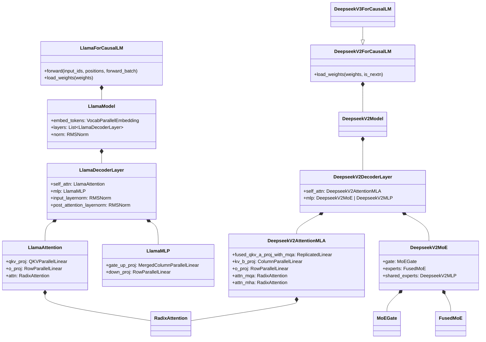

# 模型实现（Model Implementation）深度解析

> 本文档基于 SGLang 推理引擎源码（对齐 commit `e1c4db9621f7c4203ee9becd5d5456d4e6bf54f7`，2026-08-14）撰写。所有论断均来自源码阅读，并给出 `文件相对 SSOT 路径:L 行号区间` 形式的证据锚点。

## 1. What：模型接入规范

SGLang 把"一个可推理的模型"抽象为一个继承自 `torch.nn.Module` 的 Python 类，并在模块级用 `EntryClass` 列表声明该文件对外暴露的模型类。引擎在加载模型时，根据 HuggingFace `config.json` 的 `architectures` 字段匹配 `EntryClass` 中的类并实例化。

一个模型类**必须实现**的核心契约：

- `__init__(self, config, quant_config=None, prefix="")`：构建子层。注意 `prefix` 用于权重名前缀拼接（`add_prefix`），在流水线并行 / 张量并行下保证参数名全局唯一。见 `python/sglang/srt/models/llama.py:L518-L560`。
- `forward(self, input_ids, positions, forward_batch, ...)`：被 `ModelRunner` 在每次前向调用。签名通常为 `@torch.no_grad() def forward(input_ids, positions, forward_batch, input_embeds=None, pp_proxy_tensors=None)`。见 `python/sglang/srt/models/llama.py:L562-L596`。
- `load_weights(self, weights: Iterable[Tuple[str, torch.Tensor]])`：把 HF checkpoint 的 `(name, tensor)` 迭代器映射到模型参数。见 `python/sglang/srt/models/llama.py:L663-L668`。
- 可选钩子：`get_embed_and_head` / `set_embed_and_head`（词表复用、LoRA 等）、`set_eagle3_layers_to_capture`（投机解码辅助隐藏态捕获）、`get_input_embeddings`、`load_kv_cache_scales`（FP8 KV cache 缩放因子）。

引擎侧的入口 `get_model(*, model_config, load_config, device_config)` 会先通过 `get_model_loader` 取得 `BaseModelLoader`，再调用 `loader.load_model(...)` 完成实例化与权重加载。见 `python/sglang/srt/model_loader/__init__.py:L23-L33`。具体权重的逐张量拷贝由 `default_weight_loader` 完成（断言形状一致后 `param.data.copy_`）。见 `python/sglang/srt/model_loader/weight_utils.py:L1477-L1495`。

> **[OPEN]** 任务给定的必读文件清单包含 `python/sglang/srt/models/deepseek_v3.py`，但在本 commit 下该文件不存在（仅存在 `deepseek.py`、`deepseek_v2.py`、`deepseek_v4.py` 等）。DeepSeek-V3 / V3.2 实际以 `DeepseekV3ForCausalLM(DeepseekV2ForCausalLM)` 子类形式实现在 `deepseek_v2.py` 中，且其 MoE/MLA 主体逻辑全部复用于 `DeepseekV2ForCausalLM`。本文档按真实源码以 `deepseek_v2.py` 为准进行解读；若后续 commit 拆分出独立 `deepseek_v3.py`，需回填对照。

## 2. 模型类继承 / 组合关系（Mermaid）

下图展示本文涉及的关键真实类名及其组合关系。



## 3. Llama：基础稠密模型的逐层解读

### 3.1 整体结构（What / Why）

`LlamaForCausalLM` 组合一个 `LlamaModel`，后者持有 `embed_tokens`、`layers`（由 `make_layers` 构造的 `LlamaDecoderLayer` 列表）与末层 `norm`；最后接 `LogitsProcessor` 与 `lm_head`（`ParallelLMHead`，或 `tie_word_embeddings` 时复用 `embed_tokens`）。见 `python/sglang/srt/models/llama.py:L496-L542`。

`make_layers` 把"总层数"按 PP rank（`get_pp_indices`）切分，仅本 rank 负责的层会被真实构建，其余用 `PPMissingLayer` 占位，从而避免冗余显存占用。见 `python/sglang/srt/models/llama.py:L394-L411`。

**Why**：这种"外层 ForCausalLM 负责词表/head/logits，内层 Model 负责 transformer 主干"的拆分，让 PP 切分只需在 `LlamaModel` 内部处理 `pp_proxy_tensors` 的跨 rank 传递；并且 `LlamaForCausalLM` 的 `load_weights` 可复用给其他同构架构（如 `Phi3ForCausalLM`、`InternLM3ForCausalLM` 直接继承，见 `python/sglang/srt/models/llama.py:L918-L935`）。

### 3.2 逐行解读一层（`LlamaDecoderLayer.forward`）

签名：`def forward(self, positions, hidden_states, forward_batch, residual) -> (hidden_states, residual)`，见 `python/sglang/srt/models/llama.py:L341-L369`。

```python
# L349-L353：Pre-LN 残差分支。第一层 residual 为 None 时直接以输入作残差，
# 否则把 layernorm 与残差相加融合（fused residual），并把 qkv_proj 透传给
# layernorm 以支持量化路径的融合归一化。
if residual is None:
    residual = hidden_states
    hidden_states = self.input_layernorm(hidden_states, quant_linear=self.self_attn.qkv_proj)
else:
    hidden_states, residual = self.input_layernorm(
        hidden_states, residual, quant_linear=self.self_attn.qkv_proj)

# L358-L362：自注意力。positions 用于 RoPE，forward_batch 携带 KV cache /
# 批处理元数据。
hidden_states = self.self_attn(positions=positions, hidden_states=hidden_states, forward_batch=forward_batch)

# L365-L368：Post-LN + MLP。同样把 gate_up_proj 透传给 layernorm 以支持融合。
hidden_states, residual = self.post_attention_layernorm(
    hidden_states, residual, quant_linear=self.mlp.gate_up_proj)
hidden_states = self.mlp(hidden_states)
return hidden_states, residual
```

注意 `residual` 一路"携带"贯穿所有层，最后在 `LlamaModel.forward` 末尾由 `self.norm(hidden_states, residual)` 一起归一化（见 `python/sglang/srt/models/llama.py:L460`），这是 Pre-LN 架构的标准实现，避免每层重复存 `residual` 张量。

### 3.3 注意力如何对接 RadixAttention（How）

`LlamaAttention` 的三段式：`QKVParallelLinear` 把 `hidden_size` 投影到 `q/k/v` 并做 TP 切分；`get_rope` 生成旋转位置编码；`RadixAttention` 负责真正的注意力计算（含 PagedAttention / KV cache 管理）。见 `python/sglang/srt/models/llama.py:L184-L217`。

`forward` 关键路径：

```python
# L220-L223 forward_prepare_native：QKV 拆分 + RoPE
qkv, _ = self.qkv_proj(hidden_states)
q, k, v = qkv.split([self.q_size, self.kv_size, self.kv_size], dim=-1)
q, k = self.rotary_emb(positions, q, k)

# L262-L263：交给 RadixAttention 做带 KV cache 的注意力，再经 o_proj 投影回 hidden_size
attn_output = self.attn(q, k, v, forward_batch)
output, _ = self.o_proj(attn_output)
```

**Why / 坑**：`LlamaAttention` 不自己实现 attention kernel，而是把 `num_heads/head_dim/scaling/num_kv_heads/layer_id` 透传给 `RadixAttention`（`python/sglang/srt/models/llama.py:L209-L217`）。这意味着"注意力算法"与"模型结构"解耦——新增一种模型只需组装线性层与归一化，注意力后端（FlashAttention、分页缓存、MLA 等）由 `RadixAttention` 统一承载。TP 下 KV head 可能"少于 TP size"而被复制（`num_kv_heads = max(1, total // tp_size)`，见 `L162-L171`），这是 GQA/MQA 的常见坑。NPU 走 `forward_prepare_npu` 用 `split_qkv_rmsnorm_rope` 融合算子（见 `L225-L238`）。

### 3.4 MLP

`LlamaMLP` 由 `MergedColumnParallelLinear`（gate+up 合并投影）与 `RowParallelLinear`（down 投影）组成，中间用 `SiluAndMul` 激活。见 `python/sglang/srt/models/llama.py:L70-L119`。注意它只支持 `silu` 激活，否则抛 `ValueError`（见 `L104-L108`），这是 SGLang 对多数 LLM 的强假设。

## 4. DeepSeek-V3：MoE + MLA 的差异

DeepSeek-V3 复用 V2 文件，类名为 `DeepseekV3ForCausalLM`（仅 `pass`，见 `python/sglang/srt/models/deepseek_v2.py:L3220-L3221`），逻辑全部在 `DeepseekV2ForCausalLM`（`L2929`）。它和 Llama 的最大差异是：**注意力用 MLA（低秩压缩 KV），FFN 用 MoE（路由专家 + 共享专家）**。

### 4.1 MLA 注意力（What / How）

`DeepseekV2AttentionMLA` 把 KV 压缩到低秩空间，显著降低 KV cache 体积。关键线性层（`python/sglang/srt/models/deepseek_v2.py:L1779-L1872`）：

- `fused_qkv_a_proj_with_mqa`（`ReplicatedLinear`，不切分）：把 `hidden_size` 投影到 `q_lora_rank + kv_lora_rank + qk_rope_head_dim`，即把 Q 的下投影与 KV 的下投影融合。见 `L1780-L1786`。
- `q_a_layernorm` / `kv_a_layernorm`：对低秩表示做 RMSNorm。
- `q_b_proj` / `kv_b_proj`（`ColumnParallelLinear`，按 attn TP 切分）：把低秩表示上投影回各注意力头的维度。
- `o_proj`（`RowParallelLinear`）。

注意它**同时持有两套 `RadixAttention`**：`attn_mqa`（`num_kv_heads=1`，head_dim=`kv_lora_rank`，对应压缩后的 latent）与 `attn_mha`（`num_kv_heads=num_local_heads`，head_dim=完整 `qk_nope+v`，对应解压后的标准 MHA，用于某些后端）。见 `python/sglang/srt/models/deepseek_v2.py:L1893-L1925`。运行时由 forward mixin 选择其中一条路径。

> **[OPEN]** `DeepseekV2AttentionMLA` 同时继承 `DeepseekMHAForwardMixin`/`DeepseekMLAForwardMixin` 等多个 forward mixin（见 `deepseek_v2.py:L1711-L1718`），具体选择哪条 forward 路径依赖运行时后端与 `maybe_use_decode_attn_tp` 等上下文；其完整分派逻辑跨多个 mixin 文件，本文未逐一展开，建议后续补充 mla_forward 分派图。

**Why**：MLA 把每个 token 的 KV cache 从"多头高维"压缩为"单个低秩向量 + 一份 rope 分量"，从而在长上下文下大幅节省显存，是 DeepSeek 系列可扩展到 128K/256K 的关键。

### 4.2 MoE 专家层（What / How）

`DeepseekV2MoE` 是 V3 的 FFN 替代。见 `python/sglang/srt/models/deepseek_v2.py:L555-L845`。

- `MoEGate`（`L459`）：用 `nn.Parameter` 存 router 权重 `(n_routed_experts, hidden_size)`；forward 计算 router logits，并使用 `dsv3_router_gemm` 等特化 kernel（小 batch 走定制 GEMM，见 `L515-L552`）。
- `experts = get_moe_impl_class(quant_config)(...)`（`L647`）：真正的专家计算由 `FusedMoE`（或其量化子类）承担，`num_experts = n_routed_experts + ep_num_redundant_experts`。
- `topk`：默认 `TopK`（grouped noaux_tc），选出每 token 的 `num_experts_per_tok` 个路由专家（V3 为 8），并支持把共享专家也纳入 topk 计数（`L676-L711`）。
- `shared_experts`（`DeepseekV2MLP`，`L741`）：每个 token 都经过的"共享专家"，与路由专家结果相加。

**稀疏层判定**：`DeepseekV2DecoderLayer._is_layer_sparse`（`L2435-L2440`）规定——`is_nextn` 或 `n_routed_experts` 非空且 `layer_id >= first_k_dense_replace` 且 `layer_id % moe_layer_freq == 0` 的层才用 MoE，否则用稠密 `DeepseekV2MLP`。即 V3 前几层是稠密、其余是 MoE 的"混合"结构。

### 4.3 共享专家与 EP（专家并行）

**共享专家融合（fused shared experts）**：当满足能力/量化条件时，共享专家被"塞进" MoE kernel 作为额外的本地专家槽位——`num_experts_for_moe = n_routed_experts + moe_ep_size`，`top_k_for_moe = num_experts_per_tok + 1`（`deepseek_v2.py:L591-L600`）。`shared_experts_fusion_disable_reason`（`L3015-L3066`）给出了禁止该优化的全套条件（DeepEP 后端、SBO/TBO、非 256/384 专家数、非 CUDA/AMD 高算力平台等）。

**EP 在模型层的体现**：MoE 通过 `moe_ep_size = get_parallel().moe_ep_size` 感知专家并行度（`deepseek_v2.py:L571`）。当 A2A 后端为 DeepEP/Mooncake/NIXL/Mori/AscendFuseEP 时，类记录 `self.ep_size`、`self.num_experts` 并走 `forward_deepep`（`L812-L829`、`L927-L929`）；否则走 `forward_normal` / 双流图。EP 的核心语义是"每个 rank 只持有部分专家的物理权重"（通过 `experts.num_local_experts` 体现），token 经 all-to-all 在 rank 间分发/收集。`get_moe_weights`（`L846-L860`）为 EPLB（专家负载均衡）只暴露"物理路由专家"权重，并排除融合共享专家槽位。

> 关于 EP/TP/PP 在分布式运行时层面的完整机制（通讯组、`moe_ep_size` 与 `attn_tp_size` 的关系、DeepEP 调度），见 parallel 主题文档（见 architecture/parallelism.md）。本文仅描述模型层如何**感知并适配** EP。

## 5. 权重加载：HF checkpoint → 模型参数

### 5.1 通用机制（Llama）

`LlamaForCausalLM.load_weights` 在 `SGLANG_ENABLE_WEIGHT_LOADER_V2` 开启时走 `AutoWeightsLoader`（`_load_weights_v2`，`llama.py:L743-L779`），否则走 `_legacy_load_weights`（`L670-L741`）。

legacy 路径的核心是 `stacked_params_mapping`：HF 把 Q/K/V 拆成 `q_proj/k_proj/v_proj`，而模型里合并为 `qkv_proj`；把 gate/up 拆成 `gate_proj/up_proj`，模型里合并为 `gate_up_proj`。加载时把 checkpoint 的 shard 名替换为合并名，再用该参数的 `weight_loader` 按 `shard_id` 切分写入。见 `python/sglang/srt/models/llama.py:L543-L550`、`L714-L726`。

此外还做了多种健壮性处理：跳过 `rotary_emb.inv_freq`/`cos_cached`/`sin_cached`（非参数）、跳过 PP 范围外的层（`get_layer_id` + `start_layer/end_layer`，`L688-L697`）、把 FP8 的 `.activation_scale`/`.weight_scale_inv` 规整为内部命名（`L683-L686`）、以及 `maybe_remap_kv_scale_name` 处理 FP8 KV scale（`L709-L712`，定义见 `python/sglang/srt/model_loader/weight_utils.py:L1674-L1752`）。

### 5.2 DeepSeek 特化映射

`DeepseekV2WeightLoaderMixin.do_load_weights`（`python/sglang/srt/models/deepseek_common/deepseek_weight_loader.py:L152-L438`）更复杂：

- `expert_params_mapping`：通过 `FusedMoE.make_expert_params_mapping` 把 `mlp.experts.<id>.{gate,up,down}_proj` 映射到模型内部专家参数布局，并感知 `num_fused_shared_experts`（`deepseek_weight_loader.py:L177-L189`）。
- `fuse_qkv_a_proj`：当 `q_lora_rank` 非空时，把 HF 的 `q_a_proj` 与 `kv_a_proj_with_mqa` 两个权重**拼接**成模型的 `fused_qkv_a_proj_with_mqa`（按维度 cat，量化场景 cat_dim=1），见 `deepseek_weight_loader.py:L339-L405`。这与 3.1 节 MLA 的融合投影层一一对应。
- 共享专家融合时把 `mlp.shared_experts.*` 重映射到 `mlp.experts.<n_routed_experts>.*`（`L199-L224`）。
- 异步加载与线程池：`should_async_load` + `ThreadPoolExecutor` 并行提交 `weight_loader`（`L203-L300`）。

### 5.3 量化权重的处理（How / 坑）

- 量化配置由 `get_quant_config` 从 `hf_config.quantization_config` 或独立配置文件解析（见 `python/sglang/srt/model_loader/weight_utils.py:L262-L413`）。FP8 / modelopt / bitsandbytes / GGUF 各有分支。
- 量化张量的"分片加载器"：`row_parallel_weight_loader`、`sharded_weight_loader(shard_axis)` 在加载时按 `tp_rank` 切出本 rank 的权重分片（`weight_utils.py:L1498-L1547`）；`composed_weight_loader` 支持加载后做后处理（如反量化）。
- **坑**：默认 `default_weight_loader` 会断言 `param.size() == loaded_weight.size()`（`weight_utils.py:L1486-L1489`），形状不匹配会直接失败；TP 下的列/行并行权重必须通过各自的 `weight_loader` 正确切分，否则要么维度报错，要么静默加载错误分片。FP8 旧式 `kv_scale` 已被废弃并 remap 到 `k_scale`/`v_scale`（`weight_utils.py:L1691-L1709`）。
- 迭代器层：`safetensors_weights_iterator`/`pt_weights_iterator` 负责真正从磁盘读取张量，并支持 mmap、多线程、page-cache 预取（`weight_utils.py:L1073-L1280`），与 `load_weights` 解耦——前者管 IO，后者管"名字→参数"映射。

```mermaid
flowchart TD
    A[HF checkpoint 文件] --> B{safetensors?}
    B -- yes --> C[safetensors_weights_iterator<br/>mmap / 多线程 / 预取]
    B -- no --> D[pt_weights_iterator<br/>torch.load]
    C --> E[weights: Iterable[name, tensor]]
    D --> E
    E --> F[Model.load_weights<br/>name 映射 + 分片]
    F --> G{stacked / expert /<br/>fused-qkv 映射}
    G --> H[param.weight_loader<br/>按 tp_rank 切分]
    H --> I[default_weight_loader<br/>assert size + copy_]
    I --> J[模型参数就绪]
```

## 6. 坑与边界（Pitfalls）

1. **TP/KV head 复制**：当 `num_kv_heads < tp_size` 时 KV head 被复制而非切分（`python/sglang/srt/models/llama.py:L162-L171`），自定义模型若假设"总是切分"会出错。
2. **stacked params 必须先判专家**：legacy loader 在处理 `mlp.experts.*` 前必须 `continue` 跳过 stacked 映射，否则会把 `gate_proj`→`gate_up_proj` 后再被 expert 映射二次改写而崩溃（`python/sglang/srt/models/llama.py:L714-L726`、DeepSeek 同款注释 `python/sglang/srt/models/deepseek_common/deepseek_weight_loader.py:L279-L286`）。
3. **PP 层范围过滤**：`load_weights` 必须依据 `start_layer/end_layer` 跳过非本 rank 层，否则多卡下会尝试加载不存在的参数（`llama.py:L688-L697`）。
4. **tie_word_embeddings**：开启时 `lm_head` 复用 `embed_tokens`，loader 需跳过 `lm_head.weight` 并/或在 v2 路径显式拷贝（`llama.py:L706-L707`、`deepseek_v2.py:L769-L777`）。
5. **量化权重 dtype 对齐**：FP8/FP4/NVFP4 的张量布局（block scale、interleave）由各自 `weight_loader` 负责，模型层若错误地用 `default_weight_loader` 直接 copy 会因形状不符而报错。
6. **MLA 的双 RadixAttention**：`attn_mqa` 与 `attn_mha` 维度语义不同，后端切换时务必选对路径，否则 KV cache 形状与计算逻辑不匹配。

## 7. 小结

SGLang 的模型实现遵循"`*ForCausalLM`（词表/head/logits）+ `*Model`（transformer 主干）+ `*DecoderLayer`（残差/LN/子层）+ 子层（Attention/MLP/MoE）"的清晰分层，并把"注意力算法"下沉到 `RadixAttention`、把"量化/并行分片"下沉到各线性层的 `weight_loader`。新增模型只需组装这些积木并实现 `forward`/`load_weights`；DeepSeek-V3 则是该范式的进阶样例——MLA 压缩 KV、MoE + 共享专家 + EP 体现专家并行，全部复用自 `DeepseekV2ForCausalLM`。
