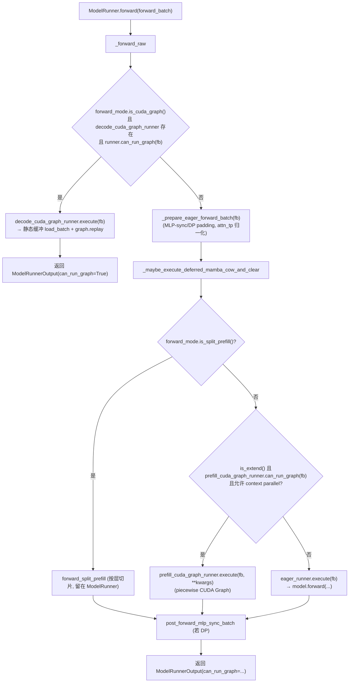

# ModelRunner 深度解析：模型前向的持有者与执行者

> 本文档基于 SSOT 提交 `e1c4db9621f7c4203ee9becd5d5456d4e6bf54f7`（2026-08-14）的本地源码撰写，所有论断均给出真实证据锚点。

## 1. What：ModelRunner 是什么

`ModelRunner` 是 SGLang 推理引擎中**真正持有模型权重、接收 `ForwardBatch`、执行一次前向、并把结果回传给调度器**的执行单元。它运行在每个模型 Worker（TP/PP rank、draft worker 等）的进程内，是 scheduler 与 HuggingFace 风格 `model.forward` 之间的唯一桥。

职责边界（从 `ModelRunner` 类定义与调用关系归纳）：

- **持有模型与全局资源**：`self.model`、`self.attn_backend`、`self.forward_stream`、`req_to_token_pool` / `token_to_kv_pool_allocator`、`self.sampler`、`lora_manager` 等，在 `__init__` 中完成分布式初始化、设备绑定、显存池分配与权重加载（`python/sglang/srt/model_executor/model_runner.py:285-L460`）。
- **接收 `ForwardBatch`**：由 scheduler 构造的 `ScheduleBatch` 经 `ForwardBatch.init_new` 转译为 GPU 张量为主、低层级数据的 `ForwardBatch`（见 `python/sglang/srt/model_executor/forward_batch_info.py:14-L26` 的文件头注释与 `ForwardBatch.init_new` 定义 `forward_batch_info.py:738-L974`）。
- **执行前向**：对外暴露的入口是 `ModelRunner.forward`（签名见下），内部经 `_forward_raw` 选择 CUDA Graph replay 或 eager 执行路径。
- **回收结果**：产出 `ModelRunnerOutput(logits_output=..., can_run_graph=...)`，并触发专家分布捕获、indexer 捕获、EPLB、dumper 等后处理（`model_runner.py:1569-L1604`）。

关键签名：

```python
# python/sglang/srt/model_executor/model_runner.py:1510
def forward(
    self,
    forward_batch: ForwardBatch,
    skip_attn_backend_init: Optional[bool] = None,   # deprecated，已迁移到 mark_forward_metadata_ready
    pp_proxy_tensors: Optional[PPProxyTensors] = None,
    reinit_attn_backend: bool = False,
    split_forward_count: int = 1,
) -> ModelRunnerOutput:
```

`ModelRunner` 本身不直接做 CUDA Graph 捕获，而是把该职责下放给一组 runner：`EagerRunner`、`DecodeCudaGraphRunner`、`PrefillCudaGraphRunner`（以及 CPU/NPU/XPU 变体）。三者都继承自 `BaseRunner`，统一实现 `can_run_graph(forward_batch)` 与 `execute(...)` 接口（见 `python/sglang/srt/model_executor/runner/base_runner.py:671-L681` 的抽象方法声明）。

## 2. Why：为什么需要这一层抽象

### 2.1 把"高层调度数据"与"低层张量数据"解耦

调度器（`Scheduler`）只关心请求级别的增删、KV 分配、chunk 切分，数据主要在 CPU 上（`ScheduleBatch`）。而 GPU 上跑前向需要的是一坨连续张量。若每层都直接读 `ScheduleBatch`，会有两个问题：

- 大量 host→device 拷贝与 Python 层遍历发生在热路径上；
- 无法复用"固定 shape 的静态缓冲区"来做 CUDA Graph。

因此 `ForwardBatch` 作为一次性转译产物，把 `ScheduleBatch` 里需要的字段（input_ids、req_pool_indices、seq_lens、out_cache_loc、sampling_info 等）以"引用别名 + 必要 H2D"的方式搬到 GPU，并补算位置、extend 元数据等（`forward_batch_info.py:738-L974`）。文件头注释明确写到：`ScheduleBatch` 由 `Scheduler` 管理、`ForwardBatch` 由 `ModelRunner` 管理（`forward_batch_info.py:18-L26`）。

### 2.2 用 runner 多态隔离"图 replay"与"eager"两种执行态

decode 步的 shape 是固定的（每请求 1 个 token，除非投机解码），天然适合 CUDA Graph 把整图录下来、每次只 `replay`，省掉 kernel launch 与 Python dispatch 开销。而 extend（prefill）步的 token 数多变，需要 eager 或 piecewise graph 兜底。把"是否可 replay"与"如何 replay"封装进 `can_run_graph` / `execute`，让 `_forward_raw` 的主干逻辑保持简洁（见下一节流程图）。

### 2.3 为什么 decode 走 CUDA Graph，prefill 走 piecewise / eager

固定 shape 是 CUDA Graph 的硬约束。decode 每步 token 数恒定，录制一次即可长期复用；prefill 的 token 数随请求长度变化，无法用单张固定图覆盖全部情形，因此 SGLang 提供 `FULL`（全图，仅限有限请求数/固定 bs）、`BREAKABLE`/`PIECEWISE`（分段图，按 token 桶组合 replay）、`tc_piecewise`（torch.compile 驱动的分段图）等 prefill 后端策略（见 `python/sglang/srt/model_executor/model_runner_components/cuda_graph_setup.py:296-L339` 对 prefill 各 bucket 的解析，以及 `python/sglang/srt/model_executor/runner/prefill_cuda_graph_runner.py:1081-L1137` 的 `can_run_graph` 按 `num_tokens` 选桶逻辑）。

## 3. How：关键代码路径

### 3.1 ForwardBatch 的构造与 prefill / decode 差异

入口是类方法 `ForwardBatch.init_new(batch, model_runner, *, capture_hidden_mode, return_hidden_states_before_norm)`（`forward_batch_info.py:738`）。它的核心规则：

- **不修改传入的 `ScheduleBatch`**：per-forward 的覆盖只能经由显式关键字参数，避免跨步污染（注释 `forward_batch_info.py:747-L748`）。
- **extend 专属字段在 decode/idle 下置空**：当 `batch.forward_mode.is_decode_or_idle()` 时，`extend_seq_lens` / `extend_prefix_lens` / `extend_logprob_start_lens` 全部为 `None`；否则从 `batch.extend_lens` / `batch.prefix_lens` 取（判断见 `forward_batch_info.py:767-L772`）。这是 prefill 与 decode 在 `ForwardBatch` 上最显著的结构差异——prefill 携带"每个请求的 prefix/extend 长度"用于变长 attention，decode 不需要。
- **位置计算路径不同**：
  - decode / target_verify：`positions = clamp_position(batch.seq_lens)`（即 `seq_len - 1`，单 token 位置），见 `forward_batch_info.py:905-L907`。
  - extend：根据 `extend_prefix_lens` / `extend_seq_lens` / `extend_num_tokens` 调用 `compute_position(...)` 得到每段起始位置 `extend_start_loc`（`forward_batch_info.py:909-L934`）。
- **执行的 forward_mode 取值**：由 `ForwardMode` 枚举决定（`forward_batch_info.py:98-L197`）。其中 `is_cuda_graph()` 在 `DECODE` / `TARGET_VERIFY` / `IDLE` / `DLLM_EXTEND` 时为真（`forward_batch_info.py:175-L181`），这正是 `_forward_raw` 判断是否走 decode 图 replay 的依据。

### 3.2 一次 forward 的完整流程（含 graph replay 分支）

`ModelRunner.forward` 只是薄封装：它处理 msprobe 调试、`step_span` 性能打点、KV-canary 上下文、弹性 EP 再平衡、专家/indexer 捕获后处理，真正的执行委托给 `_forward_raw`（`model_runner.py:1517-L1604`）。`_forward_raw` 的 dispatch 逻辑（`model_runner.py:1654-L1752`）如下：



关键判定细节：

- **decode 图 replay 分支**（`model_runner.py:1685-L1691`）：先算 `can_run_graph = mode_check() and self.decode_cuda_graph_runner and self.decode_cuda_graph_runner.can_run_graph(forward_batch)`，其中 `mode_check` 在 CPU 设备上是 `is_cpu_graph`、其余是 `is_cuda_graph`（`model_runner.py:1666-L1675`）。命中即调用 `decode_cuda_graph_runner.execute` 并直接返回，**不再做 eager padding**。
- **eager padding 兜底**（`model_runner.py:1699`）：只有非 decode-replay 的路径才调用 `_prepare_eager_forward_batch`，负责 DP/MLP-sync padding、attn_tp `num_token_non_padded` 归一化、hisparse 协调（见 `model_runner.py:1421-L1454`）。注释明确说明：decode 图路径提前返回，因为它已经预填充了静态缓冲（`model_runner.py:1693-L1698`）。
- **prefill 图分支**（`model_runner.py:1716-L1739`）：要求 `is_extend(include_draft_extend_v2=True)` 且 `prefill_cuda_graph_runner` 不是 `EagerRunner` 且 `can_run_graph(forward_batch)` 为真，并经过 `_prefill_cuda_graph_allows_context_parallel` 把关；命中则 `prefill_cuda_graph_runner.execute(...)`。
- **eager 兜底**（`model_runner.py:1742-L1744`）：上述都不满足时走 `eager_runner.execute`，内部再按 decode/idle/extend 分发到 `_execute_decode` / `_execute_idle` / `_execute_extend`（见 `python/sglang/srt/model_executor/runner/eager_runner.py:197-L347`）。

### 3.3 CUDA Graph 捕获（capture）时机

捕获发生在 **Worker 启动、首请求到来之前**，由 `ModelRunner.init_cuda_graphs` 触发（`model_runner.py:997-L1005`），它调用 `capture_cuda_graphs`（`cuda_graph_setup.py:89-L211`）。顺序很关键：

1. **先建 `EagerRunner`**（`cuda_graph_setup.py:110`）：在其 `__init__` 里 `warmup()` 预热 kernel 并分配"固定最大"的静态输入缓冲（`eager_runner.py:70-L140`）。这个缓冲是 canonical 的，后续 CUDA Graph runner 复用同一块共享池，避免重复分配。
2. **再捕获 prefill 图**（`cuda_graph_setup.py:166-L168`）：调用 `capture_prefill_graph`。若 prefill 后端被禁用，则把 `prefill_cuda_graph_runner` 指向 `EagerRunner`（`cuda_graph_setup.py:236-L247`），于是 prefill 永远走 eager。
3. **最后捕获 decode 图**（`cuda_graph_setup.py:177-L190`）：调用 `capture_decode_graph`，按 `get_batch_sizes_to_capture` 得到的 `capture_bs` 列表逐桶录制。

`capture_decode_graph` 在多种情况下整体放弃捕获（返回 `runner=None`）：非生成模型、MindSpore 后端、decode 后端被 `DISABLED`、CPU 且未开启 torch.compile 等（`cuda_graph_setup.py:419-L435`）。draft worker 通过 `capture_decode_cuda_graph=False` 跳过，改为自行捕获（见 `cuda_graph_setup.py:94-L95` 注释，及 `eagle_worker_v2.py:238` 等调用点）。

`capture_prefill_graph` 还会做大量"资格预检"：非语言模型、attention 层数不齐（`compute_attention_and_moe_layers` 发现的 Standard GQA 缺口）、没有配置捕获 bs、LoRA 不支持 prefill 图等都会回退 eager（`cuda_graph_setup.py:285-L377`）。

### 3.4 CUDA Graph replay 条件与 graph 池管理

**replay 条件**由每个 runner 的 `can_run_graph(forward_batch)` 决定，核心是 shape 匹配：

- `DecodeCudaGraphRunner.can_run_graph`（`decode_cuda_graph_runner.py:583-L656`）：
  - 含 `replace_embeds` 的动态 embedding 覆盖 → 直接 `False`（动态 per-request，无法录固定图）。
  - 计算 `cuda_graph_bs`（`model_runner.py` 中的 `_max_dp_batch_size` 或 `forward_batch.batch_size`）。
  - 若 `disable_padding`：由 `self.backend.can_run(forward_batch, graph_key)` 判定；否则要求 `cuda_graph_bs <= self.max_bs`（`decode_cuda_graph_runner.py:620-L624`）。
  - DP attention 下还要 `forward_batch.can_run_dp_cuda_graph` 为真（`decode_cuda_graph_runner.py:626-L627`）。
  - encoder-decoder 要求所有 `encoder_lens > 0`（避免混合空/非空行破坏图，`decode_cuda_graph_runner.py:632-L636`）。
  - 还有 two-batch-overlap、ngram 宽度一致性等附加门（`decode_cuda_graph_runner.py:638-L655`）。
- `PrefillCudaGraphRunner.can_run_graph`（`prefill_cuda_graph_runner.py:1081-L1137`）：除 DP 全 gather 投票、idle rank 检测外，核心调用 `self.can_replay_locally(batch_size, num_tokens, ..., capture_hidden_mode, ...)` 按聚合 token 数选桶；`tc_piecewise` / CP-v2 还会做 bucket 选择（`prefill_cuda_graph_runner.py:1119-L1132`）。

**graph 池管理**：decode 图按 bucket（`capture_bs`）组织，每个 bs 对应一张录制好的 `torch.cuda.CUDAGraph`；replay 时由 `self.backend.replay(self._replay_graph_key, forward_batch)` 执行（`decode_cuda_graph_runner.py:1310-L1332`）。`execute` 先 `load_batch` 把 live 张量拷入静态缓冲，再 `replay`，最后按 `raw_num_token` 切片回真实长度（`decode_cuda_graph_runner.py:1299-L1362`）。prefill 的 `tc_piecewise` 后端则把 graph 池交给 torch.compile 的 per-shape 缓存管理（见 `python/sglang/srt/model_executor/runner_backend/tc_piecewise_cuda_graph_backend.py:245-L246` 注释："torch.compile manages its per-shape cache internally"）。

### 3.5 CUDA Graph 的 shape 约束与 sglang 的应对：piecewise CUDA Graph

CUDA Graph 的硬约束是**录制时 shape 必须固定、图上不能含无法重放的动态控制流**（如数据依赖的 if/循环分支、host-device 同步、随机性、动态 shape 的 kernel）。SGLang 的应对策略：

- **固定 shape 录制 + padding**：所有输入张量（input_ids、seq_lens、out_cache_loc、positions 等）在 `_pad_inputs_to_size` 中被 pad 到当前 bucket 的尺寸，pad 值由 `attn_backend.get_cuda_graph_seq_len_fill_value()` 决定（`forward_batch_info.py:1510-L1541`）。decode 每请求宽度固定（`captured_req_width = decode_num_tokens_per_req()`，`decode_cuda_graph_runner.py:274-L276`）。
- **piecewise / breakable CUDA Graph（分段图）**：prefill 无法用单张全图覆盖任意长度，于是把 transformer 栈拆成若干可复用的图段（segment），按 token 桶组合 replay；`PrefillCudaGraphRunner.can_replay_locally` 即按 `num_tokens` 选择可组合的 bucket（`prefill_cuda_graph_runner.py:1096-L1117`）。`BREAKABLE` 后端允许在 DP attention 下每个 rank 用不同桶（受 `DpPaddingMode` 控制，见 `forward_batch_info.py:1345-L1365` 关于 prefill breakable 图强制 `MAX_LEN` 以保证跨 rank 同 shape 的讨论）。
- **Torch 编译式的 piecewise（tc_piecewise）**：把外层 `model.forward` 用 torch.compile 包裹，由 Inductor 为每个 shape 生成并缓存编译产物，再在内部逐个 shape 录制 CUDA 图（`tc_piecewise_cuda_graph_backend.py:142-L213`）。

### 3.6 torch.compile 的使用（与 CUDA Graph 的取舍）

torch.compile 在 SGLang 中**不是** decode 默认路径的主机制，而是作为 CUDA Graph 的"互补/替代"出现在以下位置：

- **CPU decode 路径**：`CPUGraphRunner` 用 `torch.compile` 降低 CPU 上 Python 开销（见 `python/sglang/srt/model_executor/cpu_graph_runner.py:14`、`:104`、`:655-L657`），且 `capture_decode_graph` 在 CPU 且未开 torch.compile 时会整体放弃图捕获（`cuda_graph_setup.py:434-L435`）。
- **prefill `tc_piecewise` 后端**：`TcPiecewiseCudaGraphBackend` 显式 `install_torch_compiled(...)`，把 `language_model.model.forward` 交给 torch.compile，再逐个 shape 录制（`tc_piecewise_cuda_graph_backend.py:142-L213`）。
- **DecodeCudaGraphRunner 的 `enable_torch_compile` 标志**：`self.enable_torch_compile = get_flags().capture.enable_torch_compile`（`decode_cuda_graph_runner.py:213`），若开启则 `set_torch_compile_config()`（`decode_cuda_graph_runner.py:341-L342`）；`base_runner.py:448-L459` 在 warmup 时若模型报告不兼容（如动态 rope scaling）会关掉它。

**取舍结论**：CUDA Graph 用于 decode（shape 恒定、追求最小 launch 开销）与 prefill 的传统/分段图；torch.compile 用于 CPU 解码与 prefill 的 `tc_piecewise` 路径，以及可选的 MoE/attention 融合编译。二者共享"静态缓冲 + 形状分桶"的底层约束。

> **[OPEN]** `DecodeCudaGraphRunner.enable_torch_compile` 在 CUDA decode 图路径下究竟只影响 MoE/attention 的 kernel 编译、还是会在 `model.forward` 外层再包一层 torch.compile 进入录制图，源码未在一处清晰串联；`base_runner.py:448-L459` 的 warmup 分支与 `decode_cuda_graph_runner.py:341-L342` 的配置调用之间存在语义缝隙。建议进一步追踪 `warmup()` 与 `_run_compile_pass` 的实际调用链以确认。该问题已记入 `docs/appendix/_openq_model-runner.md`。

### 3.7 DeepSeek MHA 的 chunked prefix cache（forward_batch 的 mixin）

`ForwardBatch` 混入 `ForwardBatchDeepSeekMHAMixin`（`forward_batch_info.py:411-L412`），专用于 DeepSeek MLA 的 chunked prefix cache（chunked prefill）。它在 prefill 时把长 prefix 切成等长的 chunk，逐 chunk 计算 KV 索引，避免单次大 attention（`forward_batch_deepseek_mha_mixin.py:19-L225`）。关键方法：

- `prepare_chunked_prefix_cache_info(device)`（`forward_batch_deepseek_mha_mixin.py:119-L196`）：仅在 `any(extend_prefix_lens_cpu)` 时启用，按 `prefix_chunk_len = chunk_capacity // batch_size` 切分，预计算每 chunk 的 KV 索引（`prepare_chunked_kv_indices`）。
- `fetch_mha_one_shot_kv_indices()`（`forward_batch_deepseek_mha_mixin.py:198-L225`）：一次性生成整批 KV 索引，供 MHA_ONE_SHOT 前向方法使用。

该 mixin 显式断言只用于 DeepSeek 系模型（MLA KV pool），否则抛错（`forward_batch_deepseek_mha_mixin.py:127-L130`），是 prefill 路径中"变长 prefix"的一个典型应对。

## 4. 边界与坑

- **动态形状 / 动态控制流无法入图**：含 `replace_embeds` 的 token embedding 覆盖会令 `DecodeCudaGraphRunner.can_run_graph` 直接返回 `False`（`decode_cuda_graph_runner.py:584-L586`），回退 eager。任何依赖运行时数据的 if/循环、host-device 同步、随机采样都不能录进 CUDA Graph。
- **encoder-decoder 混合空/非空行**：CUDA Graph 要求所有 `encoder_lens > 0`，否则 `can_run_graph` 返回 `False`（`decode_cuda_graph_runner.py:632-L636`）——注释也指出混合 batch 若被支持则可去掉该限制。
- **DP attention 下形状一致性**：breakable prefill 图要求所有 DP rank 走到同一个 captured shape，否则跨 rank 通信几何不一致（详见 `forward_batch_info.py:1345-L1365` 的 `MAX_LEN` 强制逻辑）。配置 `can_run_dp_cuda_graph=False` 的批次会整体回退 eager（`prefill_cuda_graph_runner.py:1084-L1088`）。
- **LoRA 对 prefill 图的限制**：当前 LoRA 配置若不支持 prefill CUDA Graph（MoE LoRA、DP attention 等），prefill 图被整体禁用（`cuda_graph_setup.py:274-L283`）；但 LoRA 的 dense 批元数据仍可在 decode 图启用（`decode_cuda_graph_runner.py:344-L351`）。
- **deprecated 的 `skip_attn_backend_init`**：已被 `ForwardBatch.mark_forward_metadata_ready()` 取代（`forward_batch_info.py:678-L703`）。预规划者（多步 draft、graph runner `load_batch`）必须在规划动作旁调用 `mark_forward_metadata_ready`，否则 forward 路径会重复规划、破坏已录制的 metadata。`_forward_raw` 在 padding 之后才调用 `needs_forward_metadata_init()` 判断是否需要重规划（`forward_batch_info.py:657-L676`）。
- **capture 顺序敏感**：必须先 `EagerRunner`（共享缓冲 canonical），再 prefill，再 decode，否则图 runner 会各自分配静态缓冲、浪费显存（`cuda_graph_setup.py:103-L168` 注释）。
- **注意力 metadata 的 stale 检测**：`needs_forward_metadata_init()` 仅在 `forward_metadata_replan_equivalent` 为真且 shape 与录制时不符时才重规划；多步 draft wrapper 的规划不被允许重规划，否则会 clobber metadata（`forward_batch_info.py:632-L676`）。
- **HIP 平台的 PCG eager 兜底**：在 AMD HIP 上，prefill 图 runner 存在时 eager extend 会用 `enable_tc_piecewise_cuda_graph()` 上下文包裹，以保持 Dynamo guard 与 PCG 特定路径一致（`eager_runner.py:312-L337`）。
- **CUDA Graph 内存占用**：捕获本身消耗显存，记录在 `self.graph_memory_usage` / `self.graph_time_usage`（`model_runner.py:1004-L1005`，`init_decode_cuda_graph` / `init_prefill_cuda_graph` 中的 `replace_graph_memory_usage`）。`capture_decode_graph` 在启动前/后各测一次可用显存算差值（`cuda_graph_setup.py:437-L491`）。

## 5. 小结

`ModelRunner` 把"调度器给的高层 `ScheduleBatch`"转译为"GPU 上的 `ForwardBatch`"，并通过 runner 多态在 `_forward_raw` 中按 `forward_mode` 与 shape 命中情况，在 **decode CUDA Graph replay / prefill piecewise graph / eager** 三条路径间分发。CUDA Graph 的核心收益来自固定 shape 录制与 replay（规避 launch/dispatch 开销），代价是必须把动态维度 pad 到 bucket、并排除一切动态控制流与动态 embedding；prefill 的变长问题由 piecewise / `tc_piecewise`（torch.compile）后端缓解。torch.compile 在本引擎中主要服务于 CPU 解码与 prefill 分段图，与 CUDA Graph 是互补而非互斥关系。

## 参考锚点速查

- `python/sglang/srt/model_executor/model_runner.py:285` — `ModelRunner` 类定义
- `python/sglang/srt/model_executor/model_runner.py:1510` — `ModelRunner.forward` 签名
- `python/sglang/srt/model_executor/model_runner.py:1654` — `_forward_raw` 的 replay/eager dispatch
- `python/sglang/srt/model_executor/model_runner.py:997` — `init_cuda_graphs`（capture 时机）
- `python/sglang/srt/model_executor/forward_batch_info.py:738` — `ForwardBatch.init_new`
- `python/sglang/srt/model_executor/forward_batch_info.py:98` — `ForwardMode` 枚举（`is_cuda_graph` 等）
- `python/sglang/srt/model_executor/forward_batch_info.py:1510` — `_pad_inputs_to_size`（shape 约束的 padding）
- `python/sglang/srt/model_executor/model_runner_components/cuda_graph_setup.py:89` — `capture_cuda_graphs`（捕获顺序）
- `python/sglang/srt/model_executor/model_runner_components/cuda_graph_setup.py:402` — `capture_decode_graph`
- `python/sglang/srt/model_executor/runner/eager_runner.py:197` — `EagerRunner.execute`
- `python/sglang/srt/model_executor/runner/decode_cuda_graph_runner.py:583` — `DecodeCudaGraphRunner.can_run_graph`（replay 条件）
- `python/sglang/srt/model_executor/runner/decode_cuda_graph_runner.py:1299` — `DecodeCudaGraphRunner.execute`（replay）
- `python/sglang/srt/model_executor/runner/prefill_cuda_graph_runner.py:1081` — `PrefillCudaGraphRunner.can_run_graph`（按 token 选桶）
- `python/sglang/srt/model_executor/forward_batch_deepseek_mha_mixin.py:119` — `prepare_chunked_prefix_cache_info`
