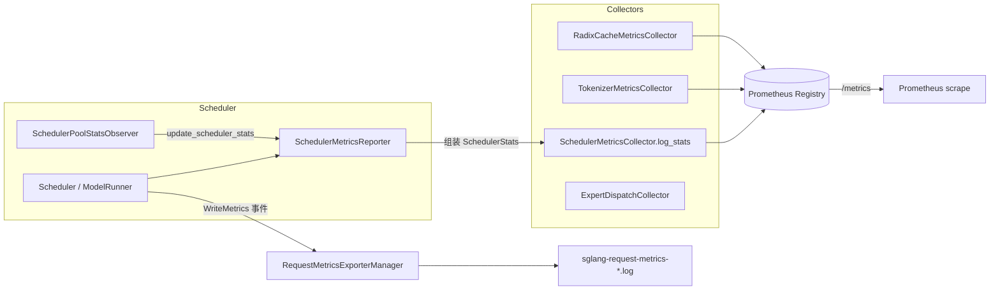

# SGLang 可观测性（Observability）源码解析

> 本文档基于 SSOT 路径 `python/sglang/srt/observability/` 及 `python/sglang/srt/managers/scheduler_components/metrics_reporter.py`、`python/sglang/srt/utils/common.py` 等源码（对齐 commit `e1c4db96`）。所有论断均给出 `文件:行号区间` 形式的证据锚点。

## What：可观测性由哪几部分组成

SGLang 的可观测性体系由三层构成：**指标（Metrics）**、**日志（Logs）** 与 **剖析（Profiling / Tracing）**。三者分别服务于不同场景：

- **指标**：基于 `prometheus_client` 暴露为 Prometheus 拉取端点，用于长期监控、告警与 Grafana 看板。核心实现在 `python/sglang/srt/observability/metrics_collector.py`。
- **日志**：调度器在每个 prefill/decode 周期在控制台打印一行紧凑状态摘要，并支持把每条请求的性能数据导出到文件。关键路径在 `metrics_reporter.py` 与 `request_metrics_exporter.py`。
- **剖析**：通过 HTTP 接口 `/start_profile`、`/stop_profile` 驱动 `torch.profiler`，输出 Chrome trace / 内存快照；另有一套基于 OpenTelemetry 风格的请求级 trace（`trace.py`、`req_time_stats.py`）。

整体数据流如下：



## Why：为什么这样设计

1. **多类 Collector 分工**：调度器、Tokenizer、RadixCache、Expert Dispatch 各自产生一组正交的指标，因此源码把指标定义拆成 `SchedulerMetricsCollector`、`TokenizerMetricsCollector`、`RadixCacheMetricsCollector`、`StorageMetricsCollector`、`ExpertDispatchCollector` 等独立类（`metrics_collector.py:238`、`1480`、`1962`、`1849`、`1947`）。这样每类指标只在相关组件启用时创建（如 LoRA、HiCache、Streaming Session 指标按需创建），避免无谓的注册开销与 label 膨胀。

2. **多进程安全**：SGLang 的 TP/PP/DP worker 通常是多进程，Python Prometheus 客户端在多进程下需走 multiprocess 模式。引擎在导入 `prometheus_client` 之前先设置 `PROMETHEUS_MULTIPROC_DIR`（`common.py:2374-2388`），`/metrics` 路由用 `CollectorRegistry` + `multiprocess.MultiProcessCollector` 聚合（`common.py:2392-2402`）。

3. **DI 可替换**：所有 Collector 继承 `_StatLoggerDIMixin`，其 `_counter_cls`/`_gauge_cls`/`_histogram_cls`/`_summary_cls` 默认为 `None`，即使用标准 `prometheus_client`；嵌入场景（如 Ray Serve LLM）可通过 `ServerArgs.stat_loggers` 注入镜像 Prometheus API 的自定义后端（`metrics_collector.py:215-226`）。

4. **指标默认关闭**：`enable_metrics` 默认为 `False`（`server_args.py:1517-1519`），避免生产环境未配置 scrape 时仍承担指标采集开销。开启后由 `SchedulerMetricsCollectorContext.init_new` 决定是否在本 rank 实际注册（`metrics_collector.py:1067-1125`，仅 `attn_tp_rank == 0` 或 `enable_metrics_for_all_schedulers` 时落盘）。

## How：关键指标与代码路径

### 如何开启 Metrics（端口 / 路径）

启动引擎时加 `--enable-metrics`。指标通过 HTTP 暴露，与推理 API 共用同一端口，路径为 `/metrics`（仅 `enable_metrics=True` 时注册中间件，`common.py:2392-2402`）。Prometheus 抓取配置示例：

```
scrape_configs:
  - job_name: sglang
    static_configs:
      - targets: ["<host>:<port>"]
```

所有指标名前缀均为 `sglang:`，并带 `model_name`、`engine_type`、`tp_rank`、`pp_rank`、`moe_ep_rank` 等 label；开启优先级调度时额外有 `priority` label（`metrics_collector.py:1096-1108`）。注意 `/metrics` 与 `/health` 在鉴权下也始终可访问（`auth.py:100`）。

### 主要指标一览

| 指标名（Prometheus） | 含义 | 代码锚点 |
| --- | --- | --- |
| `sglang:num_running_reqs` | 当前正在运行的请求数（支持按优先级拆分） | `metrics_collector.py:269-274` |
| `sglang:num_queue_reqs` | 等待队列中的请求数 | `metrics_collector.py:275-280` |
| `sglang:num_grammar_queue_reqs` | 结构化输出（grammar）等待队列长度 | `metrics_collector.py:281-286` |
| `sglang:gen_throughput` | 生成吞吐（token/s） | `metrics_collector.py:287-292` |
| `sglang:cache_hit_rate` | 前缀缓存命中率（hit_tokens / total_tokens） | `metrics_collector.py:293-298`、`metrics_reporter.py:637-663` |
| `sglang:token_usage` | KV cache 使用率（full/swa/mamba 中的瓶颈） | `metrics_collector.py:309-314` |
| `sglang:full_token_usage` / `swa_token_usage` / `mamba_usage` | 各类注意力/SSM KV 池使用率 | `metrics_collector.py:315-332` |
| `sglang:num_used_tokens` / `kv_available_tokens` / `kv_evictable_tokens` / `kv_used_tokens` | KV 池绝对 token 计数（已用/空闲/可驱逐/锁定） | `metrics_collector.py:337-396` |
| `sglang:max_total_num_tokens` | KV 池 token 容量上限（仅启动期 `emit_constants` 写入一次） | `metrics_collector.py:1006-1011` |
| `sglang:spec_accept_rate` / `spec_accept_length` | 投机解码接受率 / 平均接受长度 | `metrics_collector.py:416-451` |
| `sglang:num_retracted_requests_total` | 被抢占（retract）重试的请求累计数 | `metrics_collector.py:462-477` |
| `sglang:kv_transfer_*` | PD 分离场景 KV 传输速度/时延直方图 | `metrics_collector.py:510-561` |
| `sglang:queue_time_seconds` | 请求排队时延直方图 | `metrics_collector.py:687-733` |
| `sglang:per_stage_req_latency_seconds` | 各阶段（prefill/decode/transfer...）时延 | `metrics_collector.py:734-740`、`req_time_stats.py:281-285` |
| `sglang:time_to_first_token_seconds` | TTFT 直方图（区分 streaming） | `metrics_collector.py:1698-1706` |
| `sglang:inter_token_latency_seconds` | ITL 直方图 | `metrics_collector.py:1708-1713` |
| `sglang:e2e_request_latency_seconds` | 端到端时延直方图 | `metrics_collector.py:1715-1720` |
| `sglang:prompt_tokens_total` / `generation_tokens_total` | 累计 prefill / 生成 token 数 | `metrics_collector.py:1513-1522` |
| `sglang:realtime_tokens_total` | 按 mode（prefill_compute/prefill_cache/decode）累计 token | `metrics_collector.py:884-891` |
| `sglang:prefill_effective_tokens_total` | 含 device/host/storage 各级命中分解的有效 prefill token | `metrics_collector.py:892-905` |
| `sglang:forward_execution_seconds_total` | GPU 执行前向的累计耗时（用于 MFU/利用率） | `metrics_collector.py:906-913` |
| `sglang:cuda_graph_passes_total` | 按 mode 统计 CUDA Graph 前向次数 | `metrics_collector.py:599-603` |
| `sglang:weight_memory_usage_gb` / `kv_cache_memory_usage_gb` / `graph_memory_usage_gb` | 权重 / KV / 图显存占用 | `metrics_collector.py:1018-1035` |
| `sglang:lora_pool_utilization` | LoRA 适配器槽位利用率 | `metrics_collector.py:608-626` |
| `sglang:hicache_host_used_tokens` / `hicache_host_total_tokens` | 分层缓存主机侧 KV 使用量 | `metrics_collector.py:631-643` |

### 指标如何被填充

`SchedulerMetricsReporter`（位于 `metrics_reporter.py`）在每个调度周期组装一个 `SchedulerStats` 数据类（`metrics_collector.py:64-157`），再调用 `SchedulerMetricsCollector.log_stats(stats)` 批量写入所有 Gauge（`metrics_collector.py:1318-1418`）。其中：

- **前缀命中率**由 `cache_hit_rate = effective_hit_tokens / (effective_input_tokens + effective_hit_tokens)` 计算，分子分母剔除了被重新处理的 prefill token（`metrics_reporter.py:630-663`）。
- **KV 池使用率与绝对计数**由 `SchedulerPoolStatsObserver.update_scheduler_stats` 写入（证据：`metrics_reporter.py:666` 调用 `pool_stats.update_scheduler_stats(self.stats)`，实现见 `pool_stats_observer.py:120-121`）。
- 累计类指标（token 数、前向耗时、FLOPs）通过 `increment_*` 方法在请求完成 / 每个前向时累加（`metrics_collector.py:1243-1316`）。
- 启动常量（`max_total_num_tokens`、显存占用、page size、context_len 等）在调度器初始化时通过 `emit_constants` 一次性写入（`metrics_collector.py:1445-1477`，调用点 `scheduler.py:1099`）。

### 关键日志点

- **控制台状态行**：`SchedulerMetricsReporter` 的 prefill/decode 周期会打印一行，包含 `#new-seq`、`#new-token`、`#cached-token`、`token_usage_msg`、`#running-req`、`#queue-req` 等（`metrics_reporter.py:561-570` 的 prefill 行；`753` 左右的 decode 行）。`token_usage_msg` 由 `SchedulerPoolStatsObserver.get_prefill_usage_msg_parts` / `get_decode_usage_msg_parts` 生成（`metrics_reporter.py:551`、`750`）。
- **请求级导出**：请求完成时通过 `TokenizerMetricsCollector.observe_one_finished_request` 记录 prompt/generation token、cached token 明细、TTFT/ITL/e2e 时延（`metrics_collector.py:1740-1798`）。若启用 `--export-metrics-to-file`，`RequestMetricsExporterManager` 把每条请求的参数与时间统计写入 `sglang-request-metrics-<小时>.log`（`request_metrics_exporter.py:72-156`）。

### Profiling：torch.profiler 与自研剖析

SGLang **提供**基于 `torch.profiler` 的 GPU/CPU 剖析。通过 HTTP 接口 `/start_profile`、`/stop_profile`（`tokenizer_control_mixin.py:372` 起）触发 `SchedulerProfilerManager`（`scheduler_components/profiler_manager.py`）。

- 默认 `activities=["CPU","GPU"]`，输出 `.trace.json.gz` 的 Chrome trace（`python/sglang/srt/managers/scheduler_components/profiler_manager.py:197` 与 `:338`），保存到 `SGLANG_TORCH_PROFILER_DIR`（默认 `/tmp`）。
- 支持 `activities` 含 `MEM`（CUDA 内存快照，`_record_memory_history`）、`RPD`（ROCm）、`CUDA_PROFILER`（nsight 起停）等扩展（`python/sglang/srt/managers/scheduler_components/profiler_manager.py:252-L264`）。
- 可按 `start_step`+`num_steps` 或 `profile_by_stage`（prefill/decode 分别剖析）精确控制采样窗口（`profiler_manager.py:135-153`、`392-418`）。
- 提供 `SGLANG_PROFILE_V2` 环境变量切换为新一代 `ProfileManager` 实现（`profiler_manager.py:58-62`、`99`；`environ.py:412`）。
- 另有 NVTX 标注工具（`nvtx_utils.py`）与请求级 trace（`trace.py`、`req_time_stats.py`），可通过 `init_trace_ctx` / `trace_slice` 记录每个 stage 的 span（`req_time_stats.py:287-328`）。

### Benchmark 工具链

`python/sglang/benchmark/` 下的主要脚本（已 grep 核实存在）：

- `serving.py`：在线 serving 压测，动态请求，统计 TTFT/ITL/吞吐与 `cached_tokens_details`（`serving.py:7`、`999` 的 `BenchmarkMetrics`、`247-254` 解析缓存命中明细）。
- `offline_throughput.py`：离线（同进程）吞吐基准。
- `one_batch.py` / `one_batch_server.py`：单批推理基准，后者会抓取 `/metrics` 读取 `cached_tokens_total`、`prompt_tokens_total`（`one_batch_server.py:48-52`）。
- `bench_adaptive_speculative.py`：自适应投机解码基准。
- `dspark_sps_profiler.py` / `dspark_sts_fit.py`：基于 Spark 的 SPS（server-per-second） profiling 与 STS 拟合。
- `endpoint.py`：封装对运行中的 SGLang 端点的压测请求。
- `bench_utils.py` / `utils.py`：共享工具。

此外 `benchmark/` 下还有 `lora/`、`mmlu/`、`gsm8k/`、`hicache/` 等子目录，针对具体能力做评测。

## 边界与坑

1. **指标默认关闭**：未加 `--enable-metrics` 时 `/metrics` 路由不存在，Prometheus 抓取会 404。生产环境务必显式开启（`server_args.py:1517-1519`）。

2. **优先级 label 的"None"陷阱**：开启优先级调度但未设 `--default-priority-value` 时，`QueueCount.from_reqs` 会产生 `{None: N}`，导致 Prometheus label 出现 `priority="None"`（`metrics_collector.py:51-61`）。建议始终配置默认优先级值。

3. **多进程指标聚合依赖临时目录**：`_log_gauge` 使用 `multiprocess_mode="mostrecent"`，依赖 `PROMETHEUS_MULTIPROC_DIR`。该目录必须在 import `prometheus_client` 前设置，否则多 worker 下指标为空（`common.py:2374-2388`、`metrics_collector.py:248`）。

4. **`token_usage` 命名误导**：`SchedulerStats.token_usage` 实际是 `max(full, swa, mamba)` 的瓶颈值，源码注释明确标注 "FIXME: misleadingly named"（见 `metrics_collector.py:76-82`）。阅读看板时不应把它等同于 full-attention KV 使用率，应结合 `full_token_usage`。

5. **retract ≠ 标准术语 preemption**：SGLang 用 "retract"（撤回重试）表达抢占语义，指标为 `num_retracted_requests_total`（`metrics_collector.py:462-477`）。将其理解为"抢占/重调度次数"即可，源码中存在 `num_retracted_reqs`（旧 Gauge）与 `num_retracted_requests_total`（新 Counter）并存，优先用 Counter。

6. **profiler 不可重入**：`_start_profile` 若已有 profiling 在进行会报错要求先 `/stop_profile`（`profiler_manager.py:114-118`）；输出目录不存在时会自动创建（`profiler_manager.py:311`）。

7. **请求级导出文件按小时滚动**：`FileRequestMetricsExporter` 文件名带 `%Y%m%d_%H` 后缀，跨小时会自动切换文件并加锁写入（`request_metrics_exporter.py:94-154`），但不会删除旧文件，长期运行需外部轮转。

## 诊断指标的价值

- **前缀命中率（`cache_hit_rate`）**：直接反映 RadixCache 的复用效率。命中率高意味着大量请求复用了已有 KV，可显著降低 prefill 计算量、提升吞吐；持续走低则需检查请求前缀多样性或缓存容量（`max_total_num_tokens`）。命中率分子/分母的精确算法见 `metrics_reporter.py:630-663`。
- **抢占次数（`num_retracted_requests_total`）**：反映 KV cache 容量与并发压力的冲突程度。频繁 retract 说明内存不足或调度策略过于激进，会严重损害尾延迟；应结合 `kv_evictable_tokens` 与 `token_usage` 判断是否需要扩显存或限流。
- **`queue_time_seconds` 与 `num_queue_reqs`**：队列堆积的时延与长度，是 SLO 违约的前兆；与 `gen_throughput` 结合可定位是算力瓶颈还是调度瓶颈。

> **[OPEN]** `SchedulerStats.token_usage` 命名误导的 FIXME（见 `metrics_collector.py:78`）是否会在后续版本重命名并影响 API 兼容性，本文档依据当前 commit 仅记录现状，无法预判未来变更。
