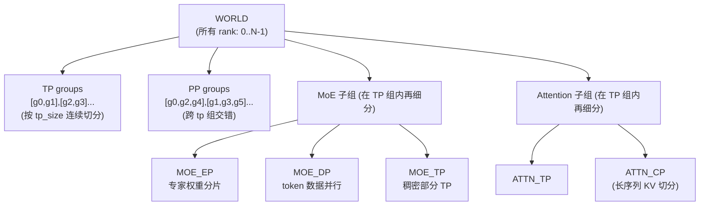
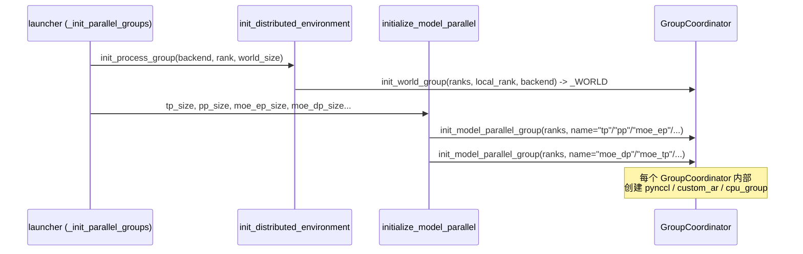
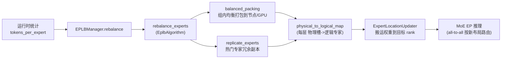

# SGLang 并行策略（Parallelism）深度解析

> 本文档基于本地源码提交 `e1c4db9621f7c4203ee9becd5d5456d4e6bf54f7`（2026-08-14）撰写。所有论断均可在 `python/sglang/srt/` 下的源码中找到对应证据，行号以 `Read` 工具实测为准。

## What：SGLang 支持哪些并行维度

SGLang 在一个全局 `world`（所有参与推理的 GPU/进程）之上，划分出多种互相正交的并行维度。核心维度有四个：

| 缩写 | 名称 | 切分对象 | 实现位置（进程组） |
|------|------|----------|--------------------|
| TP | Tensor Parallel（张量并行） | 单层权重按行/列切分到各 rank | `_TP` / `get_tp_group()` |
| PP | Pipeline Parallel（流水线并行） | 按层（stage）纵向切分模型 | `_PP` / `get_pp_group()` |
| DP | Data Parallel（数据并行） | 不同请求/微批（micro-batch）分到不同 rank | 由 `dp_size` 派生，配合 `attention_data_parallel_size` |
| EP | Expert Parallel（专家并行） | MoE 中的专家权重分片到各 rank | `_MOE_EP` / `get_moe_ep_group()` |

此外还存在若干派生/细分维度（均复用上述基础原语）：

- **MoE DP**（`_MOE_DP` / `get_moe_dp_group()`）：MoE 层内的数据并行，与 attention 的 DP 解耦，用于让 MoE 在 EP 之外再对 token 做切分。
- **MoE TP**（`_MOE_TP` / `get_moe_tp_group()`）：MoE 中稠密部分的张量并行。
- **Attention TP / CP**（`_ATTN_TP` / `_ATTN_CP`）：attention 计算内部的张量并行与上下文并行（context parallel，用于长序列切分 KV）。
- **DCP**（Decode Context Parallel，`_DCP`）：仅在 AMD HIP/CUDA 上支持的 decode 期 KV cache 切分。

这些进程组全部由 `initialize_model_parallel` 一次性构建，并缓存为模块级全局变量（`_TP`、`_PP`、`_MOE_EP` 等）。注意 `world_size == tensor_model_parallel_size * pipeline_model_parallel_size` 是硬性约束，源码中若不满足会直接 `raise RuntimeError`（证据：`python/sglang/srt/distributed/parallel_state.py:L2360-L2365`）。



## Why：为什么需要这么多维度

单一并行维度无法同时满足「显存容量」「算力利用率」「通信开销」三个目标：

1. **TP** 把一个大矩阵拆到多卡，降低单卡显存与单步计算量，但需要高频 all-reduce 同步（每层都要做），通信密集、强依赖 NVLink 等高速互联。
2. **PP** 把不同层放到不同卡，单步通信量小（仅传激活），但会引入「流水线气泡」，需要合适的 micro-batch 调度来填泡；且 SGLang 中 PP 与上下文并行/部分 MoE 配置互斥（证据：`python/sglang/srt/server_args.py:L6505`）。
3. **DP** 让多个 rank 独立处理不同请求，几乎无通信，是扩展吞吐最直接的方式；配合 `enable_dp_attention` 还可把同一请求的序列切到不同 rank（DP-Attention）。
4. **EP** 专为大 MoE 模型（如 DeepSeek-V3、Qwen-MoE）设计：专家数量巨大，单卡放不下全部专家，且不同专家负载极不均衡，必须按专家切分并做动态负载均衡（EPLB）。EP 的核心通信是 all-to-all（token 按路由结果发往持有对应专家的 rank）。

源码在 `initialize_model_parallel` 的 docstring 里给出了具体布局示例：以 8 卡、TP=2、PP=4 为例，会生成 4 个 TP 组 `[g0,g1]`、`[g2,g3]`、`[g4,g5]`、`[g6,g7]` 和 2 个 PP 组 `[g0,g2,g4,g6]`、`[g1,g3,g5,g7]`（证据：`python/sglang/srt/distributed/parallel_state.py:L2322-L2342`）。

## How：关键代码路径

### 1. 分布式环境初始化（World 级）

入口是 `init_distributed_environment`，它调用 `torch.distributed.init_process_group` 建立全局 `WORLD` 进程组，并据此创建 `_WORLD`（`GroupCoordinator`）（证据：`python/sglang/srt/distributed/parallel_state.py:L2193-L2282`）。

关键函数签名：

```python
def init_distributed_environment(
    world_size: int = -1,
    rank: int = -1,
    distributed_init_method: str = "env://",
    local_rank: int = -1,
    backend: str = "nccl",
    timeout: Optional[int] = None,
    moe_a2a_backend: Optional[str] = None,
    recovered_rank: bool = False,
    max_world_size: Optional[int] = None,
):
```

> 当 `moe_a2a_backend == "nixl"` 时，该函数还会额外创建全局 `TCPStore`（用于 NIXL 缓冲区协调），见 `python/sglang/srt/distributed/parallel_state.py:L2252-L2261`。若 backend 为 `mooncake`，则用 `MooncakeBackendOptions` 构造支持动态成员的进程组（证据：`python/sglang/srt/distributed/parallel_state.py:L2225-L2237`）。

### 2. 模型并行组构建（Model Parallel）

`initialize_model_parallel` 负责切分并创建所有子进程组（证据：`python/sglang/srt/distributed/parallel_state.py:L2285-L2639`）。其内部逻辑：

1. **TP 组**：把 `world_size` 按 `tensor_model_parallel_size` 连续切块，每块一个 TP 组，通过 `init_model_parallel_group(group_ranks, ..., group_name="tp")` 创建（证据：`python/sglang/srt/distributed/parallel_state.py:L2383-L2407`）。
2. **PP 组**：按 `world_size // pipeline_model_parallel_size` 个组，每组用 `range(pp_group_idx, world_size, num_pipeline_model_parallel_groups)` 交错取 rank（证据：`python/sglang/srt/distributed/parallel_state.py:L2619-L2639`）。
3. **MoE 子组**：在 TP 组内进一步按 `moe_ep_size`、`moe_dp_size`、`moe_tp_size` 切分。关键约束：`moe_tp_size = tensor_model_parallel_size // moe_ep_size // moe_dp_size`。EP 组用 `group_name="moe_ep"` 创建，且**强制关闭 pynccl 与 custom allreduce**（因为 EP 走 all-to-all 而非 all-reduce）（证据：`python/sglang/srt/distributed/parallel_state.py:L2526-L2587`）。
4. **Attention 子组 / DCP**：同理在 TP 组内细分（证据：`parallel_state.py:L2451-L2524`、`L2428-L2449`）。

`init_model_parallel_group` 是创建任意子组的统一工厂，返回一个 `GroupCoordinator`（证据：`python/sglang/srt/distributed/parallel_state.py:L1885-L1925`）。它默认 `use_pynccl = not (_is_npu or _is_xpu or backend == "mooncake")`，即 NPU/XPU/Mooncake 路径不走 pynccl。

调用链（由 launcher 触发）：`bootstrap._init_parallel_groups` → `init_distributed_environment` + `initialize_model_parallel` + `initialize_dp_attention`（证据：`python/sglang/srt/distributed/bootstrap.py:L193-L247`）。



### 3. 通信原语与 GroupCoordinator

`GroupCoordinator` 是 PyTorch `ProcessGroup` 的封装器，统一管理一个进程组内所有通信操作，并可根据张量大小、是否处于 CUDA Graph、是否启用对称内存等条件，把 all-reduce 路由到不同后端（证据：`python/sglang/srt/distributed/parallel_state.py:L237-L276`）。

它在构造时（`__init__`，`parallel_state.py:L278-L542`）根据 `use_pynccl` / `use_pymscclpp` / `use_custom_allreduce` / `use_torch_symm_mem_all_reduce` 等标志，懒加载创建对应的通信器：
- `PyNcclCommunicator`（基于 `pynccl` 直接调 NCCL，绕开 torch 的 c10d，便于 CUDA Graph）
- `CustomAllreduce`（自定义内核，如 NVLink 上的快速 all-reduce）
- `TorchSymmMemCommunicator`、`PyMscclppCommunicator`、`MessageQueue` 等。

`all_reduce` 方法（`parallel_state.py:L648-L764`）是用户态入口，内部按优先级选择后端：`symmetric-memory pynccl` → `flashinfer` → `custom all-reduce v2` → 退化为 `inplace_all_reduce`（经自定义 op 走 torch c10d）。当 `world_size == 1` 时直接返回输入，无通信开销（证据：`parallel_state.py:L667-L668`）。

业务代码通常不直接调 `GroupCoordinator`，而是通过 `communication_op.py` 的封装函数，例如：

```python
def tensor_model_parallel_all_reduce(input_):
    return get_tp_group().all_reduce(input_)          # communication_op.py:L18-L20

def moe_expert_parallel_all_reduce(input_):
    return get_moe_ep_group().all_reduce(input_)      # communication_op.py:L105-L107
```

`PyNcclCommunicator.__init__` 签名如下（注意它绑定的是 **非 NCCL 的 cpu_group**，用 NCCL unique id 自行建链，从而与 torch 的 NCCL 后端解耦，便于图捕获）（证据：`python/sglang/srt/distributed/device_communicators/pynccl.py:L30-L138`）：

```python
class PyNcclCommunicator:
    def __init__(self, group, device, library_path=None, is_symmetric_memory_enabled=False): ...
    def all_reduce(self, tensor, op: ReduceOp = ReduceOp.SUM): ...   # pynccl.py:L144
```

### 4. EP 与 MoE 的 all-to-all 通信

专家并行的本质是：每个 token 经 router 选出 top-k 专家后，需把 token 发往持有这些专家的 rank，计算完再发回。这是典型的 **all-to-all（全互换）** 通信，而非 all-reduce。

SGLang 通过 `moe_a2a_backend` 选择具体实现（`StandardDispatcher` 默认走 `torch.distributed.all_to_all_single`，而 `deepep` / `mooncake` / `nixl` / `pplx` / `flashinfer` 走各自的 dispatcher）（证据：`python/sglang/srt/layers/moe/fused_moe_triton/layer.py:L125-L178`）。DeepEP 路径使用 `get_tp_group().device_group` 作为通信组（`_get_deepep_comm_group`，`layer.py:L125-L134`），原因是 EP 组往往与 TP 组重叠（`moe_ep_size == tp_size` 时 `_MOE_EP = _TP`，见 `parallel_state.py:L2562-L2563`）。

### 5. EPLB：专家到 rank 的映射如何决定

MoE 负载天然不均衡（少数「热门专家」被频繁选中），静态把专家均分到各 EP rank 会造成长尾延迟。EPLB（Expert Parallelism Load Balancer）根据运行时统计的 `tokens_per_expert`，动态决定「物理专家 → 逻辑专家」的副本布局，并据此把专家权重搬运到正确的 rank。

流程如下（证据：`python/sglang/srt/eplb/eplb_manager.py:L99-L227`）：

1. `EPLBManager.rebalance` 周期性触发（每 `eplb_rebalance_num_iterations` 次前向）。
2. 通过 `get_global_expert_distribution_recorder().dump_record()` 取出各逻辑专家的历史 token 计数 `logical_count`（证据：`python/sglang/srt/eplb/eplb_manager.py:L126-L132`）。
3. `ExpertLocationMetadata.init_by_eplb` 调用 `eplb_algorithms.rebalance_experts`，产出 `physical_to_logical_map`（每层每个物理槽位对应的逻辑专家 id）（证据：`python/sglang/srt/eplb/expert_location.py:L176-L224`）。
4. `update_expert_location_with_recovery` 把新布局写回各 rank，缺失的专家权重从磁盘/备份加载（弹性 EP 场景）（证据：`python/sglang/srt/eplb/eplb_manager.py:L302-L353`）。

调度算法由 `EplbAlgorithm` 枚举决定，入口 `rebalance_experts` 分发到具体实现（证据：`python/sglang/srt/eplb/eplb_algorithms/__init__.py:L9-L72`）：

- `deepseek` / `deepseek_hierarchical`：`deepseek.rebalance_experts`。
- `deepseek_vec` / `deepseek_vec_hierarchical`：考虑 token 分布的矢量版。
- `elasticity_aware*`：用于弹性 EP（rank 数量可变）场景。

`compute_algorithm` 在 `raw_algorithm == "auto"` 时按「`num_groups` 能否被 `num_nodes` 整除」自动选 hierarchical 与否（证据：`python/sglang/srt/eplb/eplb_algorithms/__init__.py:L75-L87`）。

以 `deepseek.rebalance_experts` 为例，其两步核心算法（证据：`python/sglang/srt/eplb/eplb_algorithms/deepseek.py:L86-L168`）：

1. **`balanced_packing`**：把专家组（group）按 token 权重均衡地打包到各节点（hierarchical 模式下先按节点打包，利用 NVLink 等节点内高速互联），见 `deepseek.py:L7-L52`。
2. **`replicate_experts`**：对热门逻辑专家做**冗余副本**（`num_redundant = num_phy - num_log`），把最热的专家复制多份分散到不同 rank，从而摊平单 rank 负载，见 `deepseek.py:L55-L83`。这一机制就是 SGLang 支持「冗余专家（redundant experts）」的来源，`expert_location.py` 中 `ep_num_redundant_experts` 即控制冗余数量（证据：`python/sglang/srt/eplb/expert_location.py:L237-L240`）。



## 边界与坑（Pitfalls）

1. **EP 与 radix 缓存/通信重叠的坑**：专家布局（`physical_to_logical_map`）一旦因 EPLB 重平衡而变动，对应 rank 上的专家权重会迁移。而 radix cache（前缀缓存）是按 token 序列哈希命中的，**专家权重的物理位置变化不会自动失效 radix 缓存**——同一前缀若仍命中旧缓存、但底层专家权重已更新，可能产生错误结果。生产中 EPLB 重平衡通常需配合缓存失效或仅在 prefill/空闲窗口触发；相关恢复逻辑见 `python/sglang/srt/eplb/eplb_manager.py:L302-L353`（缺失专家权重回灌）。此外，DeepEP 的 `async_finish=True` 使 all-to-all 计算与通信重叠，若调度器在通信未完成时复用同一块缓冲（如 radix 缓存复用的 token 缓冲），也会造成数据竞争。
   > **[OPEN]** 当前源码中 EPLB 重平衡与 radix 缓存失效的精确耦合点（是否有显式 cache invalidate 调用）未在本次阅读范围内完全确认，需进一步追踪 `ExpertLocationUpdater` 调用方与 scheduler 的缓存失效逻辑。

2. **PP 与上下文并行/部分 MoE 配置互斥**：`server_args.py` 中明确断言 `moe_dp_size > 1` 时 `pp_size == 1`，且 `ep_size * moe_dp_size <= tp_size`（证据：`python/sglang/srt/server_args.py:L6497-L6514`）。混用会直接启动失败。

3. **EP 组强制关闭 pynccl/custom-AR**：因为 EP 走 all-to-all，`initialize_model_parallel` 创建 `moe_ep` 组时 `use_pynccl=False, use_custom_allreduce=False`（证据：`parallel_state.py:L2577-L2587`）。若误以为 EP 也享受 custom all-reduce 加速，会理解错性能特征。

4. **MoE 子组大小约束**：`moe_tp_size = tp_size // ep_size // dp_size` 必须为整数，且 `attn_cp_size != moe_dp_size` 仅在 `moe_dp_size == 1` 时允许（证据：`parallel_state.py:L2528`、`server_args.py:L6516-L6519`）。配置错误会在初始化阶段即报错。

5. **对称内存与 graph capture 陷阱**：`PyNcclCommunicator` 默认 `disabled=True`，需在 CUDA Graph 上下文用 `with comm.change_state(enable=True)` 开启；且 `all_reduce` 在 `torch.compiler.is_compiling()` 下对无加速后端的组会走 `inplace_all_reduce` 自定义 op 以保持图不中断（证据：`parallel_state.py:L694-L721`、`pynccl.py:L136-L138`）。

6. **弹性 EP / Mooncake 的动态成员**：`max_world_size`、`recovered_rank`、`rank_offset` 等参数支持运行时扩容（joiner 加入），此时 `group_ranks` 是局部 rank，需在 `GroupCoordinator.__init__` 中按 `rank_offset` 平移到全局 rank 空间（证据：`parallel_state.py:L304-L306`）。误用会导致 rank 映射错位。

### 6. 全局访问器与运行时并行状态

所有进程组创建后，通过模块级 `get_*_group()` 函数对外暴露，业务层（attention、MoE、sampler
等）统一从这些访问器取组，而不持有全局变量引用。例如 `get_tp_group()`、`get_pp_group()`、
`get_moe_ep_group()`、`get_moe_dp_group()`、`get_moe_tp_group()`、`get_attn_tp_group()`、
`get_attn_cp_group()`（证据：`python/sglang/srt/distributed/parallel_state.py:L1944`、
`L2003`、`L1987`、`L1982`、`L1992`、`L1954`、`L1961`）。

值得注意的是 PD-Multiplexing（prefill/decode 复用）场景：`get_tp_group()` 会在
`_ENABLE_PDMUX_P_TP` 为真时返回 `_PDMUX_PREFILL_TP_GROUP`（一个与默认 TP 组重复的副本，
用于 prefill 阶段隔离通信），否则返回 `_TP`（证据：`parallel_state.py:L1944-L1951`）。这套
「访问器 + 全局开关」的设计，使 speculative decoding 的 draft worker 也能用
`patch_tensor_parallel_group` 临时替换 TP 组而不影响 target worker（证据：
`parallel_state.py:L2739-L2761`）。

运行期真正的并行参数（如 `ep_size`、`nnodes`、`elastic_ep_initial_size`）并非直接读
`ServerArgs`，而是放在 `runtime_context.get_parallel()` 提供的 `Parallel` 对象里。EPLB 在
`_init_common` 中通过 `get_parallel().ep_size` 解析当前（可能是弹性扩容后的）EP 规模，并据
`elastic_ep_initial_size` 决定专家冗余布局（证据：
`python/sglang/srt/eplb/expert_location.py:L227-L267`）。这保证了「配置层 ServerArgs」与
「运行期可变的并行拓扑」之间的隔离：重平衡、弹性扩缩容都不会回头去改 `ServerArgs`。

### 7. 子组切分公式详解（以 8 卡为例）

为便于直观理解 `initialize_model_parallel` 的切分逻辑，取 `tp_size=8`、`pp_size=1`、
`moe_ep_size=4`、`moe_dp_size=2`：

- `moe_tp_size = 8 // 4 // 2 = 1`，即 MoE 稠密部分不再额外切分。
- **MoE EP 组**（`parallel_state.py:L2565-L2576`）：在每个 TP 组（此处整组即全部 8 卡）内，
  以 `moe_dp_size * moe_tp_size = 2` 为步长取 rank，得到 4 组：
  `[g0,g2,g4,g6]`、`[g1,g3,g5,g7]`、`[g0,g2,g4,g6]`、`[g1,g3,g5,g7]`（其中前两与后两
  因 `dp_idx` 不同但 `ep` 槽位重合，分别对应不同 dp 分区下的同一 EP 划分）。
- **MoE DP 组**（`parallel_state.py:L2540-L2548`）：以 `moe_tp_size * moe_ep_size = 4` 为
  步长取 rank，得到 2 组 `[g0,g1,g2,g3]`、`[g4,g5,g6,g7]`。

可以看到，EP 与 DP 在同一 TP 组内是正交的两套切分：EP 让专家分散、DP 让 token 分散，二者
组合恰好覆盖全部 `tp_size` 个 rank。这正是 MoE 既能「按专家扩显存」又能「按 token 扩吞吐」
的根本原因。

## 与 ServerArgs 的联动

四个核心并行度通过 `ServerArgs` 字段进入系统：`tp_size`、`pp_size`、`dp_size`、`ep_size`，以及 MoE 细分 `moe_dp_size`、`moe_a2a_backend`、上下文并行 `attn_cp_size` 等。它们在 `server_args.py` 的若干 `_handle_*` 钩子里被规范化与互相约束：

- `_handle_dwdp`（Disaggregated Wide Data Parallel）：当启用 `dwdp_size` 时强制 `dp_size = ep_size = moe_ep_size = dwdp_size`、`moe_dp_size = 1`、`moe_a2a_backend = "none"`，并开启 DP-Attention（证据：`python/sglang/srt/server_args.py:L6525-L6578`）。
- `_handle_data_parallelism`：启用 `enable_dp_attention` 时，约束 `tp_size % dp_size == 0` 并把 `chunked_prefill_size` 按 `dp_size` 缩小（证据：`python/sglang/srt/server_args.py:L6580-L6636`）。
- 这些推导出的 `tp_size / pp_size / moe_ep_size / moe_dp_size / attn_dp_size / attn_cp_size / dcp_size` 最终传入 `bootstrap._init_parallel_groups` → `initialize_model_parallel`（证据：`python/sglang/srt/distributed/bootstrap.py:L229-L242`）。

也就是说，**用户只需在 `ServerArgs` 层面声明意图，真正建立进程组、选择通信后端、决定专家布局的逻辑全部收口在 `parallel_state.py` 与 `eplb/` 中**，二者通过 `initialize_model_parallel` 的参数列表与 `get_*_group()` 全局访问器解耦。
