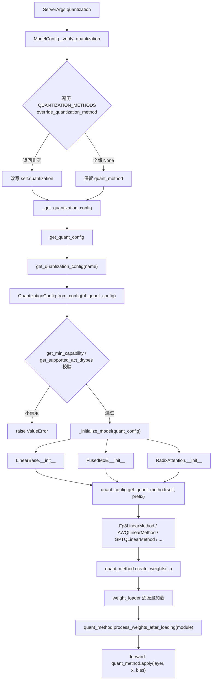
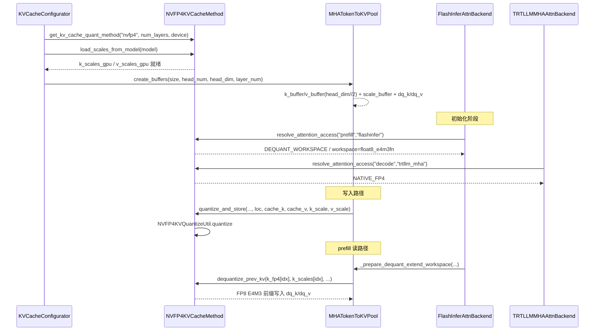

# 量化子系统（Quantization）

> 本文所有结论均来自 SSOT `/home/kimmo/develop/sglang`，对齐 commit `e1c4db9621f7c4203ee9becd5d5456d4e6bf54f7`。
> 锚点格式为 `相对路径:L起-L止`，行号以该 commit 实测为准。

---

## 0. 先分清三条互相独立的量化轴

读 SGLang 的量化代码最容易犯的错，是把"量化"当成一件事。实际上仓库里有**三套互不相同的抽象**，它们的配置来源、生命周期、扩展点都不一样：

| 轴 | 抽象基类 | 配置来源 | 作用对象 |
|---|---|---|---|
| 权重/激活量化 | `QuantizationConfig` → `QuantizeMethodBase` | HF `config.json` 的 `quantization_config` + `--quantization` | `LinearBase` / `FusedMoE` / `ParallelLMHead` |
| KV cache 标量缩放（FP8） | `BaseKVCacheMethod` | 同上（走 `RadixAttention` 分支） | `RadixAttention` 上的 `k_scale` / `v_scale` |
| KV cache 打包存储（FP4） | `KVCacheQuantMethodBase` | `--kv-cache-dtype` | `MHATokenToKVPool` 的 buffer + attention backend |

第一轴改的是"矩阵乘怎么算"，第二轴只改"从 checkpoint 里读两个 float 出来给 attention kernel 用"，第三轴改的是"KV 池子里的字节长什么样、attention 后端怎么读"。三者可以同时开启，也可以完全独立。

- 轴一入口：`python/sglang/srt/layers/quantization/base_config.py:L126-L263`（`QuantizationConfig` 抽象方法集合）。
- 轴二入口：`python/sglang/srt/layers/quantization/kv_cache.py:L18-L85`（`BaseKVCacheMethod`）。
- 轴三入口：`python/sglang/srt/layers/quantization/fp4_kv_cache_quant_method.py:L110-L290`（`KVCacheQuantMethodBase`）。

---

## 1. What：代码里真实存在哪些量化方案

单一权威注册表是 `BASE_QUANTIZATION_METHODS`，一个 `Dict[str, Type[QuantizationConfig]]`，位于 `python/sglang/srt/layers/quantization/__init__.py:L72-L101`。它之后还会被三段平台条件补丁修改（CUDA/CPU/gfx95 追加 `mxfp4`、NPU 覆盖 `gptq`/`mxfp4`、MPS 追加 `mlx_q4`/`mlx_q8`），见 `python/sglang/srt/layers/quantization/__init__.py:L104-L130`。

下表只列主线（挑选出的代表性条目，全部可在上述注册表中逐字核对）：

| 注册名（`--quantization`） | 配置类 | 计算方法类 | 适用层 | 锚点 |
|---|---|---|---|---|
| `fp8` / `mxfp8` | `Fp8Config` | `Fp8LinearMethod` / `Fp8MoEMethod` / `Fp8KVCacheMethod` | Linear、FusedMoE、RadixAttention | `layers/quantization/fp8.py:L225-L430`；`fp8.py:L432-L450`；`fp8.py:L1064-L1072`；`fp8.py:L2710-L2717` |
| `awq` | `AWQConfig` | `AWQLinearMethod`（+ `AWQLinearScheme`） | Linear（NPU 上还含 FusedMoE） | `layers/quantization/awq/awq.py:L64-L176`；`awq/awq.py:L398-L438` |
| `awq_marlin` | `AWQMarlinConfig` | `AWQLinearMethod`（+ `AWQMarlinLinearScheme`）/ `AWQMoEMethod` | Linear、ParallelLMHead、FusedMoE | `layers/quantization/awq/awq.py:L216-L370` |
| `awq`（CPU/AMX） | `AWQCPUConfig` | `AWQLinearMethod`（+ `AWQIntelAMXLinearScheme`） | Linear、FusedMoE | `layers/quantization/awq/awq.py:L179-L213` |
| `gptq` | `GPTQConfig` | `GPTQLinearMethod`（+ `GPTQLinearScheme`） | Linear、ParallelLMHead；**显式拒绝 FusedMoE** | `layers/quantization/gptq/gptq.py:L51-L190` |
| `gptq_marlin` | `GPTQMarlinConfig` | `GPTQMarlinLinearMethod` / `GPTQMarlinMoEMethod` | Linear、FusedMoE | `layers/quantization/gptq/gptq.py:L264-L426` |
| `gptq`（NPU/CPU） | `GPTQAscendConfig` / `CPUGPTQConfig` | `GPTQLinearMethod` / `GPTQMoEMethod` | Linear、FusedMoE | `layers/quantization/gptq/gptq.py:L193-L261` |
| `w8a8_int8` | `W8A8Int8Config` | `W8A8Int8LinearMethod` / `W8A8Int8MoEMethod` | Linear、FusedMoE | `layers/quantization/w8a8_int8.py:L65-L238` |
| `blockwise_int8` | `BlockInt8Config` | `BlockInt8LinearMethod` / `BlockInt8MoEMethod` | Linear、FusedMoE | `layers/quantization/blockwise_int8.py:L39-L244` |
| `w8a8_fp8` | `W8A8Fp8Config` | `W8A8Fp8LinearMethod` / `W8A8FP8MoEMethod` | Linear、FusedMoE | `layers/quantization/w8a8_fp8.py:L39-L197` |
| `w4afp8` | `W4AFp8Config` | `W4AFp8MoEMethod`（W4 权重 + FP8 激活） | 仅 FusedMoE | `layers/quantization/w4afp8.py:L35-L128` |
| `modelopt_fp8` / `modelopt_fp4` | `ModelOptFp8Config` / `ModelOptFp4Config` | `ModelOptFp8LinearMethod` / `ModelOptFp4LinearMethod` / `ModelOptNvFp4FusedMoEMethod` | Linear、FusedMoE、Embedding | `layers/quantization/modelopt_quant.py:L382-L487`；`modelopt_quant.py:L1326-L1602`；`modelopt_quant.py:L2124` |
| `mxfp4` / `quark_mxfp4` | `Mxfp4Config` / `QuarkConfig` | `Mxfp4MoEMethod` / `Mxfp4DynamicQuantMoEMethod` | 主要 FusedMoE | `layers/quantization/mxfp4.py:L246-L327`；`mxfp4.py:L1781` |
| `nvfp4_online` | `NvFp4OnlineConfig` | 在线重量化 | Linear/MoE | `layers/quantization/nvfp4_online.py:L135` |
| —（KV 专用）`--kv-cache-dtype=nvfp4` | `NVFP4KVCacheMethod` | 两级缩放（FP32 global + FP8 E4M3 block） | KV pool + attention backend | `layers/quantization/fp4_kv_cache_quant_method.py:L333-L556` |
| —（KV 专用）`--kv-cache-dtype=fp4_mx_block16` | `FP4MXBlock16KVCacheMethod` | 单级 block-16 缩放 | KV pool + attention backend | `layers/quantization/fp4_kv_cache_quant_method.py:L559-L699` |

注册表里还有 `bitsandbytes`、`gguf`、`moe_wna16`、`compressed-tensors`、`petit_nvfp4`、`auto-round`、`modelslim`、`humming`、`quark_int4fp8_moe`、`mxfp_w4a8`、`npu_mxfp4_w4a4` 等条目，全部在 `__init__.py:L72-L101` 中逐名列出。

**关于 "INT4"**：SGLang 里没有一个叫 `int4` 的注册名。4-bit 权重是通过 `awq` / `gptq` / `moe_wna16` / `w4afp8` / `quark_int4fp8_moe` 这些方案落地的——`AWQConfig.__init__` 在 `weight_bits != 4` 时直接抛异常（`awq/awq.py:L83-L88`），而 `GPTQConfig` 允许 2/3/4/8 bit（`gptq/gptq.py:L105-L109`）。另有一个 ROCm 专用的环境变量开关 `SGLANG_INT4_WEIGHT`（`fp8.py:L129`），它把 FP8 MoE 权重再压到 INT4，属于 HIP 特殊路径。

---

## 2. Why：为什么要"注册表 + 配置类 / 方法类 / Scheme / Kernel"四层

### 2.1 为什么配置类和计算类要分开

`QuantizationConfig` 只回答"checkpoint 是什么格式、这台机器能不能跑"，`QuantizeMethodBase` 才回答"权重张量怎么建、加载后怎么处理、前向怎么算"。分开的直接收益是：**同一个 config 可以按层类型返回完全不同的 method**。看 `Fp8Config.get_quant_method` 的真实签名与分派逻辑：

```python
# python/sglang/srt/layers/quantization/fp8.py:L347-L420
def get_quant_method(
    self, layer: torch.nn.Module, prefix: str
) -> Optional[QuantizeMethodBase]:
```

它按 `isinstance(layer, LinearBase)` / `FusedMoE` / `RadixAttention` 三分支返回 `Fp8LinearMethod`、`Fp8MoEMethod`、`Fp8KVCacheMethod`；并且在返回前先用 `is_layer_skipped(prefix, self.ignored_layers, fused_mapping=self.packed_modules_mapping)` 判断该层是否在 checkpoint 的忽略名单里，若命中则退回 `UnquantizedLinearMethod()`（`fp8.py:L354-L365`）。这正是"同一个模型里 attention 是 FP8、router 是 BF16"这类混合精度能落地的机制。

### 2.2 为什么 AWQ/GPTQ 多出 Scheme + Kernel 两层

FP8 的 `Fp8LinearMethod` 把后端选择塞进了 `__init__`（`fp8.py:L452-L482`：`cutlass_fp8_supported()`、`can_auto_enable_marlin_fp8()`、`dispatch_w8a8_block_fp8_linear()`）。AWQ/GPTQ 走了另一条路：**Method 是薄壳，真正的实现下沉到 `layer.scheme`，再下沉到硬件目录下的 Kernel 类**。`AWQLinearMethod` 三个方法全部是一行转发：

```python
# python/sglang/srt/layers/quantization/awq/awq.py:L429-L438
def process_weights_after_loading(self, layer): return layer.scheme.process_weights_after_loading(layer)
def apply(self, layer, x, bias=None):          return layer.scheme.apply_weights(layer, x, bias)
```

Scheme 在 `get_quant_method` 里被直接**挂到层对象上**（`layer.scheme = self.get_linear_scheme(layer)`，`awq/awq.py:L157`、`L194`、`L347`），Scheme 再在构造时 import 对应硬件目录的 Kernel（`awq/schemes/awq_linear.py:L23-L28` 取 `sglang.srt.hardware_backend.gpu.quantization.awq_kernels.AWQLinearKernel`；`awq/schemes/awq_linear.py:L104-L110` 的 `AWQAscendLinearScheme` 换成 NPU 版）。

**权衡**：这一层带来了 CUDA/HIP/XPU/NPU/AMX 五套后端的干净隔离，代价是调用栈深了两跳，而且 `layer.scheme` 是运行时动态属性——静态分析工具看不到它，读代码时必须回到 `get_quant_method` 才知道挂的是哪个 Scheme。

### 2.3 为什么需要 `override_quantization_method`

用户写 `--quantization gptq`，但 checkpoint 其实能用更快的 Marlin kernel 跑。SGLang 不让用户去猜，而是让每个 config 类自己声明"我能接管这个 checkpoint"：`ModelConfig` 在 `python/sglang/srt/configs/model_config.py:L1510-L1518` 遍历整个 `QUANTIZATION_METHODS`，逐个调 `method.override_quantization_method(quant_cfg, self.quantization)`，**第一个返回非空的就赢**并改写 `self.quantization`。

`GPTQMarlinConfig.override_quantization_method`（`gptq/gptq.py:L383-L408`）的逻辑很有代表性：只有当 checkpoint 不是 marlin 格式、能转换、且用户没有显式指定 `gptq` 时才接管；若用户显式写了 `gptq`，它打一条 "so forcing gptq" 的日志然后返回 `None`——**显式意图优先于自动优化**。`AWQMarlinConfig` 同构（`awq/awq.py:L303-L325`）。

---

## 3. How：从命令行到 kernel 的完整链路

### 3.1 量化层替换流程



关键锚点逐一对应：

- `ModelConfig` 侧的 override 循环与兼容表：`python/sglang/srt/configs/model_config.py:L1463-L1518`（`compatible_quantization_methods` 允许 CLI 指定 `modelopt_fp4` 而 checkpoint 写 `fp8`）。
- 注册表查找 + CPU/AMX 收窄 + 平台插件：`python/sglang/srt/layers/quantization/__init__.py:L146-L170`。注意 CPU+AMX 时会二次收窄到 `CPU_QUANTIZATION_METHODS`（`__init__.py:L133-L141`），只有 7 种方案；`get_quantization_config` 的错误消息里却打印的是 `QUANTIZATION_METHODS.keys()`（`__init__.py:L158`），与实际可用集合不一致。
- 读 HF 配置构造 config 对象：`python/sglang/srt/model_loader/weight_utils.py:L262-L311`。这里会把 `packed_modules_mapping` 与 `hf_config` 塞进 `hf_quant_config` 字典再交给 `from_config`，所以 config 类拿到的字典比磁盘上的多两个 key。
- 硬件能力与 dtype 双重校验：`python/sglang/srt/model_loader/loader.py:L290-L309`。
- 三类层的挂载点：`python/sglang/srt/layers/linear.py:L177-L189`、`python/sglang/srt/layers/radix_attention.py:L138-L143`、`python/sglang/srt/layers/moe/fused_moe_triton/layer.py:L370-L376`。
- 加载后处理的调用点：`python/sglang/srt/model_loader/loader.py:L843-L852`（遍历 `named_modules()` 取 `quant_method` 逐个调用）。

### 3.2 `RadixAttention` 的特殊之处

`RadixAttention.__init__` 里 `create_weights` 的签名和 Linear 完全不同——只有一个参数：

```python
# python/sglang/srt/layers/radix_attention.py:L140-L143
if quant_config is not None:
    self.quant_method = quant_config.get_quant_method(self, prefix=prefix)
if self.quant_method is not None:
    self.quant_method.create_weights(self)
```

对应 `BaseKVCacheMethod.create_weights(self, layer)`（`kv_cache.py:L32-L46`）注册的不是权重，而是两个初始化为 **-1.0（哨兵值）** 的标量参数 `k_scale` / `v_scale`，并打上 `_skip_weight_check = True` 让权重完整性检查放过它们。`process_weights_after_loading`（`kv_cache.py:L51-L85`）随后按三种情况收敛：两者都 >0 用各自的；都 ≤0 说明 checkpoint 里没有，回落到 1.0；只有一个 >0 说明 checkpoint 只有一个 `kv_scale`，取 `max` 复制给两者。ROCm（`is_fp8_fnuz()`）下还要把 scale ×2。

---

## 4. Kernel 选择：同一个量化方案对应多个 GEMM 实现

### 4.1 FP8 的三级分派

`Fp8LinearMethod` 在构造期就把 kernel 定死成一个 callable，避免每次 forward 再判断（`fp8.py:L452-L482`）：

```python
self.use_marlin = force_marlin or can_auto_enable_marlin_fp8()      # fp8.py:L459-L462
self.block_quant = self.use_mxfp8 or self.quant_config.weight_block_size is not None
if self.use_mxfp8 and not self.convert_mxfp8_to_block:
    self.w8a8_mxfp8_linear = dispatch_w8a8_mxfp8_linear()            # fp8.py:L474-L475
else:
    self.w8a8_block_fp8_linear = dispatch_w8a8_block_fp8_linear()    # fp8.py:L477
```

`dispatch_w8a8_block_fp8_linear()`（`layers/quantization/fp8_utils.py:L519-L534`）先看 `--fp8-gemm-backend`：显式指定走 `_dispatch_explicit_backend`（`fp8_utils.py:L679-L738`，含 `flashinfer_trtllm` / `flashinfer_cutlass` / `flashinfer_deepgemm` / `cutlass` / `aiter` / `deep_gemm` / `triton` 七个分支，每个都带硬件门槛检查并在不满足时抛 `RuntimeError`）；`auto` 则走 `_dispatch_auto_backend`（`fp8_utils.py:L741-L759`），优先级写在注释里：DeepGEMM → FlashInfer TRTLLM(Blackwell) → CUTLASS(SM120) → AITER(AMD) → Triton 兜底。

MXFP8 走的是另一条 `resolve_mxfp8_dense_gemm_backend()`（`fp8_utils.py:L537-L592`），返回 `Mxfp8DenseGemmBackend` 枚举，可能是 `FLASHINFER_TRTLLM` / `FLASHINFER_CUTEDSL` / `FLASHINFER_CUTLASS` / `DEEP_GEMM` / `GFX95_DOT_SCALED` / `UNSUPPORTED`。

`Fp8LinearMethod.apply`（`fp8.py:L957-L1061`）真实签名与分派顺序：

```python
def apply(self, layer: torch.nn.Module, x: torch.Tensor,
          bias: Optional[torch.Tensor] = None) -> torch.Tensor:
```

1. `use_marlin` → `torch.ops.sglang.apply_fp8_marlin_linear`（`fp8.py:L963-L972`）
2. `use_mxfp8` → `self.w8a8_mxfp8_linear`，且**按 backend 取不同的 scale 张量**：cutlass/cutedsl 用 `weight_scale_inv_swizzled`、trtllm 用 `weight_scale_inv_shuffled`、deep_gemm 用 `weight_scale_inv_deepgemm`（`fp8.py:L974-L985`）
3. `block_quant` + Intel AMX → `torch.ops.sgl_kernel.fp8_scaled_mm_cpu`（`fp8.py:L1005-L1014`）
4. `block_quant` → `self.w8a8_block_fp8_linear`（`fp8.py:L1016-L1033`）
5. 兜底 → `apply_fp8_linear(...)`（`fp8.py:L1053-L1061`）

注意第 2/4/5 步都判断了 `isinstance(x, tuple)`：上游的 fused RMSNorm+FP8-quant kernel 可以直接把 `(fp8_input, input_scale[, orig_dtype])` 三元组传下来，跳过再量化一次（`fp8.py:L1035-L1051` 的注释写明了这一约定）。

### 4.2 AWQ / GPTQ 的 kernel 形态差异很大

| 路径 | kernel 函数 | 形态 | 锚点 |
|---|---|---|---|
| AWQ 非 Marlin | `awq_dequantize` + `torch.matmul` | **每次前向先把权重反量化成 FP16 再做稠密 GEMM** | `hardware_backend/gpu/quantization/awq_kernels.py:L88-L105` |
| AWQ Marlin | `apply_awq_marlin_linear` | 真正的 W4A16 融合 kernel | `hardware_backend/gpu/quantization/awq_kernels.py:L147-L165` |
| GPTQ (exllama) | `gptq_gemm` | 融合 kernel，加载后需 `gptq_shuffle` 重排 | `hardware_backend/gpu/quantization/gptq_kernels.py:L108-L128` |
| GPTQ Marlin | `gptq_marlin_repack` + marlin gemm | 加载期重排权重/scale/zp | `hardware_backend/gpu/quantization/gptq_kernels.py:L131-L228` |

`awq_dequantize` 自身还有三层 import 兜底：XPU 用 `sgl_kernel`，HIP 用 Triton 版 `awq_dequantize_triton`，CUDA 优先 `sglang.kernels.ops.quantization.awq_dequantize` 并用 `register_custom_op_from_extern` 注册 fake impl 以支持 `torch.compile`，全部失败时保留一个直接抛 `RuntimeError` 的 `_unsupported_awq_dequantize`（`awq_kernels.py:L32-L74`）。

GPTQ 的 `use_shuffle` 是**在 Scheme 的 `create_weights` 里被写进 kernel 对象的**：当权重按行切分（`input_size != input_size_per_partition`）且 `desc_act=True` 时置为 `False`（`gptq/schemes/gptq_linear.py:L67-L78`），因为此时 act-order 重排跨 TP rank 不成立。

---

## 5. KV Cache 量化

### 5.1 FP8 KV：只改存储 dtype，不改抽象

`configure_kv_cache_dtype`（`python/sglang/srt/mem_cache/kv_cache_dtype.py:L22-L101`）把 `--kv-cache-dtype` 字符串翻译成 `torch.dtype`。`auto` 时会去读 `model.quant_config.kv_cache_quant_algo`，若为 `"FP8"` 就自动启用 FP8 KV（`kv_cache_dtype.py:L37-L47`）——这就是 `Fp8Config` 要保存 `kv_cache_quant_algo` 字段的原因（`fp8.py:L237`、`fp8.py:L326-L328`）。

### 5.2 FP4 KV：三方分工 + attention 访问规则注册表

`fp4_kv_cache_quant_method.py` 开头的模块 docstring（`L14-L34`）把设计动机写得非常直接，值得原样理解：

> `quant_method (pure compute) ► Pool (buffer + batch dequant) ► Backend (view adaptation)`

三个必须解决的问题：
1. `torch.float4_e2m1fn_x2` 只描述"打包后的 FP4 存储"，**不足以区分 recipe 是 NVFP4 还是 fp4_mx_block16**，也不说明 scale 语义；
2. 同一个 recipe 下，prefill 和 decode 可能用完全不同的 KV 视图（NVFP4 的 prefill 走 FlashInfer 的 FP8 dequant workspace，decode 由 TRT-LLM MHA 直接吃打包 FP4 + scales）；
3. 若把这些 recipe×backend 组合硬编码成各 backend 里的 dtype 判断，不支持的组合会静默走错路径。

解法是把组合关系提成数据——`KV_CACHE_ATTENTION_ACCESS_REGISTRY`（`fp4_kv_cache_quant_method.py:L777-L790`）：

```python
KV_CACHE_ATTENTION_ACCESS_REGISTRY: dict[str, tuple[KVCacheAttentionAccess, ...]] = {
    UnquantizedKVCacheMethod.name: (_plain(_PREFILL, _ANY_BACKEND), _plain(_DECODE, _ANY_BACKEND)),
    NVFP4KVCacheMethod.name: (
        _dq_workspace(_PREFILL, _NVFP4_PREFILL_BACKENDS, _NVFP4_SCALE, _FP8_E4M3),
        _native_fp4(_DECODE, _NVFP4_DECODE_BACKENDS, _NVFP4_SCALE, _TORCH_FP4),
    ),
    FP4MXBlock16KVCacheMethod.name: (
        _plain(_PREFILL, _FP4_MX_PREFILL_BACKENDS, _FP4_MX_SCALE, _BF16),
        _plain(_DECODE, _FP4_MX_MHA_BACKENDS, _FP4_MX_SCALE, _BF16),
    ),
}
```

后端名集合是硬编码的常量：NVFP4 prefill 只支持 `{"flashinfer"}`，decode 只支持 `{"trtllm_mha"}`（`fp4_kv_cache_quant_method.py:L714-L715`）；fp4_mx_block16 支持 `{"triton","torch_native","flex_attention","trtllm_mha"}`，prefill 额外加 `"fa4"`（`L716-L719`）。

关键方法签名：

```python
# fp4_kv_cache_quant_method.py:L123-L129
def resolve_attention_access(self, phase, backend_name: str,
                            backend_tags: Iterable[str] = ()) -> Optional[KVCacheAttentionAccess]

# fp4_kv_cache_quant_method.py:L224-L238
@abstractmethod
def create_buffers(self, size: int, head_num: int, head_dim: int,
                   layer_num: int, device: str) -> dict

# fp4_kv_cache_quant_method.py:L240-L253
@abstractmethod
def quantize_and_store(self, k_buffer, v_buffer, k_scale_buffer, v_scale_buffer,
                       loc, cache_k, cache_v, k_scale=None, v_scale=None) -> None

# fp4_kv_cache_quant_method.py:L255-L268
@abstractmethod
def dequantize_prev_kv(self, k_fp4, k_scales, v_fp4, v_scales,
                       layer_id: int) -> tuple[Tensor, Tensor]

# fp4_kv_cache_quant_method.py:L282-L286
@abstractmethod
def compute_cell_size(self, head_num: int, head_dim: int,
                      num_layers: int, kv_size: int) -> int
```

### 5.3 FP4 KV 的运行时时序



对应锚点：
- 构造与 scale 预加载：`python/sglang/srt/mem_cache/kv_cache_configurator.py:L249-L261`。
- buffer 布局（`head_dim // 2` 打包 + `head_dim // SCALE_BLOCK_SIZE` 个 scale + 跨层共享的 dequant workspace）：`fp4_kv_cache_quant_method.py:L433-L482`。
- 写入：`python/sglang/srt/mem_cache/memory_pool.py:L2464-L2495`。
- prefill workspace 构建（逐 request 循环，按 `page_size` 对齐游标）：`python/sglang/srt/mem_cache/memory_pool.py:L2614-L2671`。
- decode workspace 构建：`python/sglang/srt/mem_cache/memory_pool.py:L2673-L2701`。
- backend 侧解析与不支持组合的 fail-fast：`python/sglang/srt/layers/attention/flashinfer_backend.py:L320-L344` 与 `flashinfer_backend.py:L532-L540`；`python/sglang/srt/layers/attention/trtllm_mha_backend.py:L132-L142`。
- 底层 quantize/dequantize：`python/sglang/srt/layers/quantization/kvfp4_tensor.py:L150-L229`（SM100+ 用 `nvfp4_kv_quantize`，SM90 回落 `fp4_quantize` 且 global scale 需取倒数）。

### 5.4 显存账本

`compute_cell_size`（`fp4_kv_cache_quant_method.py:L536-L556`）显式区分了三块：FP4 数据与 block scale 都乘 `num_layers`，**dequant workspace 不乘**（跨层复用一份）。这是容量估算不会把显存算爆的关键，`python/sglang/srt/model_executor/pool_configurator.py:L154` 与 `L205` 是调用方。

---

## 6. 坑（踩过才知道）

### 6.1 权重加载时反量化的坑

这是量化路径里最容易出错的一块。`process_weights_after_loading` 不是"顺手做点格式转换"，它承载了**真正的数值重量化**：

**(a) 融合层的 per-tensor scale 必须统一，代价是一次 dequant→requant。** QKV / gate_up 在磁盘上是分开的三/两个张量，各有自己的 `weight_scale`；但 per-tensor FP8 GEMM 只能吃一个 scale。`requantize_with_max_scale`（`python/sglang/srt/layers/quantization/utils.py:L164-L189`）取 `weight_scale.max()`，然后逐 shard 走 `per_tensor_dequantize`（**先转 FP16 再乘 inv_scale**，`utils.py:L128-L133`）再 `scaled_fp8_quant` 回来。这一步是有损的：小 scale 的 shard 被强行拉到大 scale 上，等效位宽下降。它只在 `weight_scale[-1] > torch.finfo(torch.float8_e4m3fn).min` 时执行（`utils.py:L176-L181`）——判据是"最后一个 scale 还是初始化哨兵值吗"，哨兵值来自 `create_fp8_weight_` 里的 `scale[:] = torch.finfo(torch.float32).min`（`fp8.py:L603-L607`）。**如果某个自定义 loader 忘了保留这个哨兵初始化，这里会静默做一次不该做的重量化。**

**(b) `process_weights_after_loading` 在权重覆盖路径上会被调用两次。** `loader.py:L831-L838` 的 docstring 明确警告：overlap 加载路径先在哨兵权重上跑一次，`commit_model_weights` 在真实权重上再跑一次。因此**任何原地改写权重的量化方法都不是幂等的**，接进这条路径前必须逐一评估。`Fp8LinearMethod.process_weights_after_loading` 里的 `layer.weight = Parameter(qweight.t(), ...)`（`fp8.py:L872`）就属于会转置的操作——跑两次会转回来。

**(c) 反量化路径散落在多处，命名不统一。** 至少有四种"反量化"：
- `cast_e2m1fn_to_e4m3fn`（`fp8.py:L180-L222`）：DeepSeek-V4 FP4 专家权重无损上转 FP8，靠 `DSV4_DEQUANT_FP4_TABLE` 查表 + `MAX_OFFSET_BITS = 6`（因为 `6.0 * 2**6 = 384 < 448`，而 `2**7` 会溢出 E4M3）。
- `convert_mxfp8_weight_to_block_fp8`（`fp8.py:L656-L668`）：gfx942 无 MX matmul 硬件，加载期把 MXFP8 转成 `[128,128]` block-FP8，并顺手把 `self.use_mxfp8` 改成 `False`——**方法对象的状态在加载后被改写了**，之后 `apply` 走的是 block 路径。
- `normalize_e4m3fn_to_e4m3fnuz`：ROCm 的 fnuz 归一化。
- AWQ 非 Marlin 的 `awq_dequantize`：每次前向都反量化，不属于加载期。

**(d) MXFP8 的顺序陷阱。** `process_weights_after_loading_block_quant`（`fp8.py:L655-L680`）里有一句注释直指要害：MXFP8（E4M3 + UE8M0）**绝不能**做 fnuz 归一化，而 `is_fp8_fnuz()` 在 gfx942 上也返回 True，所以 `use_mxfp8` 分支必须写在 `_is_fp8_fnuz` 分支**之前**。这是纯粹的顺序依赖，重排代码就会静默出错。

### 6.2 AWQ 非 Marlin 路径几乎不省算力

`AWQLinearKernel.apply`（`awq_kernels.py:L88-L105`）的真实实现是 `out = awq_dequantize(qweight, scales, qzeros)` 然后 `torch.matmul(reshaped_x, out)`。它只省显存和带宽，**不省 FLOPs，还额外付一次全量反量化**。所以 `AWQMarlinConfig` 才要费力做 `override_quantization_method` 去抢接管权。反过来，一旦 `check_marlin_supports_layer` 失败（`awq/awq.py:L339-L346`），会 warning 后回落到这条慢路径——日志里那句 "Falling back to unoptimized AWQ kernels" 值得当成性能告警看。

### 6.3 激活 dtype 硬约束

`AWQConfig.get_supported_act_dtypes` 在非 NPU 上只返回 `[torch.float16]`（`awq/awq.py:L104-L105`），`GPTQConfig` 只返回 `[torch.half]`（`gptq/gptq.py:L132-L134`）。而 `loader.py:L303-L309` 会拿 `model_config.dtype` 去硬校验。**结论：CUDA 上 `--quantization awq/gptq` 配 `--dtype bfloat16` 会直接启动失败**，必须用 `awq_marlin` / `gptq_marlin`（它们返回 `[torch.half, torch.bfloat16]`）。

### 6.4 GPTQ 明确不支持 MoE

`GPTQConfig.get_quant_method` 遇到 `FusedMoE` 直接 `raise TypeError("GPTQ Method does not support MoE, please use gptq_marlin")`（`gptq/gptq.py:L177-L178`）。这是**抛异常而非静默回落**，属于好设计，但意味着 MoE 模型用 `--quantization gptq` 会在模型构造期崩溃，而非启动时校验期。

### 6.5 `--kv-cache-dtype` 不能用 dtype 反推 recipe

`resolve_kv_cache_quant`（`fp4_kv_cache_quant_method.py:L800-L827`）在传入 `torch.float4_e2m1fn_x2` 这个 dtype 对象时**主动抛错**，要求必须给字符串 `'nvfp4'` 或 `'fp4_mx_block16'`。另外两个历史名被显式拒绝：`fp4_e2m1` 已废弃；`mxfp4` 被保留给真正 block-size-32 的 MXFP4 语义，当前 block-16 的 KV recipe 必须写 `fp4_mx_block16`（`L814-L824`）。类名注释也强调了这点（`L559-L564`：不叫 MXFP4 是因为标准 MXFP4 block 是 32）。

### 6.6 NVFP4 KV 的 scale 有个架构相关的 ×6 修正

`NVFP4KVCacheMethod.load_scales_from_model`（`fp4_kv_cache_quant_method.py:L357-L428`）在 `is_sm100_supported()` 时把 `k_scale`/`v_scale` 乘 `E2M1_MAX`（=6.0，`kvfp4_tensor.py:L26`）。注释解释：SM100 的 TRT-LLM XQA kernel 期望 `amax / 448`，而标定 checkpoint 存的是 `amax / (6 * 448)`；SM120 的 kernel 路径 scale 里已含这个因子。**同一份 checkpoint 在 SM100 和 SM120 上 scale 处理不同**，跨卡对比精度时必须意识到这点。

此外该函数还有一段"按需扩容"逻辑（`L381-L395`）：`k_scales_gpu` 用**全局 layer_id** 索引，若模型的最大全局 layer_id 超过预分配的 `num_layers`（多模态/MTP 场景常见），会重建更大的张量。忘了这一点直接用 `num_layers` 当上界就会越界。

### 6.7 `layer.scheme` 是隐式契约

AWQ/GPTQ 的 `create_weights` / `apply` 全部依赖 `layer.scheme` 已被 `get_quant_method` 设置好。但 `AWQMarlinConfig.get_quant_method` 在回落分支里是 `return AWQConfig.from_config(self.full_config).get_quant_method(layer, prefix)`（`awq/awq.py:L344-L346`）——由**新构造的 AWQConfig** 去设置 `layer.scheme`。任何绕过 `get_quant_method` 直接实例化 `AWQLinearMethod` 的代码都会在 `create_weights` 时 `AttributeError`。

### 6.8 `original_isinstance` 悬空赋值

`python/sglang/srt/layers/quantization/__init__.py:L173` 有一行 `original_isinstance = builtins.isinstance`，全仓库 grep 只有这一处出现，无任何消费者。

> **[OPEN]** `__init__.py:L173` 的 `original_isinstance` 疑似 vLLM isinstance patch 移除后的遗留物，未能确认是否有动态引用。

> **[OPEN]** `UnquantizedKVCacheMethod.create_buffers` 返回 `None`（`fp4_kv_cache_quant_method.py:L299-L300` 只有 `pass`），未能完全确认所有 pool 路径都不会调用它。

---

## 7. 扩展一个新量化方案的最小改动集

按上面的链路倒推，接入一个新方案至少要动四处：

1. 写 `MyConfig(QuantizationConfig)`，实现 `get_name` / `get_supported_act_dtypes` / `get_min_capability` / `get_config_filenames` / `from_config` / `get_quant_method` / `get_scaled_act_names` 七个抽象方法（`base_config.py:L126-L263` 列全了）。
2. 在 `BASE_QUANTIZATION_METHODS` 注册（`__init__.py:L72-L101`）；若要支持 CPU/AMX 还得进 `CPU_QUANTIZATION_METHODS`（`__init__.py:L133-L141`）。
3. 在 `ModelConfig` 的 `supported_quantization` 列表里加名字（`configs/model_config.py:L1440-L1462`），否则会被 `raise ValueError(f"Unknown quantization method: ...")` 挡掉（`model_config.py:L1558-L1563`）。
4. 写 `MyLinearMethod(LinearMethodBase)`，实现 `create_weights` / `process_weights_after_loading` / `apply`。若要复用 GPTQ 那套 `dynamic` per-module override，直接用 `get_linear_quant_method(config, layer, prefix, linear_method_cls=MyLinearMethod)`（`layers/quantization/utils.py:L298-L328`）——它会 `deepcopy` config、按正则匹配 `dynamic` 规则改写、负向匹配（`-:` 前缀）时返回 `UnquantizedLinearMethod`。

相关文档：架构总览见 architecture/overview.md，KV 池与 buffer 布局见 deep-dive/memory-pool.md，attention 后端与 KV 视图适配见 deep-dive/attention-backends.md。
