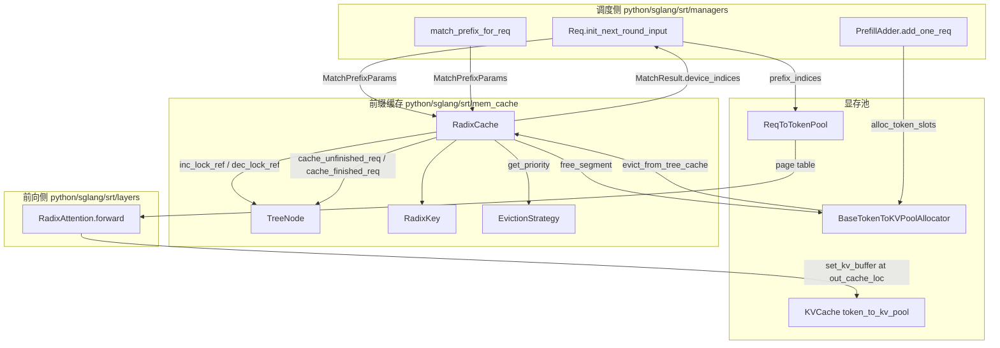
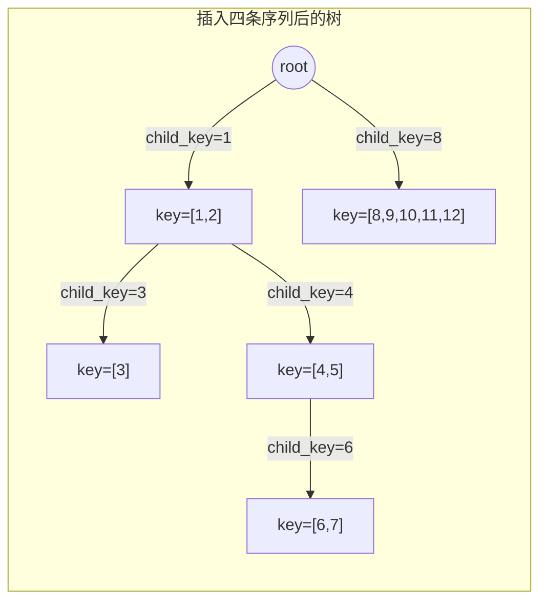
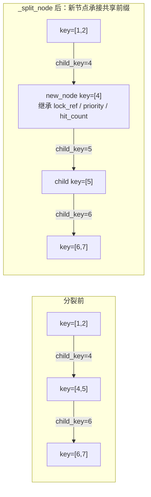
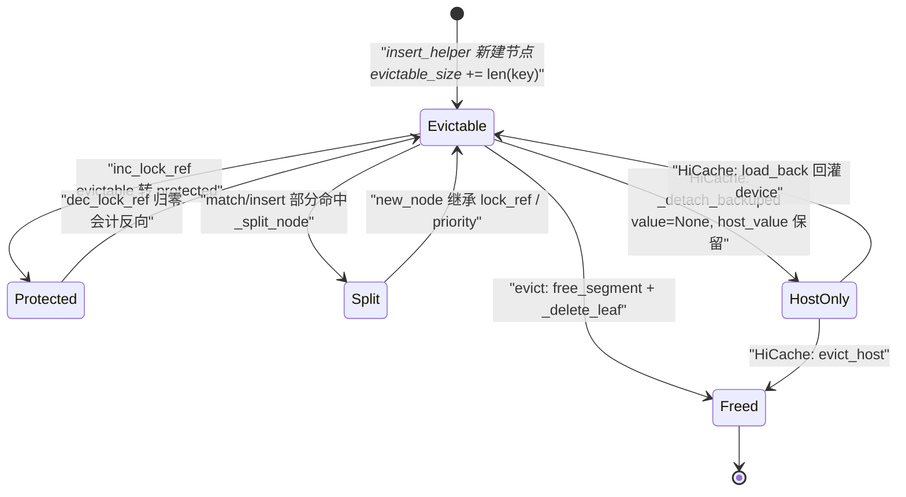
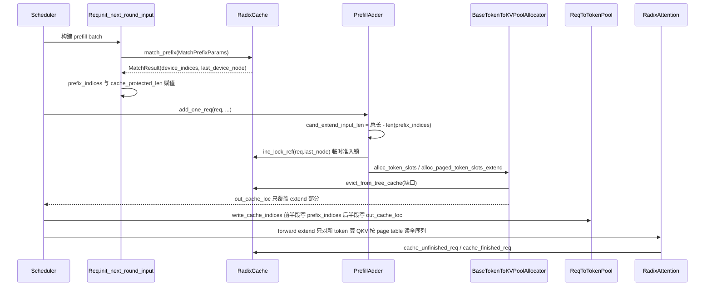
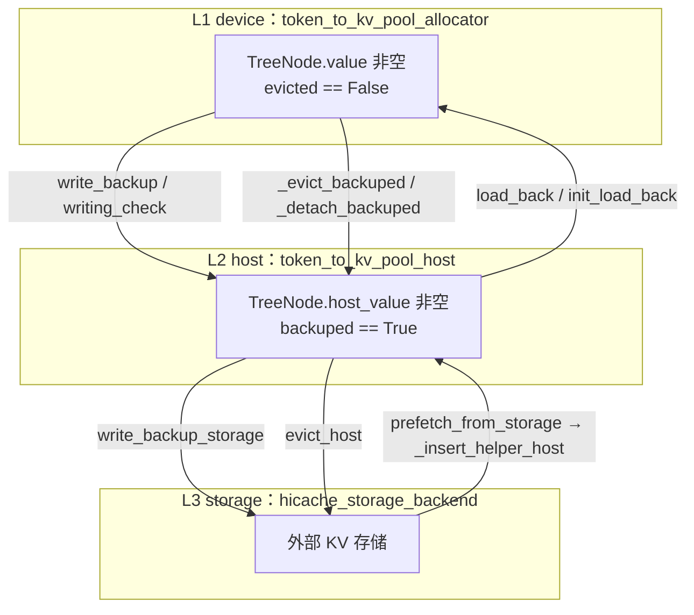

# RadixAttention 与 RadixCache：前缀 KV 复用的实现细节

> 唯一事实来源：`/home/kimmo/develop/sglang`，对齐 commit `e1c4db9621f7c4203ee9becd5d5456d4e6bf54f7`（2026-08-14）。本文所有论断均给出该 commit 下的文件与行号锚点。

## 0. 一图速览



---

## 1. What：两个同名不同层的东西

SGLang 里名字带 “Radix” 的有两处，职责完全不同，混淆它们是读这块代码最常见的第一个坎。

### 1.1 `RadixAttention` 是注意力层，不含任何树逻辑

`RadixAttention(nn.Module)` 定义在 `python/sglang/srt/layers/radix_attention.py:L91-L148`，构造签名为：

```python
class RadixAttention(nn.Module):
    def __init__(
        self,
        num_heads: int, head_dim: int, scaling: float, num_kv_heads: int,
        layer_id: int, logit_cap: float = 0.0, v_head_dim: int = -1,
        sliding_window_size: int = -1, is_cross_attention: bool = False,
        pos_encoding_mode: str = "NONE", logit_capping_method: str = "tanh",
        quant_config: Optional[QuantizationConfig] = None,
        attn_type: AttentionType = AttentionType.DECODER,
        use_irope: bool = False, prefix: str = "",
    ):
```

它的 `forward(self, q, k, v, forward_batch, save_kv_cache=True, key_value_num_tokens=None, **kwargs)`（`python/sglang/srt/layers/radix_attention.py:L150-L287`）做三件事：整形 K/V、决定走 tc-piecewise 的 custom op（`unified_attention_with_output`，见 `python/sglang/srt/layers/radix_attention.py:L403-L440`）还是直接 `get_attn_backend().forward(...)`。**整个文件里没有任何 radix 树、前缀匹配或淘汰代码**。真正把 K/V 落到显存池的是后端，例如 FlashAttention 后端在 `save_kv_cache` 为真时调用 `self.token_to_kv_pool.set_kv_buffer(layer, KVWriteLoc(cache_loc, ...), k, v, ...)`，写入位置来自 `forward_batch.out_cache_loc`（`python/sglang/srt/layers/attention/flashattention_backend.py:L1188-L1249`）。

也就是说：`RadixAttention` 只认 “把这批新 token 的 KV 写到 `out_cache_loc` 指定的槽位，并按 page table 读全序列”。前缀能否复用，对它是完全透明的——复用的表现只是 `out_cache_loc` 变短了、page table 前半段指向了别人写过的槽位。

### 1.2 `RadixCache` 才是那棵基数树

`RadixCache(KVCacheEventMixin, BasePrefixCache)` 定义在 `python/sglang/srt/mem_cache/radix_cache.py:L303-L331`，构造只接受一个参数对象 `CacheInitParams`（`python/sglang/srt/mem_cache/cache_init_params.py:L17-L57`），关键字段是 `req_to_token_pool`、`token_to_kv_pool_allocator`、`page_size`、`is_eagle`、`eviction_policy`。

树里有三类核心对象：

| 对象 | 位置 | 作用 |
| --- | --- | --- |
| `RadixKey` | `python/sglang/srt/mem_cache/radix_cache.py:L59-L235` | 逻辑 key：token 序列 + 命名空间（`extra_key` / `cache_salt`）+ bigram 视图 + `limit` 截断 |
| `TreeNode` | `python/sglang/srt/mem_cache/radix_cache.py:L238-L300` | 一条压缩边：`key`（本节点覆盖的 token 段）、`value`（对应的 KV 槽位下标张量）、`lock_ref`、`last_access_time`、`hit_count`、`host_value` |
| `RadixCache` | `python/sglang/srt/mem_cache/radix_cache.py:L303-L845` | 树的增删查改 + 淘汰 + 引用计数会计 |

**节点的 `value` 存的不是 KV 张量，而是 KV 槽位下标**（`torch.int64` 一维张量，`python/sglang/srt/mem_cache/radix_cache.py:L246`）。`insert` 传进来的 value 来自 `req_to_token_pool.req_to_token[req_pool_idx, :n]` 的拷贝（`python/sglang/srt/mem_cache/radix_cache.py:L488`、`L531`）。这是整套设计的支点：树只是 “token 序列 → 显存行号” 的索引，KV 本体始终躺在 `token_to_kv_pool` 里，谁都不搬。

### 1.3 命名空间：为什么同样的 token 有时不能共享

`RadixKey.child_key(page_size)`（`python/sglang/srt/mem_cache/radix_cache.py:L217-L229`）在构造 dict key 时会把 `extra_key` 和 `cache_salt` 一起编进去：

```python
if self.cache_salt is not None:
    return ((self.extra_key, self.cache_salt), plain)
return plain if self.extra_key is None else (self.extra_key, plain)
```

`match_prefix` 的 docstring 明确了动机（`python/sglang/srt/mem_cache/radix_cache.py:L376-L412`）：不同 LoRA/adapter、不同 cache 版本、不同检索上下文的请求，即使 token 前缀完全相同也**不允许**共享节点。而 `RadixKey.match` 在比较前会先做 `_check_compatible`，`extra_key` 或 `cache_salt` 不一致直接 `raise ValueError`（`python/sglang/srt/mem_cache/radix_cache.py:L169-L183`）——这是一个防御式断言：命名空间隔离靠 `child_key` 分桶保证，走到 `match` 时必然同名空间。

---

## 2. Why：几个关键设计选择的动机与代价

**为什么用 radix（压缩前缀树）而不是 “hash(prefix) → blocks” 的哈希表？**
三个原因在代码里都有对应物：(1) 分叉共享，一次 `_split_node` 就能让两个请求共享公共前缀而无需复制 value（`python/sglang/srt/mem_cache/radix_cache.py:L704-L727`）；(2) 淘汰粒度天然是 “叶子”，从叶子往根剥可以保证 “父前缀一定比子前缀活得久”，这条不变式让前缀复用率不会因为淘汰而出现 “中间空洞”（`evict` 只从 `evictable_leaves` 取，`python/sglang/srt/mem_cache/radix_cache.py:L592-L620`）；(3) 引用计数可以沿路径向根传播，一次 `inc_lock_ref` 就锁住整条前缀链（`python/sglang/srt/mem_cache/radix_cache.py:L622-L635`）。

**为什么 value 存下标而不是 KV？** 因为淘汰要做的事就变成 “把这些下标还给 allocator”，一行 `free_segment` 就够（`python/sglang/srt/mem_cache/radix_cache.py:L609`）；而且 page_size > 1 时，同一个 page 内的 token 下标在显存行里是连续的，释放可以用 stride 切片取 page 代表元，避免 `torch.unique` 带来的设备同步（`python/sglang/srt/mem_cache/allocator/paged.py:L273-L303`）。

**为什么 `RadixKey.match` 要写成 galloping + 二分？** 见 `python/sglang/srt/mem_cache/radix_cache.py:L188-L206` 的注释与实现：长共享前缀场景下逐 token 的 Python 循环是灾难，代码改为 “倍增窗口做整段 C 级切片比较，命中差异后在窗口内二分”，把 Python 层的比较次数降到 O(log n) 量级。这是 Python 实现的 radix 树能扛住长 prompt 的关键之一。

**为什么要 `lock_ref` 而不是等 GC？** 一个请求 match 到前缀后，这段 KV 在整个 prefill+decode 期间必须不被淘汰；`lock_ref` 从叶到根 +1，同时把节点的 token 数从 `evictable_size_` 搬到 `protected_size_`（`python/sglang/srt/mem_cache/radix_cache.py:L622-L656`）。调度器的准入判断直接读这两个数（`available_and_evictable_str`，`python/sglang/srt/mem_cache/base_prefix_cache.py:L419-L422`）。

**为什么维护 `evictable_leaves` 集合？** `evict` 需要 “当前所有可淘汰叶子”。若每次淘汰都全树 DFS，代价随树规模线性增长。代码改为在插入/删除/锁变更时增量维护一个 set（`_update_leaf_status`，`python/sglang/srt/mem_cache/radix_cache.py:L820-L833`），`evict` 只需一次 `heapify`（`python/sglang/srt/mem_cache/radix_cache.py:L598-L602`）。代价是这个 set 的正确性完全依赖所有修改路径都调用 `_update_leaf_status`——`_insert_helper`、`_delete_leaf`、`inc_lock_ref`、`dec_lock_ref` 四处都调了。

---

## 3. How：匹配路径 `match_prefix`

### 3.1 签名与语义

```python
def match_prefix(self, params: MatchPrefixParams) -> MatchResult:
```

锚点 `python/sglang/srt/mem_cache/radix_cache.py:L376-L434`。参数与返回值定义在 `python/sglang/srt/mem_cache/base_prefix_cache.py:L48-L56`（`MatchPrefixParams`）与 `L166-L206`（`MatchResult`）。返回值字段中与本层直接相关的是：

- `device_indices`：命中前缀对应的 KV 下标，`torch.int64` 一维张量，长度即 “可复用的 token 数”；
- `last_device_node` / `last_host_node` / `best_match_node`：命中终点节点。纯 `RadixCache` 下三者是同一个对象（`python/sglang/srt/mem_cache/radix_cache.py:L429-L434`）；
- `host_hit_length`：只有 HiCache 才非 0。

执行流水线是四步：`maybe_to_bigram_view` → 空 key 快速返回 → `page_aligned` 截断 → `_match_prefix_helper`。

其中 `page_aligned`（`python/sglang/srt/mem_cache/radix_cache.py:L150-L154`）把长度向下取整到 `page_size` 的倍数：**树里永远只存整 page**。`maybe_to_bigram_view`（`L156-L167`）是 EAGLE/投机解码的适配：把 N 个 raw token 视为 N-1 个 bigram 逻辑单元，`__len__`、`__iter__`、`__getitem__`、`child_key` 全部按 bigram 语义重载（`L99-L144`、`L217-L229`）。

### 3.2 `_match_prefix_helper`：逐层下钻 + 必要时分裂

```python
def _match_prefix_helper(self, node: TreeNode, key: RadixKey):
```

锚点 `python/sglang/srt/mem_cache/radix_cache.py:L678-L702`。循环体逻辑：

1. 用 `key.child_key(self.page_size)` 取首个逻辑单元作为 dict key，在 `node.children` 里查子节点；
2. `prefix_len = child.key.match(key, page_size=self.page_size)`；
3. 若 `prefix_len < len(child.key)`（只匹配了子节点的一部分），调用 `_split_node` 把子节点在 `prefix_len` 处劈成两截，取上半截作为终点并 `break`；
4. 否则整段命中，`value.append(child.value)`，`key = key[prefix_len:]`，继续下钻；
5. 沿路刷新 `last_access_time`（供 LRU/SLRU 使用）。

注意第 3 步：**`match_prefix` 是会修改树结构的读操作**，docstring 里专门写了 “This method may mutate internal structure by splitting an existing node”（`python/sglang/srt/mem_cache/radix_cache.py:L401-L411`）。分裂不复制 KV，只是把 value 张量切成两段（`child.value[:split_len].clone()` / `child.value[split_len:].clone()`，`L713-L716`），并同步切分 `hash_value` / `event_hash_value`（`L720-L725`，实现见 `python/sglang/srt/mem_cache/utils.py:L187-L211`）。

### 3.3 匹配与分裂图示

下图用 `python/sglang/srt/mem_cache/radix_cache.py:L848-L862` 自带的 `__main__` 示例（依次插入 `[1,2,3]`、`[1,2,4,5]`、`[1,2,4,5,6,7]`、`[8,9,10,11,12]`，然后用 `[1,2,3,13,14]` 查询），`page_size=1`：



查询 `[1,2,3,13,14]` 时：`root` 的 `children[1]` → `key=[1,2]` 全段命中（`prefix_len == len(child.key)`），继续用剩余 `[3,13,14]` 的 `child_key=3` 命中 `key=[3]` 全段，随后剩余 `[13,14]` 在 `children` 里查不到 → 循环结束。返回 `device_indices` 长度 3，`last_device_node` 是 `key=[3]` 这个节点。

若查询换成 `[1,2,4,6]`，则会在 `key=[4,5]` 上发生部分匹配（`prefix_len=1 < 2`），触发 `_split_node`：



`new_node` 继承 `child` 的 `parent`、`lock_ref`、`priority`、`hit_count`（`python/sglang/srt/mem_cache/radix_cache.py:L707-L717`）——**`lock_ref` 必须继承**，否则新插入的中间节点会被误判为可淘汰，把正在被引用的前缀释放掉。

---

## 4. How：插入路径与写树时机

### 4.1 `insert` 与 `_insert_helper`

```python
def insert(self, params: InsertParams) -> InsertResult:      # L436-L456
def _insert_helper(self, node, key: RadixKey, value,
                   priority: int = 0, chunked: bool = False) # L737-L790
```

`_insert_helper` 的返回值 `(total_prefix_length, last_node)` 语义非常关键：`total_prefix_length` 是 **“这次插入中，树里已经存在的那部分长度”**，也就是 “重复写入的 KV 数量”。调用方拿它来释放重复分配的显存槽位（下一节）。

循环逻辑与匹配几乎对称，额外做三件事：

- `node.priority = max(node.priority, priority)` 沿路径向上传播优先级（`L751`、`L768`、`L772`），供 `PriorityStrategy` 淘汰使用；
- `_inc_hit_count(node, chunked)`（`L729-L735`）：**chunked 请求不计命中**，注释解释了原因——分块 prefill 的后续 chunk 会命中自己上一个 chunk 建的节点，若计数会造成 LFU/SLRU 的自引用膨胀；
- 尾部新建节点时 `self.evictable_size_ += len(key)`，并调用 `_record_store_event(new_node)` 发出 `BlockStored` 事件给 KV-aware router（`L784-L788`，事件实现在 `python/sglang/srt/mem_cache/events.py:L76-L138`）。

`InsertParams.value` 允许为 `None`，此时 `insert` 会用 token id 本身当 value（`python/sglang/srt/mem_cache/radix_cache.py:L447-L451`），这是给 `create_simulated`（`L333-L349`）这类无显存池场景（例如调度器里用于 in-batch 前缀检测的 `waiting_queue_radix_tree`，`python/sglang/srt/managers/schedule_policy.py:L235`）准备的调试通路，**生产路径不要依赖它**。

### 4.2 两个写树时机：unfinished 与 finished

`cache_unfinished_req(self, req: Req, chunked=False)`（`python/sglang/srt/mem_cache/radix_cache.py:L515-L583`）在一次 prefill 之后调用，做了六件事，顺序不能乱：

1. 取 `req.get_fill_ids()`（即 `full_untruncated_fill_ids[:extend_range.end]`，`python/sglang/srt/managers/schedule_batch.py:L1273-L1274`）与对应的 `req_to_token` 行；
2. 构造 page 对齐的 `RadixKey`，`insert` 得到 `new_prefix_len`；
3. `free_segment(kv_indices[req.cache_protected_len : new_prefix_len], start_pos=req.cache_protected_len)`：把 “本次新算但树里已有” 的那段槽位还给 allocator（`L544-L547`）；
4. 重新 `match_prefix` 拿到树内的规范下标，并 `assert len(new_indices) == len(radix_key)`（`L550-L557`）；
5. `req_to_token_pool.write(...)` 把规范下标写回请求行——**这一步是 “去重” 的关键**：此后该请求读的是树里那份 KV，而不是自己刚写的那份；
6. 更新 `req.cache_protected_len`、`dec_lock_ref(旧 last_node)` + `inc_lock_ref(新 last_node)`、更新 `req.prefix_indices` 与 `req.last_node`。

`cache_finished_req(self, req, is_insert=True, *, kv_len_to_handle: int)`（`L458-L513`）在请求结束时调用。它把 `origin_input_ids + output_ids` 一并插入（把生成的 token 也变成可复用前缀），然后用 `free_segments([...])` 一次性释放两段：重复段 `[cache_protected_len, freed_end)` 与非 page 对齐的尾巴 `[key_len, ...)`（`L501-L509`）。`free_segments` 的语义见 `python/sglang/srt/mem_cache/allocator/base.py:L133-L149`——它保证跨段共享的边界 page 只被释放一次。

`req.cache_protected_len` 存在的理由写在代码注释里（`python/sglang/srt/mem_cache/radix_cache.py:L564-L567`）：`page_size > 1` 时，尾部不足一 page 的部分会留在 `req.prefix_indices` 里但**没有**进树，因此不能用 `len(prefix_indices)` 当 “已被树保护的长度”，必须单独记账，否则这部分槽位会泄漏或被双重释放。

### 4.3 `disable` 模式

`--disable-radix-cache`（`python/sglang/srt/server_args.py:L929-L931`）下 `self.disable=True`，`match_prefix` 直接返回 `_empty_match_result`（`L416-L417`），`cache_finished_req` 退化成 “把 `[cache_protected_len, kv_len_to_handle)` 全部释放”（`L466-L474`）。注意 `disable=True` 时对象仍然存在、仍然承担 “释放显存” 的职责，并不是空实现。

---

## 5. How：淘汰路径与 memory pool 的耦合点

### 5.1 `evict` 的实现

```python
def evict(self, params: EvictParams) -> EvictResult:   # L592-L620
```

流程：

1. `leaves = list(self.evictable_leaves)`，用 `self.eviction_strategy.get_priority(node)` 构建小顶堆并 `heapify`（`L598-L602`）；
2. 循环弹出优先级最小者 `x`，调用 `self.token_to_kv_pool_allocator.free_segment(x.value, start_pos=0)` 归还槽位，累加 `num_evicted += len(x.value)`，再 `_delete_leaf(x)` 把节点摘链（`L606-L611`）；
3. 若 `x.parent` 变成了无子节点且 `lock_ref == 0`，把父节点压回堆里，实现 “自底向上逐层剥离”（`L613-L615`）；
4. `_record_remove_event(x)` 发 `BlockRemoved` 事件；
5. `update_eviction_metrics(num_evicted, start_time)` 上报指标（实现见 `python/sglang/srt/mem_cache/base_prefix_cache.py:L251-L256`）。

**淘汰策略是可插拔的**：`get_eviction_strategy(policy)` 工厂支持 `lru / lfu / fifo / mru / filo / priority / slru`（`python/sglang/srt/mem_cache/utils.py:L56-L75`），各策略的 `get_priority` 只有一到两行（`python/sglang/srt/mem_cache/evict_policy.py:L10-L65`）：LRU 返回 `last_access_time`、LFU 返回 `(hit_count, last_access_time)`、SLRU 按 `hit_count >= protected_threshold` 分两段、Priority 返回 `(node.priority, last_access_time)`。CLI 开关是 `--radix-eviction-policy`（`python/sglang/srt/server_args.py:L911-L923`）。堆里放的是 `(priority, node)` 二元组，`TreeNode.__lt__` 按 `last_access_time` 比较（`python/sglang/srt/mem_cache/radix_cache.py:L299-L300`），保证优先级相同时不会因为 `TreeNode` 不可比较而抛异常。

### 5.2 耦合点一：谁触发淘汰

淘汰不是后台线程，而是**分配前的同步动作**。`alloc_token_slots` / `alloc_paged_token_slots_extend` 在真正 `allocator.alloc(...)` 之前先调 `evict_from_tree_cache`（`python/sglang/srt/mem_cache/allocation.py:L146-L166`、`L193-L249`）：

```python
def evict_from_tree_cache(tree_cache: BasePrefixCache | None, num_tokens: int):
    ...
    available_size = allocator.available_size()
    if available_size < num_tokens:
        tree_cache.evict(EvictParams(num_tokens=num_tokens - available_size))
```

锚点 `python/sglang/srt/mem_cache/common.py:L105-L129`。两个细节值得注意：只淘汰 “缺口”（`num_tokens - available_size`）而不是一次性清空；分页路径会额外按 “每请求多算一个 page” 做保守估计（`python/sglang/srt/mem_cache/allocation.py:L205-L208`）。若淘汰后仍分配失败，会 `logger.error` + `tree_cache.pretty_print()` 后抛 `RuntimeError`（`L155-L164`）——线上看到 “Out of memory. Try to lower your batch size” 伴随一棵树的打印，就是这里。

### 5.3 耦合点二：怎么还显存

`evict` 用的是 `free_segment(x.value, start_pos=0)` 而不是 `free(x.value)`。代码注释说明了前提：“Tree values are page-aligned copies of a kv row: page-exact segment”（`python/sglang/srt/mem_cache/radix_cache.py:L608`）。分页 allocator 的 `free_segment`（`python/sglang/srt/mem_cache/allocator/paged.py:L273-L303`）在 `start_pos % page_size == 0` 时直接取 `free_index[::ps]` 作为 page 代表元，从而避免 `torch.unique` 的数据相关输出形状（会强制 device 同步）。

这条优化能成立，依赖一条贯穿全文的不变式：**任何 `TreeNode.value` 的长度都是 `page_size` 的整数倍，且起点落在 page 边界上**。它由两处共同保证：`RadixKey.page_aligned` 在入树前截断（`L150-L154`），`RadixKey.match` 在 `page_size > 1` 时把匹配长度向下取整（`L210`、`L213-L215`），因此 `_split_node` 的切点也必然是 page 的整数倍。改动这块代码时若破坏了该不变式，症状不是断言失败，而是**释放到错误的 page**，表现为极难定位的 KV 内容错乱。

### 5.4 节点状态机



`Protected` 态下节点绝不会进入 `evictable_leaves`：`_update_leaf_status` 的第一条判断就是 `if node.evicted or node.lock_ref > 0:` 则从集合移除并返回（`python/sglang/srt/mem_cache/radix_cache.py:L820-L824`）。

---

## 6. 命中前缀之后，如何真正跳过 prefill

这是本篇最需要跨文件读的部分。链路如下：



三个精确锚点：

1. **计算要算多少 token**：`cand_extend_input_len = len(req.full_untruncated_fill_ids) - len(req.prefix_indices)`（`python/sglang/srt/managers/schedule_policy.py:L1223-L1225`）。命中越长，这个数越小，`_update_prefill_budget` 里扣的预算也越少（`python/sglang/srt/managers/schedule_policy.py:L857-L913`，其中 `log_hit_tokens += prefix_len` 就是前缀命中率指标的来源）。
2. **拼接 page table**：`write_cache_indices` 对每个请求写两段——`[0, prefix_len)` 写 `prefix_tensors[i]`（即 `req.prefix_indices`，指向别人写过的槽位），`[prefix_len, seq_len)` 写本次新分配的 `out_cache_loc` 切片（`python/sglang/srt/mem_cache/allocation.py:L55-L101`，调用点 `L371-L384`）。attention 后端按这张表读 KV，因此复用前缀对 kernel 完全透明。
3. **临时准入锁**：`PrefillAdder` 在做预算判断的临界区里用 `with self._lock_node(req.last_node)` 把命中前缀锁住（`python/sglang/srt/managers/schedule_policy.py:L1048-L1063`、调用点 `L1273`），退出时 `dec_lock_ref`。这防止 “A 请求刚 match 到的前缀，被同批次 B 请求的分配动作淘汰掉”。真正被接纳后再由 `_req_inc_lock_ref` 持久加锁（`L950-L956`）。

还有一个容易忽略的边界：`_compute_max_prefix_len`（`python/sglang/srt/managers/schedule_batch.py:L1416-L1421`）把可匹配长度限制为 `input_len - 1`，注释写明 “the matched length is at most 1 less than the input length to enable logprob computation”。也就是说**即使 100% 命中，也必须至少 prefill 一个 token**——否则这一步没有任何 logits 可算。开了 `return_logprob` 时还会进一步被 `logprob_start_len` 压低。

调度侧还有一个等价入口 `match_prefix_for_req(tree_cache, req, token_ids=None, *, cow_mamba=False, include_req=False)`（`python/sglang/srt/managers/schedule_policy.py:L138-L197`），它与 `Req.init_next_round_input`（`python/sglang/srt/managers/schedule_batch.py:L1358-L1396`）做的是同一件事：调用 `match_prefix` 后把结果打散赋值给 `req.prefix_indices / last_node / last_host_node / best_match_node / host_hit_length` 等字段。

调试开关：`SGLANG_RADIX_FORCE_MISS`（`python/sglang/srt/environ.py:L586`）会用 `zero_match_result` 把匹配结果强制清零（`python/sglang/srt/managers/schedule_policy.py:L168-L171`、`python/sglang/srt/mem_cache/base_prefix_cache.py:L209-L227`），排查 “是不是缓存命中导致的结果差异” 时很有用。

---

## 7. 多级缓存：HiCache 确实存在

`grep HiCache` 的结论是明确的：仓库里有完整的 L1(device)/L2(host)/L3(storage) 三级实现，入口类是 `HiRadixCache(RadixCache)`（`python/sglang/srt/mem_cache/hiradix_cache.py:L76-L215`），由 `--enable-hierarchical-cache` 经工厂选择链选中（`python/sglang/srt/mem_cache/registry.py:L117-L129`）。



关键机制与锚点：

- **节点变成双态**。`TreeNode.evicted` 定义为 `self.value is None`，`backuped` 定义为 `self.host_value is not None`（`python/sglang/srt/mem_cache/radix_cache.py:L268-L274`）。HiCache 淘汰 device 时不删节点，只把 `value` 置 `None`（`_detach_backuped`，`python/sglang/srt/mem_cache/hiradix_cache.py:L1264-L1275`），节点变成 “只在 host 上有” 的 tombstone。
- **匹配要跨层**。`HiRadixCache.match_prefix`（`python/sglang/srt/mem_cache/hiradix_cache.py:L1737-L1768`）复用同一棵树，但 `_match_prefix_helper` 只把非 evicted 节点的 value 收进 `device_indices`（`L1855-L1879`），随后向上回溯统计 `host_hit_length`，并把 `last_host_node` 定位到最近的 `backuped` 祖先。这就是 `MatchResult.host_hit_length` 的来源，调度侧用它算 `real_input_tokens = cand_extend_input_len - req.host_hit_length`（`python/sglang/srt/managers/schedule_policy.py:L1232-L1233`）——host 命中的部分是 “搬回来”，不是 “重算”。
- **两种写策略两种淘汰**。`HiRadixCache.evict` 按 `cache_controller.write_policy` 分派（`python/sglang/srt/mem_cache/hiradix_cache.py:L1188-L1196`）：`_evict_write_through`（`L1212-L1228`）直接丢未备份叶子、降级已备份叶子；`_evict_write_back`（`L1230-L1262`）会尝试先把叶子刷到 host 再降级，host 也满时才 `_drop_subtree_no_host` 整棵子树丢弃并打 warning（`L1293-L1336`）。host 层自己也有一套 LRU：`evict_host`（`L1338-L1371`）只淘汰已经 `evicted` 且 `host_ref_counter == 0` 的节点。
- **L3 预取**。`prefetch_from_storage`（`L1770-L1810`）以 `last_host_node` 为锚点发起异步预取，命中的页通过 `_insert_helper_host`（`L1812-L1853`）插成 “只有 host_value、value=None” 的节点，并发 `StorageMedium.CPU` 的 store 事件。

> **[OPEN]** `HiRadixCache.match_prefix` 目前把 `best_match_node` 直接置为 `last_host_node`，而代码里留有 `TODO(ispobock): use best_match_node as start node for load_back`（`hiradix_cache.py:L1765-L1766`），与 `MatchResult` docstring 描述的 “多组件校验后的最深节点” 语义（`base_prefix_cache.py:L176-L181`）并不完全一致。

另一条独立实现是实验性 C++ 树：`RadixCacheCpp`（`python/sglang/srt/mem_cache/radix_cache_cpp.py:L35-L85`），由 `SGLANG_EXPERIMENTAL_CPP_RADIX_TREE` 开启（`python/sglang/srt/environ.py:L585`、选择链 `python/sglang/srt/mem_cache/registry.py:L97-L102`）。它把树逻辑下沉到 `RadixTreeCpp`（JIT 编译 `tree_v2.cpp`，Python 侧接口声明在 `python/sglang/srt/mem_cache/cpp_radix_tree/radix_tree.py:L52-L102`），Python 只剩薄封装：`match_prefix` 直接转发 `raw_token_ids()`（`radix_cache_cpp.py:L108-L120`），插入走 `tree.writing_through(key, value)` 并返回 “已在 device 上的下标数”（`L122-L136`），`evict` 拿回被淘汰的下标张量列表再逐个 `allocator.free(...)`（`L158-L169`）。当前它有两条硬限制：`cache_salt` 直接 `raise ValueError`（`L36-L41`），`enable_hierarchical_cache` 时 `raise NotImplementedError("Host cache is not supported yet")`（`L75-L85`）。

> **[OPEN]** C++ 树的 `enable_write_cancel` 构造参数只被赋值、从未被读取（全仓库仅 `radix_cache_cpp.py:L47` 与 `L50` 两处出现）；它是为写取消功能预留还是历史遗留，需要确认。

树实现的选择顺序完整写在 `default_radix_cache_factory`（`python/sglang/srt/mem_cache/registry.py:L79-L160`）：`ChunkCache` → `RadixCacheCpp` → `UnifiedRadixCache` → `PureSWARadixCache` → `HiRadixCache` → `LMCRadixCache` / flexkv → 默认 `RadixCache`。本文描述的是最后这条基线路径；SWA / Mamba / DSA 等混合模型走的是 `unified_radix_cache.py`，其组件化设计是另一个话题。

---

## 8. 边界与坑

1. **`match_prefix` 会改树**。它可能触发 `_split_node`，所以不能当纯读操作在只读上下文里调用；`_split_node` 里若忘记继承 `lock_ref`（`python/sglang/srt/mem_cache/radix_cache.py:L711`），正被引用的前缀会被判为可淘汰。
2. **page 对齐的尾巴不进树**。`page_size > 1` 时不足一 page 的尾部只留在 `req.prefix_indices` 中，靠 `req.cache_protected_len` 单独记账，由下一次 `cache_unfinished_req` 或最终 `cache_finished_req` 释放（注释见 `L564-L567`）。自定义 cache 子类若忘了维护它，就是显存泄漏。
3. **`_empty_match_result` 是共享对象**。`reset()` 里构造一次并被所有 miss 请求返回（`L364-L373`、`L416-L422`），其中 `device_indices` 是同一个空张量。任何 “原地修改 match 结果” 的写法都会跨请求污染。
4. **`children` 是 `defaultdict(TreeNode)`**（`L243`）。所有查找路径都必须先 `child_key in node.children.keys()` 再取值（`L685`、`L758`），否则一次误访问就会静默插入一个 `key=None` 的幽灵节点，后续 `len(node.key)` 直接崩。
5. **EAGLE bigram 的长度换算**。`is_bigram` 下 `len(key) = raw_len - 1`，`insert` 会把 value 截到 `len(key)`（`L445-L448`、`L166`）；`RadixKey.match` 的 bigram 分支是 `min(matched_tokens - 1, ...)` 再向下取整到 page（`L208-L210`）。手工构造 `RadixKey` 时长度对不上，症状是 `cache_unfinished_req` 里那条 `assert len(new_indices) == len(radix_key)`（`L555-L557`）当场炸掉。
6. **chunked 请求不能计 hit_count**。见 `_inc_hit_count` 的注释（`L729-L735`）。用 LFU/SLRU 时若绕过这个开关，分块 prefill 会把自己造的节点刷成 “高频”，彻底打乱淘汰顺序。
7. **淘汰是同步阻塞的**。`evict` 在分配路径上被调用（`python/sglang/srt/mem_cache/allocation.py:L151`、`L208`），每次都会 `list(evictable_leaves)` + `heapify`，叶子极多时是可观的 CPU 开销，指标可从 `observe_eviction_duration` 观察（`python/sglang/srt/mem_cache/base_prefix_cache.py:L251-L256`）。
8. **`disable=True` 不等于什么都不做**。它仍然负责在 `cache_finished_req` 里释放请求的 KV（`L466-L474`），只是不建树。
9. **`total_size()` 与 `evictable_size()` 不是一回事**。`_total_size_helper`（`L835-L845`）遍历全树累加 `len(node.value)` 且跳过 evicted 节点，而 `evictable_size_` 是增量维护的 “未被锁住的 token 数”；`protected_size_` 才是被锁住的部分（`L658-L663`）。三者的差值恰好是诊断 “前缀锁泄漏” 的抓手。

> **[OPEN]** `RadixCache.evict` 在弹堆后不再复查 `x.lock_ref > 0`（`L606-L611`），而 `HiRadixCache._evict_write_through` 会复查（`hiradix_cache.py:L1221-L1222`）。在单线程调度器下前者应当安全（`evictable_leaves` 由 `_update_leaf_status` 在锁变更时同步维护），但这处不对称是有意为之还是历史遗留，需要确认。

---

## 9. 锚点速查

| 主题 | 锚点 |
| --- | --- |
| `RadixKey` / `match` / `child_key` | `python/sglang/srt/mem_cache/radix_cache.py:L59-L235` |
| `TreeNode` | `python/sglang/srt/mem_cache/radix_cache.py:L238-L300` |
| `match_prefix` / `_match_prefix_helper` | `python/sglang/srt/mem_cache/radix_cache.py:L376-L434`、`L678-L702` |
| `_split_node` | `python/sglang/srt/mem_cache/radix_cache.py:L704-L727` |
| `insert` / `_insert_helper` | `python/sglang/srt/mem_cache/radix_cache.py:L436-L456`、`L737-L790` |
| `cache_unfinished_req` / `cache_finished_req` | `python/sglang/srt/mem_cache/radix_cache.py:L515-L583`、`L458-L513` |
| `evict` / `inc_lock_ref` / `dec_lock_ref` | `python/sglang/srt/mem_cache/radix_cache.py:L592-L620`、`L622-L656` |
| 淘汰策略 | `python/sglang/srt/mem_cache/evict_policy.py:L10-L65`、`python/sglang/srt/mem_cache/utils.py:L56-L75` |
| 淘汰触发点 | `python/sglang/srt/mem_cache/common.py:L105-L129`、`python/sglang/srt/mem_cache/allocation.py:L146-L166` |
| page table 拼接 | `python/sglang/srt/mem_cache/allocation.py:L55-L101` |
| `MatchResult` 语义 | `python/sglang/srt/mem_cache/base_prefix_cache.py:L166-L206` |
| HiCache 三级 | `python/sglang/srt/mem_cache/hiradix_cache.py:L1188-L1262`、`L1338-L1371`、`L1737-L1810` |
| C++ 树 | `python/sglang/srt/mem_cache/radix_cache_cpp.py:L35-L169` |
| 实现选择链 | `python/sglang/srt/mem_cache/registry.py:L79-L160` |
| `RadixAttention` | `python/sglang/srt/layers/radix_attention.py:L91-L287` |

相关文档：内存池与 allocator 见 deep-dive/memory-pool.md，调度器主循环见 deep-dive/scheduler.md，attention 后端如何消费 page table 见 deep-dive/attention-backends.md。本文遗留的不确定项汇总在 appendix/_openq_radix-cache.md。
