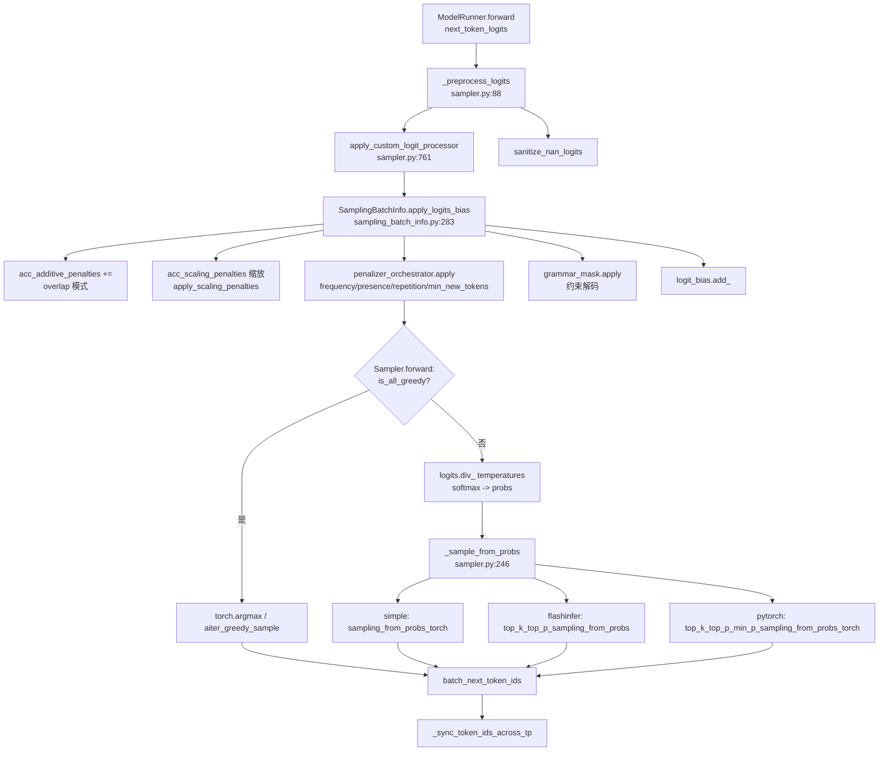

# SGLang 采样（Sampling）源码深度解析

本文档基于 SSOT 路径 `python/sglang/srt/sampling/` 与 `python/sglang/srt/layers/sampler.py` 的源码（对齐 commit `e1c4db9621f7c4203ee9becd5d5456d4e6bf54f7`）整理，聚焦采样参数的定义、logits 在采样前的修改（penalty / bias / grammar mask）、penalty 的增量统计，以及 batch 内多请求的高效（vectorized）采样执行。

## 1. What：采样子系统由哪些组件构成

SGLang 的采样被拆分为「参数」「批量元信息」「penalty 编排器」「实际采样内核」四层，职责清晰、互不耦合：

- **`SamplingParams`**（`sampling_params.py:45-L90`）：单个请求的可序列化采样参数。它继承自 `msgspec.Struct`，因此既是 API 入参（`/generate`、`/chat/completions`），也能在 scheduler ↔ worker 间用 msgpack IPC 高效传输。所有数值型参数都带默认值，且区分「API 参数」与「内部填充字段」（如 `stop_strs`、`is_normalized`）。
- **`SamplingBatchInfo`**（`sampling_batch_info.py:28-L85`）：把一个 `ScheduleBatch` 内所有请求的标量采样参数沿 batch 维堆叠成 GPU tensor（如 `temperatures`、`top_ps`、`top_ks`、`min_ps`），并持有 `penalizer_orchestrator`、`grammar_mask`、`logit_bias`、`custom_logit_processor` 等批量状态。它是模型 `forward` 之后、采样之前的唯一输入。
- **`BatchedPenalizerOrchestrator` + 各 `*Penalizer`**（`penaltylib/orchestrator.py:13-L29`、`penaltylib/__init__.py`）：把 frequency / presence / repetition / min_new_tokens 四种惩罚统一编排。每个 penalizer 维护自己的累积 tensor（`_is_required()` 自判是否需要），从而保证「未使用某 penalty 时零开销」。
- **`Sampler`**（`layers/sampler.py:70-L244`）：拿到模型输出的 `next_token_logits` 与 `SamplingBatchInfo`，依次完成「预处理 logits → 施加 penalty/bias/grammar mask → softmax → 按 batch 内每请求各自的策略采样」。

> **关键结论**：采样在 SGLang 中不是「对单个序列循环调用」，而是一个把全部请求并入一个 `[batch, vocab]` 张量、用向量化/融合 kernel 一次性完成的操作。`SamplingBatchInfo` 把「每请求不同的策略」编码进 tensor（而非 Python 分支），从而让 CUDA kernel（flashinfer / sgl_kernel）可以整批并行。

## 2. SamplingParams 参数体系

`SamplingParams` 的字段分为「概率采样控制」「停止条件」「结构化约束」「token 级干预」四类。`__post_init__`（`sampling_params.py:91-L149`）负责把 `None` 归一为默认值，并对 `0 <= temperature < 1e-6` 做特殊归并——将其强制转为贪婪采样（`top_k = 1`）。`verify()`（`sampling_params.py:151-L210`）在引擎入口处对范围做硬性校验（如 `top_p ∈ (0,1]`、`repetition_penalty ∈ (0,2]`、`frequency/presence_penalty ∈ [-2,2]`）。

| 参数 | 含义 | 代码锚点 |
|---|---|---|
| `temperature` | 温度缩放，先 `logits /= temperature`（`sampler.py:189`）；`<1e-6` 时退化为贪婪（`sampling_params.py:144-L147`） | `sampling_params.py:62`, `sampler.py:189` |
| `top_p` | nucleus 截断：保留累计概率 ≤ top_p 的最小 token 集合 | `sampling_params.py:63`, `sampler.py:583` |
| `top_k` | 仅保留概率最大的 k 个；`-1` 归一为 `TOP_K_ALL = 1<<30`（全词表） | `sampling_params.py:64`, `sampling_params.py:148-L149`, `sampler.py:282` |
| `min_p` | 以最大概率的 `min_p` 倍为阈值过滤低概率 token | `sampling_params.py:65`, `sampler.py:590` |
| `frequency_penalty` | 已出现过的 token，按出现次数线性减分（可负可正） | `sampling_params.py:66`, `penaltylib/frequency_penalty.py:42-L43` |
| `presence_penalty` | 出现过即减固定分，与次数无关 | `sampling_params.py:67`, `penaltylib/presence_penalty.py:42-L43` |
| `repetition_penalty` | 乘性惩罚（>1 惩罚、<1 奖励）已出现 token 的 logit | `sampling_params.py:68`, `penaltylib/repetition_penalty.py:9-L15`, `:55-L57` |
| `min_new_tokens` | 在达到该长度前，禁止采样 stop / eos token | `sampling_params.py:69`, `penaltylib/min_new_tokens.py:73-L78` |
| `n` | 单请求产出 n 条序列（见下方 **OPEN**） | `sampling_params.py:70` |
| `logit_bias` | 直接给指定 token 的 logit 加偏置 | `sampling_params.py:80`, `sampling_batch_info.py:134-L140`, `:299-L300` |
| `json_schema` / `regex` / `ebnf` / `structural_tag` | 结构化输出约束，互斥（`sampling_params.py:201-L210`） | `sampling_params.py:71-L74`, `sampling_params.py:207-L210` |
| `ignore_eos` | 忽略 eos，持续生成 | `sampling_params.py:75` |
| `sampling_seed` | 确定性采样种子（`multinomial_with_seed`） | `sampling_params.py:81`, `sampler.py:684-L725` |
| `custom_params` | 传给自定义 logit processor 的 JSON 安全参数 | `sampling_params.py:82`, `custom_logit_processor.py:24` |

`normalize(tokenizer)`（`sampling_params.py:212-L254`）把字符串型 `stop` / `stop_regex` 编码为 token 序列并计算最大匹配长度（`stop_str_max_len`），随后把原始别名清空、置 `is_normalized=True`。它还会通过 `raise_if_tokenizer_required`（`sampling_params.py:305-L332`）在 `skip_tokenizer_init=True` 时拒绝依赖 tokenizer 的特性（字符串 stop、`min_new_tokens`）。

> **[OPEN]** `SamplingParams.n`（`sampling_params.py:70`）在 sampling 模块内部未被沿 batch 维展开；`n>1` 究竟由 scheduler 克隆 `Req` 实现、还是当前引擎不支持，未能从采样源码确证，详见 appendix/_openq_sampling.md。

## 3. How：采样执行路径

### 3.1 从 schedule batch 到 GPU tensor

`SamplingBatchInfo.from_schedule_batch`（`sampling_batch_info.py:86-L220`）是入口：它遍历 `batch.reqs`，用 `pin_memory` + `non_blocking` H2D 把每个请求的标量参数堆叠成 tensor（`temperatures.view(-1,1)`、`top_ps` 等），并据参数分布计算批量级布尔开关：`is_all_greedy`（全部 `top_k<=1`）、`is_any_greedy`、`need_top_p_sampling`、`need_top_k_sampling`、`need_min_p_sampling`（`sampling_batch_info.py:204-L208`）。这些开关让 `Sampler.forward` 在 `is_all_greedy` 时直接走 `torch.argmax` 快速路径（`sampler.py:126-L133`），避免 softmax 与采样 kernel 的浪费。

`logit_bias` 在 `from_schedule_batch` 中被构建为 `[batch, vocab]` 的全零张量，仅对设置了 `logit_bias` 的请求按 key 写入偏置值（`sampling_batch_info.py:134-L140`）。注意其 key 是字符串（见 `CustomParamValue` 定义 `sampling_params.py:33-L37`），写入时用 `int(key)` 转换。

### 3.2 采样主体

`Sampler.forward`（`sampler.py:97-L244`）流程如下：

1. **预处理**：`_preprocess_logits`（`sampler.py:88-L95`）先应用自定义 logit processor（若 `has_custom_logit_processor`），再做 `sanitize_nan_logits` 防止 NaN/logits 污染。
2. **分支**：`is_all_greedy` 直接 `argmax`；否则 `logits.div_(temperatures)`（`sampler.py:189`）→ `softmax`（`sampler.py:207`）→ `_sample_from_probs`（`sampler.py:210`）。
3. **采样**：`_sample_from_probs`（`sampler.py:246-L296`）在 `simple_sampling_case`（无 top_p/top_k/min_p）时调用 `sampling_from_probs_torch`（纯 multinomial）；否则按后端分派：flashinfer 的 `top_k_top_p_sampling_from_probs` / `min_p_sampling_from_probs`（`sampler.py:266-L282`），或 pytorch 回退 `top_k_top_p_min_p_sampling_from_probs_torch`（`sampler.py:283-L293`，实现见 `sampler.py:563-L608`——按降序排序后用 `cumsum` 做 top-p 截断、用 `>= top_ks` 做 top-k 截断）。
4. **确定性**：当 `enable_deterministic` 且带 `sampling_seed` 时，用 Gumbel 技巧的 `multinomial_with_seed`（`sampler.py:684-L725`）：对 `seed`、`positions`、`col_indices` 做 `murmur_hash32` 生成均匀噪声，再 `-log(-log(x))` 得到 Gumbel 噪声，加回 logprobs 后 `argmax`。全程 float64 以保证数值稳定。
5. **TP 同步**：`_sync_token_ids_across_tp`（`sampler.py:493-L508`）默认不同步（省一次 all-reduce），但 `SYNC_TOKEN_IDS_ACROSS_TP` 或含 `grammars` 时做 `ReduceOp.MIN` 以防止 TP rank 因采样 kernel 非确定性而错位。

### 3.3 Penalty 的增量统计与施加

`BatchedPenalizerOrchestrator` 在 `from_schedule_batch` 中按固定集合实例化了四个 penalizer（`sampling_batch_info.py:187-L196`）：`BatchedFrequencyPenalizer`、`BatchedMinNewTokensPenalizer`、`BatchedPresencePenalizer`、`BatchedRepetitionPenalizer`。每个 penalizer 在构造期通过 `prepare_if_required()` 自判是否需要（`_is_required()` 检查 batch 中是否有请求设置了对应非零参数），仅当需要时 `prepare()` 才分配 `[batch, vocab]` 张量（`orchestrator.py:25-L29`）。

**增量统计**（核心创新点）：每步 decode 后，`ScheduleBatch.cumulate_penalty_output_tokens`（`schedule_batch.py:3000-L3019`）取各请求的「最近一个 output token」，以非阻塞 H2D 上传，并调用 `cumulate_output_tokens`，由 orchestrator 转发给每个已 prepared 的 penalizer。各 penalizer 用 `scatter_add_` / `scatter_` 把本次 token 对应的惩罚值累加进 `[batch, vocab]` 累积张量，而非每步重扫历史序列：

- Frequency：`cumulated_frequency_penalties.scatter_add_(index=output_ids, src=frequency_penalties)`（`frequency_penalty.py:35-L40`），`apply` 时 `logits.sub_(cumulated)`（`frequency_penalty.py:42-L43`）——出现次数越多，减分线性越大。
- Presence：同样 `scatter_`（非 add，因为只记「是否出现」，`presence_penalty.py:35-L40`），`apply` 时 `logits.sub_(cumulated)`（`presence_penalty.py:42-L43`）——只要出现过就减固定值，与次数无关。
- Repetition：乘性，`is_multiplicative=True`（`repetition_penalty.py:23`）。`scatter_` 累加缩放因子（`repetition_penalty.py:48-L53`），`apply` 走 `apply_scaling_penalties`（`repetition_penalty.py:9-L15`，`@torch.compile` 融合）：`logits<0` 时 `logits*scale`，否则 `logits/scale`。
- MinNewTokens：`_prepare` 时把 stop/eos token 列标为 `-inf`（`min_new_tokens.py:25-L62`），`_apply` 时在「当前输出长度 < min_new_tokens」的布尔掩码行上把这些 token 的 logit 加上 `-inf`（`min_new_tokens.py:73-L78`）。注释特别指出用 `torch.where` 而非布尔索引，以避免 data-dependent 的 device→host 同步与 `-inf*0=nan` 问题。

**施加顺序**（`apply_logits_bias`，`sampling_batch_info.py:283-L300`）：先叠加 overlap 模式的 `acc_additive_penalties`、再 `apply_scaling_penalties` 缩放、再 `penalizer_orchestrator.apply`、再 `grammar_mask.apply`、最后 `logit_bias.add_`。实际在 `ModelRunner._preprocess_logits`（`model_runner.py:1754-L1769`）被调用——注意 penalty 与 grammar mask 在此阶段一次性并入 `next_token_logits`，随后 `grammar_mask` 立即置空以释放显存。

## 4. 自定义 Logit Processor

`CustomLogitProcessor` 是抽象基类（`custom_logit_processor.py:24-L44`），`__call__(logits, custom_param_list)` 接收整批 logits 并返回修改后的 logits。`to_str` / `from_str` 用 `dill` + `orjson` 序列化（带 `lru_cache` 去重反序列化）。SGLang 内置了多个实例：

- `DisallowedTokensLogitsProcessor`（`custom_logit_processor.py:47-L58`）：把禁用的 token 置 `-inf`（bad words）。
- `ThinkingBudgetLogitProcessor` 及其子类（GLM-4.x / Qwen3 / DeepSeek-R1 / Inkling，`custom_logit_processor.py:71-L152`）：通过 `THINKING_START/END_TOKEN_ID` 控制思考块长度，预算用尽后强制把 `THINKING_END_TOKEN_ID` 的 logit 抬到最高。
- `DeepseekOCRNoRepeatNGramLogitProcessor`（`custom_logit_processor.py:156-L218`）：滑动窗口内屏蔽 n-gram 重复。

在 `SamplingBatchInfo.from_schedule_batch` 中，相同字符串表示的自定义 processor 会被合并为一组，并构造一个 `[batch]` 布尔 mask 标识哪些请求使用该 processor（`sampling_batch_info.py:153-L174`）；`apply_custom_logit_processor`（`sampler.py:761-L799`）据此用 `logits[batch_mask]` 只对该子集张量调用 processor，支持 `num_tokens_in_batch>1`（投机解码每批多 token）。

## 5. 边界与坑

1. **Penalty 与约束解码（grammar）的耦合**：`apply_logits_bias` 中 penalty 先于 `grammar_mask.apply` 施加（`sampling_batch_info.py:292-L297`）。grammar mask 通过把非法 token 置 `-inf` 强制结构化输出；但若某 token 同时被 penalty 减到极低值、又被 grammar 允许，二者共同决定最终分布。由于 grammar mask 在 `ModelRunner._preprocess_logits` 施加后即被置空（`model_runner.py:1769`），其显存生命周期与 overlap 调度紧密相关——务必在下次迭代前完成采样，否则 `delay_sample_func` 闭包会长期持有 `grammar_mask` 造成显存泄漏（见注释 `model_runner.py:1764-L1768`）。

2. **Penalty 与投机解码（speculative decoding）的耦合**：`BatchedPenalizerOrchestrator.apply` 支持 `repeat` 参数（`orchestrator.py:55-L86`）。当怀疑被验证的 draft token 多于 1 个时，每请求的 penalty 张量会用 `repeat_interleave` 沿 batch 维展开，以匹配 draft token 布局。additive 惩罚先捕获进 zeros 再展开后加；scaling 惩罚先 `accumulate_scaling_penalties` 再展开后 `apply_scaling_penalties`。**坑**：`accumulate_scaling_penalties` 会把多个乘性惩罚张量相乘（`orchestrator.py:94-L104`），目前仅 repetition 是乘性惩罚，若日后新增乘性 penalizer 需注意乘法顺序与幂等性。

3. **`logit_bias` 与其他偏置的叠加顺序**：`logit_bias.add_` 是 `apply_logits_bias` 的最后一步（`sampling_batch_info.py:299-L300`），即用户输入的偏置在 penalty、grammar 之后施加。需要「用户偏置绝对优先」或「与 grammar 冲突」时，要意识到它无法覆盖 `-inf` 的 grammar 屏蔽——`+bias` 对 `-inf` 仍为 `-inf`（除非 bias 也是 `inf`，但这会导致 `nan`）。

4. **确定性采样与 logprob 一致性**：`Sampler.forward` 在 `enable_deterministic` 时用 `F.log_softmax` 而非 `log(softmax)` 计算 logprobs，因为两者在 ~1e-6 量级有差异，会破坏 prefill/decode 的逐位对齐（`sampler.py:191-L204`）。使用 `multinomial_with_seed` 时所有运算强制 float64（`sampler.py:710-L725`）。

5. **`temperature` 退化为贪婪的副作用**：`__post_init__` 把 `0<=temperature<1e-6` 改写为 `temperature=1.0, top_k=1`（`sampling_params.py:144-L147`）。这意味着「极低温度」用户会意外得到完全贪婪、且 `is_all_greedy` 为 True 走快速路径——若同时设置了 top_p，top_p 在该请求内被忽略。

6. **batch 合并/过滤必须保持 tensor 长度一致**：`merge_batch` 明确要求先处理 `logit_bias`（其形状依赖 batch size），再处理 `temperatures` 等（`sampling_batch_info.py:388-L443`）；`__len__`（`sampling_batch_info.py:236`）基于 `temperatures` 张量，所以任何 `len(self)`/`len(other)` 的读取都须在合并 `temperatures` 之前完成，否则 batch size 计算会错位（见 `sampling_batch_info.py:428-L445` 中 merge_batch 内的注释）。

7. **`n` 参数的处理不确定**：`SamplingParams.n`（`sampling_params.py:70`）在采样路径中未被展开为多条序列，引擎层面似乎不支持单请求多序列。见下方 OPEN。

> **[OPEN]** 同 §2 表末注：`n` 是否真正生效、以及 overlap 模式下 `acc_*` 张量与 `penalizer_orchestrator` 的使用边界、`custom_logit_processor` 与 `grammar_mask` 的冲突优先级，三项均见 appendix/_openq_sampling.md。

## 6. 关键函数 / 类签名速查

- `class SamplingParams(msgspec.Struct, kw_only=True, array_like=True)`：字段见 §2 表格。
- `SamplingBatchInfo.from_schedule_batch(cls, batch: ScheduleBatch, vocab_size: int) -> "SamplingBatchInfo"`（`sampling_batch_info.py:86`）
- `SamplingBatchInfo.apply_logits_bias(self, logits: torch.Tensor)`（`sampling_batch_info.py:283`）
- `SamplingBatchInfo.update_penalties(self)` / `copy_for_forward(self)`（`sampling_batch_info.py:266`, `:453`）
- `class BatchedPenalizerOrchestrator`：`__init__(vocab_size, batch, penalizers: Set[Type])`；`apply(self, logits, repeat=None)`；`cumulate_output_tokens(self, output_ids)`（`orchestrator.py:13`, `:55`, `:45`）
- `class Sampler(nn.Module)`：`forward(self, logits_output, sampling_info, return_logprob, top_logprobs_nums, token_ids_logprobs, positions)`（`sampler.py:97`）
- `Sampler._sample_from_probs(self, probs, sampling_info, positions, simple_sampling_case)`（`sampler.py:246`）
- `apply_scaling_penalties(logits, scaling_penalties)`（`repetition_penalty.py:9`，`@torch.compile`）
- `multinomial_with_seed(logprobs, seed, positions)`（`sampler.py:684`，确定性 Gumbel 采样）

## 7. 参考锚点汇总

- `python/sglang/srt/sampling/sampling_params.py:45-L90`（SamplingParams 字段）
- `python/sglang/srt/sampling/sampling_params.py:144-L149`（temperature 退化为贪婪）
- `python/sglang/srt/sampling/sampling_params.py:151-L210`（verify 范围校验）
- `python/sglang/srt/sampling/sampling_params.py:212-L254`（normalize）
- `python/sglang/srt/sampling/sampling_batch_info.py:86-L220`（from_schedule_batch 构建张量）
- `python/sglang/srt/sampling/sampling_batch_info.py:283-L300`（apply_logits_bias 施加顺序）
- `python/sglang/srt/sampling/penaltylib/orchestrator.py:13-L29`（编排器 is_required 自判）
- `python/sglang/srt/sampling/penaltylib/orchestrator.py:55-L104`（apply + 乘性/加性分离，投机 repeat）
- `python/sglang/srt/sampling/penaltylib/frequency_penalty.py:35-L43`（frequency 增量统计与施加）
- `python/sglang/srt/sampling/penaltylib/repetition_penalty.py:9-L15`（乘性缩放 kernel）
- `python/sglang/srt/sampling/penaltylib/min_new_tokens.py:73-L78`（min_new_tokens -inf 屏蔽）
- `python/sglang/srt/layers/sampler.py:97-L244`（Sampler.forward 主流程）
- `python/sglang/srt/layers/sampler.py:246-L296`（_sample_from_probs 后端分派）
- `python/sglang/srt/layers/sampler.py:561-L608`（pytorch top-k/top-p/min-p 实现）
- `python/sglang/srt/layers/sampler.py:684-L725`（multinomial_with_seed Gumbel）
- `python/sglang/srt/model_executor/model_runner.py:1754-L1769`（_preprocess_logits 调用点）
- `python/sglang/srt/managers/schedule_batch.py:3000-L3019`（cumulate_penalty_output_tokens）
