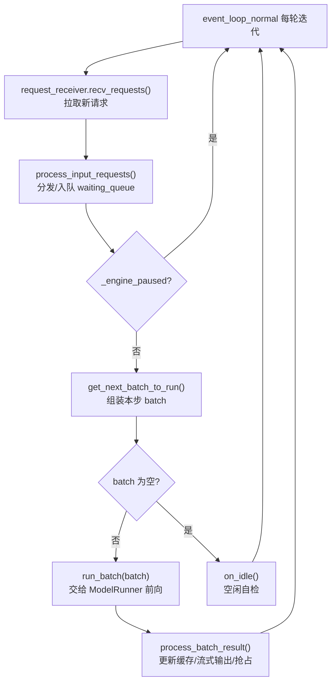
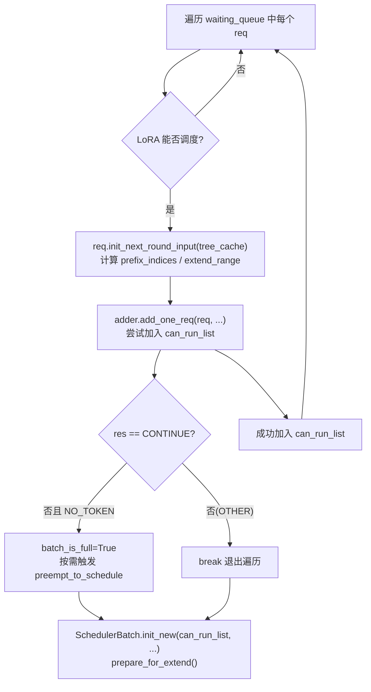
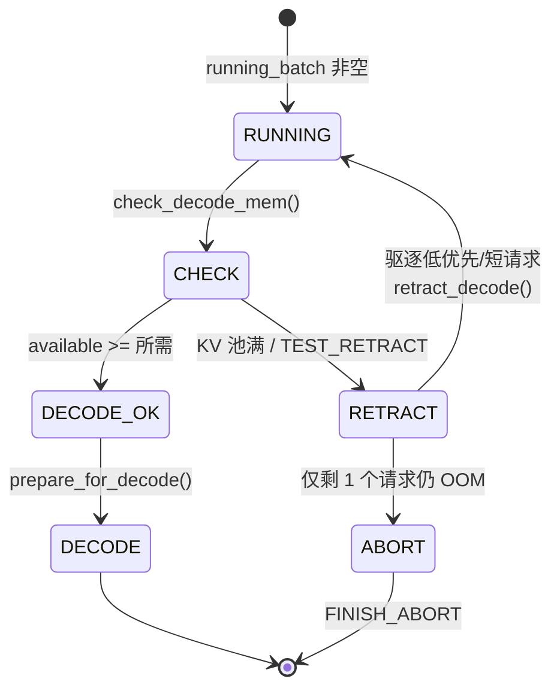

# Scheduler 深度解析：主循环、Batch 组装与抢占

> 本文档基于 SGLang 源码（commit `e1c4db9621f7c4203ee9becd5d5456d4e6bf54f7`）对 `Scheduler` 的调度主循环、prefill/decode 混合调度、chunked prefill 与抢占机制做逐层拆解。所有论断均给出指向 SSOT 的证据锚点（`python/sglang/srt/managers/...` 相对路径 + 行号区间，行号以 `Read` 实测为准）。

## 1. What：Scheduler 是什么

`Scheduler`（`python/sglang/srt/managers/scheduler.py:378`）是 SGLang 推理引擎在**单个 tensor-parallel（TP）GPU worker** 上的调度核心，它通过多重继承组合了 PD 解耦、多路复用（multiplex）、流水线并行（PP）、扩散 LLM（DLLM）、MLX 等多种 mixin 能力，但最核心的职责只有三件：

1. **接收请求**：从 tokenizer manager（或内嵌的 Rust server）拉取已 tokenize 的请求。
2. **组装 batch**：在每一次事件循环迭代中，决定哪些等待中的请求进入 prefill、哪些正在 decode 的请求继续 decode，并把它们拼成一个 `ScheduleBatch`。
3. **触发前向并回收结果**：把 batch 交给 `ModelRunner` 做 prefill（EXTEND）或 decode（DECODE），在结果回来后更新 KV 缓存、流式输出 token、并触发必要的抢占/回收。

它维护两个核心队列/批次（见 `init_running_status`，`python/sglang/srt/managers/scheduler.py:1131`）：

- `self.waiting_queue: List[Req]` —— 还在排队、尚未开始 prefill 的请求。
- `self.running_batch: ScheduleBatch` —— 正在持续 decode 的连续批（continuous batching），`batch_is_full` 标记其是否因显存预算而饱和。

`Scheduler` 内部并不直接管理 KV 缓存的字节分配，而是依赖三个对象（在 `init` 中由 `kv_cache_builder.build_kv_cache` 创建，`python/sglang/srt/managers/scheduler.py:519`）：

- `tree_cache`（`RadixCache` / 分层缓存）：负责前缀复用与可驱逐（evictable）记账。
- `req_to_token_pool`：每个请求到 token 槽位的映射池。
- `token_to_kv_pool_allocator`：KV 缓存页的实际分配器（`available_size()` 是显存余量的权威来源）。

## 2. Why：为什么这么设计

### 2.1 单线程事件循环 + overlap 两条路径

GPU 计算与 CPU 调度逻辑天然重叠。SGLang 提供两条事件循环路径（由 `enable_overlap` 决定，`python/sglang/srt/managers/scheduler.py:428`）：

- `event_loop_normal`（`python/sglang/srt/managers/scheduler.py:1714`）：同步路径，先 `run_batch` 再 `process_batch_result`。
- `event_loop_overlap`（`python/sglang/srt/managers/scheduler.py:1749`）：把上一轮的 `process_batch_result` 与本轮的 GPU 前向重叠在 `schedule_stream` 与 `forward_stream` 上。

两条路径都由 `run_event_loop`（`python/sglang/srt/managers/scheduler.py:1658`）在构造好 `schedule_stream` 后分发到 `dispatch_event_loop`。这样无论是否 overlap，外层骨架一致，便于维护。

### 2.2 prefill 优先于 decode

解码是"稳态"，而 prefill 决定首 token 延迟（TTFT）。因此调度决策的逻辑是：**优先把等待队列里的请求凑成 prefill 批次；只有当没有可 prefill 的请求时，才继续 decode**（`get_next_batch_to_run` 中 `if new_batch is not None: ret = new_batch else: ...decode...`，`python/sglang/srt/managers/scheduler.py:3121`）。

### 2.3 chunked prefill 与混合调度

长 prompt 一次性 prefill 会长时间霸占 GPU、拖垮在跑 decode 的延迟。chunked prefill 把长 prompt 切成 `chunked_prefill_size` 的小块，分批处理；而 `enable_mixed_chunk` 允许在 prefill 这一批里把正在 decode 的请求"混"进来，进一步降低互相等待（见第 4.4 节）。

## 3. How：关键代码路径

### 3.1 主循环结构

非 overlap 路径的主循环骨架（`event_loop_normal`，`python/sglang/srt/managers/scheduler.py:1714`）每一步只有四件事：

关键函数签名：

- `def event_loop_normal(self)` —— `python/sglang/srt/managers/scheduler.py:1714`
- `def event_loop_overlap(self)` —— `python/sglang/srt/managers/scheduler.py:1749`
- `def get_next_batch_to_run(self, running_batch: ScheduleBatch, last_batch: Optional[ScheduleBatch]) -> NextBatchPlan` —— `python/sglang/srt/managers/scheduler.py:3012`
- `def run_batch(self, batch: ScheduleBatch, pp_proxy_tensors: Optional[PPProxyTensors] = None) -> Union[GenerationBatchResult, EmbeddingBatchResult]` —— `python/sglang/srt/managers/scheduler.py:3623`
- `def process_batch_result(self, batch: ScheduleBatch, result: ...)` —— `python/sglang/srt/managers/scheduler.py:3917`
- `def process_input_requests(self, recv_reqs: List)` —— `python/sglang/srt/managers/scheduler.py:1872`

请求接收由 `SchedulerRequestReceiver.recv_requests`（`python/sglang/srt/managers/scheduler_components/request_receiver.py:76`）完成：在 `pp_rank==0 & attn_tp_rank==0 & attn_cp_rank==0` 的 rank 上通过 zmq（或 Rust ring）非阻塞拉取，再通过 `broadcast_pyobj` 广播到所有 TP/CP rank（见 `_broadcast_reqs_across_ranks`，同文件 `:153`）。`SchedulerInputBlocker`（`python/sglang/srt/managers/scheduler_input_blocker.py:25`）则在启用 `SGLANG_ENABLE_COLOCATED_BATCH_GEN` 时通过 BLOCK/UNBLOCK 消息阻塞入队，用于协同调度。

### 3.2 get_next_batch_to_run：一步决策的总入口

`get_next_batch_to_run`（`python/sglang/srt/managers/scheduler.py:3012`）的返回类型是 `NextBatchPlan(batch_to_run, running_batch)`（`python/sglang/srt/managers/schedule_batch.py:3393`），它把"本步要跑什么"和"更新后的 running_batch"打包返回，主循环再 `self.running_batch = plan.running_batch`。

它做的事情按顺序（结合源码）：

1. 处理挂起的 chunked abort、超时 abortion（`:3015`）。
2. **合并上一轮的 prefill 结果**：如果 `last_batch.forward_mode.is_extend()` 且不是 HiSparse，则 `last_batch.filter_batch(...)` 把已完成/被占位的请求剔除，并把剩余的 prefill 批次 `merge_batch` 进 `running_batch`（`:3064`）。这一步正是"prefill 完成 → 转入 decode"的衔接点。
3. 计算新的 prefill 批次：`prefill_plan = self.get_new_batch_prefill(running_batch)`（`:3104`）。
4. 若 `new_batch` 非空 → 跑 prefill（优先）；否则在 `running_batch` 非空且非纯 prefill时调用 `update_running_batch(running_batch)` 继续 decode（`:3121`–`:3130`）。
5. 最后经 `dp_attn_adapter.maybe_prepare_mlp_sync_batch` 与 `ngram_embedding_manager.prepare_for_forward` 做 DP attention / ngram 对齐，并打调度时间戳。

> **[OPEN]** DP attention 与 spec decoding 同时开启时，`maybe_prepare_mlp_sync_batch` 通过 `need_mlp_sync` 确保 prefill 与 decode 批次不被混合（`:3108` 注释明确写"make sure prefill and decode batches will not be mixed when spec and dp-attn is enabled"）。但其具体判定与跨 rank 同步细节跨越 `dp_attn.py`，本文档未完整追到 worker 内部，需另行核对。

### 3.3 prefill 批次组装：get_new_batch_prefill / _get_new_batch_prefill_raw

`def get_new_batch_prefill(self, running_batch: ScheduleBatch) -> NextBatchPlan`（`python/sglang/srt/managers/scheduler.py:3154`）是 prefill 组装入口，它内部主要委托给 `_get_new_batch_prefill_raw`（`python/sglang/srt/managers/scheduler.py:3180`）。后者通过 `PrefillAdder`（`python/sglang/srt/managers/schedule_policy.py:504`）逐条把 `waiting_queue` 中的请求加入 `can_run_list`。

早期的多重"闸门"（early return）决定本次是否**完全跳过 prefill**：

- 若 `running_batch.batch_is_full` 或等待队列为空 **且** 没有 `chunked_req` → 直接返回 `None`（`:3198`）。
- `min_free_slots_delayer` 的节流（`:3205`）。
- 显存不可分配：`get_num_allocatable_reqs(running_bs) <= 0` 且非 `chunked_req` 且未开启优先级抢占 → 置 `batch_is_full=True` 返回（`:3220`）。

通过闸门后，构造真正的 `PrefillAdder`（`:3253`）并遍历 `waiting_queue`：

遍历循环中的关键逻辑（`python/sglang/srt/managers/scheduler.py:3293` 起）：

- 每加入一个请求前检查 `len(adder.can_run_list) >= self.get_num_allocatable_reqs(running_bs)`，若达到则置 `batch_is_full=True`（`:3298`）。
- `res = adder.add_one_req(...)`，返回 `AddReqResult` 枚举（`python/sglang/srt/managers/schedule_policy.py:498`）：
  - `CONTINUE`：成功加入。
  - `NO_TOKEN`：显存不够，置 `batch_is_full`（`:3334`），并**回滚**可能已被 `init_next_round_input` 暂存的 Mamba COW/clear 元数据，避免内存泄漏（`:3346`）。
  - `OTHER`：其它原因（如 `prefill_max_requests` 达到、`ignore_eos` 预算、prefill delayer 延迟判定），直接 `break`。

遍历结束后：

- `self.waiting_queue` 被改写为剔除已入选请求的列表（`:3370`）。
- 若 `adder.preempt_list` 非空，把被抢占的请求重新 `_add_request_to_queue`（`:3371`）。
- 若 `adder.new_chunked_req` 非空，记录为 `self.chunked_req`（`:3378`），表示本次 prefill 是一个长 prompt 的**中间 chunk**，下次迭代必须继续。
- 用 `can_run_list` 构造 `ScheduleBatch.init_new(...)`，设置 `contains_last_prefill_chunk = (self.chunked_req is None or len(can_run_list) != 1)`（`python/sglang/srt/managers/scheduler.py:3397`），并调用 `new_batch.prepare_for_extend()`（`python/sglang/srt/managers/schedule_batch.py:2363`）把 `forward_mode` 置为 `EXTEND`、分配 out_cache_loc。

### 3.4 decode 批次组装（等价 get_new_batch_decode）

源码**没有**名为 `get_new_batch_decode` 的函数——decode 批次就是上一轮留下的 `running_batch`，由 `update_running_batch`（`python/sglang/srt/managers/scheduler.py:3478`）维护：

1. `batch.filter_batch()` 剔除已完成的请求；若变空则清零 `batch_is_full`。
2. **显存不足检测**：`batch.check_decode_mem()`（`:3488`）。若返回 False（KV 池满），调用 `batch.retract_decode(self.server_args)` 抢占一部分请求（见 4.3）。
3. 否则 `self.new_token_ratio_tracker.decay_step()` 衰减新 token 比例估计。
4. 最后 `batch.prepare_for_decode()`（`python/sglang/srt/managers/schedule_batch.py:3021`）置 `forward_mode = DECODE` 并返回。

### 3.5 prefill 与 decode 能否同批：混合调度（Mixed Chunked Prefill）

当 `is_mixed_chunk`（即 `chunked_prefill_size` 非 None 且 `enable_mixed_chunk`，见 `init_chunked_prefill`，`python/sglang/srt/managers/scheduler.py:1153`）开启时，`_get_new_batch_prefill_raw` 在 prefill 批次构造后检查（`python/sglang/srt/managers/scheduler.py:3429`）：

- `running_batch` 非空；
- 没有 `return_logprob` 冲突；
- `new_batch.input_embeds is None`（混部要求 input_ids 形状一致，input_embeds 形状不匹配会被排除）。

满足则 `running_batch.filter_batch()` → `prepare_for_decode()` → `new_batch.mix_with_running(running_batch)`（`python/sglang/srt/managers/schedule_batch.py:2739`），后者把 `forward_mode` 置为 `ForwardMode.MIXED`，并对 running 部分把 `extend_range` 设为"只解码下一个 token"（`set_extend_range(full_len-1, full_len)`），把两者 `merge_batch` 到同一个 `ScheduleBatch` 内。这样在**一个前向**里既做新请求的 prefill 又做老请求的 decode。

> 隔离点：混合批次里 running 部分的 token 通过 `mix_running_indices` / `future_map.output_tokens_buf` 承载（见 `schedule_batch.py:2748`–`:2750`），`decoding_reqs` 字段（`python/sglang/srt/managers/scheduler.py:3441`）记录哪些 req 是 decode 部分，使 `process_batch_result_prefill`（`python/sglang/srt/managers/scheduler_components/batch_result_processor.py:193`）知道哪些 req 不要流式输出、哪些要 `maybe_cache_unfinished_req`。

### 3.6 chunked prefill 的分块来源与限制

- **chunk size 来源**：`self.chunked_prefill_size = get_schedule().chunked_prefill_size`（`python/sglang/srt/managers/scheduler.py:1154`），最终来自 server args 的 `chunked_prefill_size`。
- **多模态禁用**：若模型是多模态且用 Transformers 后端，chunked prefill 被强制关闭（避免 chunk 与多模态特征错位），见 `:1158`。
- **分块逻辑**：在 `PrefillAdder.add_one_req`（`python/sglang/srt/managers/schedule_policy.py:1201`）中：
  - 当 `rem_chunk_tokens is None`（禁用）→ 整个序列一次性提交（`:1154`）。
  - 否则若 `cand_extend_input_len > rem_chunk_tokens` → 截断到 `chunk_tokens_limit`（`rem_chunk_tokens` 向下对齐 page_size），并把 `self.new_chunked_req = req`（`:1414`、`:1379`、`:1410`）。
  - `add_chunked_req`（`python/sglang/srt/managers/schedule_policy.py:997`）专门处理"上一轮剩下的 `chunked_req`"：继续从未 prefill 的部分切下 `_rem_tokens = min(rem_chunk_tokens, rem_total_tokens)` 作为本 chunk，若仍 `truncated` 则继续返回 `req`（否则返回 `None` 表示完成）。
- **动态分块（PP）**：`enable_dynamic_chunking`（`python/sglang/srt/managers/scheduler.py:1178`）在 PP>1 时调用 `predict_next_chunk_size` 调整 chunk 大小。
- **chunk 续跑衔接**：`get_next_batch_to_run` 顶部（`python/sglang/srt/managers/scheduler.py:3038`）若 `chunked_req` 存在，把它从本轮 merge 中排除，并对已产生新 KV 的部分 `stash_chunked_request` 缓存（`python/sglang/srt/managers/scheduler.py:2922`，内部 `maybe_cache_unfinished_req(..., chunked=True)`）。`chunked_req.init_next_round_input()`（`:3273`）为下一 chunk 准备输入。`inflight_middle_chunks` 计数器在 `process_batch_result_prefill`（`python/sglang/srt/managers/scheduler_components/batch_result_processor.py:309`）递减，标记"该 prefill 尚未完成、不要流式输出这个 req"。

### 3.7 run_batch 与结果回收

`run_batch`（`python/sglang/srt/managers/scheduler.py:3623`）按 `is_generation`、`enable_overlap`、`spec_algorithm` 分多个分支调用 `model_worker.forward_batch_generation`。overlap 路径把结果 `result_queue.append((batch.copy(), batch_result))`（`python/sglang/srt/managers/scheduler.py:1799`）延后到下一轮 `pop_and_process` 处理；同步路径则立刻 `process_batch_result`（`:3737` 附近）。

`process_batch_result`（`python/sglang/srt/managers/scheduler.py:3917`）按 `forward_mode` 分发：

- DECODE → `batch_result_processor.process_batch_result_decode`
- EXTEND（普通 prefill）→ `batch_result_processor.process_batch_result_prefill`（`python/sglang/srt/managers/scheduler_components/batch_result_processor.py:193`）
- 其中 prefill 结果的收尾负责：`req.output_ids.append(next_token_id)`、`req.update_finish_state()`、未完成的 `maybe_cache_unfinished_req`、完成的 `release_kv_cache`，以及流式输出 `stream_output`（`:366`）。

## 4. 边界与坑（Preemption / 抢占与重试）

### 4.1 抢占触发条件

decode 阶段的抢占由 `update_running_batch` 触发（`python/sglang/srt/managers/scheduler.py:3488`）：

- `check_decode_mem`（`python/sglang/srt/managers/schedule_batch.py:2799`）先按"下一 decode 需要的 token 数"调用 `evict_from_tree_cache` 回收**可驱逐**的 radix 缓存条目（短fall 回收），再比较 `available_size() >= num_tokens`。
- `new_tokens_required_next_decode`（`python/sglang/srt/managers/schedule_batch.py:2772`）按 page 粒度估算：每个 `kv_committed_len % page_size == 0` 的请求下一个 decode 步需要一整页。

### 4.2 恢复路径：retract_decode

`retract_decode`（`python/sglang/srt/managers/schedule_batch.py:2806`）：

1. 用 `_get_decode_retraction_order`（`python/sglang/srt/managers/schedule_batch.py:2856`）确定驱逐顺序：默认按 `(len(output_ids), -len(origin_input_ids))` **逆序**——即"输出越长、原始输入越短"的请求越优先保留（因为它已经投入最多、重算代价最大）；若 `retraction_policy == "priority"` 则按 priority 排序（`:2872`）。
2. 循环从队尾 `pop` 一个请求，`release_req` 释放其 KV（**不插入 radix 树**，因为需要立刻腾出空间，`schedule_batch.py:2825` 注释），直到 `check_decode_mem` 通过或只剩 1 个请求。
3. 被驱逐的请求通过 `self._add_request_to_queue(req, is_retracted=True)`（`python/sglang/srt/managers/scheduler.py:3549`）重新进入 `waiting_queue`（NULL 模式）或 PD decode 的 prealloc 队列（`:2731`），下一轮会被 `get_new_batch_prefill` 当作普通请求重新 prefill——**由于 radix 缓存可能仍保留其前缀，重算时往往能命中缓存前缀**。
4. 若连最后 1 个请求都满足不了，则 `FINISH_ABORT`（`:2836`）优雅中止，而非让 scheduler 崩溃（`schedule_batch.py:2828`）。

### 4.3 优先级抢占（prefill 抢占 decode）

当 `enable_priority_scheduling` 且未关闭 `disable_priority_preemption` 时（`init_schedule_policy`，`python/sglang/srt/managers/scheduler.py:1240`），`_get_new_batch_prefill_raw` 在 `running_batch.batch_is_full` 时不会直接 `break`，而是尝试 `adder.preempt_to_schedule(req, self.server_args)`（`python/sglang/srt/managers/scheduler.py:3308`）。

`preempt_to_schedule`（`python/sglang/srt/managers/schedule_policy.py:1430`）：

- 按 `(priority * -priority_sign, -wait_queue_entry_time)` 排序 running 请求（`:1450`）。
- 仅当 `priority_diff > priority_scheduling_preemption_threshold`（`:1469`）才把对应 running 请求加入 `preemptible_reqs`，并累加其 token 预算，直到覆盖新请求所需。
- 命中后 `release_req` 立即释放 running 请求 KV，把它们加入 `preempt_list`（`:1499`），随后这些请求被重新入队等待重算。
- 注释（`schedule_policy.py:1438`）特别指出：请求完成分两阶段（先 `release_kv_cache`，再 `filter_batch`），抢占发生在两阶段之间，必须跳过 `r.finished()` 的请求，否则会双重释放。

> **[OPEN]** `retract_decode` 注释中明确标注 `TODO(lsyin): improve retraction policy for radix cache`（`schedule_batch.py:2867`），说明当前的驱逐顺序（长输出优先保留）与 radix 缓存的共享收益之间尚未做联合优化，可能在缓存命中率高的场景存在次优驱逐。

### 4.4 chunked prefill 与 radix 缓存命中的坑

- **命中前缀不应被分块**：`add_one_req` 中 `cand_extend_input_len = len(full_untruncated_fill_ids) - len(prefix_indices)`（`schedule_policy.py:1223`），只有**未命中**的前缀部分才参与分块与显存预算；命中部分通过 `init_load_back`（`schedule_policy.py:1314`）从 host/radix 拉回，不重复 prefill。
- **混合批次的形状约束**：`is_mixed_chunk` 路径要求 `new_batch.input_embeds is None`（`python/sglang/srt/managers/scheduler.py:3434`），因为 `mix_with_running` 是把 decode 的 token 与 prefill 的 `input_ids` **拼接**输入（`schedule_batch.py:2751` 的 `out_cache_loc` 拼接）。若 prefill 部分使用 `input_embeds`（如部分多模态），形状无法对齐，会退化为非混合路径。
- **长 prompt + 高并发下的 `batch_is_full` 抖动**：一个 `chunked_req` 在每轮迭代都被强制加入 `can_run_list`（`:3272` 的 `add_chunked_req` 不走 `batch_is_full` 早退），这会让 `running_batch.batch_is_full` 反复在 prefill 与 decode 之间被重置（`:3080`、`:3366`），从而允许更多 decode 请求被接纳——这是有意为之，但意味着 chunk 进行中显存预算的"瞬时"计算较复杂。
- **abort 与 chunk 的竞态**：`abort_request` 不会立即拆除正在 chunk 的 `chunked_req`，而是记入 `_pending_chunked_abort_req`，由 `process_pending_chunked_abort`（`python/sglang/srt/managers/scheduler.py:2925`）在调度步顶部、且 `self.chunked_req is req` 时才真正中止；在 overlap 模式下结果会晚一步到达，batch result processor 通过 `inflight_middle_chunks` 与 `is_aborted` 跳过被中止 chunk 的流式输出。

## 5. 小结

`Scheduler` 的调度本质是**单线程事件循环 + 每步一次 `get_next_batch_to_run` 决策**：先合并上轮 prefill 结果到 `running_batch`，再尽量凑 prefill 批次（含 chunked / mixed），没有 prefill 才继续 decode；结果经 `process_batch_result` 回收并触发 KV 释放/缓存。`PrefillAdder` 是 admission control 的核心，`retract_decode` 与 `preempt_to_schedule` 分别处理 decode OOM 与优先级抢占，二者都把被驱逐请求重新入队等待重算，并依赖 radix 缓存前缀复用尽量降低重算代价。混合 chunked prefill 与 radix 命中、形状约束（input_embeds）之间存在需要留意的边界条件。

> 全文锚点：`python/sglang/srt/managers/scheduler.py:378`、`:1131`、`:1153`、`:1658`、`:1714`、`:1749`、`:1872`、`:2007`、`:3012`、`:3154`、`:3180`、`:3273`、`:3293`、`:3397`、`:3429`、`:3478`、`:3623`、`:3917`、`:2922`、`python/sglang/srt/managers/schedule_policy.py:504`、`:997`、`:1201`、`:1430`、`python/sglang/srt/managers/schedule_batch.py:2363`、`:2739`、`:2799`、`:2806`、`:3021`、`:3393`、`python/sglang/srt/managers/scheduler_components/request_receiver.py:76`、`python/sglang/srt/managers/scheduler_components/batch_result_processor.py:193`、`python/sglang/srt/managers/scheduler_input_blocker.py:25`。
