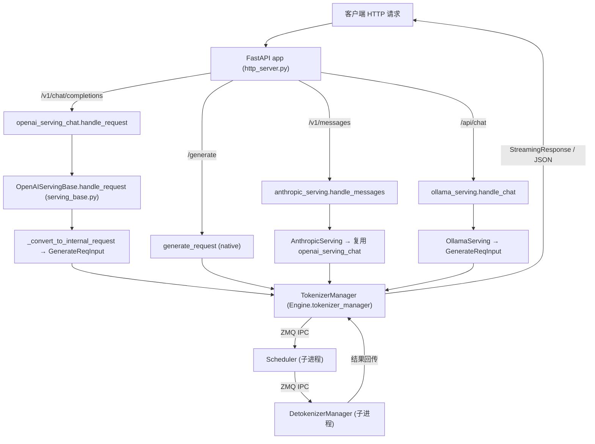

# SGLang 服务端入口（Server Entrypoint）深度解析

本文聚焦 SGLang Runtime（SRT）从进程启动到请求落地的全链路入口逻辑，覆盖：

- HTTP 服务如何路由请求、如何与 Engine 交互（`python/sglang/srt/entrypoints/http_server.py`）
- OpenAI / Anthropic / Ollama 兼容层如何把外部协议映射为内部请求
- `ServerArgs` 参数体系的 dataclass 结构、与 argparse 的关系、默认值来源
- `Engine` 如何聚合 `TokenizerManager` / `Scheduler` / `DetokenizerManager`

所有论断均可在对齐 commit `e1c4db9621f7c4203ee9becd5d5456d4e6bf54f7` 的源码中找到证据。

---

## 1. What：这一层是什么

SGLang 的"服务端入口"由三层协作构成，职责边界清晰：

1. **HTTP 服务层（FastAPI）**：`http_server.py` 中的模块级 `app = FastAPI(...)`（`python/sglang/srt/entrypoints/http_server.py:L455-L459`）定义了所有路由，是外部流量唯一入口。它把 HTTP 请求反序列化为内部 dataclass，再转交给 Engine 层。
2. **Engine 封装层**：`Engine` 类（`python/sglang/srt/entrypoints/engine.py:L199-L211`）是 Python 进程内对三个核心组件的聚合体——`TokenizerManager`（主进程）、`Scheduler`（子进程）、`DetokenizerManager`（子进程）。HTTP 层与 Engine 共享同一个主进程，通过 ZMQ IPC 与子进程通信。
3. **配置层**：`ServerArgs`（dataclass，`python/sglang/srt/server_args.py:L444-L445`）承载全部启动参数，既被 CLI（`sglang.srt.arg_groups.arg_utils`）自动推导为命令行参数，也被 `Engine(**kwargs)` 直接构造。

关键认知：**HTTP 服务、Engine、TokenizerManager 三者都跑在主进程**；只有 `Scheduler` 与 `DetokenizerManager`（以及可选的多个 tokenizer worker）是独立子进程。进程间通过 ZMQ（`ipc://` 或 `tcp://`）通信，这一事实决定了全局状态必须以 `_global_state` 这样的单例挂在主进程上。

---

## 2. Why：为什么这样分层

### 2.1 进程模型的设计动机

`Engine` 的类注释明确指出三组件分工（`python/sglang/srt/entrypoints/engine.py:L199-L211`）：

- `TokenizerManager`：在主进程对请求做分词，并投递给 Scheduler。
- `Scheduler`（子进程）：接收请求、调度 batch、前向计算，把输出 token 发给 `DetokenizerManager`。
- `DetokenizerManager`（子进程）：把输出 token 反序列化为文本，再回传给 `TokenizerManager`。

把 Tokenizer/Detokenizer 中昂贵或需独占 GPU 的部分拆到子进程，是为了让**真正吃 GPU 的模型推理（Scheduler）与 IO 密集的分词/反分词解耦**，并允许通过 `--tokenizer-worker-num` / `--detokenizer-worker-num` 横向扩展这些 IO 组件（见 `engine.py:L985-L1020` 的 worker 路由逻辑）。

### 2.2 为何用 dataclass + 注解自动生成 CLI

`ServerArgs` 有近千个字段。若全部手写 `parser.add_argument`，维护成本极高。SGLang 选择用 `A[T, Arg(...)]` 注解（即 `typing.Annotated` 的别名 `A`，`python/sglang/srt/arg_groups/arg_utils.py:L58`）声明字段，再由 `add_cli_args_from_dataclass`（`python/sglang/srt/arg_groups/arg_utils.py:L218-L338`）统一扫描 dataclass 字段、自动生成 argparse 参数。这样：

- 字段名 `tp_size` → CLI 旗标 `--tp-size`（`_field_to_cli_name`，`arg_utils.py:L208-L210`）。
- `aliases=["--tensor-parallel-size"]` 提供 `--tp-size` 的等价长名（`server_args.py:L1006`）。
- `dest` 被锚定回字段名，因此 argparse 的解析结果能直接落到 dataclass 属性上（即使 CLI 名与字段名不同），见 `arg_utils.py:L253-L254`。

这一设计的权衡是：**绝大多数参数无需手写 CLI 注册**，但少数特殊参数（废弃旗标、`--config` 元参数、动态 `choices`）仍需在 `add_cli_args` 中手动注册（`server_args.py:L473-L483` 文档说明）。

---

## 3. How：关键代码路径

### 3.1 进程启动流程

`launch_server`（`python/sglang/srt/entrypoints/http_server.py:L2718-L2779`）是 `sglang serve` 的总入口。它先做一件事：调用 `Engine._launch_subprocesses` 拉起所有子进程（`http_server.py:L2742-L2754`），随后根据 `SGLANG_RUST_SERVER` 环境与否决定走 Rust 内嵌服务还是 Python uvicorn 服务。Python 路径进入 `_setup_and_run_http_server`（`http_server.py:L2464`）：

1. 用 `set_global_state(_GlobalState(...))` 把 `tokenizer_manager` / `template_manager` / `scheduler_info` 挂到模块级单例（`http_server.py:L2479-L2485`）。
2. 单 tokenizer 模式下，把 `server_args` 直接塞到 `app` 对象上（`app.is_single_tokenizer_mode = True`、`app.server_args = server_args`，`http_server.py:L2498-L2499`），供 lifespan 闭包读取。
3. 若配置了 `api_key` / `admin_api_key`，注入 API key 中间件（仅单 tokenizer 模式支持，`http_server.py:L2513-L2524`）。
4. 最终 `uvicorn.run(app, host=..., port=..., loop="uvloop", ...)`（`http_server.py:L2604-L2616`）。

> **[OPEN]** `_setup_and_run_http_server` 在 `tokenizer_worker_num > 1` 时改用 `uvicorn.run("sglang.srt.entrypoints.http_server:app", workers=...)`（`http_server.py:L2650-L2664`），每个 worker 是独立进程，通过共享内存 `multi_tokenizer_args_<main_pid>` 重建自己的 `TokenizerManager`（`init_multi_tokenizer`，`http_server.py:L216-L266`）。多 worker 与单 worker 在 lifespan 中的分支（`http_server.py:L274-L282`）值得进一步确认两者共享状态的一致性边界。

### 3.2 请求路由：HTTP → Engine

`mermaid` 关系图如下（组件名与源码一致）：

FastAPI 路由定义在模块顶层（非类方法），通过 `raw_request.app.state.<handler>` 访问在 `lifespan` 中实例化的各 serving 对象。例如：

- `/v1/chat/completions`（`http_server.py:L1702-L1709`）→ `openai_serving_chat.handle_request`。
- `/v1/messages`（`http_server.py:L1982-L1989`）→ `anthropic_serving.handle_messages`。
- `/api/chat`（`http_server.py:L1953-L1956`）→ `ollama_serving.handle_chat`。
- 原生 `/generate`（`http_server.py:L874-L919`）→ 直接调用 `_global_state.tokenizer_manager.generate_request(obj, request)`。

这些 serving 对象在 `lifespan` 内统一创建（`http_server.py:L303-L367`）。注意 `openai_serving_chat` 的类型由 `tokenizer_manager.serving_chat_class(...)` 动态决定（`http_server.py:L306-L309`），支持按模型定制 chat 编码逻辑。

### 3.3 OpenAI 兼容层：从 ChatRequest 到 GenerateReqInput

所有 OpenAI serving 处理器的基类 `OpenAIServingBase.handle_request`（`python/sglang/srt/entrypoints/openai/serving_base.py:L73-L133`）执行统一骨架：

1. `_validate_request` 校验（可重写）。
2. `_convert_to_internal_request` 把 OpenAI 协议对象转成内部 `GenerateReqInput` 或 `EmbeddingReqInput`（`serving_base.py:L93`、`L152`）。
3. 根据 `request.stream` 分流到 `_handle_streaming_request` / `_handle_non_streaming_request`（`serving_base.py:L102-L109`）。

以 `/v1/chat/completions` 为例，真正完成协议映射的是 `OpenAIServingChat._convert_to_internal_request`（`python/sglang/srt/entrypoints/openai/serving_chat.py:L912-L1037`）：

- **消息处理与模板应用**：`_process_messages`（`serving_chat.py:L1039`）调用 chat template 把多轮 messages 渲染为文本/input_ids，并提取 stop 串、tool_call 约束等。
- **采样参数映射**：`request.to_sampling_params(...)`（`serving_chat.py:L953-L958`）把 OpenAI 的 `temperature` / `top_p` / `max_tokens` 等映射为内部 `sampling_params`，默认值来自 `self.default_sampling_params`（由 `ServerArgs.sampling_defaults` 决定，见下文）。
- **多模态分支**：根据是否多模态、是否为 kimi_k3/inkling 等编码规格，决定传 `text=` 还是 `input_ids=`（`serving_chat.py:L960-L983`）。
- **最终构造**：`GenerateReqInput(...)`（`serving_chat.py:L998-L1035`）聚合 `sampling_params`、`image_data`、`stream`、`lora_path`（从 `model:adapter` 语法解析，`serving_base.py:L40-L53`）、`routed_dp_rank`（HTTP 头 `X-Data-Parallel-Rank` 优先级更高，`serving_base.py:L264-L293`）、`rid`、`session_id` 等。

这一 `GenerateReqInput` 随后被交给 `Engine.tokenizer_manager.generate_request`（见 `engine.py:L445`、`L558`），进入 tokenizer→scheduler→detokenizer 的 ZMQ 流水线。

### 3.4 Anthropic / Ollama 兼容层

- **Anthropic**：`AnthropicServing` 在 lifespan 中由 `openai_serving_chat` 构造（`http_server.py:L337-L339`），即 Anthropic Messages API 复用了 OpenAI chat 的底层编码能力，只在外层做协议字段的换算与错误包络（异常处理器 `_anthropic_error_response`，`http_server.py:L513-L521`，把 5xx 错误统一改写为 "Internal server error" 以避免泄露堆栈）。
- **Ollama**：`OllamaServing`（`http_server.py:L334`）独立实现 `handle_chat` / `handle_generate` / `get_tags` / `get_show`，路由前缀可通过环境变量 `SGLANG_OLLAMA_CHAT_ROUTE` 等覆盖（`http_server.py:L1953-L1976`），根路径 `/` 也可被 `SGLANG_OLLAMA_ROOT_ROUTE` 重定向（`http_server.py:L1935-L1950`）。

### 3.5 ServerArgs 关键字段分组

`ServerArgs` 字段按 `# ---` 注释分节（`server_args.py:L486-L487` 起）。按文档要求的四组摘录真实签名锚点：

| 分组 | 字段 | 真实锚点 | 默认 |
|------|------|----------|------|
| 模型 | `model_path: A[str, Arg(help=..., aliases=["--model"])]` | `server_args.py:L489-L496` | （必填） |
| 模型 | `context_length: A[Optional[int], ...] = None` | `server_args.py:L578-L586` | `None` |
| 并行 | `tp_size: A[int, Arg(..., aliases=["--tensor-parallel-size"])] = 1` | `server_args.py:L1002-L1009` | `1` |
| 并行 | `pp_size` / `dp_size` / `moe_dp_size` | `server_args.py:L1018` / `L1034` / `L1065` | 均为 `1` |
| 缓存 | `mem_fraction_static: A[Optional[float], ...] = None` | `server_args.py:L771-L775` | `None`（按显存自动算） |
| 缓存 | `disable_radix_cache: A[bool, "Disable RadixAttention...", NS("memory")] = False` | `server_args.py:L929-L931` | `False` |
| 缓存 | `radix_eviction_policy` / `page_size` | `server_args.py:L911` / `L888` | `"lru"` / `None` |
| 采样 | `sampling_defaults: A[str, Arg(choices=["openai","model"])] = "model"` | `server_args.py:L1400-L1407` | `"model"` |
| 采样 | `preferred_sampling_params: A[Optional[str], ...] = None` | `server_args.py:L1418-L1425` | `None` |

> **[OPEN]** `sampling_defaults="model"` 表示默认从模型 `generation_config.json` 读取推荐采样参数（`server_args.py:L1403`）；但 `default_sampling_params` 在 serving 层如何被 `ChatCompletionRequest.to_sampling_params` 实际消费、与 per-request 的 `temperature` 如何合并，需进一步追踪 `serving_chat.py` 中 `self.default_sampling_params` 的初始化来源以给出完整证据链。

通信端口由另一个 dataclass `PortArgs` 承载（`python/sglang/srt/server_args.py:L9701-L9731`），其 `init_new`（`L9733-L9874`）在单节点用 `ipc://` 临时文件、在 DP-attention 多节点用 `tcp://` 派生端口，确保主进程与各子进程之间的 ZMQ 通道唯一可寻址。

### 3.6 Engine 如何聚合三个组件

`Engine.__init__`（`python/sglang/srt/entrypoints/engine.py:L224-L315`）的核心动作：

1. 加载插件（保证 `ServerArgs.__post_init__` 钩子生效），然后构造 `self.server_args`。
2. 注册 `atexit` 钩子 `shutdown`（`engine.py:L260`），保证进程退出时清理子进程。
3. 调用类方法 `_launch_subprocesses`（`engine.py:L1052-L1244`）——这是聚合的心脏：
   - `server_args.check_server_args()` 做启动前参数校验（`engine.py:L1082`，见第 4 节"坑"）。
   - `PortArgs.init_new(server_args)` 分配 IPC 端口（`engine.py:L1086`）。
   - `_launch_scheduler_processes`（`engine.py:L1125`）按 `tp_rank`/`pp_rank` 计算 GPU 分配并 `mp.Process(target=run_scheduler_process_func, ...)` 拉起（`engine.py:L884-L918`）。`dp_size>1` 时改为拉起 `DataParallelController`（`engine.py:L920-L934`）。
   - `_launch_detokenizer_subprocesses`（`engine.py:L1192`）拉起 detokenizer（支持多 worker + router）。
   - `init_tokenizer_manager_func`（即 `init_tokenizer_manager`，`engine.py:L147-L196`）在**主进程**构造 `TokenizerManager` 并初始化 `TemplateManager`。
   - 调用 `scheduler_init_result.wait_for_ready()` 阻塞直到模型加载完成（`engine.py:L1213`），并初始化 `SubprocessWatchdog` 监听子进程崩溃（`engine.py:L1228-L1231`）。
4. 主进程内创建 ZMQ `DEALER` socket `send_to_rpc` 用于 `collective_rpc`（`engine.py:L289-L295`）。

`Engine.generate` / `async_generate`（`engine.py:L352-L563`）只是把 Python 友好签名翻译成 `GenerateReqInput`，再调 `self.tokenizer_manager.generate_request(obj, None)`——印证了"Engine 是 TokenizerManager 的薄封装"。

---

## 4. 边界与坑（参数校验与冲突处理）

### 4.1 `check_server_args` 的硬约束

`ServerArgs.check_server_args`（`python/sglang/srt/server_args.py:L9004` 起）在 `_launch_subprocesses` 中被调用（`engine.py:L1082`），是启动期最重要的"坑"守门员。典型冲突断言：

- `tp_size * pp_size` 必须能被 `nnodes` 整除（`server_args.py:L9007-L9009`）。
- `--disable-cuda-graph-padding` 与 `--enable-torch-compile` 互斥，否则初始化会卡数分钟（`server_args.py:L9018-L9024`）。
- `pp_size > 1` 时不兼容 overlap schedule 与 speculative decoding（`server_args.py:L9026-L9034`）。
- 多节点 DP 必须开启 `enable_dp_attention`（`server_args.py:L9036-L9038`）。
- `chunked_prefill_size > 0` 时必须能被 `page_size` 整除（`server_args.py:L9069-L9072`）。
- `served_model_name` 不能含冒号 `:`，因为冒号被 `model:adapter` 的 LoRA 语法占用（`server_args.py:L9050-L9055`）。

> **坑点**：这些校验发生在 `Engine` 构造、子进程拉起之前。一旦触发，会抛出 `AssertionError` 并中断整个启动。因此很多"启动即崩"的问题应首先对照 `check_server_args` 而非模型代码。

### 4.2 多 tokenizer 模式不支持 API key

`init_multi_tokenizer` 显式 `assert server_args.api_key is None`（`http_server.py:L231-L233`），因为多 tokenizer worker 进程间共享状态下 API key 鉴权无法简单落地。若你用 `--tokenizer-worker-num > 1` 又设了 `--api-key`，启动会直接失败。

### 4.3 异常包络按路径分流

`http_server.py` 注册了两个异常处理器：`HTTPException`（`L524-L577`）与 `RequestValidationError`（`L581-L624`）。它们根据 `request.url.path` 前缀返回不同错误体：
- `/v1/messages` → Anthropic 风格 `{"type":"error","error":{...}}`，且 5xx 不回显上游细节（`L532-L557`）。
- `/v1/responses` → OpenAI 嵌套 `{"error":{...}}`（`L560-L569`）。
- 其余 → 标准 `ErrorResponse`（`L571-L577`）。

同时注意 `RequestValidationError` 被重写为 **400**（而非 FastAPI 默认的 422，`L581-L624`），且对非 `/v1/messages` 路径会做内容类型校验（强制 `application/json`，`validate_json_request`，`L627-L640`）。

### 4.4 `routed_dp_rank` 的废弃与范围校验

`Engine._resolve_routed_dp_rank`（`engine.py:L321-L350`）指出 `data_parallel_rank` 已废弃。若 `dp_size <= 1` 且传入 `routed_dp_rank=0` 会被忽略；否则越界会抛 `ValueError`。这说明路由参数与并行配置强耦合，错配会直接报错而非静默降级。

### 4.5 Rust server 路径的偏离

当 `SGLANG_RUST_SERVER` 环境置位时，`Engine.__init__` 直接抛 `ValueError` 拒绝离线 Python API（`engine.py:L248-L253`），且 `launch_server` 走内嵌 Rust 服务路径（`http_server.py:L2756-L2768`），不再启动 Python 的 `TokenizerManager` / `DetokenizerManager` 子进程。这是一个容易被忽略的"环境开关改变整个进程拓扑"的坑。

---

## 5. 小结

服务端入口的本质是：**FastAPI 做协议适配与路由 → Engine 做进程编排与参数聚合 → 三个 Manager 经 ZMQ 完成分词/调度/反分词**。`ServerArgs` 作为贯穿全栈的配置单例，既驱动 CLI 又驱动运行时；其 `check_server_args` 是启动期最关键的参数冲突防火墙。OpenAI / Anthropic / Ollama 三套兼容层最终都收敛到同一个内部 `GenerateReqInput`，这是理解 SGLang 请求生命周期的主线。

> 相关文档：见 architecture/overview.md（整体架构）、见 deep-dive/scheduler.md（调度器内部）、见 deep-dive/tokenizer-detokenizer.md（分词/反分词流水线）。
