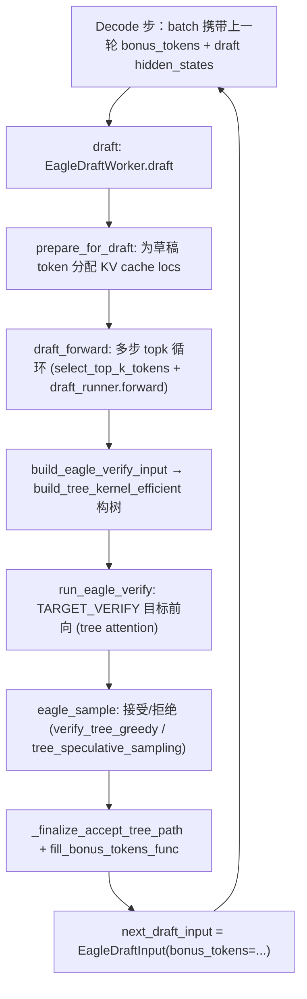
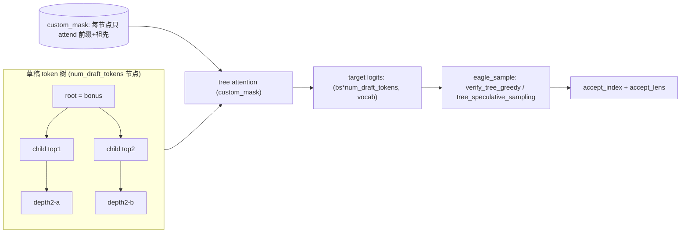
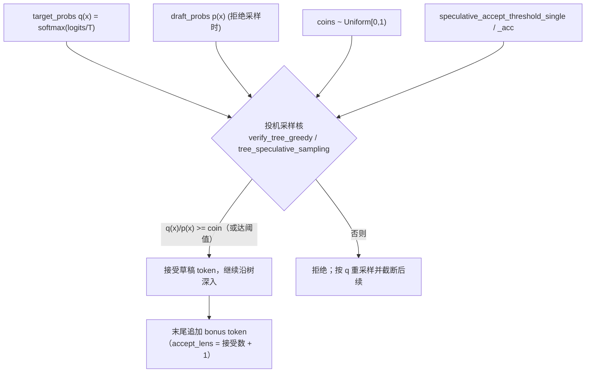

# SGLang 投机解码（Speculative Decoding）源码深度解析

> 本文档唯一事实来源（SSOT）：`/home/kimmo/develop/sglang`，对齐 commit `e1c4db9621f7c4203ee9becd5d5456d4e6bf54f7`。
> 所有论断均来自该 commit 的源码阅读，关键结论后附 `相对SSOT路径:L行号区间` 锚点。
> EAGLE 系列（EAGLE / EAGLE3 / FROZEN_KV_MTP）是 SGLang 投机解码的核心实现，本文以 EAGLE 为主线，
> 并对 NGRAM / STANDALONE / DFLASH / DSPARK 等兄弟算法在关键处做差异对照。

---

## 1. What：投机解码是什么

### 1.1 基本思想

自回归 LLM 每生成一个 token 需要一次完整的前向（forward），其吞吐受限于**内存带宽 / 计算串行化**，而非纯算力。投机解码的核心观察是：很多序列的后续 token 是高度可预测的，可以由一个**更小、更浅、或共享权重的“草稿（draft）”模型/草稿头**一次“猜测”出 `k` 个候选 token（甚至是一棵候选 token 树），然后交给**目标（target）模型一次前向并行验证**整棵草稿树。只要目标模型接受了草稿，就相当于一步产出了多个 token，从而摊薄每 token 的延迟。

SGLang 把“一步生成多 token”扩展为**树状草稿 + 树注意力（tree attention）并行验证**：草稿阶段产出的不是一条链，而是一个以 `bonus token`（目标模型上一轮的最终预测）为根的、每个节点分叉 `topk` 的树。验证阶段把整棵树拼成一批 token，用一棵自定义的因果注意力掩码（tree mask / `custom_mask`）让每个草稿 token 只 attend 它在树上的祖先，从而在一次目标模型前向里算出整棵树的 logits，再按规则**沿树接受一条最优路径**。

### 1.2 SGLang 支持的算法

`SpeculativeAlgorithm` 枚举了内建算法，并通过插件机制 `register` 支持自定义算法。枚举与 worker 分发如下：

```python
class SpeculativeAlgorithm(Enum):
    DFLASH = auto()
    DSPARK = auto()
    EAGLE = auto()
    EAGLE3 = auto()
    FROZEN_KV_MTP = auto()
    STANDALONE = auto()
    NGRAM = auto()
    NONE = auto()
```
锚点：`python/sglang/srt/speculative/spec_info.py:30-44`

`create_worker` 依据算法类型返回对应的 worker 类。EAGLE / EAGLE3 / STANDALONE / FROZEN_KV_MTP 默认走 `EAGLEWorkerV2`（开启 `enable_multi_layer_eagle` 时走 `MultiLayerEagleWorkerV2`）；DFLASH/DSPARK 各有 V2 worker；NGRAM 走 `NGRAMWorker`。
锚点：`python/sglang/srt/speculative/spec_info.py:262-314`

> 关键区分（来自 `SpeculativeAlgorithm` 的 `is_*` 谓词）：
> - `is_eagle()` 包含 EAGLE / EAGLE3 / FROZEN_KV_MTP，且 `carries_draft_hidden_states()` 仅对 EAGLE 为真，意味着只有 EAGLE 系在 disagg prefill→decode 时传输草稿隐状态（`spec_info.py:156-159`）。
> - `has_draft_kv()` 对 NGRAM 为假：NGRAM 的草稿树只活在 verify mask 里、不写 KV 链（`spec_info.py:150-154`）。
> - `need_topk()` 对 EAGLE / STANDALONE 为真，即草稿阶段需要保留 `topk` 候选分布。

---

## 2. Why：设计动机与权衡

### 2.1 为什么用树而不是链

若草稿只是一条 `topk=1` 的链，验证时一旦某个位置拒绝，后续所有猜测全部作废，期望接受长度 ≤ `speculative_num_steps`。EAGLE 采用 `topk > 1` 的树：每个深度都保留多个分支，验证时只要目标模型在某节点选中的是其任一子节点即可沿该分支继续前进，显著提高了“在 `num_draft_tokens` 个候选里找到一条被接受的长路径”的概率。代价是验证一次要跑 `num_draft_tokens`（通常远大于 `num_steps`）个 token 的目标前向，且需要一棵不规则的 tree mask。

### 2.2 期望收益与退化成本

设单步接受长度期望为 `E[L]`，则投机解码每轮实际提交 `E[L]` 个 token，但付出了“一次草稿前向（小模型/少步）+ 一次目标验证前向（含全部草稿 token）”的代价。

- 当目标模型与草稿模型分布接近、`E[L]` 远大于 1 时，吞吐接近线性提升。
- 当草稿质量差（如草稿分布与目标分布差异大）时，`E[L] → 1`，此时**不仅没有收益，反而因为额外的草稿前向 + 把 `num_draft_tokens` 个 token 喂给目标模型验证而变慢**。这就是“接受率低时的退化成本”——验证前向是固定开销，草稿 token 越多（`speculative_num_draft_tokens` 越大）退化越明显。
锚点：相关配置 `speculative_num_steps` / `speculative_eagle_topk` / `speculative_num_draft_tokens` 见 `python/sglang/srt/server_args.py:2076`、`2081`、`2086`。

### 2.3 与 CUDA Graph / Radix 缓存的协同必要性

草稿阶段是宽度固定（`topk` token/请求）的小前向，验证阶段是宽度固定（`num_draft_tokens`）的类 extend 前向——两者都具备“形状可预测”的特征，天然适合用 **CUDA Graph** 捕获以降低 kernel launch 开销。同时验证阶段会为全部草稿 token 申请 KV 页，必须与 **Radix / prefix 缓存** 的分配与回收协同，避免被拒绝的草稿 KV 泄漏或污染已提交前缀。这两点正是实现中的关键“坑”（见第 6 节）。

---

## 3. How：关键代码路径

### 3.1 整体草稿-验证循环

EAGLE 的每轮 decode 由 `EAGLEWorkerV2`（目标 worker 的包装）驱动，内部持有一个 `EagleDraftWorker`（草稿 worker）。一轮的完整闭环如下：



锚点（入口与编排）：
- `EagleDraftWorker.draft`：`python/sglang/srt/speculative/eagle_worker_v2.py:494-555`
- `EAGLEWorkerV2.verify`：`python/sglang/srt/speculative/eagle_worker_v2.py:1497-1512`（内部调用 `run_eagle_verify`）
- `run_eagle_verify`：`python/sglang/srt/speculative/eagle_worker_common.py:461-661`

### 3.2 草稿生成（draft 阶段）

`draft()` 先调用 `prepare_for_draft` 得到一个 `ForwardBatch` 并决定能否走 CUDA Graph；随后若可走图则用 `self.cuda_graph_runner.execute`，否则走 `draft_forward`。
锚点：`python/sglang/srt/speculative/eagle_worker_v2.py:494-555`、`python/sglang/srt/speculative/eagle_worker_common.py:212-313`（`prepare_for_draft`）。

`prepare_for_draft` 的关键动作：
1. 按 `batch.seq_lens` 与 `topk`、`num_steps` 为草稿 token **批量分配 KV cache 位置**（`assign_draft_cache_locs_contiguous` 等）。当 `page_size > 1 且 topk > 1` 时要用 page 对齐的分支式分配，并调用 `duplicate_prefix_tail_to_draft_branches` 把前缀尾页复制到各分支的空洞 slot，以保证整页读取的一致性（这里是经典的坑，见 6.2）。
2. 设置 `draft_input.num_tokens_per_req = topk`（每请求固定 `topk` 个 token，便于 CUDA Graph 捕获）。
3. 构造 `positions = batch.seq_lens.repeat_interleave(topk)`。

`draft_forward` 是草稿循环的核心：
- 输入来自 `EagleDraftInput` 的 `topk_p`、`topk_index`、`hidden_states`、`bonus_tokens`。
- 循环 `speculative_num_steps` 次：每次用 `select_top_k_tokens` 选出本步候选，写入 `token_list`/`score_list`/`parents_list`；若非最后一步，则把 `input_ids` 喂给 `self.draft_runner.forward`，取回 logits，再据此更新下一轮的 `topk_p/topk_index/hidden_states`（或走拒绝采样的 `sample_draft_proposal` / `renorm_draft_probs` + `fast_topk`）。
- `topk == 1` 有专门的快速路径（`draft_topk1_postprocess` 或 `argmax`）。
- 循环结束把各步结果组装为 `parent_list, top_scores_index, draft_tokens, draft_probs` 返回。开启拒绝采样时，`draft_probs` 是 `[bs, num_steps, vocab]` 的草稿分布栈，供后续 verify 使用。
锚点：`python/sglang/srt/speculative/eagle_worker_v2.py:557-724`

`draft()` 拿到结果后调用 `build_eagle_verify_input` 把树结构固化成 `EagleVerifyInput`（见 3.4）。

### 3.3 树构建：草稿 token 树如何表示

`build_tree_kernel_efficient` 把 `parent_list`（每个草稿 token 的父节点）、`top_scores_index`（每步按分数选出的代表子节点）、`bonus_tokens`（树根）组装成一棵 `num_draft_tokens` 节点的树，并产出验证所需的全部张量：

- `draft_tokens`：先 `cat(bonus_tokens.unsqueeze(1), draft_tokens)` 拼成扁平的草稿 token 序列；
- `tree_mask`（即后续 `EagleVerifyInput.custom_mask`）：树注意力掩码，每个草稿 token 只能 attend 自身前缀（含原始序列 `[0, seq_len)` 与树上祖先）；
- `positions`：每个草稿 token 的位置（如 depth=[0,1,1,2]、prompt 长度 7 时 `positions=[7,8,8,9]`）；
- `retrieve_index / retrieve_next_token / retrieve_next_sibling`：树遍历索引，验证后用于沿树回溯出被接受的那条路径。

`tree_mask_mode` 有三种（`FULL_MASK` / `QLEN_ONLY` / `QLEN_ONLY_BITPACKING`），GPU 走 `FULL_MASK`，CPU（intel_amx）直接消费 `QLEN_ONLY` 的 `qlen×qlen` 掩码。
锚点：`python/sglang/srt/speculative/eagle_utils.py:135-209`（`TreeMaskMode`）、`147-289`（`build_tree_kernel_efficient`）。

### 3.4 并行验证（target verify 阶段）

`run_eagle_verify` 是验证步的“真理之源”：

1. `eagle_prepare_for_verify`：把 `verify_input.draft_token` 设为 `batch.input_ids`，为全部草稿 token **分配目标模型 KV cache 位置**（`assign_extend_cache_locs_uniform_func`），并构造 `ForwardMode.TARGET_VERIFY` 的 `ForwardBatch`。若 `decode_cuda_graph_runner.can_run_graph` 为真，则 `load_batch` 并标记 metadata 就绪（走 CUDA Graph），否则延迟到 `forward_extend` 再初始化。
2. `target_worker.forward_batch_generation(..., is_verify=True)`：目标模型一次前向，**tree attention** 在 `custom_mask` 引导下算出整棵草稿树的 logits（`next_token_logits`，形状 `[bs * num_draft_tokens, vocab]`）。
3. 若开启 constrained decoding（grammar），用 `GrammarTree.from_device(...)` 重建树并生成 vocab mask。
锚点：`python/sglang/srt/speculative/eagle_utils.py:493-576`（`eagle_prepare_for_verify`）、`python/sglang/srt/speculative/eagle_worker_common.py:461-661`（`run_eagle_verify`）。

树注意力示意：



### 3.5 接受 / 拒绝准则

`eagle_sample` 依据采样模式分两条路径（锚点：`python/sglang/srt/speculative/eagle_utils.py:649-879`）：

**贪婪路径（greedy）**：当 `is_all_greedy` 或 CPU/NPU/HIP/XPU 时，目标取 argmax 得到 `target_predict`，调用 `verify_tree_greedy_func`（底层 `sgl_kernel.verify_tree_greedy` 或对应后端的 Triton/CPU 实现）。接受规则是经典的**树贪婪验证**：沿 `retrieve_*` 树，若某节点的 `candidates == target_predict` 则接受并继续深入，否则停止——即在树上贪心找到一条全部命中 argmax 的最长路径。
锚点：`python/sglang/srt/speculative/eagle_utils.py:374-439`（`verify_tree_greedy_func`）。

**采样路径**：否则对 `next_token_logits` 做 temperature / top_k / top_p 归一化得到 `target_probs`（即目标分布 `q(x)`）；若开启 `speculative_use_rejection_sampling`，草稿分布 `draft_probs`（即 `p(x)`）来自草稿阶段；再生成随机 `coins`（含 `speculative_accept_threshold_single` / `speculative_accept_threshold_acc` 两个接受阈值），交给：

- `tree_speculative_sampling_target_only`（目标分布采样，无草稿分布时），或
- `chain_speculative_sampling_triton`（拒绝采样，需 `draft_probs`），

产出 `predict`、`accept_index`、`num_correct_drafts`。

接受准则的“概率比”本质（注意：具体数学在外部 kernel 内，见 OPEN）是**投机采样（speculative sampling）** 的标准判定：对草稿提议 `x`，以 `min(1, q(x)/p(x))` 的概率接受，否则按 `q` 重采样并截断后续。配置项 `speculative_accept_threshold_single` / `speculative_accept_threshold_acc` 允许在单步/累计层面放宽接受（提高接受率、牺牲严格分布保真）。锚点：`python/sglang/srt/server_args.py:2131`、`2136`。

`eagle_sample` 返回的 `num_correct_drafts + 1` 中的 `+1` 包含末尾的 **bonus token**（目标模型在每个被接受链末端额外给出的 1 个预测），因此 `accept_lens = num_correct_drafts + 1`（`eagle_utils.py:876-879`）。

### 3.6 验证后处理与下一轮衔接

`run_eagle_verify` 在 `eagle_sample` 之后：

1. `new_seq_lens = batch.seq_lens + accept_lens`。
2. 若分配器支持 `clear_unaccepted_c128_draft_states`，清理**被拒绝草稿 token 的 KV**（避免污染缓存）。
3. `accept_tokens = predict[accept_index]`；`fill_bonus_tokens_func` 从接受序列里取出每个请求的 bonus token，作为下一轮 `EagleDraftInput.bonus_tokens`。
4. 当 `topk > 1` 时调用 `_finalize_accept_tree_path`：把被接受的树路径（KV slot、predict、hidden_states）压缩到每个请求块的最前端（供后续 draft-extend 的 `select_index` / 已提交 KV 读取假设），实现是 `move_accept_tokens_to_target_kvcache` + `_compact_accept_to_front`。`topk == 1` 时接受路径本就在最前，无需压缩。
5. 返回 `GenerationBatchResult`，其中 `next_draft_input = EagleDraftInput(bonus_tokens=bonus_tokens)`，回到 3.2 进入下一轮草稿。
锚点：`python/sglang/srt/speculative/eagle_worker_common.py:586-661`、`406-435`（`_finalize_accept_tree_path`）。

---

## 4. 数据结构：SpecInfo / draft 结构

投机解码的所有跨阶段张量通过 `SpecInput` 体系在 scheduler / worker / attention backend 之间传递。`SpecInput` 是抽象基类，`SpecInputType` 用 `IntEnum` 区分各算法的 draft/verify 阶段（供 attention backend 断言与 `ForwardBatch` padding 分发，无需硬编码算法类）。
锚点：`python/sglang/srt/speculative/spec_info.py:317-373`

EAGLE 三个核心 dataclass（均继承 `SpecInput`）的真实签名与关键字段：

**`EagleDraftInput`（草稿阶段的输入）**
```python
@dataclass
class EagleDraftInput(SpecInput):
    topk_p: torch.Tensor = None            # (b, topk) 每步 topk 概率
    topk_index: torch.Tensor = None        # (b, topk) 每步 topk 索引
    draft_probs: torch.Tensor = None       # 拒绝采样时的草稿分布 q（(b,v) 或 (b,num_steps,v)）
    hidden_states: Optional[torch.Tensor] = None  # (b, hidden) 供 draft forward 消费
    capture_hidden_mode: CaptureHiddenMode = CaptureHiddenMode.FULL
    dsa_topk_indices: Optional[torch.Tensor] = None
    bonus_tokens: torch.Tensor = None      # 每请求 bonus token（树根）
    kv_indptr / kv_indices: torch.Tensor = None
    num_tokens_per_req: int = -1
    future_indices: Optional[torch.Tensor] = None   # V2 overlap 专用
```
锚点：`python/sglang/srt/speculative/eagle_info.py:141-269`（含 `create_idle_input`、`filter_batch`、`merge_batch`）。

**`EagleVerifyInput`（验证阶段的输入）**
```python
@dataclass
class EagleVerifyInput(SpecInput):
    draft_token: torch.Tensor              # 拼好 bonus 的扁平草稿 token
    custom_mask: torch.Tensor              # tree attention 掩码
    positions: torch.Tensor
    retrieve_index / retrieve_next_token / retrieve_next_sibling: torch.Tensor
    spec_steps: int
    topk: int
    draft_token_num: int
    capture_hidden_mode: CaptureHiddenMode
    seq_lens_sum: int
    seq_lens_cpu: torch.Tensor
    draft_probs: torch.Tensor = None       # 拒绝采样时的草稿分布 (bs, num_steps, vocab)
```
`max_tree_depth` 属性 = `spec_steps + 1`（限制 `accept_index` 行宽）；`tree_topk` = `topk`（`eagle_info.py:43-54`）。
锚点：`python/sglang/srt/speculative/eagle_info.py:15-80`

**`EagleDraftExtendInput`（draft-extend 填充 KV 的 pass）**
携带 `hidden_states`、`num_correct_drafts`、`num_accept_tokens`、`input_ids`、`seq_lens`、`positions`、`bonus_tokens` 等，是目标 prefill/verify 之后补齐草稿 KV 的输入，随后被替换回新的 `EagleDraftInput`。
锚点：`python/sglang/srt/speculative/eagle_info.py:271-389`

CUDA Graph 捕获时通过 `create_dummy_verify_input` 构造零形/占位 `SpecInput`，只取形状元数据（`spec_info.py:393-453`）。

---

## 5. Mermaid：接受准则（采样路径）



---

## 6. 坑与边界

### 6.1 CUDA Graph 协同

- **固定形状是前提**：草稿前向每请求固定 `topk` 个 token（`prepare_for_draft` 中 `num_tokens_per_req = topk`），验证前向每请求固定 `num_draft_tokens` 个 token，`EagleVerifyInput.__post_init__` 把 `num_tokens_per_req` 设为 `draft_token_num`。只有形状固定，CUDA Graph 才能捕获与重放（`eagle_info.py:37-41`）。
- **verify mask 缓冲复用**：`build_eagle_verify_input` 优先写入 `target_attn_backend.verify_mask.buffer`（若 `fits(bs)`），否则退化为临时分配（`eagle_worker_common.py:348-354`）。捕获期用 `create_dummy_verify_input` 提供占位形状（`spec_info.py:393-453`）。
- **capture vs eager 回退**：超过已捕获 `max_bs` 的批次会回退到 eager 路径（`build_eagle_verify_input` 的 “an eager batch past the captured max_bs falls back to allocating”）；`eagle_prepare_for_verify` 中 `can_run_cuda_graph` 决定走 `load_batch` 还是延迟初始化（`eagle_utils.py:561-574`）。
- **draft 与 target 是两个独立的 CUDA Graph runner**：草稿走 `EAGLEDraftCudaGraphRunner`，验证走 `decode_cuda_graph_runner`，二者形状体系不同，不能混用。

### 6.2 与 Radix / prefix 缓存的协同（坑）

- **草稿 token 也会占 KV 页**：`prepare_for_draft` 与 `eagle_prepare_for_verify` 分别为草稿 token 与目标验证 token 分配 KV 位置。验证后只有**被接受路径**成为已提交序列并进入正常的 Radix/prefix 缓存复用；被拒绝 token 的 KV 必须通过 `clear_unaccepted_c128_draft_states` 显式清理（`eagle_worker_common.py:590-601`），否则会泄漏 KV 页并可能污染后续前缀比对。
- **页面对齐的分支分配**：当 `page_size > 1 且 topk > 1` 时，每个分支是 page 对齐的，需用 `duplicate_prefix_tail_to_draft_branches` 把前缀尾页 KV 复制到各分支的空洞 slot，以保证整页读取时前缀一致（`eagle_worker_common.py:254-292`）。这是极易出错的边界，改动时应格外谨慎。
- **NGRAM 不写 draft KV**：`has_draft_kv()` 对 NGRAM 为假，其树只活在 verify mask 里，因此 per-decode KV 分配不需要按 `topk` 做 page rounding（`spec_info.py:150-154`）——说明不同算法的缓存协同策略并不统一。
- **STANDALONE 不读 hidden_states**：其 `EagleDraftInput.hidden_states` 为 `None`，且 `carries_draft_hidden_states()` 对 STANDALONE 为假，disagg 传输时不带草稿隐状态（`spec_info.py:156-159`）。

### 6.3 接受率退化的隐性成本

每轮验证前向是**固定开销**（覆盖全部 `num_draft_tokens` 个 token 的 tree attention），与最终接受多少无关。若草稿质量差、接受长度逼近 1，则不仅没有加速，还因为“小模型草稿前向 + 大模型全树验证”而比普通自回归更慢。调参上：`speculative_num_draft_tokens` 越大树越大、潜在接受路径越长，但验证开销与 KV 压力也越大；`speculative_eagle_topk` 越大分支越多（提高找到长接受路径概率），但 tree mask 与 verify 成本同步上升。二者需要在具体负载上权衡，而非越大越好。

### 6.4 拒绝采样的数据契约

当 `speculative_use_rejection_sampling` 为真时，verify 必须拿到**目标词表维度对齐**的 `draft_probs`，否则 `eagle_sample` 会显式抛错（`eagle_utils.py:787-794`）。这是一道防御性校验：草稿阶段若未产出 vocab 对齐的草稿分布（如某算法/worker 子类未正确 plumb `draft_probs`），验证核会在入口前被拦下，避免 Triton kernel 内出现 vocab 错配的静默错误。

### 6.5 多算法差异一览（对照）

| 维度 | EAGLE 系 | STANDALONE | NGRAM | DFLASH/DSPARK |
| --- | --- | --- | --- | --- |
| 草稿 KV 写链 (`has_draft_kv`) | 是 | 是 | 否 | 是 |
| 携带草稿隐状态 (`carries_draft_hidden_states`) | 是 | 否 | 否 | DFLASH 系 true |
| 需要 topk (`need_topk`) | 是 | 是 | 否 | — |
| 验证 ragged (`supports_ragged_verify`) | 否 | 否 | 否 | DSPARK 是 |
| worker | `EAGLEWorkerV2` | `StandaloneWorkerV2` | `NGRAMWorker` | `DFlashWorkerV2`/`DSparkWorkerV2` |

数据来源：`python/sglang/srt/speculative/spec_info.py:127-204`、`262-314`。

---

## 7. 结论

SGLang 的投机解码以 EAGLE 系为核心，采用“**草稿头多步 topk 循环生成 token 树 → 目标模型一次 tree-attention 前向并行验证整棵树 → 沿树贪心/投机采样接受一条最优路径**”的闭环。其性能关键在于：固定的 `topk`/`num_draft_tokens` 形状使其能充分利用 CUDA Graph；tree mask 把不规则树压成一次批量前向；`bonus token` 机制让目标模型每轮额外贡献 1 个确定预测。代价则是验证前向的固定开销（低接受率时退化）、KV 页在草稿树上的精细分配/回收（与 Radix 缓存协同的多个坑），以及不同算法在“是否写草稿 KV / 是否携隐状态 / 是否需 topk”上的实现差异。

---

## 8. OPEN Questions

> 以下为阅读源码时未能在 SSOT 内确认、或实现分叉点较多的点，已同步写入 `docs/appendix/_openq_speculative-decoding.md`。

> **[OPEN]** 接受准则中“概率比 `min(1, q(x)/p(x))`”的精确数学与截断逻辑实现在 `sgl_kernel` 的 `verify_tree_greedy` / `tree_speculative_sampling_target_only` / `chain_speculative_sampling_triton` 等 CUDA/Triton kernel 内，这些源码不在本 SSOT（本地 `/home/kimmo/develop/sglang` Python 层）中。本文仅能从 Python 侧确认其**输入契约**（`target_probs`、`draft_probs`、`coins`、`speculative_accept_threshold_single/_acc`）与**输出语义**（`predict`/`accept_index`/`num_correct_drafts+1`），无法逐行核对 kernel 内部判定公式。需结合 `sgl_kernel` 仓库确认阈值在单步与累计两种模式下的具体作用方式。

> **[OPEN]** `SpeculativeAlgorithm.is_eagle()` 当前仍把 `FROZEN_KV_MTP` 包含在内（源码标注 `FIXME(kpham_sgl): Remove FROZEN_KV_MTP here once we have established support for it in the scheduler`），意味着 FROZEN_KV_MTP 在 worker 创建时复用 EAGLE 路径，但是否在 scheduler 全流程（草稿缓存分配、radix 协同）中完全支持尚未确认，建议结合 scheduler 侧 `_draft_extend_for_*` 与 FROZEN_KV_MTP worker 进一步核实。

> **[OPEN]** EAGLE3 的 aux hidden state 宽度（`get_draft_input_from_target_hidden_dim`，`eagle_utils.py:442-481`）依赖 `hf_config.eagle_config` 中 `use_aux_hidden_state` / `num_aux_hidden_states` / `eagle_aux_hidden_state_layer_ids` 等字段；这些字段的具体取值来自模型 config，SSOT 内无样例，宽度推导的分支覆盖面建议结合具体 EAGLE3 模型权重配置复核。
