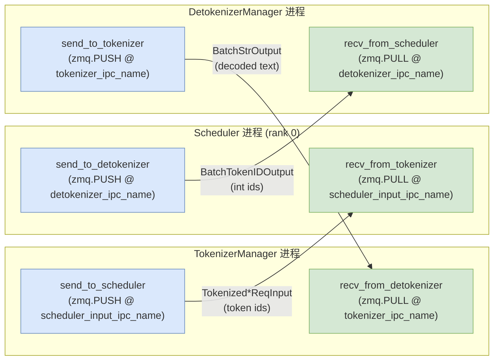

# TokenizerManager 与 DetokenizerManager：请求预处理与增量解码

> 本文仅依据 SGLang 本地源码（commit `e1c4db9621f7c4203ee9becd5d5456d4e6bf54f7`）撰写，所有论断均附证据锚点。涉及文件：`python/sglang/srt/managers/tokenizer_manager.py`、`python/sglang/srt/managers/detokenizer_manager.py`、`python/sglang/srt/managers/io_struct.py`、`python/sglang/srt/managers/scheduler_components/ipc_channels.py`、`python/sglang/srt/managers/multi_tokenizer_mixin.py`。

## 1. What：这两个组件是什么

`TokenizerManager` 与 `DetokenizerManager` 是两个**独立的常驻进程**，位于 HTTP 服务器（或 `TokenizerWorker`）与 `Scheduler` 之间，分别承担"请求 token 化"与"token id 流反序列化为文本"的职责：

- `TokenizerManager`：把用户传入的自然语言文本（或已编码的多模态输入）切分为模型可消费的 token id，组装成 `TokenizedGenerateReqInput` / `TokenizedEmbeddingReqInput` 发送给 `Scheduler`；并维护每个请求在 tokenizer 侧的异步状态，等待并回传 `Scheduler` 的产出。证据：`class TokenizerManager` 定义于 `python/sglang/srt/managers/tokenizer_manager.py:374`，其模块 docstring 明确写 `"TokenizerManager is a process that tokenizes the text."`（`python/sglang/srt/managers/tokenizer_manager.py:14`）。
- `DetokenizerManager`：从 `Scheduler` 接收已生成的整数 token id 流（`BatchTokenIDOutput`），增量解码为文本（`BatchStrOutput`）后回传给 `TokenizerManager`/`TokenizerWorker`。它是真正的 CPU 解码热路径。证据：`class DetokenizerManager` 定义于 `python/sglang/srt/managers/detokenizer_manager.py:91`，docstring 为 `"DetokenizerManager is a process that detokenizes the token ids."`（`python/sglang/srt/managers/detokenizer_manager.py:14`）。

两者的分工可一句话概括：**TokenizerManager 负责"入向"的文本→token，DetokenizerManager 负责"出向"的 token→文本**，而 `Scheduler` 始终在 token-id 空间内工作。

## 2. Why：为什么要把它们独立成进程

核心动机是**避免 CPU 密集的 tokenizer/detokenizer 工作阻塞 GPU 推理与调度线程**：

- 这两类操作（尤其是 HF `tokenizer` / `tokenizer.decode`）是 Python 单线程 + GIL 的 CPU 重活，且与模型前向计算无数据依赖。若放在 `Scheduler` 进程内，会直接拖慢 `Scheduler` 的事件循环与 `ModelRunner` 的 step 调度。
- 源码把它们显式实现为独立进程：`DetokenizerManager` 通过 `run_detokenizer_process` 启动，并用 `setproctitle.setproctitle("sglang::detokenizer")` 标记进程名（`python/sglang/srt/managers/detokenizer_manager.py:515-521`）。`TokenizerManager` 通过 `auto_create_handle_loop` 启动其 asyncio 事件循环（`python/sglang/srt/managers/tokenizer_manager.py:2175`），并在 `handle_loop` 中持续消费来自 detokenizer 的回传（`python/sglang/srt/managers/tokenizer_manager.py:2200`）。
- 进程间通过 ZMQ 的单向 PUSH/PULL（无应答、无阻塞）解耦，使得 tokenizer/detokenizer 的延迟不会反压 GPU 计算。

> 权衡：独立进程带来一次序列化（msgspec/pickle）+ ZMQ 拷贝的开销，且需要独立维护请求状态（`ReqState` 与 `DecodeStatus`）。SGLang 用批量解码、`LimitedCapacityDict` 环形淘汰、以及"在已解码文本上做增量差量"等手段抵消这部分开销（见第 5、6 节）。

## 3. 进程间通信拓扑（ZMQ 拓扑与消息流向）

三者之间使用 **ZMQ 的 PUSH→PULL 单向 socket**，全程无 REQ/REP、无阻塞等待。具体 socket 类型与绑定点由以下源码确定：

- `TokenizerManager.init_ipc_channels`：以 `zmq.PULL` 绑定 `port_args.tokenizer_ipc_name`（接收 detokenizer 回传），以 `zmq.PUSH` 连接 `port_args.scheduler_input_ipc_name`（发往 scheduler）。证据：`python/sglang/srt/managers/tokenizer_manager.py:534-548`。
- `DetokenizerManager.init_ipc_channels`：以 `zmq.PULL` 绑定 `port_args.detokenizer_ipc_name`（接收 scheduler 产出），以 `zmq.PUSH` 连接 `port_args.tokenizer_ipc_name`（回传 tokenizer）。证据：`python/sglang/srt/managers/detokenizer_manager.py:111-122`。
- `Scheduler`（rank 0）侧 `SchedulerIpcChannels.create`：`Scheduler` 以 `zmq.PULL` 绑定 `scheduler_input_ipc_name` 接收 tokenizer 输入，以 `zmq.PUSH` 绑定 `detokenizer_ipc_name` 发送解码任务；当 `--skip-tokenizer-init` 时，scheduler 直接把结果 PUSH 到 `tokenizer_ipc_name`（绕过 detokenizer）。证据：`python/sglang/srt/managers/scheduler_components/ipc_channels.py:37-65`。



**多 tokenizer / 多 detokenizer 模式**（`--tokenizer-worker-num > 1`）下，拓扑中插入两个路由器：`MultiTokenizerRouter`（tokenizer worker ↔ scheduler 与 detokenizer 回传的扇出）与 `MultiDetokenizerRouter`（按 `http_worker_ipc` 的 `zmq.crc32` 哈希把请求钉到固定 detokenizer，保证同一 rid 的 `decode_status` 一致）。证据：`python/sglang/srt/managers/multi_tokenizer_mixin.py:429-622`。此时 `TokenizerManager.send_to_scheduler` 改为 PUSH 到 `tokenizer_worker_ipc_name`，并由 router 转发（`python/sglang/srt/managers/tokenizer_manager.py:544-549`）；`DetokenizerManager` 的 `send_to_tokenizer` socket 在 `tokenizer_worker_num > 1` 时**不创建**，结果改由 `multi_http_worker_event_loop` 经 `SocketMapping` 直接扇出到各 worker IPC（证据：`python/sglang/srt/managers/detokenizer_manager.py:116-122`、`:399-426`）。

## 4. TokenizerManager 详解（入向路径）

### 4.1 关键方法签名

```python
class TokenizerManager(TokenizerControlMixin, TokenizerManagerScoreMixin):
    def init_ipc_channels(self, port_args: PortArgs): ...
    async def generate_request(self, obj: Union[GenerateReqInput, EmbeddingReqInput],
                               request: Optional[fastapi.Request] = None): ...
    async def _tokenize_one_request(self, obj: Union[GenerateReqInput, EmbeddingReqInput]): ...
    async def _tokenize_texts(self, texts: Union[str, List[str]],
                              is_cross_encoder: bool = False): ...
    def abort_request(self, rid: str = "", abort_all: bool = False): ...
    async def _handle_batch_output(self, recv_obj: Union[BatchStrOutput, BatchEmbeddingOutput, BatchTokenIDOutput]): ...
```

### 4.2 请求处理主流程

`generate_request` 是入口协程：先 `_init_req_state`（为每个子请求建立 `ReqState`），在 `is_pause` 与 `model_update_lock` 保护下调用 `_tokenize_one_request` 完成 token 化，再 `_send_one_request`（经 `_dispatch_to_scheduler` → `sock_send(self.send_to_scheduler, obj)`）发往 scheduler，最后 `async for response in self._wait_one_response(...)` 把结果逐块 yield 给上层 HTTP handler。证据：`python/sglang/srt/managers/tokenizer_manager.py:755-821`。

`_tokenize_one_request` 负责把 `GenerateReqInput`/`EmbeddingReqInput` 转换为 `TokenizedGenerateReqInput`，核心分支为：

- `obj.input_embeds` 或 `obj.input_ids` 已提供时直接使用；
- 否则调用 `_tokenize_texts` 用 HF tokenizer 编码。注意 `skip_tokenizer_init=True` 时不接受文本 prompt，会显式抛错（证据：`python/sglang/srt/managers/tokenizer_manager.py:1006-1014`）；
- 多模态请求（`contains_mm_input()`）会触发 `mm_processor.process_mm_data_async` 以补齐图像/音频占位 token 与 `input_ids`（证据：`python/sglang/srt/managers/tokenizer_manager.py:1036-1104`）。

`_tokenize_texts` 的输入格式自动识别（`SINGLE_STRING` / `BATCH_STRINGS` / `CROSS_ENCODER_PAIRS`，见 `_detect_input_format` `:823-844`），并优先走 `AsyncDynamicbatchTokenizer`（仅单条文本，需开启 `--enable-dynamic-batch-tokenizer`），否则回退到普通 `tokenizer(...)` 批量编码（证据：`python/sglang/srt/managers/tokenizer_manager.py:881-983`）。

### 4.3 abort 与结果回流

`abort_request` 构造 `AbortReq(rid=rid, abort_all=abort_all)` 并 `_dispatch_to_scheduler(req)`；当 `rid` 不在 `rid_to_state` 时会提前返回以避免无效发送（证据：`python/sglang/srt/managers/tokenizer_manager.py:1980-1997`）。

`scheduler` 的产出（经 detokenizer 解码后的 `BatchStrOutput`，或 `--skip-tokenizer-init` 时的 `BatchTokenIDOutput`）由 `handle_loop` 接收后进入 `_handle_batch_output`。该方法按 `rid` 取出 `ReqState`，累积 `state.output_ids` 与 `state.append_text(delta_text)`，并依据 `is_stream` / `incremental_streaming_output` 决定是发增量 delta（流式）还是整段文本。证据：`python/sglang/srt/managers/tokenizer_manager.py:2215-2392`。

## 5. DetokenizerManager 详解（出向路径）

### 5.1 事件循环与调度

`event_loop` 是同步循环：`sock_recv(self.recv_from_scheduler)` 阻塞取一条 `BatchTokenIDOutput`，经 `TypeBasedDispatcher`（`_request_dispatcher`）分派到 `handle_batch_token_id_out` / `handle_batch_embedding_out` 等；若产出非 `None`，`sock_send(self.send_to_tokenizer, output)` 回传。证据：`python/sglang/srt/managers/detokenizer_manager.py:156-174`。dispatcher 注册见 `init_request_dispatcher` `:156-164`。

### 5.2 增量解码状态机（DecodeStatus）

`DecodeStatus` 维护每个 rid 的增量解码进度，关键字段：`decoded_text`（已提交文本）、`decode_ids`（累积的全部 token id）、`surr_offset`（surrogate 上下文起点）、`read_offset`（已读取到的最新位置）、`sent_offset`（已发送给 tokenizer 的位置）。证据：`python/sglang/srt/managers/detokenizer_manager.py:63-88`。

解码主逻辑在 `_decode_batch_token_id_output`（`python/sglang/srt/managers/detokenizer_manager.py:290-409`）：

1. 对每个 rid 初始化或追加 `DecodeStatus`；追加时把新到的 `decode_ids` extend 进去（并 `_clamp_decode_ids`，见 5.4）。
2. 切分两段用于解码：`surr_ids = decode_ids[surr_offset:read_offset]`（surrogate 上下文前缀，含多模态占位等），`read_ids = decode_ids[surr_offset:]`（完整待解码段）。
3. 调用 `_grouped_batch_decode` 把两段 id 解码为文本 `surr_texts` / `read_texts`。
4. **增量差量**：`new_text = read_texts[i][len(surr_texts[i]):]`，即"本次新出现"的文本，避免重复解码已发送的前缀。

### 5.3 流式输出如何处理"半个 token"

这是 detokenizer 最易错的部分。一个 UTF-8 多字节字符可能被拆成多个 token，单步解码得到的 `new_text` 可能以不完整的字节序列结尾，此时 tokenizer 会输出 Unicode 替换符 `�`（U+FFFD）。源码处理分支如下（证据：`python/sglang/srt/managers/detokenizer_manager.py:373-394`）：

- 若 `new_text` 非空**且不以 `�` 结尾** → 认为这是干净可提交的文本：提交到 `decoded_text`，把 `surr_offset`/`read_offset` 推进到 `len(decode_ids)`，并发送 `new_text`。
- 若 `new_text` 以 `�` 结尾（不完整 UTF-8）→ 调用 `find_printable_text(new_text)` 只取可打印前缀，**不提交**到 `decoded_text`，token 偏移保持原位，待下一步拿到更多 token 后重试，避免把乱码发出去。
- 还存在"pending"机制：`sent_offset` 可能大于 `decoded_text_len`（表示上一次 `�` 恢复步骤已发出但未提交的文本），本次 emission 用 `new_text[pending:]` 跳过，防止重复发送。

`find_printable_text` 来自 `sglang.utils`（`python/sglang/srt/managers/detokenizer_manager.py:48-52` 导入），用于剥离尾部的非法 UTF-8。

### 5.4 越界 token id 的钳制与批量解码优化

`_clamp_decode_ids` 把超出词表范围的 id（如多模态占位负 id、radix-cache 的 pad 哈希）映射为 0，因为 tiktoken 类后端会对负/越界 id 抛 `OverflowError`；由于该钳制对 `surr_ids` 与 `read_ids` 同样施加，增量（read 减 surr）文本不变。证据：`python/sglang/srt/managers/detokenizer_manager.py:212-224`。

`_grouped_batch_decode` 做批量解码并按 `(skip_special_tokens, spaces_between_special_tokens)` 分组：对空 span 直接返回 `""` 以省去逐行开销；对慢速（非 `is_fast`）tokenizer 走 `decode_without_hf_kwargs` 逐行；对 fast tokenizer 若整批 flag 一致走一次 `batch_decode`，否则按 flag 分组分别 `batch_decode`。`--disable-tokenizer-batch-decode` 可强制逐行解码以规避某些边角问题（如 gpt-oss）。证据：`python/sglang/srt/managers/detokenizer_manager.py:226-288`、`init_running_status` 中的 `disable_tokenizer_batch_decode` `:141-143`。

### 5.5 停止符裁剪

`trim_matched_stop` 在流式增量与最终产出两处裁剪命中的 stop string / stop token（证据：`python/sglang/srt/managers/detokenizer_manager.py:176-206`）。注意：对字符串 stop 默认 `no_stop_trim=False` 会截掉匹配串本身（保留到匹配起点）；对 token stop，默认会移除最后一个 token，但 gpt-oss 的 `<|call|>`（id `200012`）作为 eos 时若开启 `tool_call_parser="gpt-oss"` 则保留（`:200-202`）。代码注释也指出"多 stop string 同时命中"的情形尚未处理（`:186` TODO）。

## 6. 消息格式（io_struct）

`scheduler` 发往 detokenizer 的是 `BatchTokenIDOutput`，关键字段（`python/sglang/srt/managers/io_struct.py:1404-1502`）：

- `finished_reasons: List[Optional[FinishReasonDict]]` —— 为 `None` 表示仍在流式生成；
- `decoded_texts: List[str]`、`decode_ids: List[array]`、`read_offsets: List[int]` —— 增量解码所需的历史文本、累积 id、已读取偏移；
- `skip_special_tokens` / `spaces_between_special_tokens` / `no_stop_trim` —— 解码配置（均为 per-request 列表）；
- `output_ids`、`prompt_tokens`、`completion_tokens`、`cached_tokens`、`reasoning_tokens` 等统计字段。

detokenizer 回传的是 `BatchStrOutput`（`python/sglang/srt/managers/io_struct.py:1504-1589`），把 `decode_ids` 换成已解码的 `output_strs: List[str]`，其余统计/日志概率字段透传。两者均继承 `BaseBatchReq`（`python/sglang/srt/managers/io_struct.py:90`），带有 `rids` 与 `http_worker_ipcs` 用于多 worker 路由。

## 7. 边界与坑（多 tokenizer / 多模态 / 容量）

1. **解码状态容量与淘汰**：`decode_status` 是 `LimitedCapacityDict`（`DETOKENIZER_MAX_STATES` 默认 `1<<16`，可被环境变量 `SGLANG_DETOKENIZER_MAX_STATES` 调大）。当请求数超过容量，最旧条目被 `popitem(last=False)` 淘汰；若某 rid 的解码状态被淘汰，后续 `_decode_batch_token_id_output` 会抛 `RuntimeError` 提示增大该环境变量（证据：`python/sglang/srt/managers/detokenizer_manager.py:60`、`:502-512`、`:362-372`）。
2. **多模态占位 token 的坑**：图像/音频/视频占位 id 常为负值或词表外值，必须经 `_clamp_decode_ids` 钳制，否则 tiktoken 后端 `OverflowError`。这些 id 只出现在 `surr_offset` 之前、不携带文本，钳制不影响增量文本（证据：`:212-224`）。
3. **多 tokenizer 路由一致性**：`MultiDetokenizerRouter` 用 `zlib.crc32(http_worker_ipc) % num_workers` 把同一 rid 钉到同一 detokenizer，确保 `decode_status` 不被分片到不同进程（证据：`python/sglang/srt/managers/multi_tokenizer_mixin.py:555-573`）。若哈希分布不均或 worker 数变化，可能出现某 detokenizer 偏热。
4. **`skip_tokenizer_init` 绕过 detokenizer**：此时 scheduler 直接把 `BatchTokenIDOutput` 经 `tokenizer_ipc_name` PUSH 回 `TokenizerManager`，detokenizer 完全不参与，输出里只有 `output_ids` 没有 `output_strs`（证据：`python/sglang/srt/managers/scheduler_components/ipc_channels.py:55-60`、`python/sglang/srt/managers/tokenizer_manager.py:2330-2331`）。
5. **特殊 token 与空格**：解码是否 `skip_special_tokens` 是 per-request 的，batch 内可能不一致，因此 `_grouped_batch_decode` 必须按 flag 分组而非一次性 `batch_decode`（`:256-281`）。gpt-oss 等模型的 tool-call token 与 stop 裁剪存在特殊交互（`:200-202`）。
6. **嵌入模型无解码**：`handle_batch_embedding_out` 直接原样返回 `recv_obj`（不解码），`BatchEmbeddingOutput` 不含文本（证据：`python/sglang/srt/managers/detokenizer_manager.py:208-210`、`python/sglang/srt/managers/io_struct.py:1592-1602`）。

> **[OPEN]** `trim_matched_stop` 当前只处理"命中单个 stop"的情况（源码 `:186` 注释 TODO：handle the case where multiple stop strs are hit）。多 stop 串同时命中时的裁剪语义（保留/裁剪哪一个）需进一步确认实现行为。

> **[OPEN]** `TokenizerManager` 自身进程启动函数（类似 `run_detokenizer_process` 的 `run_tokenizer_process`）在本任务必读的两个文件中未见定义，推测由引擎装配层（`sglang/srt/entrypoints` 或 `Engine`）负责 fork/spawn。其确切入口与进程名设置位置待在 `entrypoints` 侧源码中确认。
