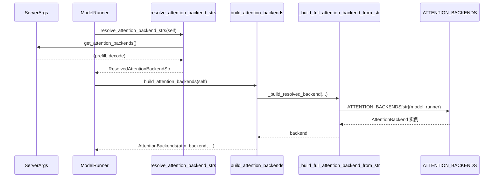

# 如何新增一个注意力（Attention）Kernel 后端

> 本文面向想要给 SGLang 推理引擎接入自定义注意力 kernel（如新的融合 kernel、第三方库、或仅用于实验的 dummy backend）的开发者。所有结论均来自对 SSOT 源码的阅读；文中每个关键论断都附有 `文件:行号区间` 形式的证据锚点，可直接跳转核对。

## 一、What：注意力后端是什么，注册机制长什么样

SGLang 把「注意力计算」从模型代码中解耦出来，统一抽象成 `AttentionBackend` 基类（`python/sglang/srt/layers/attention/base_attn_backend.py:L33-L54`）。每个具体实现（FlashInfer、Triton、FlashAttention-3、各类 MLA backend 等）都是一个 `AttentionBackend` 子类，由一个**全局注册表** `ATTENTION_BACKENDS = {}` 以「字符串名 → 工厂函数」的形式持有（`python/sglang/srt/layers/attention/attention_registry.py:L31-L39`）。

注册本身是一个装饰器，闭包把工厂函数塞进字典：

```python
def register_attention_backend(name):
    def decorator(fn):
        ATTENTION_BACKENDS[name] = fn
        return fn
    return decorator
```

（`python/sglang/srt/layers/attention/attention_registry.py:L34-L39`）

每个被注册的工厂函数签名统一为 `create_xxx_backend(runner)`，返回一个 `AttentionBackend` 实例。例如 FlashInfer 的注册（`python/sglang/srt/layers/attention/attention_registry.py:L42-L66`）：

```python
@register_attention_backend("flashinfer")
def create_flashinfer_backend(runner):
    if not runner.use_mla_backend:
        from sglang.srt.layers.attention.flashinfer_backend import FlashInferAttnBackend
        return FlashInferAttnBackend(runner, init_new_workspace=runner.init_new_workspace)
    else:
        from sglang.srt.layers.attention.flashinfer_mla_backend import FlashInferMLAAttnBackend
        return FlashInferMLAAttnBackend(runner)
```

**关键设计动机（Why）**：使用「工厂函数 + 惰性 import」而非直接存类，有两个好处。其一，工厂函数内部才 `import` 具体 backend 模块，避免所有后端依赖（flashinfer、trtllm、aiter……）在启动时全部加载；其二，工厂函数可以做运行时校验与条件分支（如 `flashinfer` 在 MLA 模型下切换到 `FlashInferMLAAttnBackend`，`trtllm_mla` 直接 `raise ValueError` 拒绝非 MLA 模型，见 `attention_registry.py:L69-L87`）。注册表只是名字到工厂的映射，**并不负责选择**——选择逻辑在 `ModelRunner` 一侧。

下面是「注册 → 选择 → 实例化」的整体关系图：

```mermaid
flowchart TD
    subgraph registry["注册表 attention_registry.py"]
        DICT["ATTENTION_BACKENDS = {}<br/>python/.../attention_registry.py:L31"]
        DEC["@register_attention_backend(name)<br/>L34-L39"]
        FAC["create_xxx_backend(runner)<br/>e.g. L42-L66"]
        DEC --> FAC
        FAC -->|写入| DICT
    end
    subgraph setup["选择 attention_backend_setup.py"]
        RES["resolve_attention_backend_strs<br/>L155-L176"]
        BUILD["build_attention_backends<br/>L67-L140"]
        FULL["_build_full_attention_backend_from_str<br/>L249-L255"]
        RES --> BUILD --> FULL
        FULL -->|ATTENTION_BACKENDS[str](runner)| DICT
        DICT -->|返回工厂| FULL
    end
    subgraph base["基类 base_attn_backend.py"]
        ABC["class AttentionBackend(ABC)<br/>L33-L54"]
    end
    FAC -->|返回| ABC
```

## 二、What：Backend 基类必须实现哪些接口

`AttentionBackend` 是一个抽象基类，定义了两类契约：**前向元数据（forward metadata）初始化契约**与 **forward 分派契约**。下面列出必须/通常要重写的方法与真实签名（锚点均为基类定义处）。

### 2.1 前向元数据初始化（CUDA Graph 友好）

基类把元数据准备拆成三段（`python/sglang/srt/layers/attention/base_attn_backend.py:L62-L104`）：

```python
def init_forward_metadata(self, forward_batch: ForwardBatch): ...
# 默认 = init_forward_metadata_out_graph(fb) + init_forward_metadata_in_graph(fb)

def init_forward_metadata_out_graph(self, forward_batch: ForwardBatch, in_capture: bool = False): ...
# 在 graph.capture() 之外执行：host op / 动态 shape / 不可图录制逻辑。
# 捕获时调用方传入 in_capture=True，replay/eager 传默认 False。

def init_forward_metadata_in_graph(self, forward_batch: ForwardBatch): ...
# 在 graph.capture() 之内执行、可被图录制的静态 shape GPU op。
# 默认 no-op。体内禁止调用 .item()/.cpu()/.tolist()/动态 shape torch.empty()。
```

（`python/sglang/srt/layers/attention/base_attn_backend.py:L62-L104`）

FlasInfer 的 `init_forward_metadata_out_graph` 真实实现（`python/sglang/srt/layers/attention/flashinfer_backend.py:L695-L699`）按 `forward_mode` 走不同分支：decode/idle 走 `indices_updater_decode.update`，target_verify 走 `indices_updater_prefill.update`，dllm_extend / draft_extend_v2 各有分支。这正是「metadata 构造按 forward_mode 分派」的范例。

### 2.2 forward 分派与三个算子入口

基类 `forward` 是统一入口，按 `forward_mode` 再派发到三个具体算子（`python/sglang/srt/layers/attention/base_attn_backend.py:L216-L297`）：

```python
@debug_kernel_api
def forward(self, q, k, v, layer, forward_batch, save_kv_cache=True, **kwargs):
    # idle -> 返回空张量；decode -> forward_decode；NPU 的 mixed -> forward_mixed
    # 其余（extend、draft_extend、target_verify 等）-> forward_extend

def forward_decode(self, q, k, v, layer, forward_batch, save_kv_cache=True, **kwargs):
    raise NotImplementedError()      # L261-L272

def forward_extend(self, q, k, v, layer, forward_batch, save_kv_cache=True, **kwargs):
    raise NotImplementedError()      # L274-L285

def forward_mixed(self, q, k, v, layer, forward_batch, save_kv_cache=True):
    raise NotImplementedError()      # L287-L297
```

（`python/sglang/srt/layers/attention/base_attn_backend.py:L216-L297`）

注意：基类的 `forward_decode` / `forward_extend` / `forward_mixed` 都直接 `raise NotImplementedError()`，所以**任何可用的后端都必须至少实现 `forward_decode` 与 `forward_extend`**（基类 `forward` 在所有非 decode/idle/mixed-npu 的路径上都落到 `forward_extend`）。

### 2.3 CUDA Graph 相关（按需实现）

若后端要支持 CUDA Graph（绝大多数生产后端需要），还必须实现：

```python
def init_cuda_graph_state(self, max_bs: int, max_num_tokens: int): ...   # L160-L162，基类 raise
def get_cuda_graph_seq_len_fill_value(self): ...                          # L187-L189，基类 raise，返回 padding 填充值（如 0 或 1）
```

（`python/sglang/srt/layers/attention/base_attn_backend.py:L160-L162`、`:L187-L189`）

FlashInfer 的实现分别是 `init_cuda_graph_state(self, max_bs, max_num_tokens, kv_indices_buf=None)`（`python/sglang/srt/layers/attention/flashinfer_backend.py:L1004-L1009`）和返回 `1` 的 `get_cuda_graph_seq_len_fill_value`（`flashinfer_backend.py:L1240-L1241`）。

### 2.4 类级开关（class attribute，非方法）

基类还定义了一组类属性开关，用于声明能力边界（默认值见 `base_attn_backend.py:L56-L143`）：

- `needs_cpu_seq_lens: bool = True`（L114）——后端是否依赖 `seq_lens_cpu`/`seq_lens_sum`。
- `extend_dummy_seqs_capped_by_req_pool: bool = False`（L119）——是否在 dummy extend 时把 batch_size 限制在 `req_to_token_pool.size` 之内（FlashInfer 设为 `True`，见 `flashinfer_backend.py:L294`）。
- `use_captured_forward_metadata_for_breakable_cuda_graph: bool = False`（L126）——BCG 捕获是否跨 graph break 暴露 metadata tensor 地址。
- `supports_full_cuda_graph_chunked_prefix: bool = False`（L143）——是否支持 chunked-prefix FullCG，需要重写 `prepare_full_cuda_graph_chunked_prefix`（L145-L158）。
- `prefill_attention_backend_str` / `decode_attention_backend_str`（L57-L58）——由 ModelRunner 在构造后回写（见 2.5）。

### 2.5 metadata 数据结构

metadata 没有统一的基类约束，是后端内部自定义的 dataclass。FlashInfer 定义了 `DecodeMetadata`（持有 `decode_wrappers` 列表与可选的 SWA `swa_out_cache_loc`，`flashinfer_backend.py:L146-L150`）和 `PrefillMetadata`（持有 `prefill_wrappers`、`use_ragged`、`extend_no_prefix`、`multi_item_params`、`swa_out_cache_loc`，`flashinfer_backend.py:L153-L159`），最终被组装进 `self.forward_metadata`，在 `forward_extend`/`forward_decode` 中通过 `self.forward_metadata.prefill_wrappers[...]` 读取（`flashinfer_backend.py:L1253-L1255`、`:L1414-L1416`）。

## 三、How：后端如何被选中（ServerArgs 开关 → Runner）

选择链路是：命令行/ServerArgs 字段 → `resolve_attention_backend_strs` → `build_attention_backends` → `_build_resolved_backend` → `_build_full_attention_backend_from_str` → `ATTENTION_BACKENDS[str](model_runner)`。

**1) ServerArgs 的开关字段**（`python/sglang/srt/server_args.py:L1668-L1694`）：`attention_backend`（统一后端）、`decode_attention_backend`（仅 decode，优先级更高）、`prefill_attention_backend`（仅 prefill，优先级更高）。它们的 `choices` 都来自 `ATTENTION_BACKEND_CHOICES`（同一文件 L179-L207）。

**2) 字符串解析**：`attention_backends_of(cfg)`（`python/sglang/srt/arg_groups/overrides.py:L276-L290`）把 split 字段回退到基础 backend，返回 `(prefill, decode)` 二元组；`ServerArgs.get_attention_backends()`（`server_args.py:L8923-L8924`）即委托它。

**3) Runner 解析并落库**：`ModelRunner.init_attention_backends`（`python/sglang/srt/model_executor/model_runner.py:L932-L952`）先调用 `resolve_attention_backend_strs(model_runner=self)` 得到 `(prefill, decode)`（`attention_backend_setup.py:L155-L176`），把结果烙印到 `self.prefill_attention_backend_str` / `decode_attention_backend_str`（model_runner.py:L947-L948），再调用 `build_attention_backends`（attention_backend_setup.py:L67-L140）。

**4) 工厂实例化**：`_build_full_attention_backend_from_str` 校验名字在 `ATTENTION_BACKENDS` 中，并以 `ATTENTION_BACKENDS[backend_str](model_runner)` 调用工厂（`attention_backend_setup.py:L249-L255`）。注意：工厂拿到的是 `model_runner`，其 `prefill_attention_backend_str`/`decode_attention_backend_str` 此时已被设置，因此后端构造时即可读取（FlashInfer 在 `__init__` 中读取 `model_runner.prefill_attention_backend_str` 做 KV 访问校验，见 `flashinfer_backend.py:L327-L333`）。

**5) 模型级包装与 hybrid**：若 `prefill != decode`，则 `_build_resolved_backend` 会用 `HybridAttnBackend` 把两个完整后端组合起来（`attention_backend_setup.py:L191-L222`）；草稿（draft）worker 则用 `draft_attention_backend` 统一覆盖 prefill/decode（L167-L174）。此外 `attn_backend_wrapper`（attention_registry.py:L309-L494）会为混合架构（GDN、Mamba2、KDA 等）再包一层线性/稀疏侧后端。

选择流程时序如下：



**关于 CLI 合法性**：若要让 `--attention-backend dummy` 成为合法命令行选项，名字必须同时出现在两处且完全一致——注册表 `ATTENTION_BACKENDS`（`attention_registry.py:L31`）与 `ATTENTION_BACKEND_CHOICES`（`server_args.py:L179-L207`）。新增名字可用 `add_attention_backend_choices(["dummy"])`（server_args.py:L392-L393）扩展，或直接向 `ATTENTION_BACKEND_CHOICES` 列表追加。`_resolved_attention_backends`（server_args.py:L8914-L8921）与 `get_attention_backends`（L8923-L8924）都依赖这个列表。

## 四、How：新增一个 dummy backend 的有序步骤

下面给出把「一个最小可跑的 dummy backend」接进引擎需要改动的文件，按执行顺序。

1. **新建后端模块** `python/sglang/srt/layers/attention/dummy_backend.py`，定义 `class DummyAttnBackend(AttentionBackend)`，至少实现 `forward_decode`、`forward_extend`、`init_cuda_graph_state`、`get_cuda_graph_seq_len_fill_value` 四个方法（否则 base 类默认实现会 `raise NotImplementedError`）。如需 CUDA Graph，还要正确填充 per-batch-size 的 metadata 字典并以 `self.forward_metadata` 暴露给 `forward_*`。

2. **在注册表中注册工厂函数**（推荐沿用惰性 import 模式，避免无谓依赖）：在 `attention_registry.py` 末尾新增

   ```python
   @register_attention_backend("dummy")
   def create_dummy_backend(runner):
       from sglang.srt.layers.attention.dummy_backend import DummyAttnBackend
       return DummyAttnBackend(runner)
   ```

   工厂签名必须是 `create_dummy_backend(runner)`（单位置参数），因为 `_build_full_attention_backend_from_str` 用 `ATTENTION_BACKENDS[backend_str](model_runner)` 调用（attention_backend_setup.py:L255）。

3. **把名字加入 CLI choices**：在 `server_args.py` 的 `ATTENTION_BACKEND_CHOICES`（L179-L207）追加 `"dummy"`，或直接调用 `add_attention_backend_choices(["dummy"])`（L392-L393）。这一步缺失会导致 argparse 拒绝该选项（但它们被用作 `choices=`，见 server_args.py:L1672）。

4. **（可选）兼容性断言**：若你的 backend 仅支持特定硬件/模型，参考 `trtllm_mla`（attention_registry.py:L69-L87）在工厂里 `raise ValueError`；或参考 `fa3`（L209-L232）按 `get_device_capability()` 做 SM 版本校验。

5. **（可选）能力开关**：在 `DummyAttnBackend` 上按需要覆盖类属性 `needs_cpu_seq_lens`、`extend_dummy_seqs_capped_by_req_pool`、`supports_full_cuda_graph_chunked_prefix` 等（base_attn_backend.py:L114-L143），避免被错误地纳入 CUDA Graph / 长上下文路径。

6. **启动验证**：用 `--attention-backend dummy`（或 `--prefill-attention-backend dummy --decode-attention-backend dummy`）启动。`ModelRunner.init_attention_backends` 会解析并实例化（model_runner.py:L932-L952）；若 prefill≠decode，会自动套 `HybridAttnBackend`（attention_backend_setup.py:L191-L222）。

> **[OPEN]** 注册表与 `ATTENTION_BACKEND_CHOICES` 的「两份名单一致性」目前没有任何启动期校验：若只在 `ATTENTION_BACKENDS` 注册而忘了加 choices，`resolve` 阶段会在 `_build_full_attention_backend_from_str` 的 `if backend_str not in ATTENTION_BACKENDS: raise ValueError` 处才报错（`attention_backend_setup.py:L252-L253`），错误信息只说 "Invalid attention backend" 而不提示「choices 缺项」。可考虑在测试或启动早期加一个一致性自检。

## 五、坑：metadata 构造与 forward_mode

1. **out_graph / in_graph 的 CUDA Graph 边界**。元数据准备被刻意拆成两段，是为了让可图录制的部分进 `init_forward_metadata_in_graph`、不可录制的 host/dynamic-shape 部分进 `init_forward_metadata_out_graph`（base_attn_backend.py:L62-L104）。若把 `.item()` / `.cpu()` / `.tolist()` 或动态 `torch.empty()` 写进 in_graph 分支，CUDA Graph 捕获会失败或产生错误结果。FlashInfer 在 `in_capture=True` 时额外走 `_prepare_cuda_graph_metadata`（`flashinfer_backend.py:L719-L721`），这是典型的「捕获期 vs replay 期」分叉写法。

2. **forward_metadata 必须可跨 batch 复用/按 bs 索引**。CUDA Graph 下 `init_cuda_graph_state(max_bs, max_num_tokens)` 预分配按 batch size 索引的 metadata（FlashInfer 用 `self.prefill_cuda_graph_metadata[bs]` / `decode_cuda_graph_metadata[bs]`，见 `flashinfer_backend.py:L729-L742`）。若你的 metadata 持有跨 replay 的 tensor 地址并在 BCG（breakable cuda graph）下暴露给 kernel，需把 `use_captured_forward_metadata_for_breakable_cuda_graph` 置 `True` 并实现 `init_forward_metadata_for_breakable_cuda_graph_capture` / `prepare_forward_metadata_for_breakable_cuda_graph_replay`（base_attn_backend.py:L126-L185），否则 graph break 后地址失效。

3. **forward_mode 不止 decode/extend**。基类 `forward` 把 idle、decode、NPU 的 mixed 单独分派，其余（含 `draft_extend_v2`、`target_verify`、`dllm_extend`、`extend`）全部落到 `forward_extend`（base_attn_backend.py:L228-L259）。这意味着 `forward_extend` 是「重灾区」——你必须在这里正确区分 extend / draft_extend / target_verify 等子模式（参考 FlashInfer `init_forward_metadata_out_graph` 的多分支，flashinfer_backend.py:L723-L765）。若只实现了朴素的 prefill，draft 投机解码或 verify 阶段会走错分支。

4. **idle 模式必须有返回值**。基类 `forward` 在 idle 时直接 `return q.new_empty(...)`（base_attn_backend.py:L228-L229）；若你重写了 `forward` 而没有保留该分支，空闲 batch 会被错误计算。建议不要重写 `forward`，只重写三个子算子。

5. **decode 与 extend 的 KV 写入语义不同**。FlashInfer 的 `forward_decode` 只有在 `save_kv_cache=True` 时才 `set_kv_buffer`（flashinfer_backend.py:L1423-L1432），且其 `cache_loc` 在交叉注意力下取自 `encoder_out_cache_loc`（L1417-L1421）。若你的 backend 不处理交叉注意力，需在构造/工厂阶段按 FlashInfer 那样 `assert not is_encoder_decoder`（参考 `triton` 后端，attention_registry.py:L179-L182）。

6. **prefill/decode 分离会触发 HybridAttnBackend**。一旦用户设置 `--prefill-attention-backend X --decode-attention-backend Y`，Runner 会用 `HybridAttnBackend` 包裹两个完整 backend，并先 `attn_backend_wrapper` 再做模型级包装（attention_backend_setup.py:L191-L217）。你的 backend 需要能在「被包裹」语境下正常工作，且其 `forward_metadata` 的惰性（lazy）重建不能依赖跨 forward 的全局状态。

## 六、小结与交叉阅读

新增一个注意力 backend 的核心动作只有两步：**写一个 `AttentionBackend` 子类** + **用 `@register_attention_backend` 注册一个 `create_*_backend(runner)` 工厂**。但要让它「可被用户选择」，名字还必须进入 `ATTENTION_BACKEND_CHOICES`；要让它「跑得稳」，必须按 forward_mode 正确构造 metadata、守住 CUDA Graph 的 out_graph/in_graph 边界。

相关阅读（纯文本路径，避免断链）：
- `python/sglang/srt/layers/attention/base_attn_backend.py` —— 基类完整定义。
- `python/sglang/srt/layers/attention/attention_registry.py` —— 注册表与全部工厂函数。
- `python/sglang/srt/model_executor/model_runner_components/attention_backend_setup.py` —— 选择/构建链路。
- `python/sglang/srt/server_args.py` —— ServerArgs 开关与 `ATTENTION_BACKEND_CHOICES`。
- `python/sglang/srt/layers/attention/flashinfer_backend.py` —— 最完整的参考实现。
- 深度解读可见 `docs/deep-dive/attention-backends.md`（若需理解逐 backend 差异与默认值回退）。
