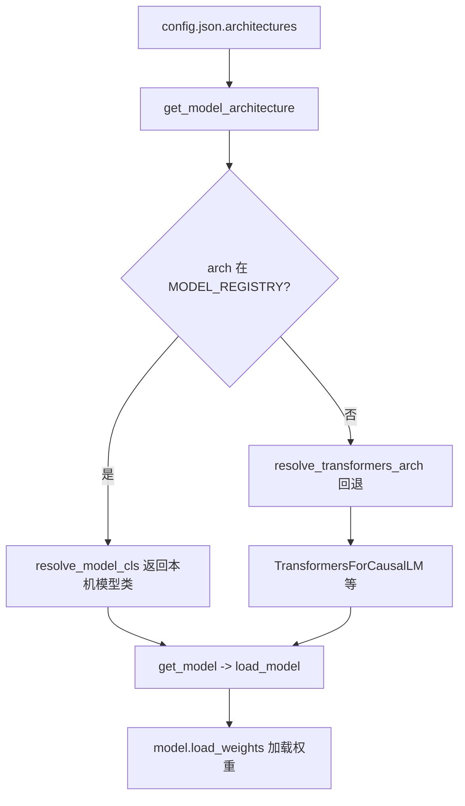

# 如何为 SGLang 新增一个模型（Add a Model）

> 本文档基于 SSOT commit `e1c4db9621f7c4203ee9becd5d5456d4e6bf54f7`（2026-08-14）的源码阅读结论。所有论断均带 `文件:行号` 锚点，可自行用 `Read` 复核。

## What：模型注册机制是什么

SGLang 的模型实现分散在 `python/sglang/srt/models/` 下各个独立模块中。框架在启动时不逐一 import，而是通过**模块自声明 + 包扫描**的方式，把「HuggingFace `config.json` 里的 `architectures` 名字 → 模型类」建立一张全局映射表 `MODEL_REGISTRY`（实际对象名为 `ModelRegistry`，单例）。

核心数据结构是 `_ModelRegistry`，其内部用 `models: Dict[str, Union[Type[nn.Module], str]]` 以 **model_arch 字符串为 key** 保存模型类（`python/sglang/srt/models/registry.py:19-22`）。

注册发生在模块导入期：包级常量 `ModelRegistry = _ModelRegistry()` 紧接着 `ModelRegistry.register("sglang.srt.models")`，后者会遍历 `python/sglang/srt/models/` 目录下所有 `.py` 模块并收集其中声明的 `EntryClass`（`python/sglang/srt/models/registry.py:130-134`）。

`register` 的实际扫描逻辑在 `import_model_classes`：用 `pkgutil.iter_modules` 列出子模块，对每个模块 `importlib.import_module` 后检查是否含 `EntryClass` 属性；`EntryClass` 可以是单个类，也可以是类列表（一个模块注册多个架构），最终以 `entry.__name__` 作为 key 写表（`python/sglang/srt/models/registry.py:94-127`）。

典型的「声明」就是模块末尾一行：

```python
EntryClass = [
    LlamaForCausalLM,
    Phi3ForCausalLM,
    InternLM3ForCausalLM,
    IQuestCoderForCausalLM,
]
```
（`python/sglang/srt/models/llama.py:930-935`）

注意 `Phi3ForCausalLM(LlamaForCausalLM)` 等只是 `pass` 的子类，说明注册名与实现类解耦：一个实现类可被多个 `architectures` 名字复用。

### 配置如何被解析成模型类

用户传入模型路径后，`get_model` 先取 `get_model_loader(load_config, model_config)` 再 `loader.load_model(...)`（`python/sglang/srt/model_loader/__init__.py:23-33`）。决定「用哪个类」的关键函数是 `get_model_architecture`：它读取 `model_config.hf_config.architectures`，先判断 `ModelRegistry.get_supported_archs()` 是否覆盖；若不支持且 `model_impl != TRANSFORMERS`，则走 `resolve_transformers_arch` 回退到 `TransformersForCausalLM` 等 HF 后端（`python/sglang/srt/model_loader/utils.py:197-237`）。最终由 `ModelRegistry.resolve_model_cls(architectures)` 返回 `(model_cls, arch)`，其中 `_normalize_archs` 保证 `TransformersForCausalLM` 永远排在最后作为 fallback（`python/sglang/srt/models/registry.py:80-91`）。



---

## Why：为什么这样设计

1. **声明式注册，避免循环依赖与全量 import**。`register` 用 `pkgutil` 懒遍历，新增模型只要新建一个模块并加 `EntryClass`，无需改动注册中心代码；import 失败时若非 `strict` 仅 warning 跳过，提升鲁棒性（`python/sglang/srt/models/registry.py:104-110`）。
2. **arch 名即 key，天然对齐 HuggingFace**。`config.json` 的 `architectures` 字段直接作为 key，用户无需任何额外映射配置即可用 HF 原生权重启动。
3. **统一权重加载契约**。`load_weights(weights: Iterable[Tuple[str, torch.Tensor]])` 是所有模型的统一接口，框架侧只负责把 checkpoint 迭代成 `(name, tensor)` 流喂给模型，模型自己负责 key 重映射与分片，便于支持 TP/PP/量化等复杂形态。

---

## How：手把手新增一个「类 Llama」的模型

下面以新增一个与 Llama 结构相同、仅配置名不同的模型 `MyLlamaForCausalLM`（HF `architectures: ["MyLlamaForCausalLM"]`）为例。

### 步骤 1：新建模块文件
在 `python/sglang/srt/models/` 下新建 `my_llama.py`。

### 步骤 2：实现 `MyLlamaForCausalLM`（继承或照搬 Llama 组件）
最小可行做法是直接复用 `LlamaModel`/`LlamaDecoderLayer`/`LlamaAttention`/`LlamaMLP`，只重写顶层类：

```python
from sglang.srt.models.llama import LlamaForCausalLM
from transformers import LlamaConfig

class MyLlamaForCausalLM(LlamaForCausalLM):
    # 若结构完全一致，可仅 pass；有差异则覆写 _init_model / 子层
    pass
```
顶层类的 `__init__` 签名需与框架一致：`__init__(self, config, quant_config=None, prefix="")`，内部必须构建 `self.model`、`self.lm_head`（`tie_word_embeddings` 时绑定 `embed_tokens`）、`self.logits_processor`、`self.stacked_params_mapping`（`python/sglang/srt/models/llama.py:518-560`）。

### 步骤 3：声明 `EntryClass`
模块末尾必须导出 `EntryClass`，key 即为 HF 架构名：

```python
EntryClass = MyLlamaForCausalLM
```
确保类名与 `config.json` 的 `architectures` 完全一致（`python/sglang/srt/models/llama.py:930-935`）。

### 步骤 4：实现 `load_weights`
绝大多数 Llama 系模型**无需手写** `load_weights`——基类 `LlamaForCausalLM.load_weights` 已处理：先按 `SGLANG_ENABLE_WEIGHT_LOADER_V2` 分流到 `_load_weights_v2`（走 `AutoWeightsLoader` + `RemapRegistry`）或 `_legacy_load_weights`（`python/sglang/srt/models/llama.py:663-668`）。

legacy 路径的核心是把 HF 的 `q_proj/k_proj/v_proj` 合并到融合的 `qkv_proj`、`gate_proj/up_proj` 合并到 `gate_up_proj`，通过 `stacked_params_mapping` 三元组 `(".qkv_proj", ".q_proj", "q")` 循环替换名字并调用各参数的 `weight_loader` 分片（`python/sglang/srt/models/llama.py:670-742`）。若你的模型权重键名不同，可仿照 `LlamaAttention.load_weights` 用 `STANDARD_QKV_MAPPING.try_load(...)` 做自动路由（`python/sglang/srt/models/llama.py:266-280`；`STANDARD_QKV_MAPPING` 定义见 `python/sglang/srt/model_loader/auto_loader.py:114-120`）。

### 步骤 5：准备 `config.json`
至少包含 `architectures: ["MyLlamaForCausalLM"]`、`hidden_size`、`num_attention_heads`、`num_key_value_heads`、`intermediate_size`、`num_hidden_layers`、`vocab_size`、`rms_norm_eps`、`rope_theta`、`hidden_act` 等。Llama 系从 `config` 读取 rotary 参数（支持 `rope_parameters`、`rope_scaling`、`original_max_position_embeddings`、`attention_bias` 等可选字段），缺失时给出默认值（`python/sglang/srt/models/llama.py:294-339`）。

### 步骤 6：启动验证
```
python -m sglang.launch_server --model-path /path/to/my-llama
```
若架构未注册会走到 `TransformersForCausalLM` fallback 并打印 warning（`python/sglang/srt/model_loader/utils.py:228-236`）。想强制本机实现，确认类名正确且无 import 报错（import 失败在 `strict=False` 下被静默跳过，`python/sglang/srt/models/registry.py:104-110`）。

---

## 权重加载关键点（config.json 字段 / state_dict key 映射 / 量化）

- **state_dict key 映射**：HF 权重使用 `.q_proj/.k_proj/.v_proj/.gate_proj/.up_proj`，而 SGLang 运行时把它融合为 `.qkv_proj`、`.gate_up_proj`。默认 loader 通过字符串替换 + `param.weight_loader(param, tensor, shard_id)` 完成分片加载（`python/sglang/srt/models/llama.py:714-739`）。新模型若结构不同，需在 `load_weights` 里自定义 `stacked_params_mapping`。
- **默认 weight_loader**：`default_weight_loader(param, loaded_weight)` 做形状断言后 `param.data.copy_`；量化层会把 `weight_loader` 替换为带分片/反量化的版本（`python/sglang/srt/model_loader/weight_utils.py:1477-1495`）。
- **量化权重**：量化配置由 `get_quant_config` 从 `config.json` 的 `quantization_config`（或 `text_config.quantization_config`、`compression_config`）读取并注入每层的 `quant_config`（`python/sglang/srt/model_loader/weight_utils.py:262-311`）。FP8 的 `k_scale/v_scale` 与旧式 `kv_scale` 的命名差异由 `maybe_remap_kv_scale_name` 统一归一到 `attn.k_scale/attn.v_scale`（`python/sglang/srt/model_loader/weight_utils.py:1674-1752`）。新增量化类型时需保证对应 linear 层注册正确的 `weight_loader`。
- **`tie_word_embeddings`**：为 `True` 时 `lm_head` 直接复用 `embed_tokens` 且跳过 `lm_head.weight` 的加载；为 `False` 时构建独立的 `ParallelLMHead`（`python/sglang/srt/models/llama.py:531-540`、`706-707`、`757-777`）。

---

## 边界与坑

1. **`EntryClass` 类名必须与 `config.json` 的 `architectures` 完全一致**。`resolve_model_cls` 用精确字符串匹配；差一个字母就会 fallback 到 HF Transformers 后端，性能/功能可能不及预期但未必报错（`python/sglang/srt/models/registry.py:84-91`、`python/sglang/srt/model_loader/utils.py:223-237`）。
2. **模块 import 静默失败**。`register` 在 `strict=False` 下吞掉 import 异常，仅 warning。若你的模型类有顶层依赖错误，会“看起来没注册”，需主动检查启动日志（`python/sglang/srt/models/registry.py:104-110`）。
3. **rotary 配置陷阱**：`rope_theta`、NeoX 风格（`rope_is_neox_style`）、`rope_scaling` 都来自 `config`。遗漏 `rope_scaling` 或 `original_max_position_embeddings` 会导致长上下文位置编码错误（`python/sglang/srt/models/llama.py:294-307`）。自定义 rope 必须调用 `get_rope(...)` 并在 `forward` 中施加（`python/sglang/srt/models/llama.py:201-208`）。
4. **`lm_head` 绑定陷阱**：`tie_word_embeddings=True` 时 checkpoint 里若仍含 `lm_head.weight`，legacy loader 会 `continue` 跳过，但 v2 `AutoWeightsLoader` 需要把它显式加入 `skip_prefixes`，否则 `embed_tokens` 与 `lm_head` 不一致（`python/sglang/srt/models/llama.py:757-777`）。
5. **TP/PP 分片与 `stacked_params_mapping`**：融合层权重写入的是 `qkv_proj`/`gate_up_proj` 的 `weight_loader`，而非原始 `q_proj`。自定义 `load_weights` 时务必先走 `STANDARD_*_MAPPING.try_load` 或 `stacked_params_mapping` 循环，否则分片维度对不上会触发形状断言失败（`python/sglang/srt/models/llama.py:714-739`、`python/sglang/srt/model_loader/weight_utils.py:1486-1491`）。
6. **PP 下权重过滤**：pipeline parallel 时 `_load_weights_v2` 通过 `filter_pp_weights` 丢弃非本 rank 的层；legacy 路径则在 `load_weights` 里用 `get_layer_id` 判断 `layer_id` 是否落在 `[start_layer, end_layer)`（`python/sglang/srt/models/llama.py:688-697`、`python/sglang/srt/model_loader/auto_loader.py:156-170`）。自定义层命名若不含 `model.layers.N` 结构，需保证 `get_layer_id` 能解析。

> **[OPEN]** 权重加载存在 v1（legacy）与 v2（`AutoWeightsLoader` + `RemapRegistry`）两条路径，由 `SGLANG_ENABLE_WEIGHT_LOADER_V2` 控制。文档仅确认分流点在 `LlamaForCausalLM.load_weights`（`python/sglang/srt/models/llama.py:663-668`）。v2 路径下各模型的 `RemapRegistry` 注册细节与新式 `post_load_weights`（PR1 协议）的完整迁移状态，建议进一步阅读 `python/sglang/srt/models/utils.py` 与 `python/sglang/srt/model_loader/auto_loader.py` 后再补充。

### 进阶：不解耦内核即可注册外部模型包
若你不想把模型代码放进 SGLang 仓库，可将其打包为独立 Python 包，并通过环境变量 `SGLANG_EXTERNAL_MODEL_PACKAGE` 指向该包名。注册中心在扫描完内置 `sglang.srt.models` 后会额外调用 `ModelRegistry.register(external_pkg, overwrite=True)`，从而用外部实现覆盖同名架构（`python/sglang/srt/models/registry.py:133-134`）。该路径的包内同样需要满足「模块含 `EntryClass`」的约定（`python/sglang/srt/models/registry.py:111-125`）。注意 `overwrite=True` 意味着外部包的同名架构会**替换**内置实现，调试时需确认到底加载了哪一份。

### 进阶：快速验证权重是否被正确加载
可用 `LlamaForCausalLM.get_weights_by_name(name)`（仅用于非优化路径的单测）按名取回参数，对比 checkpoint 原始张量，确认分片与 key 映射无误（`python/sglang/srt/models/llama.py:781-852`）。若启动后报形状断言失败，优先检查 `stacked_params_mapping` 与融合层 `weight_loader` 是否覆盖了所有 checkpoint key；legacy loader 对未在 `params_dict` 中的 key 仅打印 warning 而不报错，容易掩盖「部分权重未加载」的问题（`python/sglang/srt/models/llama.py:740-741`、`python/sglang/srt/model_loader/weight_utils.py:1486-1491`）。

---

## 证据锚点速查

- 注册单例与包扫描：`python/sglang/srt/models/registry.py:130-134`
- `import_model_classes`（`EntryClass` 收集）：`python/sglang/srt/models/registry.py:94-127`
- `resolve_model_cls`（`arch` → 类）：`python/sglang/srt/models/registry.py:80-91`
- `get_model`：`python/sglang/srt/model_loader/__init__.py:23-33`
- `get_model_architecture`：`python/sglang/srt/model_loader/utils.py:197-237`
- `EntryClass` 声明示例：`python/sglang/srt/models/llama.py:930-935`
- 顶层类 `__init__` / `tie_word_embeddings`：`python/sglang/srt/models/llama.py:518-560`
- `load_weights` 分流 v1/v2：`python/sglang/srt/models/llama.py:663-668`
- legacy 权重 key 映射：`python/sglang/srt/models/llama.py:670-742`
- `STANDARD_QKV_MAPPING`：`python/sglang/srt/model_loader/auto_loader.py:114-120`
- `default_weight_loader`：`python/sglang/srt/model_loader/weight_utils.py:1477-1495`
- FP8 kv_scale 重映射：`python/sglang/srt/model_loader/weight_utils.py:1674-1752`
- rotary 参数读取：`python/sglang/srt/models/llama.py:294-339`
