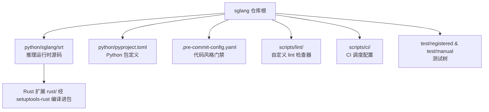
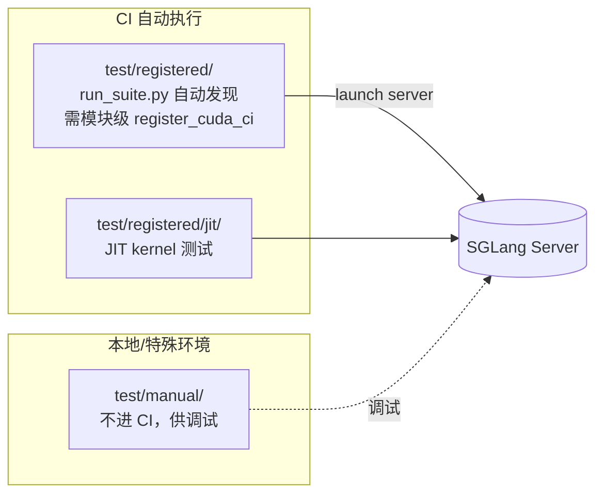
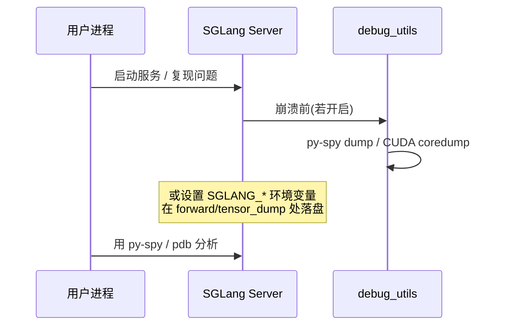

# 开发环境搭建（Dev Setup）

本页面向 SGLang 贡献者，说明如何在本地从源码搭建可调试、可测试、可提交 PR 的开发环境。所有结论均来自对齐 commit `e1c4db9621f7c4203ee9becd5d5456d4e6bf54f7` 的源码，命令与环境变量均以真实文件为准。

---

## 1. What：开发环境包含什么

SGLang 的 Python 包源码位于仓库的 `python/` 子目录（`python/sglang/`），与构建系统、Rust 扩展、CI 脚本、文档分层组织：



- **可编辑安装（editable install）**：让你在 `python/sglang/srt` 下直接改代码、无需重装即生效。
- **pre-commit 门禁**：在 `pre-commit` / `pre-push` / `manual` 三个阶段自动跑 ruff、black、isort、clang-format 等检查器，保证提交前风格一致。
- **测试树**：`test/registered` 为 CI 自动发现并执行的测试；`test/manual` 为本地调试、特殊环境用、不进 CI。
- **调试开关**：大量 `SGLANG_*` 环境变量与 `debug_utils/` 下的 dump / coredump 工具用于在运行时暴露内部状态。

> 为何要从源码开发而不是 pip 装 wheel：wheel 是编译产物，改 `python/sglang/srt` 后不会反映到已安装包；可编辑安装让源码即生效，且 `dev` docker 镜像（`lmsysorg/sglang:dev`）已预装编译/开发工具链（见 install.mdx:74）。

---

## 2. Why：为什么这样设计

- **可编辑安装 + 源码树分离**：SGLang 同时包含 Python 运行时、JIT/AOT CUDA 算子、以及 Rust 扩展（如 `sglang-grpc`、`sglang-mm`）。`python/pyproject.toml` 用 `setuptools-rust` + `setuptools-scm` 自动发现 `rust/` 工作区里的扩展模块（见 python/pyproject.toml:1-3, 242-247），因此 `pip install -e "python"` 一键把整套运行时以开发模式装好。
- **pre-commit 而非只靠 CI**：CI 资源有限，且只有受信贡献者能触发（见 docs/docs/developer_guide/contribution_guide.mdx:108-113）。把 ruff/black/isort 下放到本地 pre-commit，能在 push 前就修掉大部分格式问题，减少 CI 往返。
- **registered / manual 二分**：CI 机器宝贵，必须能自动发现、按 AST 解析 `est_time`/`stage`/`runner_config` 来调度测试（见 test/README.md:61-73）。把"需要手动搭环境/仅供调试"的用例放进 `manual/`，避免污染 CI 注册表。

---

## 3. How：搭建与日常命令

### 3.1 可编辑安装

官方"Method 2: From source"给出的命令（见 docs/docs/get-started/install.mdx:60-70）：

```bash
git clone -b v0.5.16 https://github.com/sgl-project/sglang.git
cd sglang
pip install --upgrade pip
pip install -e "python"          # 关键：editable，源码改动即时生效
```

依赖分组在 `python/pyproject.toml` 中声明：`sglang[test]` 提供 pytest / parameterized / expecttest 等测试依赖，`sglang[dev]` 等价于 `sglang[test]`（见 python/pyproject.toml:154-185）。开发推荐：

```bash
pip install -e "python[test]"
```

> **坑 1**：若遇到 `OSError: CUDA_HOME environment variable is not set`，需 `export CUDA_HOME=/usr/local/cuda-<版本>`，或先装 FlashInfer 再装 SGLang（见 install.mdx:55-58）。默认 CUDA 13，要在 CUDA 12 下装需额外换 wheel 源（install.mdx:28-36）。

### 3.2 pre-commit 与代码风格

安装并启用（见 docs/docs/developer_guide/contribution_guide.mdx:23-31）：

```bash
pip3 install pre-commit
pre-commit install
pre-commit run --all-files      # 本地手动跑全部检查
```

`.pre-commit-config.yaml` 中实际生效的检查器（见 .pre-commit-config.yaml:1-188）：

- `isort`（rev 7.0.0，isort hook）：导入排序。
- `ruff`（rev v0.15.1）：仅 `--select=F401,F821,UP037`（未使用导入 / 未定义名 / 过时的 `typing` 导入），并 `--fix`（见 .pre-commit-config.yaml:33-50）。注意 ruff 默认**只查这几类**，其余风格靠 black。
- `black`（rev 26.1.0，`black-jupyter`）：代码格式化（见 .pre-commit-config.yaml:51-55）。
- `codespell`：拼写检查（见 .pre-commit-config.yaml:56-60）。
- `clang-format`（`--style=file`）：C++/CUDA 文件格式化（见 .pre-commit-config.yaml:61-66）。
- 大量 `local` 钩子：`check-registered-tests`、`check-no-registered-tests-in-package`、`check-no-bare-pytest-main`、`check-static-ratchets` 等，保证测试注册合规（见 .pre-commit-config.yaml:94-176）。

> **坑 2**：`pre-commit run --all-files` 第一次失败很正常，因为 `--fix` 会就地改文件；改完后**再跑一次**确认通过（docs/docs/developer_guide/contribution_guide.mdx:33）。链接检查（lychee）默认不阻塞本地提交，仅在 CI 强制（docs/docs/developer_guide/contribution_guide.mdx:35）。

### 3.3 测试布局：registered vs manual



- **`test/registered/`**：CI 测试文件，被 `run_suite.py` 自动发现（见 test/README.md:14）。每个文件**必须在模块级调用注册函数**，例如 `register_cuda_ci(est_time=80, stage="base-b", runner_config="1-gpu-small")`（见 test/README.md:63-71）。`est_time`/`stage`/`runner_config` 必须是字面量，`run_suite.py` 用 AST 解析收集（test/README.md:73）。
- **`test/manual/`**：非 CI 测试，用于本地调试或特殊 setup（test/README.md:15）。
- **运行单个测试**（见 test/README.md:39-59）：

```bash
# 直接跑单个文件（unittest 或 pytest 均可，CI runner 默认带 -f failfast）
python3 test/registered/core/test_srt_endpoint.py
# 单个测试方法
python3 test/registered/core/test_srt_endpoint.py TestSRTEndpoint.test_simple_decode
# 单元测试用例（不启服务器）
pytest test/registered/unit/ -v
pytest test/registered/unit/mem_cache/ -v
# 跑一整个 CI suite
python3 test/run_suite.py --hw cuda --suite base-b-test-1-gpu-small
```

> **坑 3**：测试文件末尾必须以 `unittest.main()` 或 `pytest.main([__file__])` 收尾，**不要**自定义 `argparse` 或改 `sys.argv`，否则 CI 追加 `-f` 会出错（test/README.md:20-35）。

---

## 4. Debug 技巧

### 4.1 常用打印 / 断点位置（指向真实函数）

- **调度主循环**：`Scheduler` 的 `event_loop_normal` / `event_loop_overlap` / `run_batch` 是请求处理核心，断点可放 `python/sglang/srt/managers/scheduler.py`。
- **前向执行**：`ModelRunner` 的 `forward` / `forward_decode` 是每层实际计算入口，断点可放 `python/sglang/srt/model_executor/model_runner.py`（如 model_runner.py:389 处打印 device / CUDA_VISIBLE_DEVICES 上下文）。
- **tokenizer / detokenizer 边界**：`TokenizerManager` 与 `DetokenizerManager`（python/sglang/srt/managers/）是请求进出边界，适合看请求体。
- **自定义对象 dump**：`debug_utils/dumper.py` 的 `Dumper` 类读取 `DUMPER_*` 系列环境变量决定是否 dump 中间张量（见 python/sglang/srt/debug_utils/dumper.py:72,85，其 `_env_prefix` 返回 `"DUMPER_"`）；`dump_loader.py` 用 `SGLANG_DUMP_LOADER_DIR` 指定加载目录（见 python/sglang/srt/debug_utils/dump_loader.py:61）。
- **张量 dump hook**：`tensor_dump_forward_hook.py` 用 `TENSOR_DUMP_TOP_LEVEL_MODULE_NAME`（默认 `model`）与 `TENSOR_DUMP_LAYERS_MODULE_NAME`（默认 `layers`）定位要 dump 的模块（见 python/sglang/srt/debug_utils/tensor_dump_forward_hook.py:156-157）。

### 4.2 attach 调试器 / 进程采样

- **py-spy**：依赖里已带 `py-spy`（python/pyproject.toml:61）。崩溃前 SGLang 默认尝试 py-spy dump，由 `SGLANG_PYSPY_DUMP_BEFORE_CRASH`（默认 `True`）控制（见 python/sglang/srt/environ.py:367）。
- **CUDA coredump**：`debug_utils/cuda_coredump.py` 在崩溃前生成 coredump，`SGLANG_CUDA_COREDUMP`（默认 False）、`SGLANG_CUDA_COREDUMP_DIR`、`SGLANG_CUDA_COREDUMP_BEFORE_CRASH_WAIT_SECS`（默认 60s）控制（见 environ.py:362-369）。相关还有 `CUDA_ENABLE_USER_TRIGGERED_COREDUMP`、`CUDA_COREDUMP_PIPE`（python/sglang/srt/utils/cudacore_pyspy_dump_utils.py:33,97）。
- **remote-pdb**：在 `diffusion` extra 里提供（python/pyproject.toml:117），可用于远程 attach。



### 4.3 关键环境变量开关（调试向）

除下方完整表外，以下开关对调试尤其有用：

- `SGLANG_INVARIANT_CHECK`（默认 OFF，environ.py:464）、`SGLANG_CHECK_KV_PAGE_INVARIANTS`（默认 False，environ.py:450）、`SGLANG_DEBUG_MEMORY_POOL`（environ.py:440）、`SGLANG_DEBUG_POISON_POOL`（environ.py:442）——内存/KV 页一致性校验。
- `SGLANG_LOG_SCHEDULER_STATUS_INTERVAL`（默认 60s，environ.py:332）、`SGLANG_LOG_MS`（environ.py:328）、`SGLANG_LOG_FORWARD_ITERS`（environ.py:326）——运行时日志开关。
- `SGLANG_ENABLE_NVTX_SCHEDULER` / `SGLANG_ENABLE_NVTX_OPERATIONS`（environ.py:413-416）——Nsight 打点。

---

## 5. 常用环境变量清单（来自 srt 源码 grep）

下列变量均通过 `grep -rn "os.getenv\|os.environ" python/sglang/srt` 取得，给出真实文件与行号。

| 变量名 | 作用 | 默认 | 锚点 |
|---|---|---|---|
| `SGLANG_TORCH_PROFILER_DIR` | torch profiler 输出目录 | `/tmp` | python/sglang/srt/utils/profile_utils.py:110 |
| `SGLANG_IS_IN_CI` | 标记当前是否运行在 CI 中（影响清理逻辑） | `false` | python/sglang/srt/utils/stale_shm_cleanup.py:85 |
| `SGLANG_WAIT_PORT_TIMEOUT` | 等待端口就绪超时（秒） | `30` | python/sglang/srt/utils/network.py:67 |
| `SGLANG_LOCAL_IP_NIC` | 指定取本地 IP 用的网卡名 | 未设置 | python/sglang/srt/utils/network.py:268 |
| `SGLANG_HOST_IP` / `HOST_IP` | 覆盖广播用本机 IP | 空 | python/sglang/srt/utils/network.py:360 |
| `SGLANG_LOGGING_CONFIG_PATH` | 自定义 logging 配置路径 | 未设置 | python/sglang/srt/utils/common.py:2182 |
| `PROMETHEUS_MULTIPROC_DIR` | Prometheus 多进程指标目录 | 运行时生成临时目录 | python/sglang/srt/utils/common.py:2384 |
| `SGLANG_DETOKENIZER_MAX_STATES` | detokenizer 缓存最大状态数 | `1<<16` | python/sglang/srt/managers/detokenizer_manager.py:60 |
| `SGLANG_HEALTH_CHECK_TIMEOUT` | HTTP 健康检查超时（秒） | `20` | python/sglang/srt/entrypoints/http_server.py:192 |
| `SGLANG_WAIT_WEIGHTS_READY_TIMEOUT` | 等待权重就绪超时（秒） | `120` | python/sglang/srt/entrypoints/http_server.py:193 |
| `SGLANG_RUN_ID` | 本次运行唯一 ID（offloader 用） | 自动生成 | python/sglang/srt/entrypoints/engine.py:1659 |
| `SGLANG_DP_RANK` | 数据并行 rank | 必填（运行时注入） | python/sglang/srt/managers/scheduler.py:4947 |
| `SGLANG_CPU_OMP_THREADS_BIND` | CPU 引擎 OMP 线程绑核策略 | `all` | python/sglang/srt/utils/numa_utils.py:439 |
| `SGLANG_NSYS_PROFILING` | 是否处于 nsys 性能分析 | `0` | python/sglang/srt/utils/bench_utils.py:56 |
| `SGLANG_CLIP_MAX_NEW_TOKENS_ESTIMATION` | 最大新 token 估计裁剪上限 | `4096` | python/sglang/srt/managers/schedule_policy.py:74 |
| `SGLANG_MAMBA_DEBUG_ASSERTS` | Mamba 缓存调试断言 | `0` | python/sglang/srt/mem_cache/memory_pool.py:101 |
| `SGLANG_LAZY_COMPACTION_MAX_MOVES_PER_CALL` | 惰性压缩单次最大搬移数 | `4096` | python/sglang/srt/mem_cache/multi_ended_allocator.py:234 |
| `SGLANG_MOE_PADDING` | 强制 MoE padding | `0` | python/sglang/srt/layers/moe/utils.py:731 |
| `SGLANG_SKIP_P2P_CHECK` | 跳过 P2P 连通性检查 | `0` | python/sglang/srt/distributed/device_communicators/custom_all_reduce_utils.py:430 |
| `SGLANG_NCCL_SO_PATH` | 指定 NCCL 动态库路径 | 未设置 | python/sglang/srt/distributed/device_communicators/pynccl_wrapper.py:48 |
| `SGLANG_PP_LAYER_PARTITION` | 流水线并行的层切分覆盖 | 未设置 | python/sglang/srt/distributed/utils.py:103 |
| `SGLANG_RINGBUFFER_WARNING_INTERVAL` | 共享内存 ringbuffer 警告间隔（秒） | `60` | python/sglang/srt/distributed/device_communicators/shm_broadcast.py:27 |
| `SGLANG_STAGING_USE_TORCH` | KV staging 缓冲是否用 torch（否则 triton） | 未设置（默认用 triton） | python/sglang/srt/disaggregation/common/staging_buffer.py:28 |
| `SGLANG_USE_CPU_ENGINE` | 启用 CPU 推理引擎 | `0` | python/sglang/srt/platforms/__init__.py:42 |
| `SGLANG_DG_CACHE_DIR` | DeepGEMM JIT 缓存目录 | 跟随 `SGLANG_CACHE_DIR` | python/sglang/srt/layers/deep_gemm_wrapper/compile_utils.py:40 |
| `TORCHINDUCTOR_CACHE_DIR` / `TRITON_CACHE_DIR` | torch.compile / triton 编译缓存目录 | 运行时设置 | python/sglang/srt/compilation/compiler_interface.py:198-201 |
| `SGLANG_DUMP_LOADER_DIR` | 对象 dump 加载目录 | 未设置 | python/sglang/srt/debug_utils/dump_loader.py:61 |
| `TENSOR_DUMP_TOP_LEVEL_MODULE_NAME` | 张量 dump 顶层模块名 | `model` | python/sglang/srt/debug_utils/tensor_dump_forward_hook.py:156 |
| `TENSOR_DUMP_LAYERS_MODULE_NAME` | 张量 dump 层模块名 | `layers` | python/sglang/srt/debug_utils/tensor_dump_forward_hook.py:157 |

> 大多数 `SGLANG_*` 变量的**权威声明处**是 `python/sglang/srt/environ.py` 里的 `envs` 对象：通过 `EnvStr` / `EnvBool` / `EnvInt` / `EnvFloat` 字段集中定义类型与默认值（见 python/sglang/srt/environ.py:37 起 `EnvField` 类、environ.py:272 起 `SGLANG_*` 字段）。上面表里凡在 `environ.py` 也有声明的变量，以 `environ.py` 中的默认值为准。

---

## 6. 边界与坑（速查）

1. **不要直接 push `main`**：必须开分支（如 `feature/xxx`）再开 PR（docs/docs/developer_guide/contribution_guide.mdx:34）。
2. **registered 测试必须注册**：漏掉 `register_cuda_ci(...)` 会被 `check-registered-tests` 钩子拒绝，且 registered 测试不得出现在 `python/sglang/` 包内（由 `check-no-registered-tests-in-package` 检查，见 .pre-commit-config.yaml:135-140）。
3. **禁用 pickle 反序列化不可信数据**：CI 与贡献指南明确禁止 `pickle.loads/load`、`recv_pyobj` 用于网络/不可信数据（docs/docs/developer_guide/contribution_guide.mdx:159）。
4. **CUDA_HOME / CUDA 版本**：源码开发依赖 CUDA，装包前确认 `CUDA_HOME` 与 CUDA 主版本（默认 13）。
5. **单测试/单 job 时间上限**：单个测试文件 >500s、单个 CI job >30min 都需拆分（docs/docs/developer_guide/contribution_guide.mdx:156-157），否则拖累 CI。
6. **环境变量读取双层**：既有直接用 `os.getenv` 的散点（如上表），也有统一的 `envs` 对象（environ.py）。调试时若改了 `envs` 里的声明要确认调用方用的是 `envs.X.get()` 而非自己再 `os.getenv`——可能出现两处默认值不一致。

```mermaid
flowchart TD
    A[git clone + 分支] --> B[pip install -e python[test]]
    B --> C[pre-commit install]
    C --> D[改代码 python/sglang/srt]
    D --> E[pre-commit run --all-files]
    E --> F[跑测试: pytest test/registered/unit 或 python3 test/...]
    F --> G[设 SGLANG_* 调试开关 / 用 py-spy / dump]
    G --> H[开 PR]
```

> 更多内部机制见 architecture/overview.md 与 hacking/ 下其他文档。
