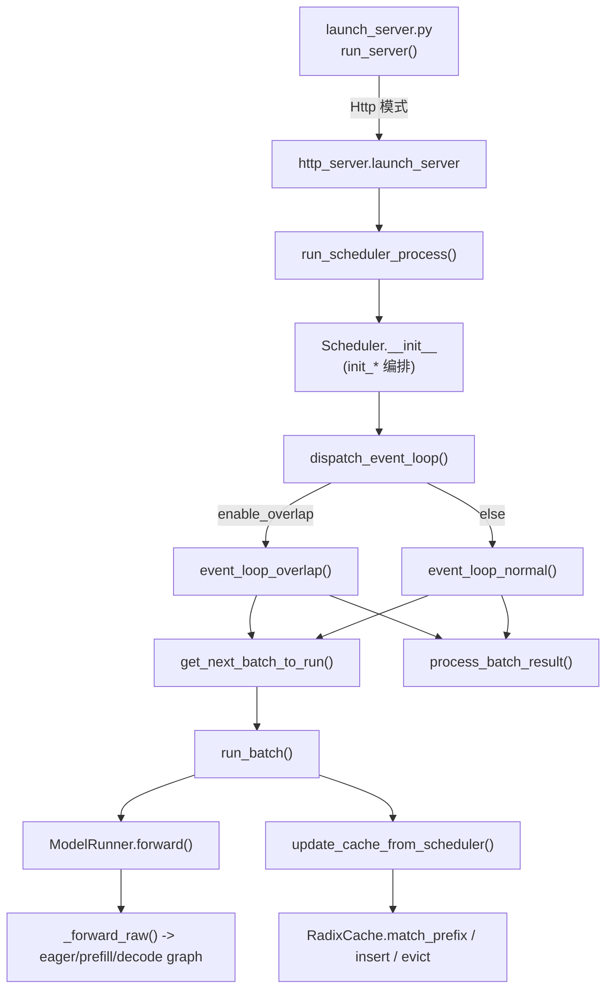

# SGLang 源码阅读指南（reading-guide）

本指南面向希望深入理解 SGLang 推理引擎内部实现的工程师与研究者。所有结论均来自对 SSOT（`/home/kimmo/develop/sglang`，对齐 commit `e1c4db9621f7c4203ee9becd5d5456d4e6bf54f7`）源码的逐行阅读，锚点精确到文件与行号区间，不依赖任何记忆或外部资料。

---

## What：本指南覆盖的组件与范围

SGLang 的在线推理主链路由四个核心文件承载：

1. **启动入口** `python/sglang/launch_server.py` — 解析参数并分发到 HTTP / gRPC / Ray 等服务器模式。
2. **调度器** `python/sglang/srt/managers/scheduler.py` — 单进程内管理一个 TP（tensor parallel）GPU worker，决定每步跑什么 batch、何时 prefill、何时 decode。
3. **模型执行器** `python/sglang/srt/model_executor/model_runner.py` — 真正发起模型前向（forward）、采样（sample）、KV cache 更新的组件。
4. **前缀缓存** `python/sglang/srt/mem_cache/radix_cache.py` — 以基数树（radix tree）管理可复用的 KV cache 前缀。

这四个文件构成「请求进入 → 调度决策 → GPU 前向 → KV 复用」的闭环。其余如 `schedule_batch.py`、`io_struct.py`、`memory_pool.py` 会在阅读时被自然牵出，但本指南只锚定上述四文件。

---

## Why：为什么推荐这样的阅读顺序

SGLang 的架构遵循「调度与执行解耦、CPU 调度流与 GPU 前向流重叠」的设计。`Scheduler` 不知道模型细节，`ModelRunner` 不知道调度策略，二者通过 `ScheduleBatch` / `ForwardBatch` 这类纯数据结构通信。如果你直接跳进 `ModelRunner.forward` 会淹没在 CUDA graph、DP-attn padding、EPLB 等分支里；反之从入口自顶向下，先建立「一次请求如何在循环里被逐步推进」的心智模型，再下钻到前向与缓存，理解成本最低。

另一条动机是 **overlap 模式**。调度器默认开启 overlap（`server_args.disable_overlap_schedule` 默认不禁用，见 `Scheduler.__init__` 中 `self.enable_overlap = not server_args.disable_overlap_schedule and not use_mlx()`，python/sglang/srt/managers/scheduler.py:428），它让 CPU 处理上一步结果与 GPU 执行当前步重叠。这种异步性正是「断点最难下」的根源，因此本指南专门给出 breakpoint 建议。

---

## How：推荐阅读路线

### 路线总览（架构图）



### 第一阶段 · 新手：从入口到一次完整请求

1. **`launch_server.py` 的 `run_server(server_args)`**（python/sglang/launch_server.py:15-52）。它只做一件事：根据 `server_args.encoder_only` / `smg_grpc_mode` / `use_ray` 等标志，import 并调用对应服务器模块的 `launch_server`。默认走最后一支 `from sglang.srt.entrypoints.http_server import launch_server`（python/sglang/launch_server.py:50-52）。先读这段，建立「参数 → 模式分发」的认知即可，不必追进 http_server。

2. **`Scheduler.__init__`**（python/sglang/srt/managers/scheduler.py:388-478+）。它本身是一个「编排器（orchestrator）」，注释明确要求「Keep __init__ as an orchestrator: sequence init_* and maybe_init_* calls」（python/sglang/srt/managers/scheduler.py:400-403）。重点看它如何设置 `self.enable_overlap`（:428）、`self.page_size`（:436）、`self.enable_dp_attention`（:447）等关键开关，以及 `ParallelState`（:460）封装的 rank 信息。

3. **`dispatch_event_loop(scheduler)`**（python/sglang/srt/managers/scheduler.py:4894-4923）。根据 `disaggregation_mode` 与 `enable_overlap` 选择具体事件循环：默认 `event_loop_overlap()`，否则 `event_loop_normal()`（:4905-4908）。这是「调度循环」的入口分叉点。

4. **`event_loop_normal()`**（python/sglang/srt/managers/scheduler.py:1713-1747）。一个清晰的 `while True`：① `recv_requests()` 收请求；② `process_input_requests()`；③ `get_next_batch_to_run()` 决定本步 batch；④ `run_batch()` 执行；⑤ `process_batch_result()` 处理输出。先读 `normal` 版本（无 overlap 干扰）最容易看清主链路。

### 第二阶段 · 进阶：调度决策与执行

5. **`get_next_batch_to_run(running_batch, last_batch)`**（python/sglang/srt/managers/scheduler.py:3012-3147）。这是调度的心脏：处理 chunked prefill 的续跑（:3038-3049）、把上一步 prefill 合并进 running batch（:3083-3089）、调用 `get_new_batch_prefill`（:3104）补新 prefill，否则 `update_running_batch` 进入 decode（:3127）。返回 `NextBatchPlan(batch_to_run=..., running_batch=...)`（:3147）。

6. **`run_batch(batch, pp_proxy_tensors=None)`**（python/sglang/srt/managers/scheduler.py:3623-3840）。分发到 `self.model_worker.forward_batch_generation(batch)`（generate 路径，如 :3784）或 `forward_batch_embedding`（embedding 路径，如 :3829）。overlap 分支里还会把结果 `copy_to_cpu` 放到 `copy_stream` 以重叠下一前向（:3732-3737）。

7. **`ModelRunner.forward(forward_batch, ...)`**（python/sglang/srt/model_executor/model_runner.py:1510-1604）。核心是委托给 `_forward_raw`（:1555）。**`ModelRunner._forward_raw(...)`**（python/sglang/srt/model_executor/model_runner.py:1654-1752）是关键决策点：先判断是否可跑 decode CUDA graph（`can_run_graph` 分支直接 `decode_cuda_graph_runner.execute`，:1686-1691），否则 split_prefill / prefill graph / `eager_runner.execute`（:1709-1744）。读完这里你就理解了「何时走 graph、何时走 eager」。

### 第三阶段 · 专家：缓存、并发重叠与边界

8. **`RadixCache.match_prefix / insert / evict`**（python/sglang/srt/mem_cache/radix_cache.py:376 / 436 / 592）。三者构成前缀复用与淘汰的核心。`match_prefix` 返回最长命中前缀的 KV 索引（:424-434），`insert` 把新前缀写入基数树（:453），`evict` 用 `eviction_heap` 按策略淘汰叶子（:599-620）。

9. **`event_loop_overlap()`**（python/sglang/srt/managers/scheduler.py:1749-1818）。理解 `result_queue` 如何把「上一步结果处理」与「当前步前向」解耦（:1795-1807），以及 `launch_batch_sample_if_needed` 为何要等上一步结果（:1814-1815）。这是专家级需要啃透的异步细节。

---

## 断点与打印建议：最快看懂一次请求

按「一次请求从进入到吐出第一个 token」的时序，建议在以下函数设断点（均含真实锚点）：

| 关注点 | 断点函数 | 锚点 |
| --- | --- | --- |
| 请求入队 | `Scheduler.process_input_requests` | python/sglang/srt/managers/scheduler.py:1872 |
| 请求被建为 Req | `Scheduler.handle_generate_request` | python/sglang/srt/managers/scheduler.py:2363 |
| 本步选哪些请求 | `Scheduler.get_next_batch_to_run` | python/sglang/srt/managers/scheduler.py:3012 |
| 实际 GPU 前向 | `Scheduler.run_batch` | python/sglang/srt/managers/scheduler.py:3623 |
| 进入模型 forward | `ModelRunner.forward` | python/sglang/srt/model_executor/model_runner.py:1510 |
| graph/eager 决策 | `ModelRunner._forward_raw` | python/sglang/srt/model_executor/model_runner.py:1654 |
| 采样出 token | `ModelRunner.sample` | python/sglang/srt/model_executor/model_runner.py:1771 |
| 结果回写与收尾 | `Scheduler.process_batch_result` | python/sglang/srt/managers/scheduler.py:3917 |
| 前缀缓存命中 | `RadixCache.match_prefix` | python/sglang/srt/mem_cache/radix_cache.py:376 |
| 前缀缓存写入 | `RadixCache.cache_finished_req` | python/sglang/srt/mem_cache/radix_cache.py:458 |

**打印技巧**：
- 在 `run_batch` 开头打印 `batch.forward_mode`、`batch.reqs` 长度与 `batch.seq_lens`，可直观看到 prefill vs decode、batch 大小变化。
- 在 `get_next_batch_to_run` 返回的 `NextBatchPlan` 处打印 `batch_to_run.forward_mode` 与 `running_batch.batch_size()`，可看清调度在「补 prefill」与「跑 decode」之间如何切换。
- 在 `RadixCache.match_prefix` 打印 `MatchResult.device_indices.shape`，可验证前缀复用是否生效（命中越长，shape[0] 越大）。

---

## 最小可调试启动与复现

为了用最少变量理解一次请求，建议以**单卡、单请求、关闭 overlap 与 CUDA graph 干扰**的方式启动：

```bash
# 最小复现：tp=1，单请求，关闭 overlap 以便用同步断点
sglang serve \
  --model-path <你的小模型，如 Qwen2-0.5B> \
  --tp 1 \
  --disable-overlap-schedule \
  --mem-fraction-static 0.8

# 然后用单条请求触发一次 prefill + decode
curl http://localhost:30000/v1/complete \
  -H 'Content-Type: application/json' \
  -d '{"model":"<model>","prompt":"Hello, my name is","max_tokens":16}'
```

**为什么这样配**：
- `--tp 1`：避免 `ParallelState` 多 rank、NCCL 初始化与 DP-attn 干扰，断点只在单进程内命中。证据：TP/DP/PP rank 在 `Scheduler.__init__` 中被大量读取（python/sglang/srt/managers/scheduler.py:450-478），多 rank 会让控制流分散。
- `--disable-overlap-schedule`：关闭 `enable_overlap` 后走 `event_loop_normal`（python/sglang/srt/managers/scheduler.py:4908），结果处理与前向串行，断点命中时机确定、不会被 `result_queue` 异步冲掉。
- 小模型：权重加载与 graph capture 快，`ModelRunner.initialize`（python/sglang/srt/model_executor/model_runner.py:625）与 `init_cuda_graphs`（:997）耗时低，便于反复重启调试。
- 单条 `max_tokens` 小的请求：一次 `run_batch` 即可观察 prefill（extend）后紧跟若干 decode 步，无需处理 chunked prefill 续跑的复杂度。

若想观察 KV 复用，连发两条共享前缀的 prompt（如都以 "Hello, my name is" 开头），在 `RadixCache.match_prefix` 的第二个请求上即可看到 `device_indices` 非零命中。

---

## 坑与边界（务必注意）

1. **overlap 下的时序错觉**：开启 overlap 时，`run_batch` 返回后结果尚未被 `process_batch_result` 处理（它在 `result_queue` 里等下一轮，python/sglang/srt/managers/scheduler.py:1799）。在 `run_batch` 末尾打印 `batch_result` 看到的可能是「上一轮」的快照，调试务必确认 `enable_overlap` 状态。

2. **`event_loop_normal` 与 `event_loop_overlap` 行为不一致**：不要假设两者逻辑等价。overlap 版本多了 `launch_batch_sample_if_needed`（:1814）与 `_apply_war_barrier`（:1798）等同步逻辑。新手先读 normal 版，再读 overlap 版。

3. **CUDA graph 会绕过 eager 代码路径**：当 `decode_cuda_graph_runner.can_run_graph` 为真，`_forward_raw` 直接 `execute` 并返回（python/sglang/srt/model_executor/model_runner.py:1686-1691），你设在 `eager_runner.execute` 的断点不会命中。想追 decode 细节需加 `--disable-cuda-graph` 或断在 `decode_cuda_graph_runner.execute`。

4. **RadixCache 的 key 可能是 bigram 视图**：在 eagle  speculative 场景下 `is_eagle=True`，`match_prefix` 会先把 key 转成 bigram 视图（python/sglang/srt/mem_cache/radix_cache.py:414），此时 KV 索引长度比 token 数少 1。调试命中长度对不上时，先确认 `self.is_eagle`。

5. **`cache_finished_req` 会释放并重新占用引用**：它把完成的请求 KV 写入树后，用 `free_segments` 释放重复/未对齐区间（python/sglang/srt/mem_cache/radix_cache.py:501-509），并 `dec_lock_ref(req.last_node)`（:513）。误以为「写入缓存 = 永久保留」会误解淘汰时机——真正决定生死的是 `evict`（:592）中的 `evictable_leaves` 与 `lock_ref`。

6. **`Scheduler.__init__` 不直接做重活**：它是编排器，真正的模型加载、memory pool 初始化、graph capture 分散在 `init_model_worker`（:901）、`init_memory_pools`（:962）、`init_all_cuda_graphs`（:980）等。追「启动时做了什么」要顺着这些 `init_*` 方法，而非在 `__init__` 里找细节。

> **[OPEN]** `run_scheduler_process`（python/sglang/srt/managers/scheduler.py:4990）如何被 `http_server` 拉起、与 `TokenizerManager` / `RequestDispatcher` 的进程边界具体如何划分，本指南未深入（仅锚定 launch_server 的分发）。如需补全进程拓扑，建议另读 `python/sglang/srt/entrypoints/http_server.py` 与 `managers/io_struct.py`。

---

## 交叉参考

- 调度循环与 batch 结构的细节见 scheduler 相关文档（见 hacking/ 与 architecture/ 下对应文件）。
- 前缀缓存的完整数据结构见 `python/sglang/srt/mem_cache/radix_cache.py`，相关开放问题集中在 appendix 的 `_openq_memory-pool.md` 与 `_openq_model-runner.md`。
- 模型前向的 graph/eager 分支细节可结合 `python/sglang/srt/model_executor/forward_batch_info.py` 中的 `ForwardBatch` 理解。
