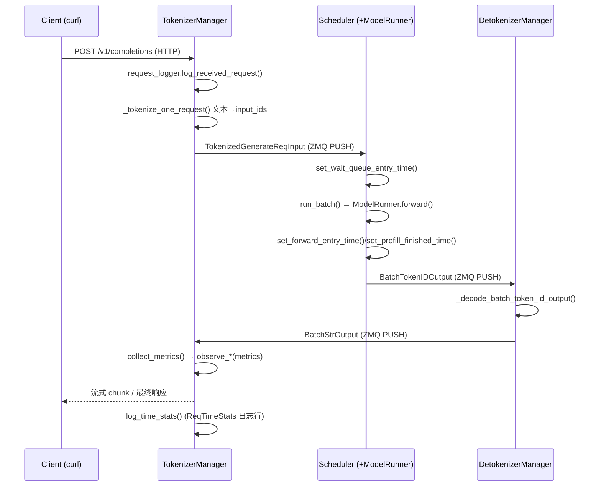

# 端到端请求观测（End-to-End Observation）

> 适用 commit：`e1c4db9621f7c4203ee9becd5d5456d4e6bf54f7`（2026-08-14）
> 本文所有结论均来自该 commit 的源码阅读，关键论断后附 `文件:行号` 形式的证据锚点。

## What：一次请求在 SGLang 中的生命周期

SGLang 采用**多进程 + ZMQ 管道**的架构。一个 HTTP 请求从进入到返回，会依次流经四个核心角色：

1. **TokenizerManager**（进程）：FastAPI 收到请求 → 记请求日志 → 文本 tokenize → 通过 ZMQ 发给 Scheduler。
2. **Scheduler**（进程）：把请求放进等待队列，调度到 `running_batch`，驱动 GPU 计算（经 `tp_worker` → `ModelRunner.forward`）。
3. **ModelRunner**（在 Scheduler 的 TP worker 进程内）：执行一次 prefill / decode 前向，产出 token id。
4. **DetokenizerManager**（进程）：把 token id 反序列化为文本，通过 ZMQ 把 `BatchStrOutput` 发回 TokenizerManager。

TokenizerManager 收到反序列化结果后，流式（或非流式）把结果返回给客户端，并在请求结束时上报指标。



关键入口：`TokenizerManager.generate_request` 是异步生成器，逐 token 产出响应（`python/sglang/srt/managers/tokenizer_manager.py:755-L821`）。注意第 792 行的 `self.request_logger.log_received_request(...)` —— 这是"请求已收到"日志的产生点；第 807 行的 `async for response in self._wait_one_response(...)` 则是把 Scheduler→Detokenizer→回传的结果逐步 yield 给客户端的循环。

> **[OPEN]** `_wait_one_response` 内部如何把 `BatchStrOutput` 还原成 SSE/JSON 流式 chunk、以及在多 tokenizer worker（`tokenizer_worker_num > 1`）模式下返回路径如何通过 `SocketMapping` 直接回到对应 HTTP worker，本文未深入展开，建议后续单独成文。

## Why：为什么要单独做"观测"

LLM 推理时延由多个不可见阶段叠加而成：排队（queue）、prefill 前向、decode 循环、跨进程 ZMQ 传输、tokenize/detokenize 开销。如果不把这些阶段拆开，线上一旦变慢，根本无法判断瓶颈在 GPU 计算、KV cache 争抢，还是请求堆积。

SGLang 的设计取舍：
- **时间在请求对象内就地采集**（`Req.time_stats`，见 `python/sglang/srt/observability/req_time_stats.py:591-L643` 的 `SchedulerReqTimeStats`）。各阶段只调用 `set_xxx_time()` 打点，避免在每个热路径上做字符串格式化。
- **两类观测互补**：（a）逐请求的结构化时延日志（`ReqTimeStats` 一行），便于精确定位单请求的异常；（b）Prometheus 指标（`SchedulerMetricsCollector` / `TokenizerMetricsCollector`），便于看集群整体趋势。
- **前缀缓存命中在请求对象上直接体现**（`cached_tokens` / `cached_input_len`），无需额外查询即可从日志/指标读出"这次省了多少 prefill 算力"。

## How：一次真实请求从发起到返回的跟踪

### 1) 启动参数：打开详细日志与指标

核心开关（定义于 `python/sglang/srt/server_args.py:1465-L1626`）：

- `--log-level`（`server_args.py:1467`）：控制全局 logging 级别，默认 `info`。运行时也可通过 `ConfigureLoggingReq` 动态调级（`python/sglang/srt/managers/tokenizer_manager.py:2131-L2153` 的 `configure_logging`）。
- `--log-requests` + `--log-requests-level`（0~3，`server_args.py:1473-L1493`）：打印每个请求的"Receive/Finish"行。`level=2` 仅打印部分输入/输出，`level=3` 打印完整输入/输出（注意会很大）。
- `--enable-request-time-stats-logging`（`server_args.py:1602-L1604`）：**开启后才会打印 `ReqTimeStats(...)` 那一行**（见下）。默认关闭。
- `--enable-metrics`（`server_args.py:1517-L1519`）：开启 Prometheus 指标暴露（默认关闭）。
- 链路追踪（OpenTelemetry）：`--enable-trace`（`server_args.py:1621`），或环境变量 `SGLANG_TRACE_LEVEL`、`SGLANG_TRACE_ASYNC`（见 `python/sglang/srt/observability/trace.py:82` 与 `trace_async.py:16`）。追踪会额外产生每段（`tokenize`/`prefill_forward`/`decode_loop` 等）的 span 数据。

> **[OPEN]** `--log-requests-level` 与 `enable_request_time_stats_logging` 是两回事：前者控制"请求内容"日志，后者控制"时延分解"日志。文档里容易混淆，建议在正式文档中并列说明。

### 2) 一条真实 curl 请求

```bash
# 假设服务在 30000 端口
curl http://localhost:30000/v1/completions \
  -H "Content-Type: application/json" \
  -d '{
        "model": "default",
        "prompt": "The capital of France is",
        "max_tokens": 16,
        "temperature": 0
      }'
```

### 3) 预期能看到哪些日志片段（对应真实 logger 点）

开启 `--log-requests --enable-request-time-stats-logging` 后：

**(a) 收到请求** —— 由 `RequestLogger.log_received_request` 打印（`python/sglang/srt/utils/request_logger.py:88-L111`）：

```text
[TokenizerManager] Receive: obj=GenerateReqInput(rid='...', text='The capital of France is', sampling_params={...}, ...)
```

**(b) 逐请求时延分解** —— 由 `Req.log_time_stats()` 打印（`python/sglang/srt/managers/schedule_batch.py:1787-L1807`；调用点在 `python/sglang/srt/managers/scheduler_components/output_streamer.py:184-L190`，且仅 `attn_tp_rank == 0` 且 `enable_request_time_stats_logging` 为真时才打印）。该行内容由 `SchedulerReqTimeStats.convert_to_duration` 生成（`python/sglang/srt/observability/req_time_stats.py:1050-L1065`）：

```text
[Scheduler] ReqTimeStats(rid='...', input_len=6, cached_input_len=0, output_len=16, attempts=1, type=unified): queue_duration=12.34ms, forward_duration=245.67ms, entry_time=123456.789
```

字段含义（源码证据）：
- `input_len` = `len(self.origin_input_ids)`，即 prompt 的总 token 数（`schedule_batch.py:1800`）。
- `cached_input_len` = `self.cached_tokens`，即**前缀缓存命中的 token 数**（`schedule_batch.py:1801`）。`cached_input_len / input_len` 即为本次前缀命中比例。
- `output_len` = `len(self.output_ids)`（`schedule_batch.py:1802`）。
- 非 disagg 模式下，`queue_duration = forward_entry_time - wait_queue_entry_time`，`forward_duration = forward_entry_time - completion_time`（`req_time_stats.py:1050-L1064`）；`entry_time` 是从 `perf_counter` 转换的墙钟时间。

**(c) 完成请求（可选）** —— 由 `RequestLogger.log_finished_request` 打印（`python/sglang/srt/utils/request_logger.py:159-L191`）。若设置 `SGLANG_LOG_REQUEST_EXCEEDED_MS`，则仅当 e2e 时延超过阈值才打印（`request_logger.py:62-L63, 168-L170`）。

### 4) 时延在代码里如何被采集

`APIServerReqTimeStats`（客户端侧）与 `SchedulerReqTimeStats`（调度侧）各自打点，最后拼出端到端数字：

- 客户端 e2e：`get_e2e_latency() = finished_time - created_time`（`python/sglang/srt/observability/req_time_stats.py:479-L480`）。
- 首 token 时延：`get_first_token_latency() = first_token_time - created_time`（`req_time_stats.py:476-L477`）。
- decode 时延：`get_decode_latency() = finished_time - first_token_time`（`req_time_stats.py:482-L483`）。
- Scheduler 侧排队时延：`get_queueing_time() = forward_entry_time - wait_queue_entry_time`（`req_time_stats.py:1047-L1048`）。
- Scheduler 在每轮 `run_batch` 调度时调用 `set_time_batch(can_run_list, "set_forward_entry_time")` 打点（`python/sglang/srt/managers/scheduler.py:3383`），在 prefill 完成时调用 `set_prefill_finished_time`（`req_time_stats.py:805-L824`）。

这些点最终通过 `TokenizerManager.collect_metrics` 转成 Prometheus 指标：首次出 token 时 `observe_time_to_first_token`（`python/sglang/srt/managers/tokenizer_manager.py:2876-L2880`），后续每批 `observe_inter_token_latency`（`tokenizer_manager.py:2884-L2889`），结束时 `observe_one_finished_request`（`tokenizer_manager.py:2909-L2919`）。

### 5) 返回的日志/指标里能看到哪些有用信息

**(a) batch 大小 / 队列深度 / 吞吐**（Scheduler 侧 Gauges，定义于 `python/sglang/srt/observability/metrics_collector.py:269-L304`）：
- `sglang:num_running_reqs`（`metrics_collector.py:269`）
- `sglang:num_queue_reqs`（`metrics_collector.py:275`）
- `sglang:gen_throughput`（生成吞吐 token/s，`metrics_collector.py:287`）
- `sglang:cache_hit_rate`（前缀缓存命中率，`metrics_collector.py:293`）
- `sglang:token_usage` / `sglang:kv_available_tokens` 等 KV cache 占用（`metrics_collector.py:309-L360`）

**(b) 时延分布直方图**（Tokenizer 侧，定义于 `python/sglang/srt/observability/metrics_collector.py:1480-L1720`）：
- `sglang:time_to_first_token_seconds`（`metrics_collector.py:1698`）
- `sglang:inter_token_latency_seconds`（`metrics_collector.py:1708`）
- `sglang:e2e_request_latency_seconds`（`metrics_collector.py:1715`）
- `sglang:prompt_tokens_histogram` / `sglang:generation_tokens_histogram`（`metrics_collector.py:1566, 1582`）

**(c) 前缀命中明细**：`observe_one_finished_request` 把 `cached_tokens` 按来源（device/host/storage）拆开上报 `sglang:cached_tokens_total`（`metrics_collector.py:1592-L1596, 1761-L1784`）。这对应 Detokenizer 回传的 `cached_tokens` / `cached_tokens_details` 字段（`python/sglang/srt/managers/detokenizer_manager.py:430-L487` 的 `handle_batch_token_id_out`）。

**(d) 每阶段时延直方图**：`sglang:per_stage_req_latency_seconds`（带 `stage` 标签，如 `tokenize` / `prefill_forward` / `decode_loop` 等，定义于 `metrics_collector.py:734-L740`，打点逻辑在 `req_time_stats.py:281-L285` 的 `observe_per_stage_req_latency`）。

### 6) metrics 端点查看示例

metrics 通过 `/metrics` 暴露（HTTP 下以 ASGI Mount 挂载，见 `python/sglang/srt/utils/common.py:2398`；gRPC 模式见 `python/sglang/srt/entrypoints/grpc_server.py:64`）。需先带 `--enable-metrics` 启动：

```bash
# 启动（关键：开启 metrics）
python -m sglang.launch_server --model-path <model> \
  --port 30000 --enable-metrics \
  --log-level info --log-requests --enable-request-time-stats-logging

# 抓取指标
curl -s http://localhost:30000/metrics | grep -E "sglang:(num_running_reqs|num_queue_reqs|time_to_first_token_seconds|e2e_request_latency_seconds|cache_hit_rate|cached_tokens_total|gen_throughput|token_usage)" | head -40
```

典型输出（节选，数值为示意）：

```text
sglang:num_running_reqs{model_name="default",tp_rank="0",...} 3.0
sglang:num_queue_reqs{model_name="default",tp_rank="0",...} 0.0
sglang:cache_hit_rate{model_name="default",tp_rank="0",...} 0.42
sglang:gen_throughput{model_name="default",tp_rank="0",...} 512.0
sglang:token_usage{model_name="default",tp_rank="0",...} 0.37
# HELP sglang:e2e_request_latency_seconds Histogram of End-to-end request latency in seconds
sglang:e2e_request_latency_seconds_sum{model_name="default",is_streaming="false",...} 1.83
sglang:e2e_request_latency_seconds_count{model_name="default",is_streaming="false",...} 7.0
# HELP sglang:cached_tokens_total Number of cached prompt tokens by source (device/host/storage)
sglang:cached_tokens_total{model_name="default",cache_source="device",...} 120.0
```

> **注**：Prometheus 多进程模式下各 rank 通过 `PROMETHEUS_MULTIPROC_DIR` 聚合（`python/sglang/srt/utils/common.py:2374-L2388`）。非 `attn_tp_rank == 0` 的 rank 默认不上报 scheduler 指标（`metrics_collector.py:1081-L1084` 的 `is_stats_logging_rank` 判定），因此单进程/单卡场景下看到的就是本 rank 的数据。

## 边界与坑

1. **`ReqTimeStats` 行默认不打印**：必须 `--enable-request-time-stats-logging`。光开 `--log-requests` 只能看到 Receive/Finish，看不到 `queue_duration`/`forward_duration` 分解（`output_streamer.py:184-L190` 的 `enable_request_time_stats_logging` 守卫）。

2. **`--log-requests-level=3` 会非常吵**：完整输入/输出 dump 可能包含长文本、图片 base64 等，生产环境慎用（见 `request_logger.py:200-L234` 的 `_compute_metadata` 各级别规则）。

3. **前缀命中要从 `cached_input_len` 推算，不能只看日志有无"hit"字样**：prefill 阶段在 Scheduler 里通过 `tree_cache` 计算前缀匹配（`python/sglang/srt/managers/scheduler.py:2694-L2735`，含 `req._compute_max_prefix_len`、`tree_cache.get_prefix_hash_values` 等调用），命中结果体现在 `cached_tokens` 字段上，不会单独打 "cache hit" 日志行。指标侧则看 `sglang:cache_hit_rate` 与 `sglang:cached_tokens_total`。

4. **多进程日志分散**：一次请求跨越 TokenizerManager / Scheduler / DetokenizerManager 三个进程，日志里要用 `rid` 串联。Scheduler 侧的 `ReqTimeStats` 行只由 `attn_tp_rank == 0` 打印（`output_streamer.py:186-L188`），其余 rank 静默。

5. **时延基准用 `perf_counter` + 校准偏移**：源码用 `time.perf_counter()` 打点、再用 `global_diff_realtime_monotonic` 校准成墙钟时间（`python/sglang/srt/observability/req_time_stats.py:55-L73`）。NTP 跳变下 `calibrate_time_diff()` 会重算偏移，因此跨进程的绝对墙钟大致可比，但不应做亚毫秒级精确对账。

6. **disagg（PD 分离）模式时延字段不同**：`convert_to_duration` 在 PREFILL / DECODE 模式下输出 `bootstrap_duration`、`transfer_duration` 等字段而非统一的 `queue/forward`（`req_time_stats.py:1065-L1163`）。排查 PD 分离链路时延时，要按 `type=` 字段区分解读。

## 小结：观测落点速查表

| 想看什么 | 去哪里看 | 证据锚点 |
| --- | --- | --- |
| 请求收到 / 完成内容 | `--log-requests` 的 Receive/Finish 行 | `request_logger.py:88`, `request_logger.py:159` |
| 单请求排队+前向时延分解 | `ReqTimeStats(...)` 行（需 `--enable-request-time-stats-logging`） | `schedule_batch.py:1787`, `req_time_stats.py:1050` |
| 前缀命中了多少 token | 日志 `cached_input_len` / 指标 `cached_tokens_total` | `schedule_batch.py:1801`, `metrics_collector.py:1592` |
| TTFT / ITL / E2E 分布 | Prometheus 直方图 | `metrics_collector.py:1698`, `:1708`, `:1715` |
| 实时 batch 大小、吞吐、KV 占用 | Prometheus Gauge | `metrics_collector.py:269`, `:287`, `:309` |
| 每阶段 span 级时延 | 开启 tracing（`--enable-trace` / `SGLANG_TRACE_*`） | `trace.py:82`, `trace_async.py:16` |
