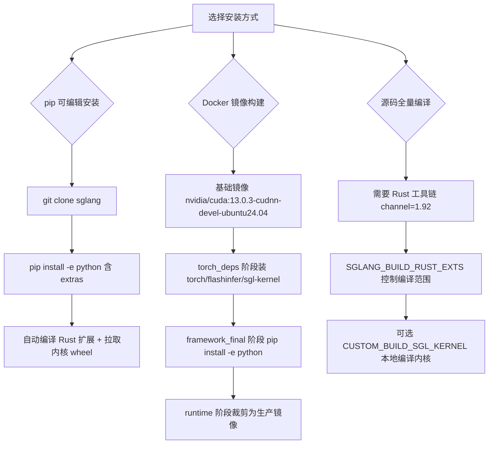

# SGLang 安装指南（源码阅读版）

> 本文所有结论均来自对 SSOT（commit `e1c4db9621f7c4203ee9becd5d5456d4e6bf54f7`）源码的逐行阅读，命令与版本号均可溯源到 `docker/Dockerfile`、`python/pyproject.toml`、`python/setup.py` 与 `scripts/ci/cuda/ci_install_dependency.sh`。文中对「已核实命令」与「通用建议」做了明确区分，凡未标注为已核实的均为基于源码的通用建议，请按需验证。

## What（这是什么）

SGLang 是一个高性能 LLM / 多模态模型推理与服务框架。它的「安装」并不是单一动作，而是由三层叠加构成：

1. **Python 包本体 `sglang`**：由 `python/pyproject.toml` 描述，包含运行时（`srt`）、内核（`kernels`）、前端 DSL 等纯 Python 代码。
2. **原生扩展（Rust / CUDA 内核）**：一部分关键模块（如 `sglang.srt.server._core`、`sglang.srt.grpc._core`、`sglang.srt.multimodal._core`）是 PyO3 扩展，需要 Rust 工具链编译；另外 `sglang-kernel`、`sgl-deep-gemm`、`sgl-deep-ep`、`flashinfer` 等以预编译 wheel 形式存在，且必须与 CUDA 主版本严格匹配。
3. **容器化运行时（可选）**：`docker/Dockerfile` 给出官方多阶段构建，最终产出 `runtime` 与 `framework` 两种镜像。

项目**不提供**独立的 `python/requirements.txt`——全部 Python 依赖声明都集中在 `python/pyproject.toml` 的 `[project].dependencies`（见 python/pyproject.toml:L17-L94）。这也是为什么仓库里找不到任务清单里提到的 `requirements.txt`：它不是遗漏，而是该版本已统一用 pyproject 管理依赖。

## 安装方式总览



---

## 方式一：pip 可编辑安装（editable）

### Why

开发、二次开发、以及 CI 默认采用 editable 安装——依赖先在独立阶段/环境装好，包本身以 `-e` 链接源码，这样改代码无需重装。CI 脚本中核心动作就是：

```bash
uv pip install -e "python[dev,runai,tracing]" --index-strategy unsafe-best-match
```
证据：scripts/ci/cuda/ci_install_dependency.sh:L488-L494（`install_sglang()` 函数，默认 `EXTRAS="dev,runai,tracing"`）。注意此处使用 `uv pip` 而非裸 `pip`，CI 在 `setup_pip_toolchain()` 中把 `PIP_CMD` 设为 `uv pip` 并设置 `UV_LINK_MODE=copy`（scripts/ci/cuda/ci_install_dependency.sh:L301-L314）。

### How（已核实命令）

最小可运行安装（仅核心依赖，不含 dev/test 额外项）：

```bash
# 1. 获取源码
git clone https://github.com/sgl-project/sglang.git
cd sglang

# 2. 创建虚拟环境（通用建议，非 CI 强制）
python3 -m venv .venv && source .venv/bin/activate

# 3. 安装核心包（editable）。需要先把 torch 等按 CUDA 主版本装好。
pip install -e "python"
```

> **说明**：上面第 3 步单独执行时，pip 会按 `python/pyproject.toml` 的顶层依赖解析。但 pyproject 里 `torch==2.13.0` 等是 cu13 默认约束（python/pyproject.toml:L80-L85），若你的环境是 CUDA 12，需要像 Dockerfile / CI 那样切换到 cu12 索引，否则会装到不匹配的 wheel。CI 的做法是显式按 CUDA 主版本指定 PyTorch 索引：
>
> ```bash
> # 已核实逻辑（来自 CI，CU_VERSION 默认 cu130）：
> uv pip install torch==2.13.0 torchaudio==2.11.0 torchvision \
>     --index-url "https://download.pytorch.org/whl/cu130"
> ```
> 证据：scripts/ci/cuda/ci_install_dependency.sh:L414-L428（`install_pytorch_stack()`，它从 pyproject 抓取各包 spec 再拼 PyTorch 索引 URL）。

### 安装 extras（可选组件）

`python/pyproject.toml` 的 `[project.optional-dependencies]`（L101-L191）定义了以下 extras，可逗号拼接到 `python[...]`：

- `diffusion`：扩散模型支持（diffusers==0.37.0、cache-dit、opencv 等）—— 多模态/图像视频生成用。
- `ray`：分布式调度 `ray[default]>=2.55.1`。
- `tracing`：OpenTelemetry 链路追踪。
- `http2`：Granian 异步服务器后端。
- `fastokens`：fastokens 分词加速。
- `test`：测试依赖（pytest、lm-eval 等）；`dev` 等价于 `test`（L185）。
- `all`：聚合 `diffusion`+`http2`+`tracing`（L187-L191）。

**最小依赖 vs 可选组件对照**（证据 python/pyproject.toml:L18-L94, L101-L191）：

| 类别 | 包（节选，已核实版本） |
|---|---|
| 最小核心 | torch==2.13.0、transformers==5.12.1、flashinfer_python[cu13]==0.6.17、flash-attn-4>=4.0.0b18、sglang-kernel==0.4.6.post1、sgl-deep-gemm==0.1.5.post2、sgl-deep-ep==0.1.0、nvidia-cutlass-dsl[cu13]==4.6.2、xgrammar==0.2.1、llguidance、fastapi、uvicorn |
| 量化内核 | sgl-deep-gemm（DeepGEMM，FP8/微缩放）、sgl-deep-ep（DeepEP，MoE 分发）、quack-kernels、humming-kernels |
| 多模态 | timm、pillow、soundfile、av（仅 ARM 平台强制）、decord2（仅 ARM 强制） |
| 可选 extras | diffusion / ray / tracing / http2 / fastokens / test |

---

## 方式二：Docker 镜像构建

### Why

官方 Dockerfile 把「装系统库 → 装 Python 依赖 → 编译/拉取内核 → 装 Rust 扩展 → 裁剪运行时」全部分阶段固化，避免在目标机上反复解决 CUDA/cuDNN/IB 等系统级依赖。它也是生产部署的推荐路径。

### How（已核实构建参数）

基础镜像与关键构建参数（docker/Dockerfile:L1-L20）：

- `ARG CUDA_VERSION=13.0.3`
- `ARG BUILD_TYPE=all`（控制 `pip install -e "python[${BUILD_TYPE}]"` 装哪些 extras）
- `ARG BRANCH_TYPE=remote` / `ARG SGL_VERSION` / `ARG USE_LATEST_SGLANG=0`
- 内核相关固定版本：`SGL_KERNEL_VERSION=0.4.6.post1`、`SGL_DEEP_GEMM_VERSION=0.1.5.post2`、`FLASHINFER_VERSION=0.6.17`、`MOONCAKE_VERSION=0.3.12.post1`、`MSCCLPP_VERSION=sglang-v0.9.1`。

支持的 CUDA 版本只限 `12.6.3`、`12.9.2`、`13.0.3` 三个（docker/Dockerfile 中 `case "$CUDA_VERSION"` 的判定，L189-L208、L225-L229 等），其它值直接 `exit 1`。

构建命令（通用建议，镜像内部逻辑已核实）：

```bash
# 从本地源码构建（BRANCH_TYPE=local 会 COPY 当前 . 到 /src）
docker build -f docker/Dockerfile \
  --build-arg CUDA_VERSION=13.0.3 \
  --build-arg SGL_VERSION=0.5.x \
  -t sglang:dev .
```

最终镜像来源（docker/Dockerfile:L584-L652）：`framework_final` 阶段先把源码 `git clone --branch v${SGL_VERSION}`（或 `USE_LATEST_SGLANG=1` / `BRANCH_TYPE=local`）拷入 `/sgl-workspace/sglang`，再执行 `python3 -m pip install --no-deps -e "python[${BUILD_TYPE}]"`，随后 `kernels lock python` 与 `kernels download python` 拉取社区内核 cubin。生产使用时切到 `runtime` 阶段（L687-L823），它从 `framework_final` COPY 站点包并剔除开发工具，但保留完整 CUDA 工具链以支持 FlashInfer / DeepGEMM 的 JIT 编译。

---

## 方式三：源码全量编译（Rust 扩展）

### Why

`python/setup.py` 会从 `../rust` 的 cargo workspace 自动发现所有声明了 `[package.metadata.sglang] python-module` 的 crate，并为每个 crate 构建一个 PyO3 扩展模块（python/setup.py:L104-L130 `_discovered_rust_extensions()`）。这意味着 `server`、`grpc`、`multimodal` 等 `_core` 模块在 editable 安装时会被**就地编译**，而非从 PyPI 拉取。

### How（已核实前置条件）

- **Rust 工具链**：`rust/rust-toolchain.toml` 固定 `channel = "1.92"`（profile=minimal，含 clippy/rustfmt）。Dockerfile 注释也要求 Rust `>= 1.85`（edition 2024）。
- **CUDA 内核本地编译（可选）**：若设置 `CUSTOM_BUILD_SGL_KERNEL=true` 且 `python/sglang/kernels/aot/dist` 存在自编译 wheel，则跳过从索引拉取 sgl-kernel（scripts/ci/cuda/ci_install_dependency.sh:L543-L584）。普通用户无需此步。
- **跳过 Rust 编译**：设置环境变量 `SGLANG_BUILD_RUST_EXTS=none` 可完全不编译 Rust 扩展（python/setup.py:L177-L182，`_declared_rust_extensions()`）；设为 `all` 编译全部，或逗号列表（如 `grpc`）只编译匹配项（python/setup.py:L152-L174）。CI 在有预编译 `_core*.so` 时会自动设为 `none`（scripts/ci/cuda/ci_install_dependency.sh:L454-L486）。

---

## 验证安装（如何确认可用）

### How（已核实验证逻辑）

CI 的 `verify_imports()`（scripts/ci/cuda/ci_install_dependency.sh:L782-L824）做了三层检查，可直接复用为人工验证：

```bash
# 1. 确认包可被定位到正确源码（editable 场景防影子包）
python3 -c "import importlib.util, os; \
print(importlib.util.find_spec('sglang').origin)"

# 2. 确认可正常导入并加载原生扩展
python3 -c "import sglang; \
import sglang.srt.server._core; \
import sglang.srt.grpc._core; \
import sglang.srt.multimodal._core; \
print('ok')"

# 3. 确认 torch CUDA 一致
python3 -c "import torch; print(torch.version.cuda)"
```

`verify_imports` 还额外 `import deep_ep` 与 `import cutlass.cute`，因为它俩是 MoE/量化路径的关键内核，缺失会导致运行期才暴露。CI 特意用 `find_spec` 而非 `import` 先校验 `sglang` 是否被站点包里的同名目录「影子化」（scripts/ci/cuda/ci_install_dependency.sh:L795-L809），这点对个人环境排查也很有用。

### 入口点（CLI）

安装后会有 `sglang` 与 `killall_sglang` 两个命令，由 `[project.scripts]` 定义（python/pyproject.toml:L201-L203）：`sglang = "sglang.cli.main:main"`。验证 CLI：

```bash
sglang --help
```

---

## 边界与坑（最容易踩的点）

1. **CUDA 主版本必须全局一致**。torch、flashinfer、sgl-kernel、sgl-deep-gemm、sgl-deep-ep、nixl、mooncake 全部区分 cu12 / cu13。pyproject 默认是 cu13（`cuda-python>=13.0`、flashinfer_python[cu13]、nvidia-cutlass-dsl[cu13]）；CUDA 12 需手动 `sed` 改回 cu12 并改用 `https://docs.sglang.ai/whl/cu129/` 索引（docker/Dockerfile:L245-L249、L610-L614；CI 同款逻辑 ci_install_dependency.sh:L430-L452）。装错主版本会出现 `libcusparseLt.so.0 missing` 之类 import 失败（ci_install_dependency.sh:L496-L504）。

2. **Rust 扩展编译失败的最常见原因**是缺 cargo 或版本过低。没 Rust 工具链又没设 `SGLANG_BUILD_RUST_EXTS=none`，`setup.py` 会直接 `raise RuntimeError`（python/setup.py:L73-L79）。CI 在 `clean_site_packages()` 里额外 `source ../utils/install_rust_protoc.sh` 并导出 `RUSTUP_TOOLCHAIN`（ci_install_dependency.sh:L261-L274），个人环境请自行装好 1.92。

3. **FlashInfer 体积大**：`flashinfer-cubin` 150+ MB、`flashinfer-jit-cache` 1.2+ GB（ci_install_dependency.sh:L372-L382）。CI 会缓存并按版本/CUDA 比对，避免重复下载；个人首次安装会自动 `kernels download python` 拉取社区 cubin（docker/Dockerfile:L616-L637）。离线环境需提前准备好缓存。

4. **没有 `python/requirements.txt`**。不要去找这个文件——依赖声明只在 pyproject。任何「`pip install -r requirements.txt`」的旧教程对当前版本都不适用。

5. **`sglang-kernel` 版本要匹配 CUDA**。PyPI 默认 wheel 只跟踪一个 CUDA 版（当前 cu130），cu129 等需从 `https://docs.sglang.ai/whl/${CU_VERSION}/` 拉 `+cuXXX` 标签 wheel（ci_install_dependency.sh:L572-L581）。

6. **Python 版本**：`requires-python = ">=3.10"`，但官方镜像用 Python 3.12（docker/Dockerfile:L42-L44、L121）。3.10/3.11 在部分预编译 wheel（如 `cuda-tile==1.6.0rc5` 注释提到的 cp310 缺失）上可能缺 wheel，建议优先 3.12。

---

## 速查：最小可复现安装（CUDA 13，已核实来源汇总）

```bash
git clone https://github.com/sgl-project/sglang.git && cd sglang
python3 -m venv .venv && source .venv/bin/activate
pip install --upgrade pip
# 1) 装 torch 栈（cu13 索引）
pip install torch==2.13.0 torchaudio==2.11.0 torchvision \
    --index-url https://download.pytorch.org/whl/cu130
# 2) editable 安装本体（会自动解 pyproject 顶层依赖 + 编译 Rust 扩展）
pip install -e "python"
# 3) 验证
python3 -c "import sglang, sglang.srt.server._core; print('ok')"
```

> 若你处于 CUDA 12 环境，第 1、2 步之间的 flashinfer / cuda-python / sgl-kernel 解析需按上文「坑 1」切换到 cu12 索引，否则无法装上匹配内核。

### 证据锚点索引
- docker/Dockerfile:L1-L20 — 基础镜像、CUDA 默认版本、内核版本 ARG
- docker/Dockerfile:L189-L208 — CUDA 版本白名单与 sgl-kernel 安装分支
- docker/Dockerfile:L584-L652 — framework_final 阶段 editable 安装与内核下载
- python/pyproject.toml:L5-L14 — 包名、requires-python、构建后端
- python/pyproject.toml:L17-L94 — 顶层依赖与逐包版本钉死
- python/pyproject.toml:L101-L191 — optional-extras 定义（diffusion/ray/tracing…）
- python/pyproject.toml:L201-L203 — CLI 入口点
- python/setup.py:L104-L130 — Rust 扩展自动发现逻辑
- python/setup.py:L152-L182 — SGLANG_BUILD_RUST_EXTS 过滤
- scripts/ci/cuda/ci_install_dependency.sh:L414-L428 — PyTorch 栈安装（cu 索引）
- scripts/ci/cuda/ci_install_dependency.sh:L488-L507 — editable 安装本体
- scripts/ci/cuda/ci_install_dependency.sh:L782-L824 — verify_imports 验证流程
