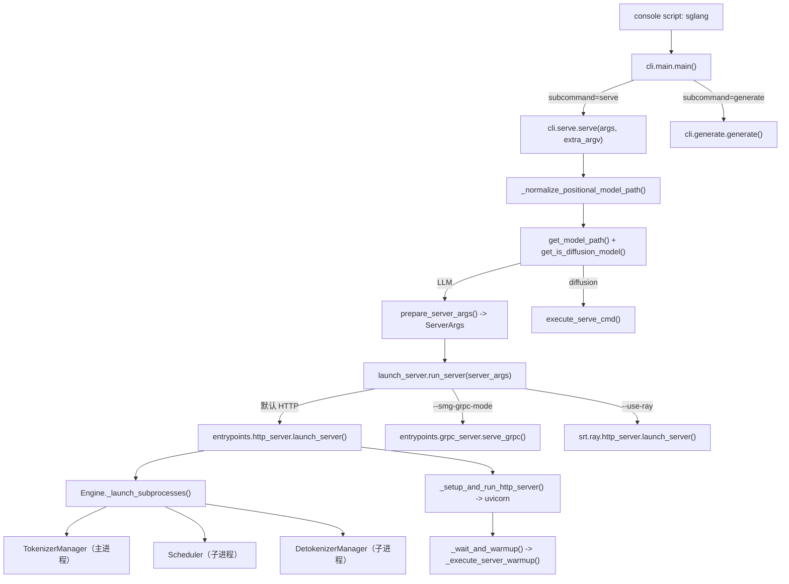
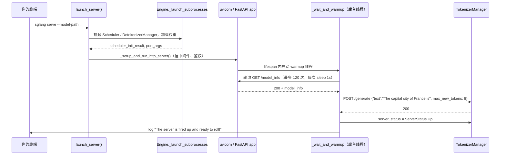

# 最小可运行示例（Minimal Example）

本文只做一件事：用**最少的参数**把 SGLang 服务拉起来，用**最少的请求**验证它活着，并把这条链路上每一步的代码位置钉死。所有命令、参数名、端点名、默认值都来自对齐 commit `e1c4db9621f7c4203ee9becd5d5456d4e6bf54f7` 的源码，不是记忆。

---

## 一、What：这条链路上到底有哪几个入口

SGLang 有**三个**可用入口，它们最终都收敛到同一套子进程拓扑（TokenizerManager + Scheduler + DetokenizerManager）。

| 入口 | 形态 | 代码起点 | 适用场景 |
| --- | --- | --- | --- |
| `sglang serve` | console script（推荐） | `python/pyproject.toml:L201-L203` 注册 `sglang = "sglang.cli.main:main"` | 起 HTTP 服务 |
| `python -m sglang.launch_server` | 模块入口（legacy，仍可用） | `python/sglang/launch_server.py:L55-L73` | 老脚本兼容 |
| `sgl.Engine(...)` | 进程内离线引擎 | `python/sglang/srt/entrypoints/engine.py:L199-L253` | 批量离线推理，不起 HTTP |

`sglang serve` 并不是 `launch_server.py` 的替代实现，而是它的**上游包装**：`cli/main.py` 用 `add_subparsers(dest="subcommand", required=True)` 注册 `serve` / `generate` / `version` 三个子命令，其中 `serve` 与 `generate` 都以 `add_help=False` 注册——因为真正的参数解析要交给下游（`python/sglang/cli/main.py:L12-L46`）。`serve()` 做完"这是 LLM 还是 diffusion 模型"的分派后，直接调用 `sglang.launch_server.run_server`（`python/sglang/cli/serve.py:L134-L141`）。



## 二、Why：为什么要这么分层

**为什么 `run_server` 里是一串 `elif` 而不是策略注册表？** 因为这几条分支的依赖是**互斥且重量级**的：encoder 分离要 `disaggregation.encode_server`，SMG gRPC 要 `entrypoints.grpc_server`，Ray 模式要 `sglang.srt.ray.http_server` 并在缺依赖时显式提示 `pip install 'sglang[ray]'`。惰性 `import` 放在分支内部，未启用的模式就不会把依赖拖进进程（`python/sglang/launch_server.py:L15-L52`）。这是"最小可跑"的前提——你只装基础包也能起服务。

**为什么推荐 `sglang serve`？** 源码里写死了这个态度：`python -m sglang.launch_server` 会先抛一条 `UserWarning`，正文就是 `'sglang serve' is the recommended entrypoint.`（`python/sglang/launch_server.py:L56-L62`）。CI 也已经全面切过去了——`popen_launch_server` 构造的命令数组第一项就是 `["sglang", "serve", "--model-path", model, ...]`（`python/sglang/test/test_utils.py:L744-L756`）。

**为什么两个入口都要 `kill_process_tree(os.getpid(), include_parent=False)`？** SGLang 是多进程架构，Scheduler / DetokenizerManager 是派生出来的子进程。主进程退出时若不主动收割，子进程会连着 CUDA 上下文一起变孤儿并长期占着显存。因此两个入口都把它放在 `finally` 里（`python/sglang/launch_server.py:L70-L73`、`python/sglang/cli/serve.py:L142-L143`）。

## 三、How：最小服务端启动

### 3.1 最小命令

`ServerArgs` 里**只有 `model_path` 没有默认值**，是唯一必填项；`host` / `port` 都有默认值（`python/sglang/srt/server_args.py:L1253-L1254`）：

```python
host: A[str, "The host of the HTTP server.", NS("serving")] = "127.0.0.1"
port: A[int, "The port of the HTTP server.", NS("serving")] = 30000
```

所以真正的最小命令只有一行（`--model` 是 `--model-path` 的官方别名，见 `python/sglang/srt/server_args.py:L489-L496`）：

```bash
# 形式 1：显式 flag
sglang serve --model-path meta-llama/Llama-3.2-1B-Instruct

# 形式 2：位置参数（等价；argv[0] 不以 '-' 开头就被改写成 --model-path）
sglang serve meta-llama/Llama-3.2-1B-Instruct
```

位置参数这条路来自 `_normalize_positional_model_path`，实现就是把 `extra_argv[0]` 前面插一个 `--model-path`（`python/sglang/cli/serve.py:L49-L53`），因此它和形式 1 完全等价，不存在语义差异。而模型路径的抽取由 `get_model_path` 完成，它同时认 `--model-path` 和 `--model`、也认 `--model-path=xxx` 这种等号写法（`python/sglang/cli/utils.py:L99-L124`）。

### 3.2 单卡小模型的推荐起手式

CI 里跑得最勤的 sanity 用例给出了单卡小显存的参数组合（`test/registered/core/test_basic_sanity.py:L43-L58`）：

```bash
sglang serve \
  --model-path meta-llama/Llama-3.2-1B-Instruct \
  --host 0.0.0.0 \
  --port 30000 \
  --mem-fraction-static 0.7 \
  --cuda-graph-max-bs-decode 4 \
  --log-level info
```

| 参数 | 作用 | 证据 |
| --- | --- | --- |
| `--model-path` / `--model` | 本地目录或 HF repo id | `python/sglang/srt/server_args.py:L489-L496` |
| `--host` | 默认 `127.0.0.1`，**只监听回环** | `python/sglang/srt/server_args.py:L1253` |
| `--port` | 默认 `30000` | `python/sglang/srt/server_args.py:L1254` |
| `--mem-fraction-static` | 权重 + KV 池占显存比例，OOM 时下调 | `python/sglang/srt/server_args.py:L771-L775` |
| `--context-length` | 覆盖 `config.json` 的最大上下文 | `python/sglang/srt/server_args.py:L578-L586` |
| `--trust-remote-code` | 允许执行 Hub 上的自定义建模代码 | `python/sglang/srt/server_args.py:L573-L577` |
| `--tp-size` / `--tensor-parallel-size` | 张量并行，默认 1 | `python/sglang/srt/server_args.py:L1002-L1009` |
| `--api-key` | 开启鉴权（OpenAI 兼容接口同样生效） | `python/sglang/srt/server_args.py:L1329-L1333` |
| `--served-model-name` | 覆盖 `/v1/models` 返回的模型名 | `python/sglang/srt/server_args.py:L1339-L1343` |
| `--skip-server-warmup` | 跳过启动预热 | `python/sglang/srt/server_args.py:L1295` |
| `--attention-backend` | 显式选注意力 kernel，默认 `None`（自动解析） | `python/sglang/srt/server_args.py:L1668-L1676` |

`--mem-fraction-static` 不传时并非固定 0.9，而是按 `gpu_mem` 反算：先累加 `reserved_mem`（512MB 底噪 + `activation_tokens * 1.5` + 并行规模补偿 + CUDA Graph 预留），再取 `round((gpu_mem - reserved_mem) / gpu_mem, 3)`；拿不到 `gpu_mem` 时兜底 `0.88`（`python/sglang/srt/server_args.py:L4878-L4913`）。所以"我什么都没改怎么 OOM 了"通常是这段自动推算在某类卡上余量不够，手动压到 0.7 是最直接的解法。

### 3.3 启动到就绪，中间发生了什么

`launch_server` 的 docstring 把拓扑写得很清楚（`python/sglang/srt/entrypoints/http_server.py:L2718-L2740`）：HTTP server 与 TokenizerManager 在主进程，Scheduler 与 DetokenizerManager 是子进程，进程间用 ZMQ 通信。关键在于**"进程起来了"≠"能服务了"**：



`_execute_server_warmup` 的等待循环是 `for _ in range(120): time.sleep(1)` 后请求 `url + "/model_info"`，成功才继续；失败则 `kill_process_tree(os.getpid())` 直接自杀（`python/sglang/srt/entrypoints/http_server.py:L2171-L2189`）。预热请求体也写死在源码里：`{"text": "The capital city of France is", "sampling_params": {"temperature": 0, "max_new_tokens": 8}}`（`python/sglang/srt/entrypoints/http_server.py:L2209-L2266`）。最后由 `_wait_and_warmup` 打出那句人人都在等的 `The server is fired up and ready to roll!`（`python/sglang/srt/entrypoints/http_server.py:L2351-L2358`）。**看到这行日志才算真就绪。**

## 四、How：最小客户端调用

### 4.1 SGLang native `/generate`

`/generate` 注册在 `POST|PUT`，请求体直接是 `GenerateReqInput`（FastAPI 自动反序列化）；`stream=True` 时以 `data: ...\n\n` + `data: [DONE]` 的 SSE 形式返回，非流式则取异步生成器的第一个产出（`python/sglang/srt/entrypoints/http_server.py:L869-L919`）。字段名 `text` / `sampling_params` 来自 `GenerateReqInput`（`python/sglang/srt/managers/io_struct.py:L160-L176`）。

```bash
curl -s http://127.0.0.1:30000/generate \
  -H "Content-Type: application/json" \
  -d '{
        "text": "The capital of France is",
        "sampling_params": {"temperature": 0, "max_new_tokens": 16}
      }'
```

这正是 CI 用例 `TestSRTEndpoint.run_decode` 的请求形状（`test/registered/core/test_srt_endpoint.py:L85-L100`），可以照抄；它还演示了流式解析：按行读，`line.startswith(b"data: ")` 且 `line[6:] != b"[DONE]"` 时才 `json.loads`。

### 4.2 OpenAI 兼容接口

`/v1/completions` 与 `/v1/chat/completions` 都要求 JSON 并转交 `openai_serving_*` handler（`python/sglang/srt/entrypoints/http_server.py:L1694-L1709`）。`model` 字段必须与 `/v1/models` 返回的 id 一致——而那个 id 就是 `tokenizer_manager.served_model_name`（`python/sglang/srt/entrypoints/http_server.py:L1823-L1837`），它默认等于 `model_path`（`python/sglang/srt/server_args.py:L4190-L4191`）。

```bash
curl -s http://127.0.0.1:30000/v1/chat/completions \
  -H "Content-Type: application/json" \
  -d '{
        "model": "meta-llama/Llama-3.2-1B-Instruct",
        "messages": [{"role": "user", "content": "用一句话解释 KV cache"}],
        "temperature": 0,
        "max_tokens": 64
      }'
```

Python 侧用官方 `openai` SDK 即可，CI 的 `TestOpenAIServer` 就是这么做的（`test/registered/openai_server/basic/test_openai_server.py:L39-L52`，注意它在 `setUpClass` 里把 `cls.base_url += "/v1"`）：

```python
import openai

client = openai.Client(api_key="EMPTY", base_url="http://127.0.0.1:30000/v1")
resp = client.chat.completions.create(
    model="meta-llama/Llama-3.2-1B-Instruct",
    messages=[{"role": "user", "content": "Count from 1 to 5."}],
    temperature=0,
    max_tokens=64,
)
print(resp.choices[0].message.content)
```

如果启动时带了 `--api-key sk-123456`，客户端就必须传同样的 key；CI 里 `popen_launch_server(..., api_key=cls.api_key)` 会把 `--api-key` 追加到命令行（`python/sglang/test/test_utils.py:L761-L762`）。

### 4.3 不起 HTTP：进程内 `sgl.Engine`

`Engine` 由 `sglang/__init__.py` 以 `LazyImport` 导出（`python/sglang/__init__.py:L85-L90`），构造参数与 `ServerArgs` 字段一一对应（`python/sglang/srt/entrypoints/engine.py:L224-L245`）。最小用法见 `examples/runtime/engine/launch_engine.py:L8-L11`：

```python
import sglang as sgl

def main():
    llm = sgl.Engine(model_path="meta-llama/Llama-3.2-1B-Instruct")
    print(llm.generate("What is the capital of France?"))
    llm.shutdown()

# 必须有 __main__ 保护：spawn 会重新执行模块，否则无限递归创建子进程
if __name__ == "__main__":
    main()
```

批量版本见 `examples/runtime/engine/offline_batch_inference.py:L26-L33`：`generate` 的第一个位置参数是 `prompt`，可以是 `str` 也可以是 `List[str]`，返回值按 `output["text"]` 取文本（签名见 `python/sglang/srt/entrypoints/engine.py:L352-L397`）。

## 五、如何确认"服务真的健康"

SGLang 暴露了一组语义**不同**的探针，选错会误判：

| 端点 | 语义 | 证据 |
| --- | --- | --- |
| `GET /health` | 默认会**真的生成 1 个 token**（见下方坑 3） | `python/sglang/srt/entrypoints/http_server.py:L646-L720` |
| `GET /health_generate` | 与 `/health` 同一个 handler，恒定走真实生成 | 同上（L646-L648 双装饰器） |
| `GET /ping` | 纯存活探针，**无条件 200**（SageMaker 用） | `python/sglang/srt/entrypoints/http_server.py:L2003-L2006` |
| `GET /model_info` | 返回 `model_path` / `is_generation` / `architectures` 等；warmup 自己就用它判"HTTP 起来了" | `python/sglang/srt/entrypoints/http_server.py:L733-L758` |
| `GET /v1/models` | OpenAI 兼容模型列表；`sglang.utils.wait_for_server` 用它做就绪判定 | `python/sglang/utils.py:L583-L601` |
| `GET /server_info` | 完整 `ServerArgs` + scheduler 内部状态 + `startup_time` + `version`，排障首选 | `python/sglang/srt/entrypoints/http_server.py:L781-L806` |
| `GET|POST /flush_cache` | 清 RadixCache；有在跑/排队请求时不会执行 | `python/sglang/srt/entrypoints/http_server.py:L946-L961` |

推荐的就绪判定与 CI 保持一致——轮询 `/health_generate` 直到 200（`python/sglang/test/test_utils.py:L620-L665`；注意它每轮 `time.sleep(10)`，并在每轮前后各查一次 `proc.poll()`，这样服务进程崩了能立刻报 `Server process exited with code ...` 而不是傻等超时）：

```bash
until curl -sf http://127.0.0.1:30000/health_generate >/dev/null; do sleep 2; done
echo "ready"
curl -s http://127.0.0.1:30000/model_info | python -m json.tool
```

## 六、本地模型来源与离线运行

**HF 缓存布局**：`find_local_repo_dir(repo_id, revision=None)` 把 repo id 映射到 `HF_HUB_CACHE/models--<org>--<name>/snapshots/<revision>`，`revision` 未指定时从 `refs/main` 文件里读（`python/sglang/srt/utils/common.py:L3680-L3702`）。也就是说 `meta-llama/Llama-3.2-1B-Instruct` 对应的目录形如：

```
$HF_HOME/hub/models--meta-llama--Llama-3.2-1B-Instruct/snapshots/<commit-sha>/
```

把这个 snapshot 目录直接当 `--model-path` 传，就彻底不碰网络：

```bash
sglang serve --model-path "$HF_HOME/hub/models--meta-llama--Llama-3.2-1B-Instruct/snapshots/<sha>"
```

**纯离线模式**：设 `HF_HUB_OFFLINE=1`。CI 就是这么做的——`_try_enable_offline_mode_if_cache_complete` 先用 `find_local_repo_dir` 确认快照完整（还会跳过 LoRA 场景和已是本地路径的情况），再往子进程环境写 `HF_HUB_OFFLINE=1`；一旦离线启动失败，`popen_launch_server` 会把 `HF_HUB_OFFLINE` 改回 `"0"` 并重启一次（`python/sglang/test/test_utils.py:L403-L458`、`L767-L805`）。这个"离线优先、失败回退在线"的策略值得抄。

**ModelScope 源**：设 `SGLANG_USE_MODELSCOPE=1`（默认 `False`，`python/sglang/srt/environ.py:L282`）。它有两处副作用：`ServerArgs.__post_init__` 会调 `_handle_modelscope_paths()`，把 model / tokenizer / speculative draft 路径解析到 ModelScope 缓存，不在磁盘上的再走 `snapshot_download`（`python/sglang/srt/server_args.py:L4201-L4230`）；同时 `AutoConfig` / `GenerationConfig` 的 import 源从 `transformers` 换成 `modelscope`（`python/sglang/srt/utils/hf_transformers/common.py:L78-L81`）。

## 七、坑（按踩到概率排序）

1. **默认只监听回环**。`host` 默认 `127.0.0.1`（`python/sglang/srt/server_args.py:L1253`），容器内或跨机访问必须显式 `--host 0.0.0.0`。注意 `ServerArgs.url()` 会把 `0.0.0.0` / `::` 回写成 `127.0.0.1` / `::1` 供**内部**请求使用（`python/sglang/srt/server_args.py:L8809-L8819`），所以 warmup 不受影响，但你的客户端 URL 要自己写对。

2. **端口没释放，重启失败**。`wait_port_available` 默认只等 `SGLANG_WAIT_PORT_TIMEOUT`（缺省 30 秒），超时直接 `raise ValueError`，并且从第 10 秒起用 `find_process_using_port` 打出占用者的 `cmdline` 和 pid（`python/sglang/srt/utils/network.py:L56-L97`）。上一个 server 的 GPU 释放可能超过 30s（源码注释点名 GB300 上观测到 >30s），CI 因此把这个值提到 120（`python/sglang/test/test_utils.py:L713-L716`）。重启前先看那条日志里的 pid，别盲目换端口。

3. **`/health` 默认不是轻量探针**。`SGLANG_ENABLE_HEALTH_ENDPOINT_GENERATION` 默认 `True`（`python/sglang/srt/environ.py:L320`），而早退分支的条件是 `not envs.SGLANG_ENABLE_HEALTH_ENDPOINT_GENERATION.get() and request.url.path == "/health"`（`python/sglang/srt/entrypoints/http_server.py:L663-L667`）——默认取值下这个条件为假，于是 `/health` 与 `/health_generate` 走同一条真实生成路径（`max_new_tokens=1`、`temperature=0`、`log_metrics=False`，rid 带 `HEALTH_CHECK` 前缀便于下游识别）。想要一个纯 200 的存活探针，要么设 `SGLANG_ENABLE_HEALTH_ENDPOINT_GENERATION=0`，要么直接用 `/ping`。另外这条探针最多等 `HEALTH_CHECK_TIMEOUT`（默认 20s，可用 `SGLANG_HEALTH_CHECK_TIMEOUT` 覆盖，`python/sglang/srt/entrypoints/http_server.py:L192`），超时会把 `server_status` 置成 `ServerStatus.UnHealthy` 并返回 503。它判"健康"的依据不是自己的请求返回了，而是 `tokenizer_manager.last_receive_tstamp > tic`——只要有任何下游回包就算活着，所以繁忙服务上这个探针几乎零开销。

4. **启动期 503 是正常的**。`server_status == ServerStatus.Starting` 时 handler 直接返回 503（`python/sglang/srt/entrypoints/http_server.py:L660-L661`）；优雅退出期（`gracefully_exit`）同样返回 503。健康探针脚本必须容忍 503 并重试，不要当成失败。

5. **warmup 失败会连坐整个进程树**。`_execute_server_warmup` 的两处失败路径都是 `kill_process_tree(os.getpid())`（`python/sglang/srt/entrypoints/http_server.py:L2186-L2189` 与 `L2325-L2329`）。所以"服务莫名自己退了"往往是预热请求非 200，去日志里搜 `Initialization failed. warmup error:`。调试期可以加 `--skip-server-warmup` 摘掉这一步（`python/sglang/srt/server_args.py:L1295`），代价是第一个真实请求要付冷启动成本。

6. **`sgl.Engine` 默认几乎不打日志**。`Engine.__init__` 在 kwargs 里没有 `log_level` 时会强制塞 `kwargs["log_level"] = "error"`（`python/sglang/srt/entrypoints/engine.py:L240-L243`）。离线跑不出东西又看不到原因时，显式传 `log_level="info"`。同时 `Engine` 与 `SGLANG_RUST_SERVER` 互斥，设了这个环境变量会直接 `raise ValueError`（`python/sglang/srt/entrypoints/engine.py:L248-L253`）。

7. **`examples/usage/` 里没有 quickstart 脚本**。该目录在此 commit 下只有 `modelopt_quantize_and_export.py` 一个文件；可运行的最小样例实际在 `examples/runtime/engine/` 下（`launch_engine.py`、`offline_batch_inference.py`、`custom_server.py`、`embedding.py` 等）。找例子请直接去那里。

8. **`--config` 与 `sglang serve` 的调用顺序有陷阱**。`serve()` 在 `python/sglang/cli/serve.py:L105` 就调用 `get_model_path(dispatch_argv)`，而 YAML 合并发生在更靠后的 `prepare_server_args` 内部（`python/sglang/srt/server_args.py:L9669-L9681`）。
   > **[OPEN]** `sglang serve --config x.yaml`（model_path 只写在 YAML 里）疑似会在读配置前就被 `get_model_path` 拒掉，详见 appendix/_openq_minimal-example.md。

9. **进程收不干净时用专用工具**。包里注册了 `killall_sglang = "sglang.cli.killall:main"`（`python/pyproject.toml:L201-L203`），比手写 `pkill -f sglang` 安全。

10. **CI 里的端口不是 30000**。`DEFAULT_URL_FOR_TEST` 由 `CUDA_VISIBLE_DEVICES` 首位数字推算（非 CI 环境为 `20000 + n*1000 + 1000`，`python/sglang/test/test_utils.py:L244-L252`）。照抄测试脚本时别把这个端口当成服务默认端口。

---

## 八、一屏速查

```bash
# 起服务（前台；看到 "fired up and ready to roll" 才算好）
sglang serve --model-path meta-llama/Llama-3.2-1B-Instruct \
             --host 0.0.0.0 --port 30000 --mem-fraction-static 0.7

# 等就绪
until curl -sf http://127.0.0.1:30000/health_generate >/dev/null; do sleep 2; done

# native 接口
curl -s localhost:30000/generate -H 'Content-Type: application/json' \
  -d '{"text":"The capital of France is","sampling_params":{"temperature":0,"max_new_tokens":16}}'

# OpenAI 接口（model 取 /v1/models 里的 id）
curl -s localhost:30000/v1/models
curl -s localhost:30000/v1/chat/completions -H 'Content-Type: application/json' \
  -d '{"model":"meta-llama/Llama-3.2-1B-Instruct","messages":[{"role":"user","content":"hi"}],"max_tokens":32}'

# 排障三件套
curl -s localhost:30000/server_info | python -m json.tool
curl -s localhost:30000/model_info  | python -m json.tool
python -m sglang.check_env
```

进一步阅读：整体架构见 architecture/overview.md，请求全链路见 architecture/request-lifecycle.md，HTTP 层与鉴权细节见 deep-dive/server-entrypoint.md，参数全量说明见 appendix/config-reference.md。
